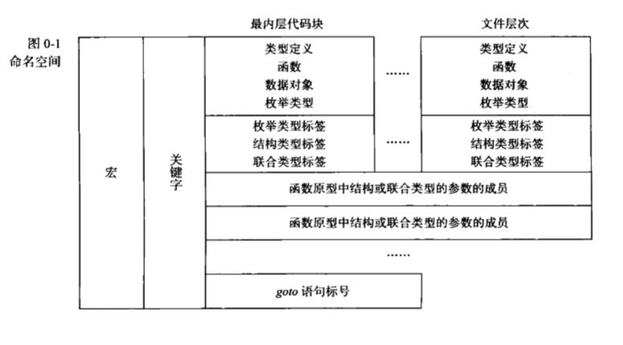

# C标准库

## 第0章  简介

### 库函数的使用

库函数可能通过函数调用或宏展开的形式调用，若要指定，可以使用下面几种方法

#### 通过头文件

##### 可能生成宏展开的代码

```C
#include <stdlib.h>
const char *str;
i = atoi(str);
```

##### 不会生成宏展开的代码

通过undef

```C
#include <stdlib.h>
#undef atoi
const char *str;
i = atoi(str);
```

通过括号

```C
#include <stdlib.h>
const char *str;
i = (atoi) (str);
```

#### 通过显式声明

```C
extern int atoi(const char *);
const char *str;
i = atoi (str);
```

#### 通过隐式声明

```C
const char *str;
i = atoi (str);
```

### 命名空间

#### 块

每个块（{}包含的部分）都引入了两个新的命名空间，一个包括作为类型定义、函数、数据对象、枚举常量声明的名字，另一个包括所有枚举（enum）、结构（struct）、联合（union）的标记

#### 结构和联合

每个结构和联合都引入一个新的命名空间，包括了所有的参数名

#### 函数原型

每个函数原型都有一个命名空间，包括所有参数名

#### 函数

每个函数都有一个命名空间，包括所有标号的名字



若有重名，左边的命名空间会覆盖右边的

#### 命名规则

库中留给库实现者使用的名字一般命名规则如下，在程序中应避免使用

* 下划线开头且具有外部链接属性的函数和数据对象，如\_abc或\_DEF

* 两个下划线开头或一个下划线加一个大写字母开头的宏，如\_\_abc或\_DEF

### 头文件实现

#### 幂等性

即不重复定义和包含头文件，可以简单地使用

```C
#ifndef _STDIO_H
#define _STDIO_H
...
#endif
```

来实现

#### 相互独立性

即不同头文件中同名的声明不应冲突，同样可以用下面方式避免

```C
#ifndef _SIZE_T
#define _SIZE_T
...
#endif
```

或使用宏，因为宏允许多次定义

```C
#define NULL (void*)0
```

但多次定义中除了空白符外应全部相同