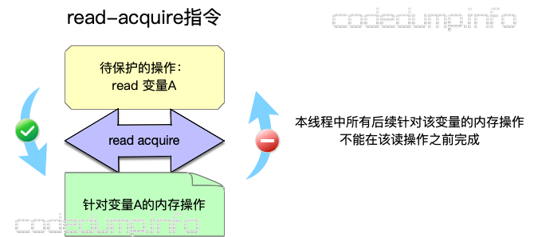
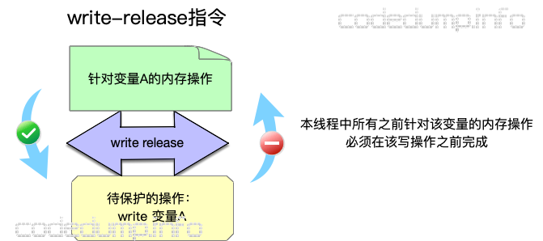

本来想搞成全文档翻译，不过一看有 https://zh.cppreference.com，还是当笔记好了

# C

https://en.cppreference.com/w/c/language

## Basic Concepts


### Objects and alignment

#### object representation


### C memory model

https://en.cppreference.com/w/c/language/memory_model

定义了使用C的抽象模型的机器中计算机内存的语义

C程序可用的数据存储对象（内存）是一个或多个字节组成的序列。每个字节都有一个独立的内存地址。

#### Byte

Byte（字节）是内存中可寻址的最小单位。它被定义为多个连续二进制位的序列，并且足以容纳任意一个*基本字符*（[这96个字符](https://en.cppreference.com/w/c/language/translation_phases) 应能被一字节容纳）。C支持8位及以上的二进制位作为一个字节。

类型 **char / unsigned char / signed char** 使用一个字节用于存储或用于value representation（值的表示）。可以使用 **CHAR_BIT** 来获取一个字节的二进制位数。

关于使用字节来表示其他基本类型（包括内存大小端序），见 [object representation](#object representation)

#### Memory Location

Memory location是

* 一个scalar type（标量类型：算术类型、指针类型、枚举类型）对象
* 最大连续非零bit field（位域）序列

```c
struct S {
    char a;     // memory location #1
    int b : 5;  // memory location #2
    int c : 11, // memory location #2 (continued)
          : 0,
        d : 8;  // memory location #3
    struct {
        int ee : 8; // memory location #4
    } e;
} obj; // The object 'obj' consists of 4 separate memory locations
```

#### Threads and data races

线程是执行程序中的一个控制流，该控制流是由 thrd_create 或其他顶层函数所创建的

线程理论上可以访问程序中的任何对象（即使是auto对象或 thread-local storage duration TLS对象也可以通过指针被其他线程访问）

正在执行的不同线程总能同时访问（读取或修改）不同的 memory location，这一过程互不干扰，因此不需要同步（注意，如果对于同一个结构体中的两个非原子bit field，两者之间的元素都是采用非零bit field方式声明的，那么不管两者相距多少位，同时修改这两个bit field是不安全的）。

若一个表达式的evaluation（求值）对一个 memory location 进行写入，与此同时另一个求值读取或修改同一个 memory location ，那么称该表达式 conflict （冲突）。当出现下列情况时程序中两个conflict evaluation（冲突的表达式）存在 data race （数据竞争）

* 两个evaluation在同一个thread中运行，或在同一个signal handler （信号处理函数）
* 一个conflicting evaluation和另一个的关系是 happen-before（早于） （见[memory order](#memory order)）

当data race出现的时候，程序的行为 undefined （未定义）

（特别的，mtx_unlock与另一线程的mtx_lock同步，从而保证mtx_unlock happen-before mtx_lock，因此可以用互斥锁来消除data race）

### C memory order

https://en.cppreference.com/w/c/atomic/memory_order

此外关于内存一致性模型的一篇文章

https://www.zhihu.com/question/24301047/answer/83422523

还有两篇比较全面的文章（推荐）

https://www.codedump.info/post/20191214-cxx11-memory-model-1/

https://www.codedump.info/post/20191214-cxx11-memory-model-2/

```c
enum memory_order {
    memory_order_relaxed,
    memory_order_consume,
    memory_order_acquire,
    memory_order_release,
    memory_order_acq_rel,
    memory_order_seq_cst
};
```

memory order 指定了在**一个线程中**的某个原子操作的周围，其他内存存取的组织方式。或者可以说它限定了编译器和CPU可以对某个原子操作周围的指令做何种程度的指令重排

**注意**：由于内存/缓存一致性的问题，**一个Thread 1上的操作的副作用（side-effect）不一定马上在Thread 2上可见**，这也是memory order存在的原因。因此在考虑memory order问题时不应只考虑到指令在Thread上的执行次序，因为在**其他Thread的视角**中，指令执行次序可能不同于该Thread指令的实际执行次序

#### 一些术语

* read-modify-write  特指一些形如fetch_add / compare_and_exchange 的原子操作，特征是存在读取-修改-写入的序列

* Synchronized-with  强调的是变量被修改后的传播关系（propagate），若线程A修改某变量之后的结果对线程B可见，则称A synchronizes-with B

* A Sequenced-before B  指在**同一线程**中，A在B之前执行，且A操作的结果B操作可见

* A Happens-before B  操作B执行时可见操作A的结果
  * 对于单线程，操作A排列在操作B前
  * 对于多线程，操作A Inter-thread Happens-before 操作B
  
* A Inter-thread Happens-before B  如果一个线程中的操作A synchronized-with 另一个线程中的操作B，则A Inter-thread Happens-before B

* carry-a-dependency  引入依赖，即下列情况

  ```c
  int* b = a;
  int c = *b;
  ```

  称这两行代码间的关系为carry-a-dependency

* total order  全序关系

* single total order  在这里指如果在所有线程的视角中，看到的某一线程的原子操作都是相同的，则称之为single total order

#### 内存模型

实际上分为4类，从上到下一致性要求逐渐变弱

* 顺序一致性（Sequence Consistency，SC）
  * memory_order_seq_cst
* Acquire-Release
  * memory_order_release
  * memory_order_acquire
  * memory_order_acq_rel
* Release-Consume
  * memory_order_release
  * memory_order_consume
* Relaxed
  * memory_order_relaxed

#### Sequentially-consistent ordering

##### 说人话环节

这里的对应内存模型就是上述的顺序一致性模型，这种模型是最简单的模型，跟我们平常编程时候的想法一致，要求为

* 每个处理器的执行顺序和代码中的顺序（program order）一样
* 所有处理器都只能看到一个单一的操作执行顺序

因此每个处理器看到的指令及其副作用是一样的，但这也要求每个核之间进行很多同步，很影响性能

##### cppreference的说法与理解

所有被标记为**memory_order_seq_cst**的原子操作，不仅会像Release-Acquire ordering一样组织内存操作，此外还会为所有有该标记的原子操作建立一个 single total modification order

一般来说

* 对于一个使用了 memory_order_seq_cst 的读取原子量M的操作B，B的视角下可以观测到下列行为之一

  * 若对于某个happens-before B的对M进行修改的操作A，则这两个操作的顺序符合single total order（即在所有线程看来，都有A happends-before B）
  * 对于上述的A，如果有一些对M的操作是在A与B间发生的（假设为C D），且标记不是memory_order_seq_cst，那么B可能会观察到一些C和D操作的结果
  * 若B前不存在上述的A，且在B前有一些对M的操作（假设为C D），且标记不是memory_order_seq_cst，则B可能会观察到一些对M的无关联修改（unrelated modification）

* 若有一个memory_order_seq_cst标记的atomic_thread_fence *sequenced-before* B，B的视角下可以观测到下列行为之一

  * 在单独全序中先出现于 X 的上个 M 的 `memory_order_seq_cst` 修改
  * 在单独全序中后出现于它的某些 M 的无关联修改

  （这段照抄了cppreference的，我的理解是在X前的关于M的memory_order_seq_cst修改A是happens-before X的，且顺序为single total order；或可以观测到一些对M的无关联修改，这些修改是后出现于X的（原文：some unrelated modification of M that appears later in M's modification order））

* 若有如下的情景

  ```c
  // Thread 1:
  atomic_store_explicit(M, memory_order_seq_cst);		// A
  atomic_thread_fence(memory_order_seq_cst);			// X
  
  // Thread 2
  atomic_thread_fence(memory_order_seq_cst);			// Y
  r1 = atomic_load_explicit(M, memory_order_seq_cst);	// B
  ```

  则B可以观察到下列行为

  * A操作的结果
  * 一些在M的修改顺序（modification order）中于A之后的对M的无关联修改

* 对于M的一对原子操作A和B，在M的modification order中，B在下列情况中将出现于A之后

  * 有一个memory_order_seq_cst标记的atomic_thread_fence X *sequenced-before* A，且X appears before B
  * 有一个memory_order_seq_cst标记的atomic_thread_fence Y *sequenced-before* B，且A appears before Y
  * 有memory_order_seq_cst标记的atomic_thread_fence X和Y，其中A *sequenced-before* X，Y *sequenced-before* B

注意：

* 只要有不带memory_order_seq_cst标签的原子操作进入，则程序立即丧失序列一致性（SC）
* fence只为fence本身建立total order，而并不会为一般的原子操作建立total order

典型应用：

多个生产者多个消费者，且在每个消费者看来，生产者的行为需要保持一致

Total Sequential ordering要求对于多核系统的CPU的每条指令都需要full memory fence，可能成为性能瓶颈

#### Release-Acquire ordering

##### 说人话环节

要求其实很简单，如图

要求在指令重排时满足下列条件（这里图疑似有误，绿框应该不是“针对A的内存操作”而是所有内存操作，因为consume语义中才有数据依赖的关系）





##### cppreference的说法与理解

使用方式

```c
// Thread 1:
atomic_store_explicit(x, memory_order_release);		// store时使用release

// Thread 2:
r1 = atomic_load_explicit(x, memory_order_acquire);	// load时使用acquire
```

如上所示，当thread1和thread2使用这两个tag操作**同一个变量时**，在thread1视角下**store前**的**所有内存写入操作**，对thread2来说，在**load后**保证可见

上述保证只针对thread1和thread2，从其他线程的视角看到的操作不能保证与这两个thread一致

典型应用：

互斥锁，如mutex spinlock。当一个锁被Thread A release，被Thread B acquire，Thread A在临界区的所有操作应该对Thread B可见，因为此时Thread B将要进入同一块临界区

#### Release sequence

##### 说人话环节

如果store操作被标记为`memory_order_release`  `memory_order_acq_rel` 或 `memory_order_seq_cst`

load操作被标记为 `memory_order_cunsume`  `memory_order_acquire` 或 `memory_order_seq_sct`

具有上述性质的store和load交替出现，并形成依赖关系，load每次读取的都是先前store的值，那么这一连串操作构成release sequence，且第一个store synchronized-with 最后一个load

##### cppreference的说法与理解

若一些原子量被存储-释放（store-released），并且多个其他线程对于上述原子量存在read-modify-write的操作，那么一个释放序列（release sequence）就会形成：所有对同一个原子量有read-modify-write操作的线程互相同步，且即使这些线程的store操作没有memory_order_release语义，也会以此方式进行操作。

典型应用：

* 一个生产者，多个消费者的情况

#### Release-Consume ordering

##### 说人话环节

和Release-Acquire很类似，但仅对与被操作的原子变量M有数据依赖关系的先后顺序进行限制，对于其他的操作不限制

##### cppreference的说法与理解

使用方式

```c
// Thread 1:
atomic_store_explicit(x, memory_order_release);		// store时使用release

// Thread 2:
r1 = atomic_load_explicit(x, memory_order_consume);	// load时使用consume
```

##### cppreference的说法与理解

如上所示，当thread1和thread2使用这两个tag操作**同一个原子变量时**，在thread1的视角下**store前**的**所有与该原子变量存在依赖（carries dependency）的内存写入操作**，对thread2来说，在**load后**保证可见

上述保证只针对thread1和thread2，从其他线程的视角看到的操作不能保证与这两个thread一致

典型应用

* 读取一个很少被修改的并发数据结构
* 生产者-消费者场景之一：生产者通过一个指针将数据结构传递给消费者。这种情形下只需要保证消费者读取的数据结构的内容正确，不需要考虑生产者对内存的其他修改

#### Relaxed ordering

##### cppreference的说法与理解

使用`memory_order_relaxed`标记的原子操作是非同步的，它不会对多个内存访问强加一个顺序，而只保证操作的原子性和写操作的顺序一致性

```c
// Thread 1:
r1 = atomic_load_explicit(y, memory_order_relaxed); // A
atomic_store_explicit(x, r1, memory_order_relaxed); // B
// Thread 2:
r2 = atomic_load_explicit(x, memory_order_relaxed); // C
atomic_store_explicit(y, 42, memory_order_relaxed); // D
```

若使用relaxed ordering，则允许产生结果（不一定代表实际中会出现，但标准允许，也就是说编程时不应假设该情况不会出现）`r1==r2==42`的情况，因为这种组织方式不保证对不同内存的访问顺序，因此即使程序里A在B前，C在D前（Sequenced-before），但**没有约束要求对y的读取A先出现于对y的修改D，也没有约束要求对x的读取C先出现于对x的修改B**

relaxed仅要求**同一线程**中对**同一原子变量**的操作保持顺序，但在其他线程的视角下这些操作的顺序并不在考虑范围

一个典型应用就是一个自增的计数器，因为这种计数器只需要保证原子性。但需要注意shared_ptr中的计数器减操作需要锁

#### 关于Volatile

在同一线程中，一个对于volatile左值操作的指令不能被重排到一个具有可观测副作用的序列点之后（意思应该就是不能被重排到一个写内存的指令后），但这个限制对于其他线程来说不一定是可见的，所以对volatile变量的读写不能用于inter-thread synchronization

此外，volatile的读写是非原子的，且不对内存操作进行排序（非volatile内存访问可以被重排到volatile内存访问的前后）

一个例外就是在VS中，默认的volatile写具有release语言，volatile读有acquire语义，所以可以被用于同步。

# Cpp

## Basic concepts

### C++ memory model

https://en.cppreference.com/w/cpp/language/memory_model

#### Byte

与C的一样

#### Memory location

与C的一样

#### Thread and data races

存在data race的情况有下列三种

* 两个evaluation在同一个thread中运行，或在同一个signal handler （信号处理函数）
* 两个 conflicting evaluation 都是原子操作（见std::atomic）
* 一个conflicting evaluation和另一个的关系是 happen-before（早于） （见[memory order](#memory order)）

（特别的，一个线程的std::mutex与另一线程的同步，从而保证mutex的释放 happen-before mutex的获取，因此可以用std::mutex来消除data race）

无锁

```cpp
int cnt = 0;
auto f = [&]{cnt++;};
std::thread t1{f}, t2{f}, t3{f}; // undefined behavior
```

有锁

```cpp
std::atomic<int> cnt{0};
auto f = [&]{cnt++;};
std::thread t1{f}, t2{f}, t3{f}; // OK
```

#### Forward progress

##### Obstruction freedom

当只有一个没有阻塞在标准库函数中的线程执行一个lock-free的原子函数时，则保证该执行可以完成（所有标准库中的lock-free操作都是obstruction-free的）

（详细定义见背景知识中的Non-blocking Algorithm）

##### lock freedom

当一个或多个lock-free的函数并行执行时，可以保证其中至少一个执行可以完成（所有在标准函数中的lock-free操作都是lock-free的——这里的实现应确保这些操作不会被其他线程造成无限的live-lock，如以连续窃取cache line的方式）

##### Progress guarantee

在一个可用的C++程序中，每个线程的操作最终肯定会执行下列操作之一

* 终止
* 调用IO函数
* 通过 volatile 泛左值进行访问
* 进行原子操作或同步操作

任何线程都不可能无限地执行并且不进行上面的几个操作之一。

所以如果一个程序含有无限循环或无限递归，则它的行为是undefined。所以允许编译器在不需要证明程序是否最后会以某个条件终止的情况下，移除没有操作（no observable behavior）的循环。

一个线程如果具有上述四种操作，或阻塞在标准库中，或调用了一个由于某个未阻塞的并发线程（non-blocked concurrent thread）而未完成的原子 lock-free 函数，则称其 make progress

###### Concurrent forward progress

保证程序只要未终止，就可以在有限时间内make progress，不论其他的线程是否make progress

标准鼓励但不要求主线程和其他使用std::thread启用的线程提供 Concurrent forward progress 保证

###### Parallel forward progress

不需要保证线程最终执行上述的四种操作之一，但一旦执行了四种操作之一，则保证之后的程序是 Concurrent forward progress 的（这条规则的最典型的场景就是线程池的情况，当线程池没有任务时所有线程都在等待，但一旦有任务，最后线程都需要make progress）

###### Weakly parallel forward progress

不管其他线程有没有make progress，都不需要保证当前线程make progress。但在下述情况下保证make progress：

若一个线程P以此种方式阻塞了线程集合S，则S中至少一个线程应提供与P相同或更强的 forword progress guarantee。当这个线程完成后，S中剩余的其他线程也会依次以同样方式进展，直到S为空解锁


# 一些背景知识

## Non-blocking Algorithm

https://en.wikipedia.org/wiki/Non-blocking_algorithm

非阻塞算法：当一个算法的一个线程失败或挂起时，不会影响其他线程

### 动机

非阻塞算法的目的就是消除程序运行中的锁，即用一些设计使得程序可以不依赖锁的同步来运行。好处显而易见

### 实现

一般的实现依赖于硬件提供的原子操作，一般Non-blocking级别分为下面几种

* Wait-freedom

  最高等级的Non-blocking。首先它保证所有线程都不会被饿死，其次保证所有的线程都能在有限步内取得进展（make progress），即没有线程会被永久阻塞

  含义就是没有两个线程间是互锁的，因为如果有互锁的线程，那么若一个线程崩溃或挂起，另一个线程可能进入死锁，如当崩溃的线程拥有一个锁的时候

* Lock-freedom

  次一等级的Non-blocking。它保证所有的线程中至少有一个线程能在有限步内取得进展，即不会发生所有线程都被阻塞的情况

  含义就是当一个线程崩溃或挂起，其他线程可以继续取得进展。举例来说，如果一共有两个线程，这两个线程需要争夺一个mutex或spinlock，那么这是非lock-free的，因为如果拿到锁的线程被挂起，那么另一个线程将无限等待

  一个Lock-free算法可以分为四步

  * 完成自己的操作
  * 协助进行阻塞操作
  * 中止阻塞操作
  * 等待

  其中 *完成自己的操作* 这一步骤可能被其他线程的 *协助阻塞* 或 *中止阻塞*  的过程打断

* Obstruction-freedom

  最低等级的Non-blocking。它保证在任何时候，当一个线程运行在一个隔离的环境下时（如所有可能发生竞争的线程都被挂起），它可以在有限步内取得进展

  Obstruction-freedom的要求只是线程中的任何部分完成的操作（partially completed operation）都可以被暂停，且更改可以被回滚。

  不使用lock-freedom中的同步协助（concurrent assistance）可以使算法更加简单。此外，contention manager可以防止系统进入“活锁”（live-locking）

  一些Obstruction-freedom算法在数据结构中使用一对一致性标记“consistency markers”来同步。进程在读取数据时先读取一个标记，此后加载对应的数据并处理，然后再读取另一个标记。若两个标记不是相同的，则说明可能先前在处理的过程中数据被其他线程修改过，这时就丢弃结果重新读取并处理。

  **上面例子的解释**：我觉得这里的意思应该是让这两个标记作为“开始操作”和“结束操作”的标志，其中对于标记的操作应该是原子的

  * 正常操作流程： 在开始操作的时候读入旧标记，并放上一个新标记，结束操作的时候比较旧的开始标记和结束标记，此后再将结束标记更新为与新的开始标记一样的值。

  * 被抢占时的流程： 如果A读完，处理一半被B抢占，首先B读取的开始标记和当前的结束标记已经不同（因为A已经更新了），那么B处理完在比较标记时肯定失败，那么修改就会被丢弃（包括将B更新的开始标记重新还原为A的）。此时A继续执行，则可以正常结束）
  * 轮流抢占时的流程：如果上面例子中，B也没有处理完就被A抢占，那么A执行完正常流程后比较标记为正确（因为A本身保存了旧的标记，即使当前开始标记已经被B的新值覆盖）。B执行完后比较标记错误，那么又会将开始标记还原为当时A更新的值


