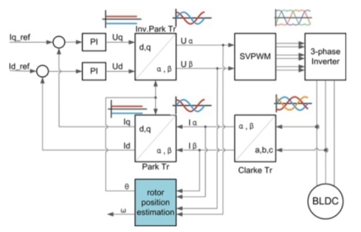
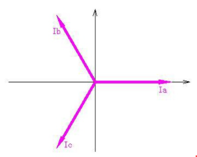
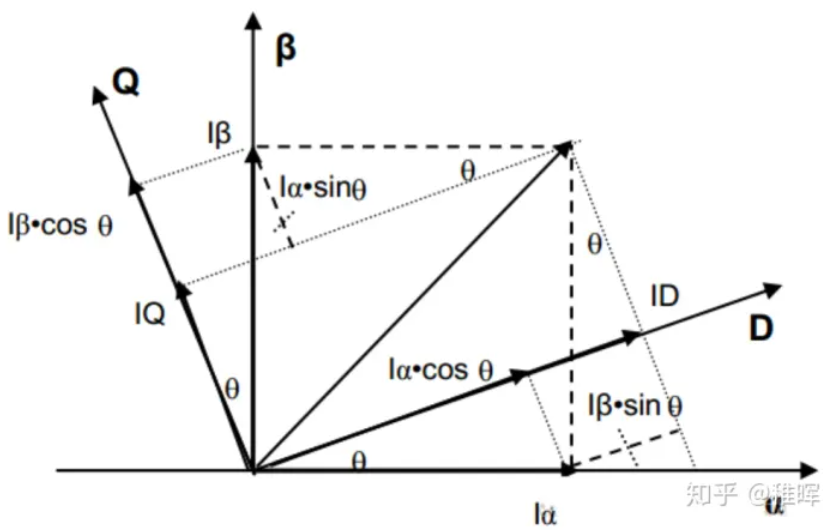
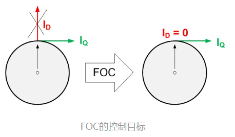
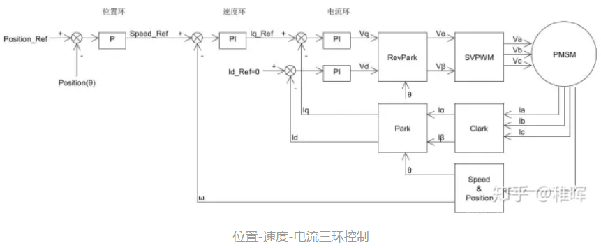

## 架构图

上图大概描述的原理如下

* 首先，BLDC由SVPWM经过三相变换后直接驱动

* 对电机的三个相采样得到的电流 $I_a \  I_b \  I_c$ 经过**Clark变换**转换为 $I_{\alpha} \ I_{\beta}$ 

* $I_{\alpha} \ I_{\beta}$ 经过**Park变换**得到 $I_q \  I_d$ ，并与设定值 $I_q\_ref \  I_d\_ref$ 计算误差

* $I_q\_ref \ I_d\_ref$ 输入PID控制器得到控制量 $U_d \  U_q$

* $U_d \  U_q$ 经过**反Park变换**得到 $U_{\alpha} \  U_{\beta}$ ，这两个电压最后用于合成电压空间矢量并输入SVPWM控制器

## 算法

### Clark变换

输入为电机采样的相电流 $I_a \ I_b \ I_c$ ，这里实际可以只用两个采样电阻，因为对于星形接法的BLDC来说，由基尔霍夫电流定律，可以从两个相的电流计算出第三个相的电流

Clark变换将采样的三个相电流变换通过正交基变换为两个相电流，从而减少了一个控制量。

原理如下，由于要正确驱动BLDC，输入的应该为三相交流电，因此采样到的电流应有120度的相角，即

所以可以由三个相电流矢量得到一对正交基底

$$
\begin{aligned}
I_{\alpha} &= I_a - cos(\frac{2 \pi}{3}) I_b - cos(\frac{2 \pi}{3}) I_c
\\
I_{\beta} &= sin(\frac{2 \pi}{3}) I_b - sin(\frac{2 \pi}{3}) I_c
\end{aligned}
$$

写成矩阵形式如下：

$$
\begin{bmatrix}
I_{\alpha} \\
I_{\beta}
\end{bmatrix}
=
\begin{bmatrix}
1 & -\frac{1}{2} & -\frac{1}{2}
\\
~
\\
0 & \frac{\sqrt{3}}{2} & -\frac{\sqrt{3}}{2}
\end{bmatrix}
\begin{bmatrix}
I_a
\\
I_b
\\
I_c
\end{bmatrix}
$$

### Park变换

Park变换将 $\alpha - \beta$ 坐标系旋转 $\theta$ 度转换为 $d-q$ 坐标系，其中 $\theta$ 是转子当前的角度

直接使用一个旋转矩阵

$$
\left \{
\begin{aligned}
I_d &= I_{\alpha} cos \theta + I_{\beta} sin \theta
\\
I_q &= -I_{\alpha} sin \theta + I_{\beta} cos \theta
\end{aligned}
\right .
$$

写成矩阵形式

$$
\begin{bmatrix}
I_d \\
I_q
\end{bmatrix}
=
\begin{bmatrix}
cos \theta & sin \theta
\\
-sin \theta & cos \theta
\end{bmatrix}
\begin{bmatrix}
I_{\alpha}
\\
I_{\beta}
\end{bmatrix}
$$

经过该旋转变换，可以将坐标系转换到与转子相对静止

由于坐标系与转子方向相同，如下图

如图，$I_D \ I_Q$ 是正交的矢量，为了让效率最大化，需要尽量控制 $I_D = 0$ ，从而使得 $I_Q$ 的输出效率最高

### PID控制

这里使用了三个PID环，内环到外环依次是：**电流环、速度环、位置环**

### 空间电压矢量

设三个相的中心点为N，则

$$
\begin{aligned}
U_a &= U_A - U_N = \frac{2}{3} U_{DC}
\\
U_b &= U_B - U_N = -\frac{1}{3} U_{DC}
\\
U_c &= U_C - U_N = -\frac{1}{3} U_{DC}
\end{aligned}
$$

## 参考资料

https://zhuanlan.zhihu.com/p/147659820

https://www.zhihu.com/column/c_1475237952008138752

http://simplefoc.cn/

[手把手教你电机FOC控制【持续更新中】 | 范子琦的博客](https://www.robotsfan.com/posts/d99d1c1a.html)

[FOC控制原理_Jack-Mai的博客-CSDN博客_foc控制](https://blog.csdn.net/maijiayong/article/details/116116924)

[FOC控制算法详解_Dokin丶的博客-CSDN博客_foc控制](https://blog.csdn.net/qq_27575841/article/details/109789125)

