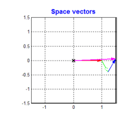
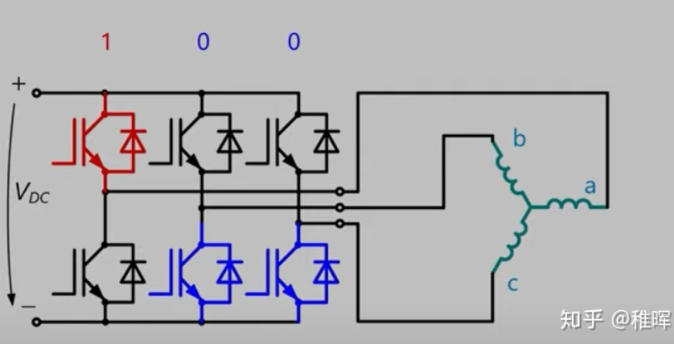

## 基本原理

无刷电机为了让转子平滑地转动，应该不断地产生一个方向绕轴旋转的磁场

为了产生一个旋转且负载均衡的磁场，最简单的方式是使用三个电磁铁进行矢量控制


如图，橙色为磁极，E F G分别为三个电磁铁，蓝色为E F G最终合成的磁场方向

此时假设磁感应强度B恒定，方向做匀速圆周运动，则有

$$
B \vec r = \vec E + \vec F + \vec G
$$


$$
U_{总} = R I + L \frac{dI}{dt} + U_{反电动势}
\\
~
\\
U_{总} - U_{反电动势} = R I + L \frac{dI}{dt}
$$

代入余弦电流

$$
U_{总} - U_{反电动势} = R I_M cos \omega t - L I_M sin \omega t
\\
~
\\
U_{总} - U_{反电动势} = \lambda I_M cos(\omega t + \theta)
$$


$$
\left \{
\begin{aligned}
A &=  M cos(\omega t - \frac{2 \pi}{3})
\\
B &= M cos \  \omega t
\\
C &= M cos(\omega t + \frac{2 \pi}{3})
\end{aligned}
\right . 
$$


$$
\left \{
\begin{aligned}
\alpha &= A - B cos \frac{\pi}{3}- C cos \frac{\pi}{3}
\\
\beta &= B sin \frac{\pi}{3} - C sin \frac{\pi}{3}
\end{aligned}
\right . 
$$

## 架构图


上图大概描述的原理如下

* 首先，BLDC由SVPWM经过三相变换后直接驱动

* 对电机的三个相采样得到的电流 $I_a \  I_b \  I_c$ 经过**Clark变换**转换为 $I_{\alpha} \ I_{\beta}$ 

* $I_{\alpha} \ I_{\beta}$ 经过**Park变换**得到 $I_q \  I_d$ ，并与设定值 $I_q\_ref \  I_d\_ref$ 计算误差

* $I_q\_ref \ I_d\_ref$ 输入PID控制器得到控制量 $U_d \  U_q$

* $U_d \  U_q$ 经过**反Park变换**得到 $U_{\alpha} \  U_{\beta}$ ，这两个电压最后用于合成电压空间矢量并输入SVPWM控制器

## 算法

### Clark变换

#### Clark变换概念

输入为电机采样的相电流 $I_a \ I_b \ I_c$ ，这里实际可以只用两个采样电阻，因为对于星形接法的BLDC来说，由基尔霍夫电流定律，可以从两个相的电流计算出第三个相的电流

Clark变换将采样的三个相电流变换通过正交基变换为两个相电流，从而减少了一个控制量。

原理如下，由于要正确驱动BLDC，输入的应该为三相交流电，因此采样到的电流应有120度的相角，即


要带动电机转动，则需要产生旋转的磁场，其波形即三相正弦波


若使用这三个互成120度的矢量，则为



显然使用这三个矢量计算较为麻烦，可以化简成两个正交的矢量，这就是clark变换


#### Clark变换基本形式

所以可以由三个相电流矢量得到一对正交基底

$$
\begin{aligned}
I_{\alpha} &= I_a - cos(\frac{2 \pi}{3}) I_b - cos(\frac{2 \pi}{3}) I_c
\\
I_{\beta} &= sin(\frac{2 \pi}{3}) I_b - sin(\frac{2 \pi}{3}) I_c
\end{aligned}
$$

写成矩阵形式如下，即Clark变换的基本形式：

$$
\begin{bmatrix}
I_{\alpha} \\
I_{\beta}
\end{bmatrix}
=
\begin{bmatrix}
1 & -\frac{1}{2} & -\frac{1}{2}
\\
~
\\
0 & \frac{\sqrt{3}}{2} & -\frac{\sqrt{3}}{2}
\end{bmatrix}
\begin{bmatrix}
I_a
\\
I_b
\\
I_c
\end{bmatrix}
$$

#### Clark变换等幅值形式

等幅值形式，即保证Clark变换前后电流的幅值相等。假设a b c的幅值为Im，若以复数形式表示三相电流，有

$$
\begin{aligned}
I &= I_{\alpha} + j I_{\beta}
\\
&= I_a + I_b e^{j \frac{2\pi}{3}} + I_c e^{-j \frac{2\pi}{3}}
\\
&= \frac{3}{2} I_m e^{-j \omega t}
\end{aligned}
$$

具体推导见附录（手推了老久）

因此Clark变换后幅值为原电流幅值的3/2，所以Clark变换的等幅值形式为

$$
\begin{bmatrix}
I_{\alpha} \\
I_{\beta}
\end{bmatrix}
=
\frac{2}{3}
\begin{bmatrix}
1 & -\frac{1}{2} & -\frac{1}{2}
\\
~
\\
0 & \frac{\sqrt{3}}{2} & -\frac{\sqrt{3}}{2}
\end{bmatrix}
\begin{bmatrix}
I_a
\\
I_b
\\
I_c
\end{bmatrix}
$$

#### Clark变换等功率形式

即保证Clark变换前后功率极值相等，等功率形式为

$$
\begin{bmatrix}
I_{\alpha} \\
I_{\beta}
\end{bmatrix}
=
\sqrt{\frac{2}{3}}
\begin{bmatrix}
1 & -\frac{1}{2} & -\frac{1}{2}
\\
~
\\
0 & \frac{\sqrt{3}}{2} & -\frac{\sqrt{3}}{2}
\end{bmatrix}
\begin{bmatrix}
I_a
\\
I_b
\\
I_c
\end{bmatrix}
$$

### Clark逆变换

#### 基本形式

可以将Clark变换的基本形式行列式展开

$$
\begin{aligned}
I_{\alpha} &= I_a - \frac{1}{2} I_b -\frac{1}{2} I_c
\\
I_{\beta} &= \frac{\sqrt{3}}{2} I_b - \frac{\sqrt{3}}{2} I_c
\end{aligned}
$$

并且考虑基尔霍夫电流定律，有$I_a + I_b + I_c = 0$

$$
\begin{aligned}
I_a &= \frac{2}{3} I_{\alpha}
\\
I_b &= - \frac{1}{3} I_{\alpha} + \frac{\sqrt{3}}{3} I_{\beta}
\\
I_c &= - \frac{1}{3} I_{\alpha} - \frac{\sqrt{3}}{3} I_{\beta}
\end{aligned}
$$

即

$$
\begin{bmatrix}
I_a \\
I_b \\
I_c
\end{bmatrix}
=
\begin{bmatrix}
\frac{2}{3} & 0
\\
~
\\
-\frac{1}{3} & \frac{\sqrt{3}}{3}
\\
~
\\
-\frac{1}{3} & -\frac{\sqrt{3}}{3}
\end{bmatrix}
\begin{bmatrix}
I_{\alpha}
\\
I_{\beta}
\end{bmatrix}
$$

#### 等幅值与等功率形式

等幅值形式即基本形式乘上系数$\frac{3}{2}$

$$
\begin{bmatrix}
I_a \\
I_b \\
I_c
\end{bmatrix}
=
\begin{bmatrix}
1 & 0
\\
~
\\
-\frac{1}{2} & \frac{\sqrt{3}}{2}
\\
~
\\
-\frac{1}{2} & -\frac{\sqrt{3}}{2}
\end{bmatrix}
\begin{bmatrix}
I_{\alpha}
\\
I_{\beta}
\end{bmatrix}
$$

同理等功率形式为

$$
\begin{bmatrix}
I_a \\
I_b \\
I_c
\end{bmatrix}
=
\begin{bmatrix}
\frac{\sqrt{6}}{3} & 0
\\
~
\\
-\frac{\sqrt{6}}{6} & \frac{\sqrt{2}}{2}
\\
~
\\
-\frac{\sqrt{6}}{6} & -\frac{\sqrt{2}}{2}
\end{bmatrix}
\begin{bmatrix}
I_{\alpha}
\\
I_{\beta}
\end{bmatrix}
$$

### Park变换

#### Park正变换

对于电机来说，分为定子和转子，因此对于旋转状态的建模应该同时考虑定子和转子的状态。于是，我们用$\alpha - \beta$ 坐标系描述定子状态，新建一个$d-q$坐标系描述转子状态

Park变换将 $\alpha - \beta$ 坐标系旋转 $\theta$ 度转换为 $d-q$ 坐标系，其中 $\theta$ 是转子当前的角度


直接使用一个旋转矩阵

$$
\left \{
\begin{aligned}
I_d &= I_{\alpha} cos \theta + I_{\beta} sin \theta
\\
I_q &= -I_{\alpha} sin \theta + I_{\beta} cos \theta
\end{aligned}
\right .
$$

写成矩阵形式

$$
\begin{bmatrix}
I_d \\
I_q
\end{bmatrix}
=
\begin{bmatrix}
cos \theta & sin \theta
\\
-sin \theta & cos \theta
\end{bmatrix}
\begin{bmatrix}
I_{\alpha}
\\
I_{\beta}
\end{bmatrix}
$$

经过该旋转变换，可以将坐标系转换到与转子相对静止

由于坐标系与转子方向相同，如下图


如图，$I_D \ I_Q$ 是正交的矢量，为了让效率最大化，需要尽量控制 $I_D = 0$ ，从而使得 $I_Q$ 的输出效率最高

#### Park逆变换

由正变换，易得

$$
\begin{bmatrix}
I_{\alpha} \\
I_{\beta}
\end{bmatrix}
=
\begin{bmatrix}
cos \theta & -sin \theta
\\
sin \theta & cos \theta
\end{bmatrix}
\begin{bmatrix}
I_d
\\
I_q
\end{bmatrix}
$$

### FOC的基本过程

FOC电机控制本质上遵循以下逻辑

```
需要的电机力矩 ----|-- Park逆变换 --> I_alpha I_Beta -- Clark逆变换 --> I_a I_b I_c
当前转子电角度 ----/
```

### PID控制

这里使用了三个PID环，内环到外环依次是：**电流环、速度环、位置环**


### 空间电压矢量



设三个相的中心点为N，则

$$
\begin{aligned}
U_a &= U_A - U_N = \frac{2}{3} U_{DC}
\\
U_b &= U_B - U_N = -\frac{1}{3} U_{DC}
\\
U_c &= U_C - U_N = -\frac{1}{3} U_{DC}
\end{aligned}
$$

## 参考资料

https://zhuanlan.zhihu.com/p/147659820

https://www.zhihu.com/column/c_1475237952008138752

http://simplefoc.cn/

[手把手教你电机FOC控制【持续更新中】 | 范子琦的博客](https://www.robotsfan.com/posts/d99d1c1a.html)

[FOC控制原理_Jack-Mai的博客-CSDN博客_foc控制](https://blog.csdn.net/maijiayong/article/details/116116924)

[FOC控制算法详解_Dokin丶的博客-CSDN博客_foc控制](https://blog.csdn.net/qq_27575841/article/details/109789125)

[FOC算法入门-CSDN博客](https://blog.csdn.net/differently1234/article/details/118084870)

[灯哥开源的个人空间-灯哥开源个人主页-哔哩哔哩视频](https://space.bilibili.com/493192058/channel/collectiondetail?sid=1104775)

https://zhuanlan.zhihu.com/p/293470912

https://zhuanlan.zhihu.com/p/172484981

## 附录

### Clark变换等幅值形式

首先假设$I_a = I_m cos \omega t$，则Ib和Ic分别为相位角相差120度的波形

$$
\begin{aligned}
I &= I_{\alpha} + j I_{\beta} = I_a + I_b e^{j \frac{2\pi}{3}} + I_c e^{-j \frac{2\pi}{3}}
\\
&= I_m cos \omega t + I_m cos (\omega t + \frac{2 \pi}{3}) e^{j \frac{2\pi}{3}} + I_m cos (\omega t - \frac{2 \pi}{3}) e^{-j \frac{2\pi}{3}}
\\
&= I_m cos \omega t + I_m (-\frac{1}{2} cos \omega t - \frac{\sqrt{3}}{2} sin \omega t) e^{j \frac{2\pi}{3}} + I_m (-\frac{1}{2} cos \omega t + \frac{\sqrt{3}}{2} sin \omega t) e^{-j \frac{2\pi}{3}}
\\
&= I_m cos \omega t [ 1- \frac{1}{2}(-\frac{1}{2}+\frac{\sqrt{3}}{2}j) - \frac{1}{2}(-\frac{1}{2}-\frac{\sqrt{3}}{2}j)] + I_m sin \omega t [ - \frac{\sqrt{3}}{2} (-\frac{1}{2}+\frac{\sqrt{3}}{2}j) + \frac{\sqrt{3}}{2} (-\frac{1}{2}-\frac{\sqrt{3}}{2}j)]
\\
&= \frac{3}{2} I_m cos \omega t - \frac{3}{2}j I_m sin \omega t
\\
&= \frac{3}{2} I_m e^{-j \omega t}
\end{aligned}
$$
