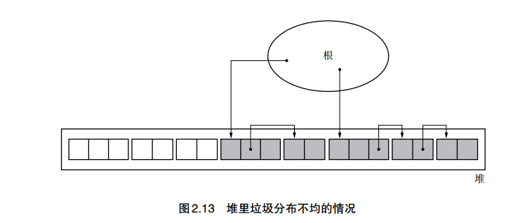

## 基本概念

### 术语

* 对象/头/域

* 指针

* mutator  书中将应用程序称为mutator，程序中运行着GC算法。mutator的下列两个操作是需要GC算法进行处理的

  * 生成对象
  * 更新指针

* 堆

* 活动对象/非活动对象  能通过mutator程序引用的对象称为活动对象

* 分配（allocation）  在内存空间中分配对象。空间不够时有下列两种做法

  * 无可分配空间，输出错误信息
  * 申请新的可用空间，进行分配

  书里为了方便讨论，假定GC管理的堆块大小固定，即若当前堆块无可分配空间，不申请新堆块，而是直接输出错误

* 分块（chunk）  为利用对象而事先准备出来的空间。初始情况下，堆是一个大分块，随着使用会被分为小的块

* 根（root）  指向对象的指针的“起点”，所有mutator可以直接访问的都应该作为根，包括调用栈、寄存器、全局变量等

### 评价标准

* 吞吐量  单位时间内的GC算法处理能力，计算方法为GC管理的空间除以GC的总运行时间
* 最大暂停时间  因执行GC算法而暂停mutator运行的最长时间
* 堆使用效率  空间使用效率

上述三者往往不可兼得，一般来说，堆空间使用效率低的算法往往速度更快

### 一些假设

下面的算法讨论中，假设GC算法可以直接区分一个对象中的数据和指针

## GC标记-清除算法

### 基本算法

思想很简单，分为标记和清理两个步骤。

* 标记  从根出发，遍历根的每个对象，并为其打上标记。并对每个对象的域指向的其他对象进行同样操作
* 清理  进行一次标记后，所有能被根访问的对象都已经被标记，因此直接释放掉没有标记的对象

```c
mark_sweep()
{
	mark_phase();		// 标记
	sweep_phase();		// 清理
}
```

#### 标记

从根出发标记活动对象

```c
mark_phase()
{
	for(r : $roots)
		mark(*r);
}
```

mark函数会迭代标记每个对象下的其他对象

```c
mark(obj)
{
	if(obj.mark == false)			// 这个判断可以防止在遇到循环引用时陷入死循环
	{
		obj.mark = true;
		for(child : children(obj))	// 获取obj指向的所有其他对象
			mark(*child);
	}
}
```

注意这里的迭代使用的DFS

#### 清除

```cpp
sweep_phase()
{
	sweeping = $heap_start;			// 从堆底开始遍历
	while(sweeping < $heap_end)
	{
		if(sweeping.mark == true)	// 说明这个对象不应被释放
		{
			sweeping.mark = false;	// 重置mark，以便下次进行GC时判断
		}
		else						// 说明这个对象应该被释放
		{
			sweeping.next = $free_list;
			$free_list = sweeping;	// 头插法把该块插入free_list
		}
		sweeping += sweeping.size;	// 遍历下一个
	}
}
```

#### 分配

因为本身GC也是一个堆内存分配器，所以应该负责内存分配

```cpp
new_obj(size)
{
	chunk = pickup_chunk(size, $free_list);		// 从free_list取一个合适的块
	if(chunk != null)
		return chunk;
	else
		allocation_fail();					// 若找不到合适的块，如前所述，这里直接视作分配失败（不向系统申请新内存）
}
```

关于pickup_chunk，一般有三种算法

* first-fit  取回free_list上第一个大于size的块，剩余空间切分。最快
* best-fit  遍历free_list，取回最合适的块。空间利用率最高
* worst-fit  取回空间最大的块。不推荐

#### 合并

改进sweep_phase使其可以在清理时合并碎片

```c
sweep_phase()
{
	sweeping = $heap_start;
	while(sweeping < $heap_end)
	{
		if(sweeping.mark == true)
		{
			sweeping.mark = false;
		}
		else
		{
			if(sweeping == $free_list + $free_list.size)	// 加了这两行，因为free_list指向的是上一个空闲节点
				$free_list.size += sweeping.size;			// 所以使用这个判断直接合并
			else
			{
                sweeping.next = $free_list;
                $free_list = sweeping;
			}
		}
		sweeping += sweeping.size;
	}
}
```

### 优缺点

优点

* 实现简单
* 不会移动对象 -> 与保守式GC算法兼容

缺点

* 容易产生碎片
* 分配较慢，需要遍历free_list
* 与写时复制不兼容。在fork时，即使主程序没有进行任何写入，GC也会写入标记位而导致复制

### 优化：多个free_list

**目的**  加快分配速度

每个free_list负责不同大小范围的块，从而缩短分配时的遍历长度

思路很简单，代码也简单，将free_list变为一个指针数组，在分配和清理时操作对应下标的free_list即可

### 优化：BiBOP法

**目的**  减少碎片化

直接分割堆空间，使得不同的空间存储不同大小的块。但如果对一个块分配了过多空间，但实际上不需要那么多块，则会降低空间使用率

### 优化： 位图标记

**目的**  减少fork时的写时复制

原本的标记是在每个对象的头，现在放在一个单独的空间中，这个空间维护管理一个表，对应每个对象的mark

书中的示例直接将一个字（word）对应bitmap上的一个位

#### 优点

* 这种方法首先可以减少写时复制
* 此外在清除时可以更高效，因为不需要遍历堆空间，而只需要操作bitmap

#### 注意

在有多个堆的情况下，为了方便确定每个地址对应的位，一般是一个堆对应一个bitmap

### 优化： 延迟清除法

这种方法是为了延迟清除操作，使得标记和清除不会一起执行，缩短最大暂停时间

#### 分配

思路首先是仅在分配内存且无法获得对应内存时进行标记-清除

```cpp
new_obj(size)
{
    chunk = lazy_sweep(size);	// 首先尝试直接从全局变量$sweeping后的堆块中获取一块内存
    if(chunk != null)
        return chunk;

    mark_phase();			// 若第一次分配不成功，执行一次标记函数。注意此时$sweeping = $heap_start

    chunk = lazy_sweep(size);	// 这次会从heap_start开始试图获取合适大小的块
    if(chunk != null)
        return chunk;

    allocation_fail();
}
```

#### 清除

lazy_sweep的实现与之前的有点不同：之前的清理中，会将回收的内存放入free_list，但lazy_sweep不会，而是让其保留mark为false，从而标记释放的内存

```cpp
lazy_sweep(size)
{
    while($sweeping < $heap_end)
    {
        if($sweeping.mark == true)			// 不应被清理的块
            $sweeping.mark = false;
        else if($sweeping.size >= size)		// 应被清理的块，且符合大小。设置新的sweeping到下一块内存，并返回当前块
        {
            chunk = $sweeping;
            $sweeping += $sweeping.size;
            return chunk;
        }
        $sweeping += $sweeping.size			// 若是一个该被清理但不符合大小的块，直接令sweeping指向下一块内存，循环
    }
    $sweeping = $heap_start;
    return null;
}
```

注意这里似乎有个问题：每次循环到一个标记的内存时，会将其置为false以便下次进行标记。但这样会不会在lazy_sweep分配内存时因为先前重置了标记导致一个活动块被分配。

答案是否定的，因为lazy_sweep是单向遍历的，每次都是从当前sweeping值开始遍历，因此单次遍历中不可能重新获取到先前重置过标记的活动块。而当lazy_sweep函数重置sweeping时，必定返回null，由new_obj算法可以看到，lazy_sweep返回null后必然会进行重新标记（或者直接执行allocation_fail()产生异常）。因此不会出现上述情况

#### 问题

若遇到非活动块和活动块位置不均匀的情况会导致算法优化效果不均衡，如图



这种情况可能反而导致最大暂停时间增加

## GC引用计数法

### 基本算法

#### 分配

```cpp
new_obj(size)
{
    obj = pickup_chunk(size, $free_list);
    if(obj == null)
        allocation_fail();
    else
    {
        obj.ref_cnt = 1;		// 设置引用计数初值
        return obj;
    }
}
```

#### 引用计数增减

```cpp
inc_ref_cnt(obj)		// 引用计数加一
{
    obj.ref_cnt++;
}

dec_ref_cnt(obj)		// 引用计数减一
{
    obj.ref_cnt--;
    if(obj.ref_cnt == 0)	// 若引用计数为0，此时应该释放该对象
        for(child : children(obj))	// 获取该对象的所有其他指针，对其指向的元素引用计数减一，因为该对象将被释放
            dec_ref_cnt(*child);
    reclaim(obj);		// 释放对象
}
```

#### 指针更新

有点类似cpp的shared_ptr的operator=

```cpp
update_ptr(ptr, obj)		// 将obj赋值给ptr
{
    inc_ref_cnt(obj);		// obj的引用计数+1
    dec_ref_cnt(*ptr);		// ptr指向的元素引用计数-1
    ptr = &obj;
}
```

这里有个细节就是应该先增obj后减`*ptr`，这是为了防止两者是同一个对象

### 优缺点

优点

* 垃圾产生时可以立即回收
* 最大暂停时间短，因为回收工作被分散在每次指针更新中
* 没有必要从根沿指针查找垃圾

缺点

* 计数器增减处理频繁，每次更新指针都需要增减
* 计数器对于每个对象都需要占用一定的位数
* 实现较为繁琐，因为如果没有语法原生支持，就要将所有指针赋值操作替换为update_ptr
* **循环引用无法回收**

### 优化： 延迟引用计数

**目的**  减少计数器增减

思路：大多数的引用更新来自于根引用，因此优化思路就是更新**根引用的指针**的时候不使用update_ptr而是直接赋值，但在dec_ref_cnt函数中将计数为0的对象加入到一个叫ZCT（zero count table）的数组中。等到没有新空间分配时再执行一个类似标记清除法的函数

####引用计数减

```cpp
dec_ref_cnt(obj)
{
    obj.ref_cnt--;
    if(obj.ref_cnt == 0)
    { 
        if(is_full($zct) == true)	// 若zct已满
            scan_zct();				// 执行一次回收
    	push($zct, obj);			// 将obj加入zct
    }
}
```

#### 分配

```cpp
new_obj(size)
{
    obj = pickup_chunk(size, $free_list);
    if(obj == null)
    {
        scan_zct();				// 执行一次回收后重新申请
        obj = pickup_chunk(size, $free_list);
        if(obj == null)
            allocation_fail();
    }
    obj.ref_cnt = 1;
    return obj;
}
```

#### 清除

很类似标记清除法。区别在于标记清除法需要遍历根的每个成员指向的其他指针，但延迟引用计数因为只有根引用更新时不使用update_ptr，所以标记时只需要遍历根即可

```cpp
scan_zct()
{
    for(r : $roots)
        (*r).ref_cnt ++;		// 这里类似标记清除算法里的标记，将实际有被引用的对象标记
   	
    for(obj : $zct)				// 标记后再遍历，若此时引用计数还是0，则说明是垃圾
    {
        if(obj.ref_cnt == 0)
        {
            remove(obj, $zct);
            delete(obj);		// 定义在下面，其实也就是把obj指向的其他元素引用计数减一
        }
    }

    for(r : $roots)			// 清除之前打的标记
        (*r).ref_cnt --;
}

delete(obj)
{
    for(child :children(obj))
    {
        (*child).ref_cnt --;
        if((*child).ref_cnt == 0)
            delete(*child);
    }
    reclaim(obj);
}
```

#### 优缺点

优点

* 减少了指针更新导致的计数器增减操作，并且通过延迟将垃圾一并回收

缺点

* 失去了普通引用计数算法可以即时回收垃圾的优点
* scan_zct使得最大暂停时间增加，可以通过缩小ZCT来加速，但又会使吞吐量减少（因为scan_zct次数增加）

### 优化： sticky引用计数法

**目的**  减少计数器位数

因为研究表明绝大多数的引用数都不会很多，因此计数器完全没有必要保留那么多位。但减少计数器位数带来的一个缺点就是可能在某些情况下发生计数器溢出。

一般有下列两种解决方法：

* 因为在计数器位数足够长的情况下（比如5位，一共可以计数32），计数器溢出的情况本身就极少发生。遇到这种情况不去管它也是个好办法，因为大多数情况下被引那么多次的空间也大概率是个常驻内存，即使不是常驻也因为这种情况极少，浪费这些内存空间也比较无所谓
* 使用改进的标记-清除算法

#### 改进的标记-清除法

思路就是通过标记-清除法重新计算所有的引用计数

##### 总体

```cpp
mark_sweep_for_counter_overflow()
{
    reset_all_ref_cnt();		// 多了这步清零所有引用计数
    mark_phase();
    sweep_phase();
}
```

##### 标记

```cpp
mark_phase()
{
    for(r : $roots)
        push(*r, $mark_stack);			// 这里使用了一个栈来存储要进行标记的对象。
    								// 因为是栈，所以实际上是一个深搜的过程
    
    while(is_empty($mark_stack) == false)
    {
        obj = pop($mark_stack);
        obj.ref_cnt ++;
        if(obj.ref_cnt == 1)		// ref_cnt为1 说明这个对象还没有被遍历过
        {
            for(child : children(obj))
                push(*child, $mark_stack);
        }
    }
}
```

先前的一个疑问：因为栈是先进后出，如果后进的对象有对先进对象的引用，那遍历到先进对象时其`ref_cnt != 1`会不会使其少遍历这个对象

实际上并不会，因为所有的对象初始ref_cnt都为0，只要该对象有被引用，都会存在某个时刻

##### 清除

```cpp
sweep_phase()
{
    sweeping = $heap_top;
    while(sweeping < $heap_end)
    {
        if(sweeping.ref_cnt == 0)
            reclaim(sweeping);
        sweeping += sweeping.size;
    }
}
```

##### 优缺点

优点

* 可以清理循环引用

缺点

* 因为遍历的时候每个对象不止遍历一次，所以遍历时间会增加

#### 1位引用计数法

顾名思义，使用1位作为计数器（或者称为tag更合适）

为0表示被引用数为1，为1表示被引用数大于等于2

这种方法一个有趣的处理在于：不同于一般引用计数让对象持有计数器，这里让指针持有计数器。因为一般指针是4字节对齐，因此令**指针的最低位为计数器**。计数器为0的指针称为UNIQUE指针，为1的指针称为MULTIPLE指针

##### 指针复制

```cpp
copy_ptr(dest_ptr, src_ptr)
{
    delete_ptr(dest_ptr);
    *dest_ptr = *src_ptr;
    set_multiple_tag(dest_ptr);
    if(tag(src_ptr) == UNIQUE)
        set_multiple_tag(src_ptr);
}
```

##### 清除

```cpp
delete_ptr(ptr)
{
    if(tag(ptr) == UNIQUE)
        reclaim(*ptr);
}
```

