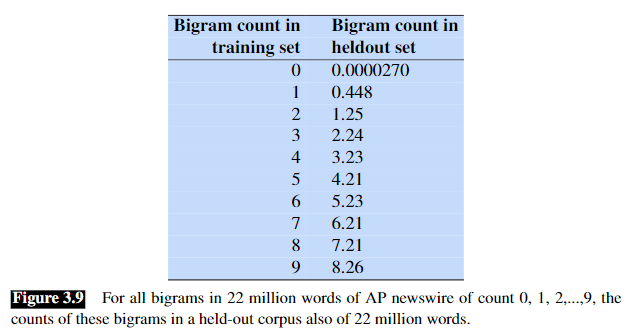

参考书目

https://web.stanford.edu/~jurafsky/slp3/3.pdf

## N-Grams

### 原始模型

某个句子出现的概率是

$$
\begin{aligned}
P(w_1 ... w_n) &= P(w_1) \ P(w_2|w_1) \ P(w_3|w_{1:2}) \ ... \ P(w_n|w_{1:n-1})
\\
&= \prod^n_{k=1} P(w_k|w_{1:k-1})
\end{aligned}
$$

该式表示在句子的m位置出现Xm的概率由前m-1个字/词共同决定

### NGram

#### 公式

但实际上很难统计上述概率，且一般只会跟邻近N个词相关性较高，所以有

$$
P(w_n|w_{1:n-1}) \approx P(w_n|w_{n-N+1:n-1})
$$

因此采用ngram，式子简化为

$$
\begin{aligned}
P(w_1 ... w_n) &= P(w_1...w_{N-1}) \ P(w_N|w_{1:N-1}) \ P(w_{N+1}|w_{2:N}) \ ... \ P(w_n|w_{n-N+1:n-1})
\\
&= P(w_1...w_{N-1}) \ \prod^n_{k=N} P(w_k|w_{k-N+1:k-1})
\end{aligned}
$$

注意，很多文章中计算句子出现的概率时，公式可能会忽略先验概率。如使用bigram计算ABCD，原式应为

$$
P(ABCD) = P(A) \ P(B|A) \ P(C|B) \ P(D|C)
$$

但给出的式子可能是一个条件概率的连乘式。这可能是因为在计算时加入了起始符号`<s>`，即变为

$$
P(ABCD) = P(<s>|A) \ P(B|A) \ P(C|B) \ P(D|C)
$$

#### 条件概率

使用最大似然估计计算ngram的条件概率

$$
P(w_n|w_{n-N+1:n-1}) = \frac{C(w_{n-N+1:n-1}\ w_n)}{C(w_{n-N+1:n-1})}
$$

其实道理很简单，比如对于ABCD，要计算出现ABC后再出现D的条件概率，则可以直接计算

$$
P(ABCD) = \frac{C(ABCD)}{C(ABC)}
$$

### Log Probabilities

由于一般条件概率的数值都较小，且结果需要由多个条件概率相乘，因此使用log处理可以减少精度损失，也可以适当缩小概率的差距

$$
p_1 * p_2 * p_3 * p_4 = exp(log \ p_1 + log \ p_2 + log \ p_3 + log \ p_4)
$$

## Evaluating Language Models

书里描述了一整节关于选取训练集和测试集的内容，不赘述

### Perplexity

$$
\begin{aligned}
PP(W) &= P(w_1 w_2 ... w_N)^{-\frac{1}{N}}
\\
&= \sqrt[N]{ \frac{1}{P(w_1 w_2 ... w_N)} }
\\
&= \sqrt[N]{ \prod_{i=1}^N \frac{1}{P(w_i|w_1 ... w_{i-1})} }
\end{aligned}
$$

因为这里取了倒数，所以理论上PP越小，P越大。因此最小化PP相当于最大化语言模型在测试集上的概率，所以可以用来评价模型的好坏。

这里其实相当于对参与运算的N个条件概率取了几何平均数。几何平均数有两种性质，一是当每个乘数增大时，几何平均数增大；二是当乘数增量一定时，增量分布得越平均，几何平均数越大。如`0.5*0.7对比0.6*0.6`

因此采用这个指标进行评估时，先取测试集中的一个句子，当模型计算出该句子的概率越大，且概率分布越平均，则模型的评价越好

## Sampling sentences from a language model

这里讲数据集采样，原理挺简单，且我不太用到，所以略过

## Generalization and Zeros

有一节专门在讲数据集的选取，在选取数据时应该注意所选的内容需与语言模型的使用场景吻合

下面的内容则是平滑

### Unknown Words

如何平滑一个在数据集里根本没出现过的单词，需要分为两种情况

* 若假设中数据本身不应存在unknown words，则直接不处理这种单词

* 否则可以采取如下方法
  
  * 选择一个完备的词典（vocabulary）
    
    * 将这些未知词转换为一个特殊token，如`<UNK>`
    
    * 像估计其他常见词一样估计该token的概率
  
  * 若没有上述字典
    
    * 将频数小于某个k值的词（k是某个小的值）全部替换为 `<UNK>`，或者直接在词典中保留前m个词（m要选取得比较大），其他全部替换为 `<UNK>`，再做估计

**对于unknown words的处理会影响到perplexity，因此使用其作为指标时需要保证比较的各个模型都使用了同一个词典**

### Smoothing

#### Laplace Smoothing

该方法很简单，因为平滑要解决的问题就是条件概率为0的情况，这里假设词典大小为V，则对所有V个词的频数都加1，这样就避免了出现0

该方法在很多现代ngram方法中表现并不好，但引入了一些重要概念

##### 原理

假设对于unigram模型，单词wi的频数ci与总词数N的关系为

$$
P(w_i) = \frac{c_i}{N}
$$

因为词典大小为V，所以经过laplace平滑后概率修正为

$$
P_{Laplace}(w_i) = \frac{c_i + 1}{N + V}
$$

同理，对于bigram，有

$$
P(w_n|w_{n-1}) = \frac{C(w_{n-1} w_n)}{C(w_{n-1})}
$$

平滑后为

$$
P_{Laplace}(w_n|w_{n-1}) = \frac{C(w_{n-1} w_n) + 1}{\sum_w (C(w_{n-1}w)+1)} = \frac{C(w_{n-1} w_n) + 1}{C(w_{n-1}) +V}
$$

**这种方法的问题在于，对数据集的改变太大，加入了过多的噪声**

##### Adjusted Count

这里定义一个值`c*`以方便比较，该值用于把平滑后的频数归一化到原来的总数N，使得 $P_{Laplace}(w_i) = \frac{c^*_i}{N}$

$$
c_i^* = (c_i + 1) \frac{N}{N+V}
$$

同理，bigram平滑后的c*为

$$
c^*(w_{n-1} w_n) = \frac{[C(w_{n-1} w_n) + 1] * C(w_{n-1})}{C(w_{n-1}) + V}
$$

##### 分析

由于该方法对每个词都加一，导致分母会加上一整个词库的大小，会导致平滑前后的词频变化较大，即 $\frac{c*}{c}$ 比值很大

直观的理解，该方法相当于把高词频的概率分布分一部分到低词频的词，因此会极大地削减高词频的概率。ngram空间越大，矩阵越稀疏，这种效果越明显

#### Add-k Smoothing

为了优化Laplace带来的噪声，将1变为k，k可以是更小的数，如0.01等

#### Backoff and Interpolation

回退与插值

##### 回退

回退的原理很简单，在高阶ngram中无法找到对应条件概率就使用较低阶的ngram值去近似

在回退算法中有一个重要的步骤来调整概率。因为我们使用对应的低阶ngram来近似高阶ngram，所以会导致整个数据集的总概率大于1

与addone的基本思想一样，我们也需要将高阶ngram的概率“匀一点”到概率为0的那些序列上（称为**discount**，即对高阶ngram的概率“打折扣”）

###### Katz回退

Katz回退中，若待计算的序列在数据集中出现过，则使用discounted的概率`P*`，否则使用低一阶的ngram对应的 $P_{BO}$ 与一个分布函数a的乘积作为新的 $P_{BO}$。如此迭代直到所有的序列概率都被计算。这里discounted概率 `P*` 应该只是在计算完所有需要backoff的序列的 $P_{BO}$ 后进行归一化的结果（即，确定了要匀多少概率出去后再进行归一化）

$$
\begin{aligned}
P_{BO}(w_n | w_{n-N+1:n-1}) = \left \{
\begin{aligned}
& P^*(w_n | w_{n-N+1:n-1}) & if \ C(w_{n-N+1:n}) > 0
\\
& a(w_{n-N+1:n-1}) P_{BO}(w_n | w_{n-M+2:n-1}) & otherwise
\end{aligned}
\right .
\end{aligned}
$$

###### Good-Turing回退

是Katz回退中一种计算`P*`和a的具体方法

##### 插值

插值的原理则是在计算某个条件概率时，使用权值将高阶和低阶的ngram值混合，如线性插值的公式：

$$
\hat P(w_n | w_{n-2} w_{n-1}) = \lambda_1 P(w_n) + \lambda_2 P(w_n|w_{n-1}) + \lambda_3 P(w_n | w_{n-2} w_{n-1})
$$

且需要保证权值和为1，即

$$
\sum_i \lambda_i = 1
$$

上面的插值方法自然引入一个问题，即权值的选择。所以可以引入一个自适应权值的方法，所有的权值都由上下文计算

自适应的思路是若某个序列的bigram可以得到准确的数量（这里应该意思就是说该序列的bigram是存在的），则认为其对应的trigram是更加可信的，应对应调高它的权值，因此该权重是取决于上下文的。对于trigram，有

$$
\begin{aligned}
\hat P(w_n | w_{n-2} w_{n-1}) =& \lambda_1(w_{n-2:n-1}) P(w_n) 
\\
&+ \lambda_2(w_{n-2:n-1}) P(w_n|w_{n-1})
\\
&+ \lambda_3(w_{n-2:n-1}) P(w_n|w_{n-2} w_{n-1})
\end{aligned}
$$

不管采用固定权值还是自适应权值，确定权值的方法都是在一个held-out语料库中进行训练，该语料库与训练集独立，用于训练模型中的超参数。训练方法也是通过调整权值找到语料库的极大似然，文中提到的方法是采用EM算法

#### Kneser-Ney Smoothing

最常用的一种算法，基本是思路是尽量将高概率的ngram匀给概率为0的ngram，使得对概率分布带来的扰动尽量小（高概率的ngram对于扰动较不敏感）

##### Absolute Discounting

Church和Gale提出了一种方法，考虑discount一个频数为4的ngram，做法是在held-out语料库中统计训练集中所有频数为4的ngram。

下图是训练集中频数为0~9的所有bigram平均出现在held-out语料库中的频数（注意这种方法应该保证两个库的词数相同）

可以看到除了0和1，其他大多数频数的概率分布都比较接近

该方法的思想是对频数一样的序列减去一个固定的值，而由于上述观察，则可以对大多数。由前面的讨论可知，smoothing算法带来的扰动对于低频数的序列影响较明显，所以该方法可以有效地减少这种扰动。

$$
P_{AbsoluteDiscounting}(w_i | w_{i-1}) = \frac{C(w_{i-1} w_i) - d}{\sum_v C(w_{i-1} v)} + \lambda(w_{i-1}) P(w_i)
$$

## Huge Language Models and Stupid Backoff

先是讲了大型模型的数据集和存储方法（如通过布隆过滤器等进行存储来节省大量空间）

然后讲了一种回退方法stupid backoff

这种方法原理很简单，就是在回退的时候不用各种方案来归一化概率，而是直接使用低一阶的ngram，即

$$
S(w_i | w_{i-N+1:i-1}) = \left \{
\begin{aligned}
& \frac{count(w_{i-N+1:i})}{count(w_{i-N+1:i-1})} & if \ count(w_{i-N+1:i}) > 0
\\
~
\\
& \lambda S(w_i|w_{i-N+2:i-1}) & otherwise
\end{aligned}
\right .
$$

由于没有对概率进行归一化，所以该方法得出的值并不是一个概率分布

一个研究指出 $\lambda = 0.4$ 有较好的结果
