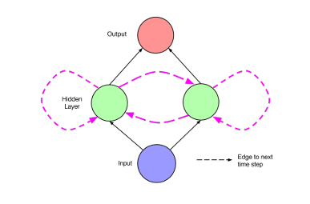
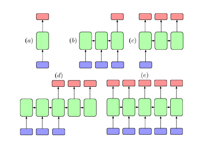

## ref

* [1506.00019](https://arxiv.org/pdf/1506.00019)  原文

* [Understanding LSTM Networks -- colah's blog](http://colah.github.io/posts/2015-08-Understanding-LSTMs/)  一篇很好的blog

* [BPTT算法详解：深入探究循环神经网络（RNN）中的梯度计算【原理理解】-CSDN博客](https://blog.csdn.net/qq_22841387/article/details/139283146)

* [TBPTT算法——Truncated Backpropagation Through Time-CSDN博客](https://blog.csdn.net/Answer3664/article/details/101059171)

## Introduction

这边介绍了RNN相比传统网络的一个优势：

* 传统网络理论上要求每个训练集和测试机的数据点都是独立的，因为每处理一个数据点后网络的状态都会丢失（这里意思应该是说传统NN没有记忆组件）

* RNN则有能力在序列的每步中传递部分信息

引入RNN时作者提了三个关键问题并一一解答

* 为什么模型需要显式地对序列进行建模
  
  传统模型没有对序列建模，但一般会通过滑动窗口等引入上下文的概念。但滑动窗口的一个致命缺点就是无法处理长上下文

* 为什么不用马尔可夫模型
  
  因为随着上下文窗口的增加，马尔可夫模型的转移矩阵会指数级爆炸，特别在底数很大的情况下爆炸情况更严重
  
  此外RNN的隐含层表达能力很强，即使假设隐含层中每个神经元都只有1和0两个值，其也可以表达2^N种状态；而一般神经元状态都是由实数表示的，可以表示的状态非常多

* RNN的表达能力会过强么
  
  这边提到了一个有限长度RNN可以模拟一个通用图灵机，但这里可能导致RNN训练过程难以收敛。但一个确定架构的RNN可以采用常见的梯度下降来进行训练，并且通过一些常用方法，如权重衰减、dropout、限制自由度等方式防止过拟合

## Background

### Sequences

RNN的输入输出都是序列，可以用 $(x^{(1)}, x^{(2)},...,x^{(T)})$ 表示输入，$(y^{(1)}, y^{(2)},...,y^{(T)})$ 表述输出

这里每个序列数据的间隔可以是以时间为间隔的，也可以是其他。比如一句话的每个单词也可以作为序列的每个元素输入

### Neural networks

基本是神经网络结构的基础知识

### Feedforward networks and backpropagation

反向传播的基本知识

### Recurrent neural networks

循环神经网络输出的公式为

$$
h^{(t)} = \sigma (W^{hx} x^{(t)} + W^{hh} h^{(t-1)} + b_h)
\\
\hat y^{(t)} = softmax(W^{yh}h^{(t)} + b_y)
$$

其中$W^{hx}$是输入和隐含层的权重转换矩阵，$W^{hh}$是隐含层内部相邻时间步长间的权重转换矩阵，bh和by是偏移

下图是一个简单的循环神经网络

若按时间步长展开，可以视为下图

展开后可以视为一个深度神经网络，每个时间步长对应一个隐含层，且每个时间步长间的权重共享。因此该网络可以使用反向传播训练，这种算法被称为backpropagation through time（BPTT）

#### Early recurrent network designs

最早的循环神经网络是Hopfield（1982）定义的，用于模式识别。该网络定义了一系列节点，并在节点间有一些权重值，链接函数则是简单的零阈值。使用时将模式编码为节点中的值，网络根据其更新规则执行几轮，最后输出另一个模式。该网络适用于从损坏的模式恢复原有模式，是玻尔兹曼机和自动编码机的前身

另一个早期的循环神经网络由Jordan（1986）引入，是一个包含一个隐含层，且扩展了一些特殊单元的前馈神经网络。输出节点会反馈到特殊单元，这些特殊单元的值则会在下一个时间步中反馈到隐含层，因此特殊单元可以记录上一个时间步的动作。此外，特殊单元也有一条反馈函数连接到节点本身上，因此也使得该网络可以跨多个时间步长传递信息。Sutskever（2014）也使用了一个类似直接由输出节点接入反馈的方法设计模型，该模型用于自然语言翻译，当生成一段文本时，每个时间步生成的单词都会在下一个时间步作为输入反馈到网络中

Elman（1990）使用了比Jordan简单的网络结构：与隐含层中每个单元关联的是一个上下文单元，每个上下文单元j'将对应的隐含层单元j上一个时间步的状态作为输入，并且采用一个固定权重$w_{j'j} = 1$；上下文单元的输出之后又通过一条标准边反馈到对应的隐含层单元j'

这种结构已经等价于简单的RNN，因为每个隐含层单元都有一条自连接的循环边。通过一条固定权重的循环边使得隐含层节点自连接的设计是LSTM的基础。

这篇论文做了一个实验：输入一个二进制序列，其中前两个数字是随机的，最后一个数字是前两个数字的xor值。随机猜测的正确率为50%，该网络正确率能达到66.7%，在当时算表现最好的网络了

#### 训练循环神经网络

训练循环神经网络在很长一段时间都被认为是困难问题，因为需要解决如何跨时间步反向传播目标函数偏差并且进行梯度下降的问题

这里考虑一个最简单的循环神经网络：

现在考虑输入在τ时间传给网络，而偏差在t时间计算出来，并假设中间的时间步输入为0。循环神经网络的梯度存在一个重要的问题，即梯度爆炸或梯度消失。考虑将上述循环神经网络按时间步展开

由于循环神经网络有一条自连接边，因此上述展开中每个时间步间的边权重都是一致的，因此输入值传播到输出中间会经过n次同样的边，因此梯度要么指数上升（$|w_{j'j}|>1$），要么指数下降（$|w_{j'j}|<1$）。这个问题会随着时间步的增加而越发严重

论文第17页讲述了一系列对RNN训练方法的研究

循环神经网络常用训练方法BPTT：[BPTT算法详解：深入探究循环神经网络（RNN）中的梯度计算【原理理解】-CSDN博客](https://blog.csdn.net/qq_22841387/article/details/139283146)

TBPTT（Truncated backpropagation through time）用于解决BPTT对于长时间步开销过大的问题：[TBPTT算法——Truncated Backpropagation Through Time-CSDN博客](https://blog.csdn.net/Answer3664/article/details/101059171)

### Modern RNN Architectures

现代RNN网络架构主要由两篇文章引入，一个是1997年的LSTM（Long Short-Term Memory），引入了存储单元，一种用于替代RNN隐含层中传统单元的计算单元，使用这种单元可以克服早期RNN训练上面临的一系列困难

第二篇是1997年的BRNN（Bidirectional Recurrent Neural Networks），该文章介绍了一种架构的RNN，它的输出不仅依赖于过去的序列，还依赖于未来的序列（与传统结构只依赖过去数据不同），该架构成功运用于自然语言处理

#### LSTM

如图是一个LSTM单元，自连接的节点代表了内部状态s，这是一个线性单元。蓝色虚线是循环边，该边有固定的权重。LSTM具体由下列部件组成

* 输入节点：图中的gc，该节点以当前输入层的值x(t)和上一个隐含层的值h(t-1)作为输入。激活函数一般是tanh，但在提出LSTM的论文中是sigmoid
  
  $$
  \boldsymbol g^{(t)} = \phi( W^{gx} \boldsymbol x^{(t)} + W^{gh} \boldsymbol h^{(t-1)} + \boldsymbol b_g )
  $$

* 输入门：输入门ic是LSTM中比较特殊的节点，也以当前输入和上一个时间步的隐含层作为输入。它称为门是因为它会与gc相乘，因此若ic为0，则等同于阻断输入，为1则等同于接收所有输入
  
  $$
  i^{(t)} = \sigma(W^{ix} \boldsymbol x^{(t)} + W^{ih} \boldsymbol h^{(t-1)} + \boldsymbol b_i)
  $$

* 内部状态：内存单元的核心sc是一个线性节点，输入为g和i的点积。其有一条固定权重的自连接边。这条边虽然跨越了多个时间步但是权重为常数，因此不会导致梯度爆炸或梯度消失
  
  $$
  \boldsymbol s^{(t)} = \boldsymbol g^{(t)} \odot \boldsymbol i^{(t)} + \boldsymbol s^{(t-1)}
  $$

* 输出门：与输入门有类似的作用，其输入也与输入门一致
  
  $$
  \boldsymbol o^{(t)} = \sigma (W^{ox} \boldsymbol x^{(t)} + W^{oh} \boldsymbol h^{(t-1)} + \boldsymbol b_o)
  $$

* 最终输出：
  
  $$
  \boldsymbol h^{(t)} = \phi (\boldsymbol s^{(t)}) \odot \boldsymbol o^{(t)}
  $$

直观上考虑LSTM的各个单元：LSTM可以学习何时将一些动作放入内部状态，何时将其放出。当输入门为0时，没有动作可以进入，当输出门为0时没有动作可以输出。当两个门同时关闭时状态会在内部流转。而内部状态自连接边权重为常数的设计使得不会出现梯度爆炸或梯度消失的问题

LSTM出现后也诞生了一些变体，如遗忘门的设计，该设计已经基本成为现在LSTM的标准

* 遗忘门：该单元的引入使得网络可以学习如何更新内部状态，这对于一个连续运行的网络尤其有用
  
  $$
  \boldsymbol f^{(t)} = \sigma (W^{fx} \boldsymbol x^{(t)} + W^{fh} \boldsymbol h^{(t-1)} + \boldsymbol b_f)
\\
\boldsymbol s^{(t)} = \boldsymbol g^{(t)} \odot \boldsymbol i^{(t)} + \boldsymbol f^{(t)} \odot \boldsymbol s^{(t-1)}
  $$

* 还有一种变体是将一些内部状态直接"peephole connect"到输入和输出门（这些连接都是在同一个LSTM单元中）。对于这种设计有一个直观的理解：考虑网络针对的任务是计数，并且当计数了n个对象时会产生对应输出。网络可能会学习在看到每个对象时让固定数量的动作进入内部状态sc，并且每次看到一个对象sc都会迭代递增；而当看到第n个对象时，网络需要让一些内容从内部状态输出，从而来影响网络输出的内容，为了实现这一点输出门oc必须知道内部状态sc的内容

下面展示使用LSTM单元替代RNN中隐含层的普通单元的例子

实际上就是把原来隐含层节点的输出接到对应LSTM单元的各个需要上一个时间节点隐含层作为输入的地方。这些结构的共同点就是每一层都以上一层当前输入值和当前层的上一个时间步值作为输入

#### BRNN

除LSTM外另一种最常用的RNN架构是BRNN，该架构有两个隐含层，每个隐含层都会跟输入和输出连接，第一个隐含层与普通RNN相同，节点与节点间按时间正向连接，而第二个隐含层则相反，如图

给定输入序列和输出序列，BRNN可以在时间步展开后运行反向传播算法进行训练。BRNN的正向传播算法如下：

$$
\boldsymbol h^{(t)} = \sigma(W^{hx} \boldsymbol x^{(t)} + W^{hh} \boldsymbol h^{(t-1)} + \boldsymbol b_h)
\\
\boldsymbol z^{(t)} = \sigma(W^{zx} \boldsymbol x^{(t)} + W^{zz} \boldsymbol h^{(t+1)} + \boldsymbol b_z)
\\
\hat{\boldsymbol y}^{(t)} = softmax(W^{yh} \boldsymbol h^{(t)} + W^{yz} \boldsymbol z^{(t)} + \boldsymbol b_y)
$$

其中h和z是隐含层中正向连接和反向连接的传播值

BRNN有一个限制，就是它的输入必须有一个固定的点，换句话说它必须获取一定的过去和未来的输入才能进行输出（我觉得可以理解为输出有一定的延迟）。并且对于一些只能以过去的数据作为输入的任务不适用

LSTM和BRNN实际上思路类似：通过替换RNN隐含层中的基础单元来实现优化。实际上一种称为BLSTM的网络也在手写识别上达到SOTA（当时的数据）

#### Neural Turing Machines

有点类似图灵机，结构是一个RNN扩展了可寻址的内存。

神经网络图灵机的两个主要组件：

* 控制器  循环前馈神经网络，其获取输入并产生输出，且负责将指令从内存读取或写入

* 内存矩阵  N*M的内存单元，存在一定数量的读写头供控制器进行交互

NTM仍然具有端到端的可分性，并可以由BPTT进行训练

NTM的实验是模拟一些基础的图灵机算法，如复制、排序等，作者使用了几种网络进行训练：LSTM RNN、使用前馈控制器的NTM、使用LSTM控制器的NTM。结果表明两种NTM结构都显著优于LSTM RNN

#### Applications of LSTMs and BRNNs

* (a)  普通的前馈神经网络，其中蓝色是输入，绿色是隐含层，红色是输出

* (b)  文本识别和视频分类任务可以被视为输入一个序列，输出一个固定长度向量的任务

* (c)  图像描述相反，可以视为输入一个固定长度向量（图片），输出一个序列的任务

* (d)  这种架构被用于自然语言翻译任务，输入一个序列最后输出一个序列，这里序列间长度可能不同

* (e)  这种架构被用于学习一个文本生成模型，可以预测下一个字符的内容

##### Representations of natural language inputs and outputs

早期使用独热码编码自然语言，但只要词表一大就会导致编码空间很大，且这种表达方式没法捕捉到词与词间的相似性。因此后来发展出了用meaning vector（即在向量中包含了单词的意义）来表示语言的方法，在一些情况下，单词的意义会从大量监督数据集中提取，但更常见的是通过基于单词共同出现概率的embedding算法来初始化向量。用来生成词向量的经典工作有GloVe和word2vec

对文本数据的分布式表示最早在1986被引入，在2003年扩展应用到NLP，2010年前后被一些描述循环自动编码器网络（Recursive auto-encoder, RAE）的论文应用

还有一些工作会以字母为单位进行编码和输出

##### Evaluation methodology

对于描述类和翻译类任务，可能存在多种正确的结果，因此评估起来比多分类问题困难

###### BLEU分数

一种常用评估方案是BLEU分数，该分数的基本原理就是计算答案的ngram概率（N一般取4）。但对于短句的BLEU分数可能很高，BLEU引入一个惩罚因子B

$$
B = \left \{
\begin{aligned}
& 1 & if \ c > r
\\
& e^{(1-r/c)} & if \  c \leq r
\end{aligned}
\right .
\\
BLEU = B \cdot exp(\frac{1}{N} \sum_{n=1}^N log p_n)
$$

其中c为输出的翻译结果的平均长度，r是对应正确翻译结果的平均长度，pn是输出的翻译结果在对应正确翻译结果中的ngram概率

尽管BLEU分数被大量使用，但却不能保证分数高的结果实际上效果好于分数低的结果。BLEU分数趋向于让大量翻译结果趋向于正确，但对于单个句子的效果实际无法保证

###### METEOR

可以避免BLEU中的一些问题。METEOR基于输出翻译结果与正确翻译结果的单词间显式的对应关系

$$
F_a = \frac{P \cdot R}{a \cdot P + (1-a) \cdot R}
\\
METEOR = (1-M) \cdot F_a
$$

P为准确率，R为召回率。M正比于`c/m`，其中c是在输出结果与正确结果中都出现的单词最小连续快，m是匹配的unigram个数

##### Natural language translation

自然语言翻译是另一种基本任务，2014年出现了如下翻译任务的架构，其中多个LSTM层作为encoder，多个LSTM层作为decoder

* 每个时间点输入一个单词到LSTM，一开始不会产生任何输出。这里作者发现将输入反向输入LSTM可以明显提升效果

* 当短句到达结尾，会向LSTM decoder发送一个特殊符号（EOS），用于指示句子输出。此时decoder获取到encoder的最终结果，每个时间点根据softmax概率输出一个单词

* decoder选择概率最大的单词输出，直到EOS

训练时，输入喂给encoder，对应输出喂给decoder，损失函数从decoder的输出反向传播到整个序列模型中

##### Image captioning

该任务为描述输入的图片

一种方法类似上面的翻译任务，但将encoder换成了CNN，decoder照样是LSTM，另一项工作的encoder为CNN与双向注意力机制网络，decoder则是标准RNN，并使用word2vec作为输出单词的embedding

# 
