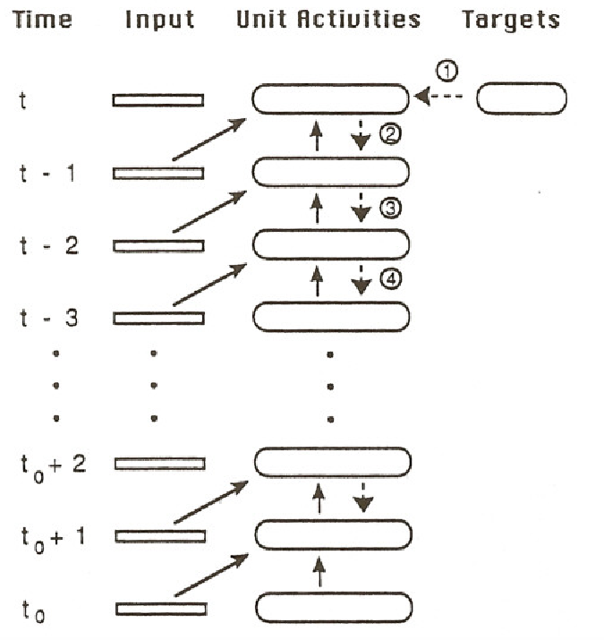

[Gradient-Based Learning Algorithms for Recurrent Networks and Their Computational Complexity](https://gwern.net/doc/ai/nn/rnn/1995-williams.pdf)  文章

[[PDF] 13 Gradient-Based Learning Algorithms for Recurrent Networks and Thei r Computational Complexity | Semantic Scholar](https://www.semanticscholar.org/paper/13-Gradient-Based-Learning-Algorithms-for-Recurrent-Williams-Zipser/4983823eb66ed5d8557f20dd5c8a09ed66f05c25)  图

[状态空间模型的离散化方法_状态空间方程离散化-CSDN博客](https://blog.csdn.net/weixin_39699362/article/details/136209499)  本文推导中的欧拉离散化

[DeepSeek - 探索未至之境](https://chat.deepseek.com/a/chat/s/7514ba0c-fd4c-4324-956d-0f1f010e07d4)  一些公式理解上与deepseek的对话，ds牛逼的

[BPTT算法详解：深入探究循环神经网络（RNN）中的梯度计算【原理理解】-CSDN博客](https://blog.csdn.net/qq_22841387/article/details/139283146)  推荐，非常清楚的推理

### Formal Assumptions and Definitions

#### Network Architecture and Dynamics

本文使用的网络如下

对应一个3*5的权重矩阵

定义$s_k(t)$为t时刻输入到第k个单元时计算出的中间值

$$
s_k(t+1) 
= \sum_{t \in U} w_{kl} y_l(t) + \sum_{l \in I} w_{kl} x_l^{net}(t) 
= \sum_{l \in U \cup I} w_{kl}x_l(t)
\\
y_k(t+1) = f_k(s_k(t+1))
$$

其中fk为激活函数

论文中根据下标所属的集合将x分为两个部分：当下标k属于I集合时，表示其是网络内部节点的输出；当下标k属于U集合时，表示其是外部节点的输出

该式表明这里使用的示例网络中每个连接都有一个时间步的延迟，即t+1时刻的输出只由t时刻的输入和输出决定。但后面的结论可以方便地扩展到含有不同连接或不同延迟的网络

从动力学方程的角度考虑上述前向传播过程：

考虑前向传播在$\Delta t$时间的变化量

$$
\begin{aligned}
& \Delta y = \frac{\Delta t}{\tau_k} * (f_k(s_k) - y_k)
\\
& 令 \Delta t 趋近于0，即
\\
& \tau_k \dot y_k(t) = - y_k(t) + f_k(s_k(t))
\\
& 进行欧拉离散化处理，得
\\
& y_k(t+\Delta t) = y_k(t) + \Delta t \dot y_k(t) = (1-\frac{\Delta t}{\tau_k}) y_k(t) + \frac{\Delta t}{\tau_k}f_k(s_k(t)]
\\
& 令\beta = \frac{\Delta t}{\tau_k} ，并将时间步离散化，\Delta t = 1
\\
& y_k(t+1) = (1-\beta) y_k(t) +\beta f_k(s_k(t)]
\end{aligned}
$$

#### Network Performance Measure

本节主要定义loss function

$$
\begin{aligned}
& 令d_k(t)为t时刻的预期输出，且只有k属于T(t)时存在对应的数据
\\
& 则t时刻的error为
\\
& e_k(t) = \left \{
\begin{aligned}
    & d_k(t) - y_k(t) & if \ k \in T(t)
    \\
    & 0 & otherwise
\end{aligned}
\right .
\\
& 全部单元在某个时间步的error为
\\
& J(t) = -\frac{1}{2} \sum_{k \in U} [e_k(t)]^2
\\
& 某段特定时间的全局error为
\\
& J^{total}(t', t) = \sum_{\tau=t'+1}^t J(\tau)
\\
& 则优化的目标即使上述函数最大化（注意J(t)的负号），因此考虑该函数对权重矩阵的梯度
\\
& \nabla \bold W J^{total}(t', t) = \sum_{\tau=t'+1}^t \nabla \bold W J(\tau)
\\
& 则对于某个权重的偏导为，其中\eta 为学习率
\\
& \Delta w_{ij} = \eta \frac{\partial J^{total}(t', t)}{\partial w_{ij}}
\end{aligned}
$$

#### Backpropagation Through Time

##### Unrolling a Network

展开网络

假设原本的RNN用N表示，其中含有n个单元，则网络N从t0到t可以展开为一个前馈神经网络N*，该网络含有t-t0层，每层有n个神经元，且对于N中每一条连接，N*的两层间都有对应相同的连接

通过这种方式可以将对RNN网络N整体error最小化的任务转换为对前馈神经网络N*中每层权重的优化（即将RNN网络的训练问题转换为FNN的训练问题）

##### Real-Time Backpropagation Through Time

文章介绍了两种基础BPTT算法，一种是实时的BPTT，另一种是Epochwise的BPTT，两种算法的误差在于误差值取的是某个时间点的误差还是整个epoch训练过程中的总误差

为了计算t时刻的误差 J(t)，则对于$k \in U, \tau \in (t_0, t]$，$\varepsilon_k(\tau)=\frac{\partial J(t)}{\partial y_k(\tau)}$ 表示t时刻的误差J(t)对第k个单元在$\tau$时刻的输出的敏感程度，$\delta_k(\tau)=\frac{\partial J(t)}{\partial s_k(\tau)}$ 表示t时刻误差J(t)对第k个单元在$\tau$时刻内部网络输出的敏感程度

$$
\begin{aligned}
& 由于t时刻整体误差对y_k(t)的偏导
\\
& \frac{\partial J(t)}{\partial y_k(t)} = \frac{\partial}{\partial y_k(t)}(-\frac{1}{2} \sum_{m \in U} [d_m(t) - y_m(t)]^2) = d_k(t) - y_k(t) = e_k(t)
\\
& 因此有
\\
& \varepsilon_k(t) = \frac{\partial J(t)}{\partial y_k(t)} = e_k(t)
\\
& 表示t时刻损失函数J(t)对第k个神经元输出y_k(t)的局部误差
\\
& 下面需要计算每个时间步的反向传播。对于每一个时间步\tau，其局部梯度为：
\\
& \delta_k(\tau) 
  = \frac{\partial J(\tau)}{\partial s_k(\tau)}
  = \frac{\partial J(\tau)}{\partial y_k(\tau)} \cdot \frac{\partial y_k(\tau)}{\partial s_k(\tau)}
  = \varepsilon_k(\tau) f_k'(s_k(\tau))
\\
& 传递到上一个时间步的中第k个神经元的误差则为
\\
&（注意由于是RNN，每层网络结构和权重一致）
\\
& \varepsilon_k(\tau-1)
= \frac{\partial J(t)}{\partial s_k(\tau-1)}
= \sum_{l \in U} \frac{\partial J(\tau)}{\partial y_l(\tau)}
  \cdot \frac{\partial y_l(\tau)}{\partial s_l(\tau)}
  \cdot \frac{\partial s_l(\tau)}{\partial y_k(\tau-1)} 
= \sum_{l \in U} w_{lk} \delta_l(\tau)
\\
& \varepsilon_k(\tau-1)表示\tau-1时刻第k个神经元输出y_k(\tau-1)的局部误差
\\
& 而\tau-1时刻的造成的误差对于\tau时刻的所有输出都有影响
\\
& 因此计算偏导时需要考虑所有l \in U
\\
& 若反向传播的时间跨度从t_0+1到t，则可以求得权重对J(t)的偏导数
\end{aligned}
$$

上述计算的传播过程如图

若计算反向传播的时间从t0+1到t，则可以计算权重的梯度

$$
\begin{aligned}
& 由于前向传播公式为
\\
& s_k(\tau) 
= \sum_{l \in U \cup I} w_{kl}x_l(\tau-1)
\\
& 所以有
\\
& \frac{\partial s_i(\tau)}{\partial w_{ij}} =  x_j(\tau-1)
\\
& 则对所有时间步求梯度
\\
& \frac{\partial J(t)}{\partial w_{ij}}
= \sum_{\tau=t_0+1}^t \frac{\partial J(t)}{\partial s_i(\tau)} \cdot \frac{\partial s_i(\tau)}{\partial w_{ij}}
= \sum_{\tau=t_0+1}^t \delta_i(\tau) x_j(\tau-1)
\end{aligned}
$$

实时的BPTT更多是一个理论上的最优结果，其假设的是梯度调整需要参考的时间跨度为无限长（即参考无限久之前的历史数据）

##### Epochwise Backpropagation Through Time

Epochwise只会考虑有限时间步长内的误差，因此可以构成一个近似解

考虑时间段t0到t1的情况，其中$\varepsilon_k(\tau)=\frac{\partial J^{total}(t_0, t_1)}{\partial y_k(\tau)}$ 表示t时刻的误差J(t)对第k个单元在\tau时刻的输出的敏感程度，$\delta_k(\tau)=\frac{\partial J^{total}(t_0, t_1)}{\partial s_k(\tau)}$ 表示t时刻误差J(t)对第k个单元在\tau时刻内部网络输出的敏感程度

$$
\begin{aligned}
& 反向传播从最后一个时间步开始，基本与Realtime的计算方式一致
\\
& \varepsilon_k(t_1) = e_k(t_1)
\\
& \delta_k(\tau)
  = \varepsilon_k(\tau) f_k'(s_k(\tau))
\\
& 迭代步骤则于Realtime有一个不同：
\\
&每一步计算都会引入当前迭代的误差作为修正项
\\
& \varepsilon_k(\tau-1)
= e_k(\tau-1) + \sum_{l \in U} w_{lk} \delta_l(\tau)
\end{aligned}
$$

因此该算法的误差是由外部误差和当前误差（文章里称为virual error）组成的，该项使得每步的误差不仅与上一个时间步传递过来的误差有关，还与当前时间步有关

则对应的权重梯度为

$$
\begin{aligned}
& \frac{\partial J^{total}(t_0, t_1)}{\partial w_{ij}}
= \sum_{\tau=t_0+1}^t \frac{\partial J^{total}(t_0, t_1)}{\partial s_i(\tau)} \cdot \frac{\partial s_i(\tau)}{\partial w_{ij}}
= \sum_{\tau=t_0+1}^t \delta_i(\tau) x_j(\tau-1)
\end{aligned}
$$

##### Epochwise BPTT Applied to Settling Networks

这里与另一篇论文中一种名为RBP（recurrent backpropagation）的算法的对比，并且说明对于若一个网络的输入长期保持一致并到达不动点，两种算法有着类似的表现，且当网络快速收敛到达一个不动点时可能导致一系列问题
