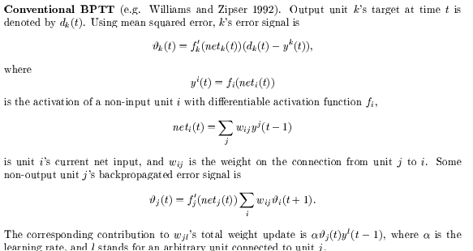

### ref

[LSTM：《Long Short-Term Memory》的翻译并解读_1 introduction. recurrent neural networks, long sh-CSDN博客](https://blog.csdn.net/qq_41185868/article/details/80248753)

[nc.dvi](https://www.bioinf.jku.at/publications/older/2604.pdf) 原文

这篇文章公式较多，很多都会采用截图的方式

### Introduction

* 问题：当时的两种RNN训练方式BPTT（Back-Propagation Through Time）和RTRL（Real-Time Recurrent Learning）都面临梯度爆炸或消失的问题，前者可能导致权重的震荡，后者则会让步长较长的连接失效

* 文章介绍了一种叫做长短期记忆（Long Short-Term Memory，LSTM）的RNN网络，该网络可以克服上述困难，并能在不失去短期连接有效性的前提下学习长达1000步的长期连接

### Constant Error Backprop

#### 指数衰减误差

介绍了一系列计算误差的方法

##### 传统BPTT

[Gradient-Based Learning Algorithms for Recurrent Networks and Their Computational Complexity](https://gwern.net/doc/ai/nn/rnn/1995-williams.pdf)

其中$net_i(t)$表示第i个单元t时刻的输出，fi表示激活函数；$y^i(t)$表示非输入单元i在t时刻的输出，$d_k(t)$表示目标输出

