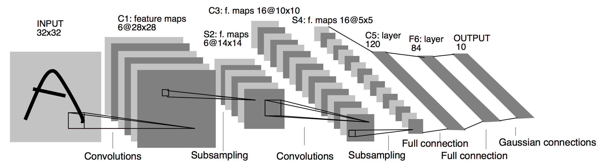

### ref
书籍链接 http://tangshusen.me/Dive-into-DL-PyTorch/#/
## 基础概念

### tensor

tensor类似于多维数组,但提供了一系列操作
#### 创建

##### 直接创建

```python
import torch
x = torch.empty(5,3)    #未初始化的5*3tensor
x = torch.rand(5,3)     #随机的tensor
x = torch.zeros(5,3)    #全0的tensor
x = torch.ones(5,3)     #全1
x = torch.eye(5)        #单位矩阵对应的tensor
x = torch.tensor([5,3]) #内容为[5,3]的一维tensor
x = torch.arange(1, 5, 1)   #[1,2,3,4]
x = torch.linspace(1, 5, 5) #[1,2,3,4,5]
```

##### 从现有tensor创建

```python
x = x.new_ones(5, 3, dtypes=torch.float64)
x = torch.randn_like(x, dtypes=torch.float)
```

#### 基本操作

##### 相加

```python
x + y
torch.add(x, y)
y.add_(x)
```

##### 索引

类似python的切片,但注意tensor的切片是共享内存的,即没有进行拷贝复制

```python
x = torch.tensor([1,2,3,4,5])
y = x[1:3]
```

##### 对某维度进行运算

```python
X = torch.tensor([[1, 2, 3], [4, 5, 6]])
X.sum(dim=0, keepdim=True)		#对X的0维度（同一列）进行求和，并对于结果保持其维度（结果为[5,7,9]）
X.sum(dim=1, keepdim=True)		#对X的1维度（同一行）进行求和，结果为[[6], [15]]
```

这里的行列概念需要明确，如X是`2*3`的矩阵，有2行3列，元素分别为`[ [a11, a12, a13], [a21, a22, a23] ]`

应该把dim看作一个掩码，如对于dim=0，相当于掩盖了除第1维外的下标数字，即只对下标的第一个数字不同的数进行求和

##### 预测概率

gather函数可以用于计算预测概率，即如下面实例，y_hat指定了当前对两个样本的分类结果，y指定了两个样本的标签，gather的输出即样本标签对应的预测概率。

注意这里的将`1*n`向量转换为`n*1`向量，用于与y_hat的每个预测项匹配

```python
y_hat = torch.tensor([[0.1, 0.3, 0.6], [0.3, 0.2, 0.5]])
y = torch.LongTensor([0, 2])
y_hat.gather(1, y.view(-1, 1))
```

输出为

```
tensor([[0.1000],
        [0.5000]])
```

##### 拼接

可以使用torch.cat对多个tensor进行拼接

```python
A = torch.ones(2, 3)
B = 2*torch.ones(2, 3)

torch.cat((A,B), 0)
torch.cat((A,B), 1)
```

结果

```
tensor([
[1,1,1],
[1,1,1],
[2,2,2],
[2,2,2]
	])
	
tensor([
[1,1,1,2,2,2],
[1,1,1,2,2,2]
	])
```


其他函数

* index_select
* masked_select
* nonzero
* gather

#### 复制

```python
y = x.clone()
```

#### 改变形状

注意view只改变索引,不创建拷贝
```python
x = torch.ones(3,5)     #创建一个3*5的tensor
view1 = x.view(5,3)     #以5*3观察x
view2 = x.view(15)      #以1*15观察x
```

#### 取值

可以以python的数值形式返回一个tensor元素的值
```python
torch.item(x[0])
```

#### 线性代数

* trace     矩阵的迹(对角线元素之和)
* diag      对角线元素
* triu/tril 矩阵上三角/下三角
* mm/bmm    矩阵乘法
* t         转置
* dot/cross 内外积
* inverse   逆矩阵
* svd       奇异值分解

#### 广播机制

形状不同的tensor运算时会触发

```python
x = torch.tensor([1,2,3])
y = torch.tensor([ [1], [2], [3] ])

```
结果为
```
tensor([[2, 3, 4],
        [3, 4, 5],
        [4, 5, 6]])
```
即x与y先被扩展后再运算
```
[   [1, 2, 3]
    [1, 2, 3]
    [1, 2, 3]   ]
+
[   [1, 1, 1]
    [2, 2, 2]
    [3, 3, 3]   ]

```

#### 内存开销优化

pytorch在运算时会使用新的空间存放运算结果,即运算`y = x+y`时,`id(y)`的值会改变,为了减少内存分配开销,可以采用下面方法

```python
y[:] = x + y
torch.add(x, y, out=y)
```

#### 和numpy互转

注意两种方法的区别:前者与原来的narray绑定,后者是用narray初始化一个tensor

* torch.from_numpy()
* torch.tensor()

#### device

可以指定tensor是定义在gpu上还是cpu上

```python
device = torch.device("cuda")          # GPU
y = torch.ones_like(x, device=device)  # 直接创建一个在GPU上的Tensor
```

## 深度学习基础

### 线性回归

#### 线性回归的定义及性质

使用一个例子说明线性回归

##### 模型定义

$$
y = x_1 w_1 + x_2 w_2 + b
$$

##### 预测表达式

$$
\hat y^{(i)} = x_1^{(i)} w_1 + x_2^{(i)} w_2 + b
$$

##### 损失函数
一般选择平方误差函数

$$
ℓ^{(i)}(w_1,w_2,b) = \frac{1}{2}(\hat y^{(i)} - y^{(i)})^2
$$

使用误差平均值来评价模型

$$
ℓ(w_1,w_2,b) = \frac{1}{n} \sum^n_{i=1} ℓ^{(i)}(w_1,w_2,b) = \frac{1}{n} \sum^n_{i=1} \frac{1}{2} (x_1^{(i)} w_1 + x_2^{(i)} w_2 + b - y^{(i)})^2
$$

目的是找出一组参数$w_1, w_2, b$使平均损失最小

$$
w^*_1, w^*_2, b = argmin ℓ(w_1,w_2,b)
$$

##### 优化算法
小批量随机梯度下降

$$
w_1 = w_1 - \frac{η}{|B|}\sum_{i \in B} \frac{∂ℓ^{(i)}(w_1,w_2,b)}{∂w_1} = w_1 - \frac{η}{|B|}\sum_{i \in B} x_1^{(i)} (x_1^{(i)} w_1 + x_2^{(i)} w_2 + b - y^{(i)})

\\

w_2 = w_2 - \frac{η}{|B|}\sum_{i \in B} \frac{∂ℓ^{(i)}(w_1,w_2,b)}{∂w_2} = w_2 - \frac{η}{|B|}\sum_{i \in B} x_2^{(i)} (x_1^{(i)} w_1 + x_2^{(i)} w_2 + b - y^{(i)})

\\

b = b - \frac{η}{|B|}\sum_{i \in B} \frac{∂ℓ^{(i)}(w_1,w_2,b)}{∂b} = b - \frac{η}{|B|}\sum_{i \in B} (x_1^{(i)} w_1 + x_2^{(i)} w_2 + b - y^{(i)})
$$

B即每个小批量中的样本个数,η则为学习率

#### 线性回归的表示方法
##### 神经网络图


##### 矢量计算表达式
###### 预测表达式

假设有n个样本,可以写成以下形式
$$
\hat y^{(1)} = x_1^{(1)} w_1 + x_2^{(1)} w_2 + b
\\
\hat y^{(2)} = x_1^{(2)} w_1 + x_2^{(2)} w_2 + b
\\
...
\\
\hat y^{(n)} = x_1^{(3)} w_1 + x_2^{(3)} w_2 + b
$$

以矩阵形式表示各个参数
$$
\hat y = \begin{bmatrix}
            \hat y^{(1)} \\
            \hat y^{(2)} \\
            ... \\
            \hat y^{(n)} \\
        \end{bmatrix}


X = \begin{bmatrix}
            x_1^{(1)} & x_2^{(1)} \\
            x_1^{(2)} & x_2^{(2)} \\
            ... \\
            x_1^{(3)} & x_2^{(3)} \\
        \end{bmatrix}


w = \begin{bmatrix}
            w_1 \\
            w_2
        \end{bmatrix}
$$

则式子可以写作

$$
\hat y = Xw + b
$$

###### 损失函数
$\hat y$和y都是 `n*1` 矩阵,因此损失函数可以写成下列形式,即第一个转置矩阵为 `1*n` ,与`n*1`矩阵相乘相当于每个元素平方相加

$$
ℓ(\theta) = \frac{1}{2n} (\hat y - y)^T(\hat y - y)
$$

###### 小批量随机梯度下降

$$
\theta = \theta - \frac{η}{B} \sum_{i \in B} \nabla_\theta ℓ^{(i)}(\theta)
$$

其中$\theta = (w_1, w_2, b)$

展开其中的$\nabla$算子，为如下结果
$$
\nabla_\theta ℓ^{(i)}(\theta) = 
\begin{bmatrix}
\frac{∂ℓ^{(i)}(w_1, w_2, b)}{∂w_1}
\\
\frac{∂ℓ^{(i)}(w_1, w_2, b)}{∂w_2}
\\
\frac{∂ℓ^{(i)}(w_1, w_2, b)}{∂b}
\end{bmatrix}

=

\begin{bmatrix}
x_1^{(i)} (x_1^{(i)} w_1 + x_2^{(i)} w_2 + b - y^{(i)})
\\
x_2^{(i)} (x_1^{(i)} w_1 + x_2^{(i)} w_2 + b - y^{(i)})
\\
x_1^{(i)} w_1 + x_2^{(i)} w_2 + b - y^{(i)}
\end{bmatrix}

=

(\hat y^{(i)} - y^{(i)})

\begin{bmatrix}
x_1^{(i)}
\\
x_2^{(i)}
\\
1
\end{bmatrix}
$$

#### 线性回归实现

##### import

```python
import torch
from IPython import display
from matplotlib import pyplot as plt
import numpy as np
import random
```

##### 生成数据集

```python
num_inputs = 2
num_examples = 1000
true_w = [2, -3.4]
true_b = 4.2

features = torch.randn(num_examples, num_inputs, dtype=torch.float32)
	#生成1000*2的随机矩阵
labels = true_w[0] * features[:, 0] + true_w[1] * features[:, 1] + true_b
	#按照y = x1w1 + x2w2 + b的公式计算真实的数据分布1000*1矩阵
labels += torch.tensor(np.random.normal(0, 0.01, size=label.size()), dtype=torch.float32)
	#给矩阵加入相同维度的正态分布噪声矩阵
```

##### 打印数据

```python
def use_svg_display():
	display.set_matplotlib_formats('svg')
    
def set_figsize(figsize=(3.5, 2.5)):
    use_svg_display()
    plt.rcParams['figure.figsize'] = figsize
    
set_figsize()
plt.scatter(feature[:, 1].numpy(), labels.numpy())
```

##### 读取数据

```python
def data_iter(batch_size, features, labels):	#batch_size指定了一次返回的样本个数
    num_examples = len(features)
    indices = list(range(num_examples))
    random.shuffle(indices)		#生成随机的下标序列
    for i in range(0, num_examples, batch_size):
        j = torch.LongTensor(indices[i: min(i+batch_size, num_example)])
        yield feature.index_select(0, j), label.index_select(0, j)
```

##### 初始化模型参数

```python
w = torch.tensor(np.random.normal(0, 0.01, (num_inputs, 1)), dtype=torch.float32)
b = torch.zeros(1, dtype=torch.float32)
```

定义了一个均值为0，标准差为0.01的1*2正态随机数矩阵w，偏差b为0

```python
w.requires_grad_(require_grad=True)
b.requires_grad_(require_grad=True)
```

因为需要对参数求梯度来迭代参数的值，因此需要设置这个值

##### 定义模型

```python
def linreg(X, w, b):
    return torch.mm(X, w) + b
```

##### 定义损失函数

```python
def squared_loss(y_hat, y):
    return (y_hat - y.view(y_hat.size())) ** 2 / 2
```

##### 定义优化算法

```python
def sgd(params, lr, batch_size):
    for param in params:
        param.data -= lr * param.grad / batch_size
```

##### 训练模型

```python
lr = 0.03
num_epochs = 3
net = linreg
loss = squared_loss

for epoch in range(num_epochs):
    for X, y in data_iter(batch_size, features, labels):
        l = loss(net(X, w, b), y).sum()
        l.backward()
        sgd([w, b], lr, batch_size)
        
        w.grad.data.zero_()
        b.grad.data.zero_()	#梯度清零以便下次求解
    train_l = loss(net(features, w, b), labels)
    print("epoch %d, loss %f" %(epoch + 1, train_l.mean().item()))
```

#### 线性回归简洁实现

##### 生成数据集

相同

##### 读取数据

```python
import torch.utils.data as Data

batch_size = 10
dataset = Data.TensorDataset(feature, labels)
data_iter = Data.DataLoader(dataset, batch_size, shuffle=True)
```

可以得到相同结果

##### 定义模型

###### 继承nn.Module

```python
class LinearNet(nn.Module):
    def __init__(self, n_feature):
        super(LinearNet, self).__init__()
        self.linear = nn.Linear(n_feature, 1)
        
    def forward(self, x):		#定义前向传播
        y = self.linear(x)
        return y

net = LinearNet(num_inputs)
print(net)
```

###### nn.Sequential

```python
net = nn.Sequential(nn.Linear(num_inputs, 1))		#方法1

net = nn.Sequential()
net.add_module('linear', nn.Linear(num_inputs, 1))	#方法2

from collections import OrderedDict					#方法3
net = nn.Sequential(OrderedDict([
    ('linear', nn.Linear(num_inputs, 1))
]))
```

##### 查看模型与参数

```python
print(net)

for param in net.parameters():
    print(param)
```

##### 初始化模型参数

```python
from torch.nn import init

init.normal_(net[0].weight, mean=0, std=0.01)
init.constant_(net[0].bias, val=0)
```

##### 定义损失函数

使用nn模块的损失函数

```python
loss = nn.MSELoss()
```

##### 定义优化算法

```python
import torch.optim as optim

optimizer = optim.SGD(net.parameters(), lr=0.03)
print(optimizer)		#查看
```

##### 训练模型

```python
num_epochs = 3
for epoch in range(1, num_epochs+1):
    for X, y in data_iter:
        output = net(X)
        l = loss(output, y.view(-1, 1))
        optimizer.zero_grad()
        l.backward()
        optimizer.step()
    print('epoch %d, loss: %f' %(epoch, l.item()))
```

##### 输出结果

```python
dense = net[0]
print(true_w, dense.weight)
print(true_b, dense.bias)
```

### softmax回归

softmax回归是一个用于分类问题的线性模型

#### softmax回归定义及性质

##### 网络模型


$$
o_1 = x_1w_{11} + x_2w_{21} + x_3w_{31} + x_4w_{41} + b_1
\\
o_2 = x_1w_{12} + x_2w_{22} + x_3w_{31} + x_4w_{41} + b_1
\\
o_3 = x_1w_{13} + x_2w_{23} + x_3w_{31} + x_4w_{41} + b_1
$$
输出层是全连接层

##### softmax运算

softmax运算是一种归一化运算
$$
\hat y_1, \hat y_2, \hat y_3 = softmax(o_1, o_2, o_3)
\\
\left\{
\begin{aligned}
\hat y_1 &= \frac{exp(o_1)}{\sum^{3}_{i=1} exp(o_i)}
\\
\hat y_2 &= \frac{exp(o_2)}{\sum^{3}_{i=1} exp(o_i)}
\\
\hat y_3 &= \frac{exp(o_3)}{\sum^{3}_{i=1} exp(o_i)}
\end{aligned}
\right.
$$

##### 矢量计算表达式

上面的模型可以用矢量表达如下

参数
$$
W =
\begin{bmatrix}
w_{11} & w_{12} & w_{13} \\
w_{21} & w_{22} & w_{23} \\
w_{31} & w_{32} & w_{33} \\
w_{41} & w_{42} & w_{43} \\
\end{bmatrix}
\qquad 
b = 
\begin{bmatrix}
b_1 & b_2 & b_3
\end{bmatrix}
$$
输入输出层
$$
x^{(i)} = \begin{bmatrix} x_1^{(i)} & x_2^{(i)} & x_3^{(i)} &x_4^{(i)}  \end{bmatrix}
\\
o^{(i)} = \begin{bmatrix} o_1^{(i)} & o_2^{(i)} & o_3^{(i)} \end{bmatrix}
$$
预测输出
$$
\hat y^{(i)} = \begin{bmatrix} \hat y^{(i)}_1 & y^{(i)}_2 & y^{(i)}_3  \end{bmatrix}
$$
上述公式的矢量表达式
$$
o^{(i)} = x^{(i)}W + b
\\
\hat y^{(i)} = softmax(o^{(i)})
$$
**小批量样本分类矢量表达式**

每个小批量样本有n个样本，输入层输入个数为d，输出层输出个数为q，则

X为`n*d`矢量，W为`d*q`矢量，b为1*q矢量，则
$$
O = XW + b
\\
\hat Y = softmax(O)
$$
O和Y都为n*q矢量，表示n个分类结果

##### 交叉熵损失函数

对于分类的问题，可以构造真实标签集：

向量$y^{(i)}$是一个1*q向量，用于表示当前样本的真实分类，若样本类型标签是$y^{1}$，则除了$y^1$为1，其他y为0

###### 平方损失函数的问题

对于这种情况，若采用平方损失函数，则会有这样一种问题：

* 假设一共有三种分类$y_1,y_2,y_3$，对于分类结果1 $y_1=0.6, y_2=0.2, y_3=0.2$和分类结果2 $y_1=0.6, y_2=0, y_3=0.4$有相同的分类结果，但平方损失函数loss差别很大

解决方案之一是使用交叉熵损失函数

###### 定义

$$
H(y^{(i)}, \hat y^{(i)}) = - \sum^q_{j=1} y_j^{(i)} log \hat y_j^{(i)}
$$

这样子定义，由于标签只有一个y值是1，其余为0，假设真实标签为$y_d=1$，此式的结果为$-log \hat y_d$

因此交叉熵损失函数的形式为：
$$
\begin{aligned}
ℓ(Θ) 	&= \frac{1}{n} \sum^n_{i=1} H(y^{(i)}, \hat y^{(i)})
\\
		&= - \frac{1}{n} \sum^n_{i=1} log \hat y^{(i)}_{y^{(i)}}
\end{aligned}
$$
式子两边取指数，有
$$
e^{-nℓ(Θ)} = \prod^n_{i=1} \hat y^{(i)}_{y^{(i)}}
$$
使用第一种形式的式子，则优化目标为最小化ℓ(Θ)，最优情况`ℓ(Θ)=0`（因为每个项都小于等于0）

使用第二种形式的式子，则优化目标为最大化$e^{-nℓ(Θ)}$，即最大化数据训练集所有标签类别的联合预测概率

#### softmax实现

##### 初始化模型参数

输入向量长度为784，输出向量长度为10，因此参数矩阵为 784*10

```python
num_inputs = 784
num_outputs = 10

W = torch.tensor(np.random.normal(0, 0.01, (num_inputs, num_outputs)), dtype=torch.float)
b = torch.zeros(num_outputs, dtype=torch.float)
```

##### softmax运算

假设softmax输入向量长度为m，设样本数为n，输出向量长度（类别数）为l，则softmax应对`n*m`的矩阵进行运算，而运算应该只对同一行的参数进行，不同行间结果是独立的

```python
def softmax(X):
    X_exp = X.exp()
    partition = X_exp.sum(dim=1, keepdim=True)
    return X_exp / partition
```

##### 定义模型

```python
def net(X):
    return softmax(torch.mm(X.view( (-1, num_inputs) ), W) + b)
```

##### 定义损失函数

可以使用gather函数

```python
def cross_entropy(y_hat, y):
    return - torch.log(y_hat.gather(1, y.view(-1, 1)))
```

##### 计算分类准确率

```python
def accuracy(y_hat, y):
    return (y_hat.argmax(dim=1) == y).float().mean().item()
```

argmax(dim=1)用于计算y_hat（`n*l矩阵`）中概率预测值最大的元素的下标，因此`y_hat.argmax(dim=1) == y`表示预测的标签与实际标签相同的情况（`n*1矩阵`），得到的值对于每个样本都只有0和1，使用mean对`n*1`矩阵求平均值，得到预测准确率

总的准确率可以如下计算

```python
def evaluate_accuracy(data_iter, net):
    acc_sum, n = 0.0, 0
    for X, y in data_iter:
        acc_sum += (net(X).argmax(dim1) == y).float().sum().item()
        n += y.shape[0]
    return acc_sum / n
```

##### 训练模型

```python
num_epochs, lr = 5, 0.1

def train_ch3(net, train_iter, test_iter, loss, num_epochs, batch_size, params=None, lr=None, optimizer=None):
    for epoch in range(num_epochs):
        train_l_sum, train_acc_sum, n = 0.0, 0.0, 0
        for X, y in train_iter:
            y_hat = net(X)
            l = loss(y_hat, y).sum()

        	if optimizer is not None:
                optimizer.zero_grad()
            elif params is not None and params[0].grad is not None:
                for param in params:
                    param.grad.data.zero_()
            
            l.backward()
            if optimizer is None:
                d2l.sgd(params, lr, batch_size)
            else:
                optimizer.step()

            train_l_sum += l.item()
            train_acc_sum += (y_hat.argmax(dim=1) == y).sum().item()
            n += y.shape[0]
        test_acc = evaluate_accuracy(test_iter, net)
        print('epoch %d, loss %.4f, train acc %.3f, test acc %.3f'
              % (epoch + 1, train_l_sum / n, train_acc_sum / n, test_acc))

train_ch3(net, train_iter, test_iter, cross_entropy, num_epochs, batch_size, [W, b], lr)
```

#### softmax简洁实现

##### 定义和初始化模型

```python
num_inputs = 784
num_outputs = 10

class LinearNet(nn.Module):
    def __init__(self, num_inputs, num_outputs):
        super(LinearNet, self).__init__()
        self.linear = nn.Linear(num_inputs, num_outputs)
    def forward(self, x):
        y = self.linear(x.view(x.shape[0], -1))
        return y
    
net = LinearNet(num_inputs, num_outputs)
```

其中`x.shape[0]`为batch_size

**注意**：上述实现中因为MNIST训练集的图像数据形状为 (batch_size, 1, 28, 28) ，其中1表示图像有一个通道（一个uint8型），需要先转换为 (batch_size, 1, 784) 的矩阵，因此一般是先通过一个FlattenLayer初始化，下面的实现使用一个FlattenLayer和一个LinearLayer**替代上述的LinearNet类**

```python
class Flatten(nn.Module):
    def __init__(self):
        super(FlattenLayer, self).__init__()
    def forward(self, x):
        return x.view(x.shape[0], -1)
```

构建网络

```python
net = nn.Sequential(
	OrderedDict([
        ('flatten', FlattenLayer()),
        ('Linear', nn.Linear(num_inputs, num_outputs))
    ])
)
```

初始化参数

```
init.normal(net.linear.weight, mean=0, std=0.01)
init.constant_(net.linear.bias, val=0)
```

##### softmax和交叉熵损失函数

在上面的实现中，softmax和交叉熵的实现如下

```python
def softmax(X):
    X_exp = X.exp()
    partition = X_exp.sum(dim=1, keepdim=True)
    return X_exp / partition

def net(X):
    return softmax( torch.mm(X.view(-1, num_inputs), W) + b )

def loss(y_hat, y):
    return -torch.log( y_hat.gather(1, y.view(-1, 1)) )

l = loss(net(X), y)
```

pytorch定义了一个函数`nn.CrossEntropyLoss()`完成上述功能

在这里，有

```python
net = nn.Sequential(
	OrderedDict([
        ('flatten', FlattenLayer()),
        ('Linear', nn.Linear(num_inputs, num_outputs))
    ])
)

l = nn.CrossEntropyLoss(net(X), y).net()
```

##### 定义优化算法

学习率为0.1的小批量随机梯度下降

```python
optimizer = torch.optim.SGD(net.parameters(), lr=0.1)
```

##### 训练模型

使用上面一节的函数训练

```python
num_epochs = 5
train_ch3(net, train_iter, test_iter, loss, num_epochs, batch_size, None, None, optimizer)
```

### 多层感知机

#### 隐含层


在单层神经网络基础上引入的一个或多个隐含层

对于小批量样本X `n*d`，隐含层输出为H `n*h`，输出层输出为O `n*q`，隐含层权重和bias $W_h, b_h$ (`d*h  1*h`)，输出层权重和bias $W_o, b_o$ (`h*q  1*q`)

对于单隐含层，计算公式为：
$$
H = X W_h + b_h
\\
O = H W_o + b_o
$$
联立可以得到公式
$$
O = (X W_h + b_h) W_o + b_o = X W_h W_o + W_o b_h + b_o
$$
**注意：从上式可以发现，虽然引入了隐含层，但其效果相当于一个输出层权重参数为$W_h W_o$，偏差参数为$W_ob_h + b_o$**

因此使用这种方式构建的神经网络与单层神经网络其实是等价的

#### 激活函数

激活函数是为了解决上述问题引入的，因为全连接层的神经网络只对数据做仿射变换（即乘上一个矩阵），多个矩阵相乘的结果与一个矩阵相乘结果是一样的，因此需要引入非线性成分。

##### ReLU


$$
ReLU(x) = max(x, 0)
$$
即大于0则值为x，若定义0点导数为0，则
$$
ReLU'(x) = \left\{
\begin{aligned}
0 \qquad x \leq 0
\\
1 \qquad x > 0
\end{aligned}
\right.
$$

##### sigmoid


$$
sigmoid(x) = \frac{1}{1 + e^{-x}}
$$
导数为
$$
sigmoid'(x) = \frac{ e^{-x} }{(1+e^{-x})^2} = sigmoid(x) * (1 - sigmoid(x))
$$

##### tanh


$$
tanh = \frac{1 - e^{-2x}}{1 + e^{-2x}}
$$
导数
$$
tanh = 1 - tanh^2(x)
$$

#### 多层感知机

至少有一个全连接隐含层，且每个隐含层输出由激活函数进行变换
$$
H = ϕ(X W_h + b_h)
\\
O = H W_o + b_o
$$

#### 多层感知机的实现

##### 初始化模型参数

```python
num_inputs, num_outputs, num_hiddens = 784, 10, 256

W1 = torch.tensor(np.random.normal(0, 0.01, (num_inputs, num_hiddens)), dtype=torch.float)
b1 = torch.zeros(num_hiddens, dtype=torch.float)
W2 = torch.tensor(np.random.normal(0, 0.01, (num_hiddens, num_outputs)), dtype=torch.float)
b2 = torch.zeros(num_outputs, dtype=torch.float)

params = [W1, b1, W2, b2]
for param in params:
    param.requires_grad_(requires_grad=True)
```

##### 定义激活函数

使用ReLU

```python
def relu(X):
    return torch.max(input=X, other=torch.tensor(0.0))
```

##### 定义模型

```python
def net(X):
    X = X.view((-1, num_inputs))
    H = relu( torch.matmul(X, W1) + b1 )
    return torch.matmul( H, W1 ) + b2
```

##### 定义损失函数

```python
loss = torch.nn.CrossEntropyLoss()
```

#### 多层感知机简洁实现

##### 定义模型

```python
num_inputs , num_outputs, num_hiddens = 784, 10, 256
net = nn.Sequential(
	FlattenLayer(),
    nn.Linear(num_inputs, num_hiddens),
    nn.ReLU(),
    nn.Linear(num_hiddens, num_outputs),
)

for params in net.parameters():
    init.normal_(params, mean=0, std=0.01)
```

##### 读取数据并训练模型

这里d2l包的函数都是上文定义的

```python
batch_size = 256

train_iter, test_iter = d2l.load_data_fashion_mnist(batch_size)
loss = torch.nn.CrossEntropyLoss()

optimizer = torch.optim.SGD(net.parameters(), lr=0.5)

num_epochs = 5
d2l.train_ch3(net, train_iter, test_iter, loss, num_epochs, batch_size, None, None, optimizer)
```

### 模型选择

#### 训练误差和泛化误差

前者是网络对训练集的误差，后者是对所有其他样本的误差。理论上来说前者和后者的分布应是相同的，但由于网络使用训练集进行训练，因此训练误差肯定小于泛化误差，所以训练误差小不代表着泛化误差小。机器学习的模型应关注降低泛化误差

#### 验证数据集

从给定训练集中随机抽取一小部分作为验证集，剩余部分作为真正的训练集

##### K折交叉验证

把原始数据集分为K份，用K-1个子数据集训练，1个数据集做验证。换着训练K次

#### 欠拟合过拟合


给定训练数据集，若模型复杂度过低容易出现欠拟合，否则容易过拟合

样本数据过少，容易出现过拟合

#### 权重衰减

当难以增大数据集时可以采取权重衰减的方式减少过拟合

##### L2范数正则化

以线性回归损失函数为例
$$
ℓ(w_1,w_2,b) = \frac{1}{n} \sum^n_{i=1} \frac{1}{2} (x_1^{(i)} w_1 + x_2^{(i)} w_2 + b - y^{(i)})^2
$$
将权重参数用$\vec w = [w_1, w_2]$表示，则定义带有L2范数惩罚项的损失函数为
$$
ℓ(w_1,w_2,b) + \frac{\lambda}{2n} ||\vec w||^2
$$
通过引入这个项，可以使大权重值造成的损失函数值较大
$$
w_1 = (1 - \frac{ηλ}{|B|}) w_1 - \frac{η}{|B|}\sum_{i \in B} x_1^{(i)} (x_1^{(i)} w_1 + x_2^{(i)} w_2 + b - y^{(i)})
\\
w_2 = (1 - \frac{ηλ}{|B|}) w_2 - \frac{η}{|B|}\sum_{i \in B} x_2^{(i)} (x_1^{(i)} w_1 + x_2^{(i)} w_2 + b - y^{(i)})
$$

#### 丢弃法

假设有单隐藏层的多层感知机，隐藏单元表达式为
$$
h_i = ϕ(x_1w_{1i} + x_2w_{2i} + x_3w_{3i} + x_4w_{4i} + b_i)
$$
丢弃法即：设丢弃概率为p，则$h_i$有p的概率被清零，有1-p的概率被除以1-p，即
$$
h_i^{'} = \frac{ξ_i}{1-p} h_i  \qquad ξ_i \in \{0, 1\}
$$
**注意，这种做法不会改变hi的输出期望，因为：**
$$
E(h_i^{'}) = \frac{(1-p)*1 + p*0}{1-p} E(h_i) = E(h_i)
$$
使用丢弃法后，任何一个权重节点都可能被舍弃，从而使输出层计算不会依赖其中一些隐含层节点

##### 简介实现

在nn.Sequential中使用`nn.Dropout(prob)`定义丢弃层

### 传播算法

#### 正向传播

正向传播是指对神经网络沿着从输入层到输出层的顺序，依次计算并存储模型的**中间变量**（包括输出）

假设一个输入维数为`d*1`，隐藏层为`h*1`，输出层为`q*1`的网络
$$
\begin{aligned}
z &= W_1 x  \qquad W_1 \in R^{h*d}
\\
h &= ϕ(z)
\\
o &= W_2 h  \qquad W_2 \in R^{q*h}
\end{aligned}
$$
加入L2正则项后的损失函数：
$$
\begin{aligned}
L &= ℓ(o,y)
\\
s &= \frac{\lambda}{2}( ||W_1||^2 + ||W_2||^2 )
\\
J &= L + s
\end{aligned}
$$
计算图


#### 反向传播

反向传播指的是计算神经网络参数梯度的方法。总的来说，反向传播依据微积分中的链式法则，沿着从输出层到输入层的顺序，依次计算并存储目标函数有关神经网络各层的**中间变量以及参数的梯度**

使用上面的例子计算反向传播公式

##### 反向传播目标函数

**注意这里的W1和W2都是参数矩阵**

由于最终要优化的对象是损失函数J，因此优化的目标函数是
$$
\frac{∂J}{∂W_1} \qquad \frac{∂J}{∂W_2}
$$

##### 计算

$$
\begin{aligned}
\frac{∂J}{∂W_2} &= \frac{∂J}{∂L} \frac{∂L}{∂W_2} + \frac{∂J}{∂s} \frac{∂s}{∂W_2}
\\
 &= \frac{∂L}{∂W_2} + \lambda W_2	\qquad \qquad \qquad
					\frac{∂J}{∂L} = \frac{∂J}{∂s} = 1, \quad
					\frac{∂s}{∂W_2} = \lambda W_2
\\
 &= \frac{∂L}{∂o} \frac{∂o}{∂W_2} + \lambda W_2
\\
 &= \frac{∂L}{∂o} \boldsymbol h^T + \lambda W_2
\\
\\
\frac{∂J}{∂W_1} &= \frac{∂J}{∂L} \frac{∂L}{∂W_1} + \frac{∂J}{∂s} \frac{∂s}{∂W_1}
\\
 &= \frac{∂L}{∂W_1} + \lambda W_1	\qquad \qquad \qquad
					\frac{∂J}{∂L} = \frac{∂J}{∂s} = 1, \quad
					\frac{∂s}{∂W_1} = \lambda W_1
\\
 &= \frac{∂L}{∂o} \frac{∂o}{∂h} \frac{∂h}{∂z} \frac{∂z}{∂W_1} + \lambda W_1
\\
 &= \frac{∂L}{∂o} W_2 ϕ^{'}(z) \boldsymbol x^T + \lambda W_1
\end{aligned}
$$

### 数值稳定性和参数初始化

#### 衰减和爆炸

假设一个n层的神经网络，从输入层到第m层隐藏层输出的权重参数均为一个相同的值（假设），比如一个为0.2一个为5

则第m层对应输出为$0.2^m X$和$5^m X$，一个衰减一个指数爆炸

#### 参数初始化

若初始化参数矩阵时采用相同的值，会产生一个问题，即每个节点正向传播的值是一样的，同层的每个输出相同，反向传播也相同，最终效果就与该层只有一个节点没有什么差别，因此初始化的时候应随机化参数

##### pytorch的默认初始化

`torch.nn.init.normal_()`使用正态分布初始化

##### Xavier

某全连接层输入a个输出b个，则随机采样于均匀分布
$$
U(- \sqrt{\frac{6}{a+b}}, \sqrt{\frac{6}{a+b}})
$$

## pytorch建模

### 模型构造

#### Module

Module是所有神经网络模块的基类

```python
import pytorch
from torch import nn

class MLP(nn.Module):
    # 声明带有模型参数的层，这里声明了两个全连接层
    def __init__(self, **kwargs):
        # 调用MLP父类Module的构造函数来进行必要的初始化。这样在构造实例时还可以指定其他函数
        super(MLP, self).__init__(**kwargs)
        self.hidden = nn.Linear(784, 256) # 隐藏层
        self.act = nn.ReLU()
        self.output = nn.Linear(256, 10)  # 输出层


    # 定义模型的前向计算，即如何根据输入x计算返回所需要的模型输出
    def forward(self, x):
        a = self.act(self.hidden(x))
        return self.output(a)
```

反向传播会自动计算，不需要重定义

```python
net = MLP()
net(X)
```

调用MLP计算X的网络输出，net会调用MLP类的`__call__`，`__call__`调用MLP类的forward函数进行计算

#### Sequential类

是Module的子类，可以使用OrderedDict传入各个Module构建模型，这里使用OrderedDict是因为正向传播和反向传播时需要保持顺序

```python
net = Sequential(
	OrderedDict([
        ("hidden", nn.Linear(num_inputs, num_hidden)),
        ("ReLU", nn.ReLU()),
        ("output", nn.Linear(num_hidden, num_outputs))
    ])
)
```

或者可以直接用Module初始化（这几个运算的基类都是Module）

```python
net = Sequential(
		nn.Linear(num_inputs, num_hidden)),
		nn.ReLU(),
    	nn.Linear(num_hidden, num_outputs),
)
```

#### ModuleList类

也是Module的子类，提供类似list的操作，但是与Sequential不同，它不定义顺序，因此需要自己实现forward

```python
class MyModule(nn.Module):
	def __init__(self):
        super(Mymodule, self).__init__()
        self.linears = nn.ModuleList([nn.Linear(num_inputs, num_hidden), nn.ReLU()])
        self.linears.append(nn.Linear(num_hidden, num_outputs))
        
    def forward(self, x):
    	h = self.linears[0](x)
        h = self.linears[1](h)	#ReLU
        o = self.linears[2](h)
        return o
```

#### ModuleDict类

```python
net = ModuleDict({
    'linear': nn.Linear(num_inputs, num_hidden),
    'act': nn.ReLU(),
})
net['output'] = nn.Linear(num_hidden, num_outputs)
```

### 参数访问、初始化和共享

#### 参数访问

使用上面方法构造的模型一般提供默认的参数初始化，但有些情况下我们希望用一些特定方式初始化

```python
for name, param in net.named_parameters():
    print(name, param)
```

所有的参数类型都是`torch.nn.parameter.Parameter`，这是Tensor的子类，若一个Tensor类型是Parameter，它会被直接加入模型列表，即若按上节的方法构造模型，在`__init__`中定义了一个`nn.Parameter`则遍历模型parameters时会返回这个参数

#### 参数初始化

##### 使用init

均值为0，标准差为0.01初始化weight参数

```python
for name, param in net.named_parameters():
    if 'weight' in name:
        init.normal_(param, mean=0, std=0.01)
        print(name, param.data)
```

常数0初始化weight参数

```python
for name, param in net.named_parameters():
    if 'weight' in name:
        init.constant(param, val=0)
        print(name, param.data)
```

##### 自定义初始化

```python
def init_weight(param):
    with param.no_grad():		#重要，不记录梯度
        param = 1				#全部置1
```

还可以使用`param.data`改变参数值且不影响梯度

#### 参数共享

在定义模型时，使用相同的实例初始化模型可以让两个层的参数共享

```python
linear = nn.Linear(num_inputs, num_outputs)
net = Sequential(linear, linear)
```

两个层参数共享，**且反向传播时梯度*2**

### 自定义层

自定义层与构造网络的其他层有相同地位，可以用于构造自己定义的运算层，并使用Sequential等加入模型

直接看原文吧 http://tangshusen.me/Dive-into-DL-PyTorch/#/chapter04_DL_computation/4.4_custom-layer

### 读取和存储

#### tensor

```python
x = tensor.ones(3)
torch.save(x, "filename")

x = torch.load("filename")
```

#### 参数

对于存在**可学习**的参数的Module，可以使用state_dict获取其参数列表。此外，优化器optim也有state_dict选项

```python
model = ModuleClass()
...
torch.save(model.state_dict(), "filename")


model = ModuleClass()
model.load_state_dict(torch.load("filename"))
```

#### 模型

```python
torch.save(model, "filename")

model = torch.load("filename")
```

### GPU

#### GPU信息

```python
torch.cuda.is_available()	#是否可用
torch.cuda.device_count()	#数量
torch.cuda.current_device()	#当前设备
torch.cuda.get_device_name(index)	#根据index获取设备名
```

#### GPU计算

三种办法将tensor放到GPU上，同时net也要转换到GPU上才能进行运算

```python
device = torch.device('cuda')

x = torch.tensor([], device=device)
x = torch.tensor([]).to(device)
x = x.cuda()

net = nn.Linear(1,1)
net.cuda()
```

## 卷积神经网络

### 二维卷积层


**注意这里的卷积运算实际上不是卷积而是个互相关运算，因为卷积运算的卷积核是翻转的，即上面若是卷积运算，卷积核应该为 [[3,2],[1,0]]，为何是翻转参考信号中的卷积**

但这里卷积运算被定义为互相关或是卷积并不影响结果，因为卷积核的参数都是学习出来的

#### 自定义层实现

```python
def corr2d(X, K):
    h, w = K.shape
    Y = torch.zeros( (X.shape[0]-h+1, X.shape[1]-w+1) )
    for i in range(h):
        for j in range(w):
            Y[i, j] = (X[i:i+h, j:j+w] * K).sum()
    return Y

class Conv2D(nn.Module):
    def __init__(self, kernel_size):
        super(Conv2D, self).__init__()
        self.weight = torch.Parameter(torch.randn(kernel_size))
        self.bias = torch.Parameter(torch.randn(1))
        
    def forward(self, x):
        return corr2d(x, self.weight) + self.bias
```

#### 特征图和感受野

特征图即一个图像通过卷积层后的输出，如上图中输出的四个元素是输入的特征图

感受野表示了影响一个输出元素x的所有输入范围，如上图的输出蓝色部分（1个数）的感受野为输入的蓝色部分（4个数）

### 填充和步幅

#### 卷积输入输出尺寸

假设输入$n_h,n_w$，卷积核$k_h, k_w$，则输出尺寸为$(n_h - k_h + 1), (n_w - k_w +1)$

#### 填充

填充可以改变输出大小，假设填充为$p_h, p_w$，输出尺寸为$(n_h + p_h - k_h + 1), (n_w  + p_w - k_w +1)$。一般来说应尽量保持输入尺寸和输出尺寸的一致，因此一般$k_h,k_w$选用奇数，并使$p_h = (k_h - 1)/2$

#### 步幅

上节定义的卷积运算每次移动一个单位，可以使用步幅改变每次移动的单位，当然输出尺寸也会变

### 多输入通道和多输出通道

#### 多输入通道

若输入有多个通道（如RGB图像），可以使用多个卷积核对不同通道进行处理，最后相加得到结果（这个结果为单通道的输出）

即假设有$c_i$个输入通道，则构建$c_i$个$n_h,n_w$的卷积核，可以表示为一个$c_i*n_h*n_w$的矩阵。此时使用第m个$n_h*n_w$卷积核与第m通道卷积，得到的全部结果相加就是单通道的卷积结果


#### 多输出通道

假设输入通道数和输出通道数为$c_i,c_o$，则可以这样构造

每个输出通道都创建一个$c_i*n_h*n_w$的卷积核，因为由上面可以得，这样一个卷积核对$c_i$个输入卷积可以得到单通道输出，因此构造$c_o$个卷积核以实现输出这些通道

#### 1*1卷积层

卷积核大小为`1*1`的多通道核，实际效果与全连接层相同


如上图，有3个输入通道，每个卷积核为`1*1`，输出通道有2个，因此一共有`3*2`个`1*1`卷积核，且有
$$
O_1[i, j] = I_1[i,j]*C[1,1] + I_2[i,j]*C[2,1] + I_3[i,j]*C[3,1]
\\
O_2[i, j] = I_1[i,j]*C[1,2] + I_2[i,j]*C[2,2] + I_3[i,j]*C[3,2]
$$
因为是`1*1`卷积核，所以卷积运算等于相乘，因此运算结果与全连接层的线性运算相同

### 池化层

目的是为了缓解卷积层对位置的过度敏感性

池化层的操作方式类似卷积，不同之处在于卷积对输入与卷积核对应的元素求互相关函数，而池化只是简单的求池化窗口内元素的**最大值、均值**或其他能表征数据整体的数值


池化与卷积一样可以通过控制填充和步幅调整输出大小

对于多通道的池化，一般来说池化层对每个通道都分别处理，输入通道数与输出通道数相同

#### 卷积神经网络 LeNet

卷积神经网络通过卷积层代替全连接层，可以有效地减少参数个数并有效处理一些一维向量数据无法解决的相邻关系（如一个`10*10`的图片变为一维向量是`1*100`，但下标为10和20的元素实际上是相邻的）

LeNet模型



由两个卷积-池化层和三个全连接网络组成

```python
class LeNet(nn.Module):
    def __init__(self):
        super(LeNet, self).__init__()
        self.conv = nn.Sequential(
            nn.Conv2d(1, 6, 5), # in_channels, out_channels, kernel_size
            nn.Sigmoid(),
            nn.MaxPool2d(2, 2), # kernel_size, stride
            nn.Conv2d(6, 16, 5),
            nn.Sigmoid(),
            nn.MaxPool2d(2, 2)
        )
        self.fc = nn.Sequential(
            nn.Linear(16*4*4, 120),
            nn.Sigmoid(),
            nn.Linear(120, 84),
            nn.Sigmoid(),
            nn.Linear(84, 10)
        )

    def forward(self, img):
        feature = self.conv(img)
        output = self.fc(feature.view(img.shape[0], -1))
        return output
```

## 优化算法
### 优化与深度学习
对于求一个函数的优化值，大多数情况下容易得到的是函数的局部最优解或者和鞍点

#### 海森矩阵
首先看函数的泰勒展开形式
##### 一元函数

$$
f(x) = f(x^{(0)}) + f'(x^{(0)}) \Delta x + \frac{1}{2} f''(x^{(0)}) (\Delta x)^2 + ...
$$

##### 二元函数
令$X = ( x_1, x_2 )$
$$
\begin{aligned}
f(x_1, x_2) &= 
 f(x_1^{(0)}, x_2^{(0)}) + (\frac{∂f}{∂x_1} \bigg|_{X^{(0)}} \Delta x_1 + \frac{∂f}{∂x_2} \bigg|_{X^{(0)}} \Delta x_2) + \frac{1}{2} \frac{∂}{∂X} (\frac{∂f}{∂x_1} \bigg|_{X^{(0)}} \Delta x_1 + \frac{∂f}{∂x_2} \bigg|_{X^{(0)}} \Delta x_2) + ...
\\
&= f(x_1^{(0)}, x_2^{(0)}) + (\frac{∂f}{∂x_1} \bigg|_{X^{(0)}} \Delta x_1 + \frac{∂f}{∂x_2} \bigg|_{X^{(0)}} \Delta x_2) + \frac{1}{2} \bigg[ \frac{∂}{∂x_1}(\frac{∂f}{∂x_1}\Delta x_1) \Delta x_1 + \frac{∂}{∂x_2}(\frac{∂f}{∂x_1}\Delta x_1) \Delta x_2 + \frac{∂}{∂x_1}(\frac{∂f}{∂x_2}\Delta x_2) \Delta x_1 + \frac{∂}{∂x_2}(\frac{∂f}{∂x_2}\Delta x_2) \Delta x_2\bigg] + ...
\\
&= f(x_1^{(0)}, x_2^{(0)}) + \frac{∂f}{∂x_1} \bigg|_{X^{(0)}} \Delta x_1 + \frac{∂f}{∂x_2} \bigg|_{X^{(0)}} \Delta x_2 + \frac{1}{2} \bigg[ \frac{∂^2f}{∂x_1^2} \bigg|_{X^{(0)}} (\Delta x_1)^2 + 2 \frac{∂f^2}{∂x_1 ∂x_2} \bigg|_{X^{(0)}} \Delta x_1 \Delta x_2 + \frac{∂^2f}{∂x_2^2} \bigg|_{X^{(0)}} (\Delta x_2)^2 \bigg] + ...
\end{aligned}
$$

写成矩阵形式
$$
\begin{aligned}
f(X) &= f(X^{(0)}) + \begin{pmatrix} \frac{∂f}{∂x_1} & \frac{∂f}{∂x_2} \end{pmatrix}_{X^{(0)}} \begin{pmatrix} \Delta x_1 \\ \Delta x_2 \end{pmatrix} + 
\frac{1}{2} 
\begin{pmatrix}
\Delta x_1 & \Delta x_2
\end{pmatrix}
\begin{pmatrix} \frac{∂^2f}{∂x_1^2} & \frac{∂^2f}{∂x_1∂x_2} \\
\frac{∂^2f}{∂x_2∂x_1} & \frac{∂^2f}{∂x_2^2}
\end{pmatrix}_{X^{(0)}}
\begin{pmatrix} \Delta x_1 \\ \Delta x_2 \end{pmatrix} + ...

\\

&= f(X^{(0)}) + \nabla f(X^{(0)})^T \Delta X + \frac{1}{2} \Delta X^T G(X^{(0)}) \Delta X + ...
\end{aligned}
$$

其中G为函数的海森矩阵
* 当函数的海森矩阵在梯度为零的位置上的特征值全为正时，该函数得到局部最小值
* 当函数的海森矩阵在梯度为零的位置上的特征值全为负时，该函数得到局部最大值
* 当函数的海森矩阵在梯度为零的位置上的特征值有正有负时，该函数得到鞍点

对于一个高斯随机矩阵，每个值为正或负的概率都是0.5，因此大概率得到的结果是有正有负的，即鞍点

### 梯度下降 (gradient descent)
#### 一维梯度下降
由泰勒级数可得
$$
f(x+ϵ) \approx f(x) + ϵf'(x)
$$

若带入-ηf'(x)，该项足够小以使得$f'(x - ηf'(x)) \approx f'(x)$，得
$$
f(x - ηf'(x)) \approx f(x) - ηf'(x)^2
$$

因此当$f'(x) \neq 0$时f(x)可以一直迭代下降

#### 多维梯度下降
输入为d维向量$\vec x = [x_1, x_2, ... , x_d]^T$， 则全微分为
$$
\nabla_x f(\vec x) = \bigg[ \frac{∂f(\vec x)}{∂x_1}, \frac{∂f(\vec x)}{∂x_2}, ... , \frac{∂f(\vec x)}{∂x_d} \bigg]^T
$$

则$-\nabla f(\vec x)$方向即为f降低最快的方向，所以
$$
\begin{aligned}
\vec x &= \vec x - \nabla f(\vec x)
\\
&= \bigg[ x_1 - \frac{∂f(\vec x)}{∂x_1}, x_2 - \frac{∂f(\vec x)}{∂x_2}, ... , x_d - \frac{∂f(\vec x)}{∂x_d} \bigg]
\end{aligned}
$$

#### 随机梯度下降 (SGD)
stochastic gradient descent

假设$f_i(x)$为对第i个样本进行训练时的损失函数，则总的损失函数为
$$
f(x) = \frac{1}{n} \sum_{i=0}^n f_i(x)
$$

因此梯度下降过程应对每个样本计算梯度
$$
\nabla f(x) = \frac{1}{n} \sum_{i=0}^n \nabla f_i(x)
$$

这里可以看出，随着样本量n的增加，梯度计算量也增加。因此引入随机梯度下降，即每次迭代都随机选取样本集中的一个样本$x_i$，只使用其梯度进行迭代
$$
x = x - \nabla ηf_i(x) 
$$

#### 小批量随机梯度下降
随机梯度下降取1个样本，梯度下降取全部样本，小批量随机梯度下降取多个样本作为一次迭代的梯度取值

采用随机梯度下降的时候需要注意，因为随机抽样时各个采样值导致的方差是不变的，因此随着迭代次数的增加应该减小η，从而使结果的方差也减小。一般做法是
$$
η_t = η_0 * a^t
$$

因此迭代时的公式为
$$
\begin{aligned}
g_t &= \nabla f_{B_i}(x_{t-1}) = \frac{1}{|B|} \sum_{i \in B_i} \nabla f_i(x_{t-1})

\\
x_t &= x_{t-1} - η_t g_t
\end{aligned}
$$

### 动量法
为了解决梯度下降法一些弊端，具体见，简单来说是因为若$x_1,x_2,...$的梯度有较大差别时可能造成自变量在梯度较大的维度上的发散 http://tangshusen.me/Dive-into-DL-PyTorch/#/chapter07_optimization/7.4_momentum

引入一个动量超参数γ，有$0 \leq γ < 1$，并在每次递归中加入一个新的项

$$
\begin{aligned}
v_t &= γv_{t-1} + η_t g_t
\\
x_t &= x_{t-1} - v_t 
\end{aligned}
$$

#### 指数加权移动平均

$$
\begin{aligned}
y_t &= (1 - γ) x_t + γy_{t-1}
\\
&= (1 - γ) x_t + (1-γ)γx_{t-1} + γ^2 y_{t-2}
\\
&= (1 - γ) x_t + (1-γ)γx_{t-1} + (1-γ)γ^2 x_{t-2} + γ^3 y_{t-3}
\\
& ...
\\
&可以写为：
\\
&= (1 - γ) \sum_{i=0}^t γ^{t-i} x_i + γ^{t+1} y_0

\end{aligned}
$$
由于

$$
令 n = \frac{1}{1-γ}，则(1 - \frac{1}{n})^n = γ^{\frac{1}{1-γ}}
\\
lim_{n \rightarrow \infin} (1 - \frac{1}{n})^n = e^{-1}
$$
因此当γ趋于1，最后一项可以被视为e^-1，若能将其忽略，则yt则为对时间的加权平均，而从权值可以看出，离t越近的x对y的影响越大

现在来看动量法的形式
$$
v_t = (1-γ)(\frac{η_t g_t}{1-γ}) + γ v_{t-1}
$$
与上面描述的指数加权移动平均形式一样

这使得历史的x对于现在的y也存在影响

### AdaGrad
这种方法根据自变量在不同维度上的梯度自适应学习率，避免统一的学习率难以适应不同维度

$$
\boldsymbol s_t = \boldsymbol{s_{t-1}} + \boldsymbol{g_t} ⊙ \boldsymbol{g_t}
\\
x_t = x_{t-1} - \frac{η}{\sqrt{s_t + \epsilon}} ⊙ \boldsymbol{g_t} 
$$
可以看到，对于梯度值大的维度学习率会相应降低

但AdaGrad也有个明显缺点，就是其学习率是单调递减的，因此若在迭代开始时未能找到较优解，迭代后期也难以找到

### RMSProp
AdaGrad的改进，采用了指数加权平均的思想来处理st

$$
\boldsymbol s_t = γ \boldsymbol{s_{t-1}} + (1-γ) \boldsymbol{g_t} ⊙ \boldsymbol{g_t}
\\
x_t = x_{t-1} - \frac{η}{\sqrt{s_t + \epsilon}} ⊙ \boldsymbol{g_t} 
$$

### AdaDelta
同样是对AdaGrad的改进

不同之处在于维护了一个$\Delta x$并以此作为学习率

$$
\boldsymbol s_t = γ \boldsymbol{s_{t-1}} + (1-γ) \boldsymbol{g_t} ⊙ \boldsymbol{g_t}
\\
\Delta x_{t} = γ \Delta x_{t-1} + (1-γ) \boldsymbol{g_t} ⊙ \boldsymbol{g_t}
\\
x_t = x_{t-1} - \sqrt{ \frac{\Delta x_{t-1} + \epsilon}{s_t + \epsilon} } ⊙ \boldsymbol{g_t}
$$

### Adam
RMSProp算法与动量法的结合

动量项：
$$
v_t = (1-γ) \boldsymbol{g_t} + γ \boldsymbol{v_{t-1}}
$$

RMSProp引入的项
$$
\boldsymbol s_t = γ \boldsymbol{s_{t-1}} + (1-γ) \boldsymbol{g_t} ⊙ \boldsymbol{g_t}
$$

将v0和s0初始化为0，则
$$
v_t = (1-γ) \sum_{i=1}^t γ^{t-i} \boldsymbol{g_i}
\\
s_t = (1-γ) \sum_{i=1}^t γ^{t-i} \boldsymbol{g_i} ⊙ \boldsymbol{g_t}
$$

试图归一化其权值，有：
$$
(1-γ) \sum_{i=1}^t γ^{t-i} = (1-γ) (\frac{1}{1-γ} - \frac{1-γ^t}{1-γ}) = 1-γ^t
$$

因此
$$
\boldsymbol{\hat v_t} = \frac{\boldsymbol{v_t}}{1-γ^t}
\\
\boldsymbol{\hat s_t} = \frac{\boldsymbol{s_t}}{1-γ^t}
$$

则更新算法为
$$
x_t = x_{t-1} - \frac{\eta \hat v_t}{\sqrt{\hat s_t} + \epsilon}
$$
