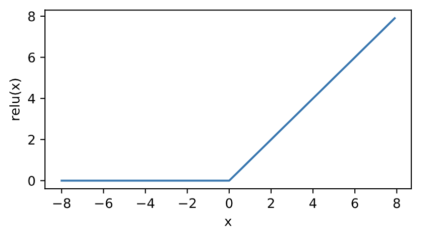
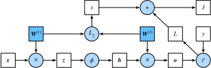

### ref
书籍链接 http://tangshusen.me/Dive-into-DL-PyTorch/#/
## 基础概念

### tensor

tensor类似于多维数组,但提供了一系列操作
#### 创建

##### 直接创建

```python
import torch
x = torch.empty(5,3)    #未初始化的5*3tensor
x = torch.rand(5,3)     #随机的tensor
x = torch.zeros(5,3)    #全0的tensor
x = torch.ones(5,3)     #全1
x = torch.eye(5)        #单位矩阵对应的tensor
x = torch.tensor([5,3]) #内容为[5,3]的一维tensor
x = torch.arange(1, 5, 1)   #[1,2,3,4]
x = torch.linspace(1, 5, 5) #[1,2,3,4,5]
```

##### 从现有tensor创建

```python
x = x.new_ones(5, 3, dtypes=torch.float64)
x = torch.randn_like(x, dtypes=torch.float)
```

#### 基本操作

##### 相加

```python
x + y
torch.add(x, y)
y.add_(x)
```

##### 索引

类似python的切片,但注意tensor的切片是共享内存的,即没有进行拷贝复制

```python
x = torch.tensor([1,2,3,4,5])
y = x[1:3]
```

##### 对某维度进行运算

```python
X = torch.tensor([[1, 2, 3], [4, 5, 6]])
X.sum(dim=0, keepdim=True)		#对X的0维度（同一列）进行求和，并对于结果保持其维度（结果为[5,7,9]）
X.sum(dim=1, keepdim=True)		#对X的1维度（同一行）进行求和，结果为[[6], [15]]
```

这里的行列概念需要明确，如X是`2*3`的矩阵，有2行3列，元素分别为`[ [a11, a12, a13], [a21, a22, a23] ]`

应该把dim看作一个掩码，如对于dim=0，相当于掩盖了除第1维外的下标数字，即只对下标的第一个数字不同的数进行求和

##### 预测概率

gather函数可以用于计算预测概率，即如下面实例，y_hat指定了当前对两个样本的分类结果，y指定了两个样本的标签，gather的输出即样本标签对应的预测概率。

注意这里的将`1*n`向量转换为`n*1`向量，用于与y_hat的每个预测项匹配

```python
y_hat = torch.tensor([[0.1, 0.3, 0.6], [0.3, 0.2, 0.5]])
y = torch.LongTensor([0, 2])
y_hat.gather(1, y.view(-1, 1))
```

输出为

```
tensor([[0.1000],
        [0.5000]])
```

##### 拼接

可以使用torch.cat对多个tensor进行拼接

```python
A = torch.ones(2, 3)
B = 2*torch.ones(2, 3)

torch.cat((A,B), 0)
torch.cat((A,B), 1)
```

结果

```
tensor([
[1,1,1],
[1,1,1],
[2,2,2],
[2,2,2]
	])
	
tensor([
[1,1,1,2,2,2],
[1,1,1,2,2,2]
	])
```


其他函数

* index_select
* masked_select
* nonzero
* gather

#### 复制

```python
y = x.clone()
```

#### 改变形状

注意view只改变索引,不创建拷贝
```python
x = torch.ones(3,5)     #创建一个3*5的tensor
view1 = x.view(5,3)     #以5*3观察x
view2 = x.view(15)      #以1*15观察x
```

#### 取值

可以以python的数值形式返回一个tensor元素的值
```python
torch.item(x[0])
```

#### 线性代数

* trace     矩阵的迹(对角线元素之和)
* diag      对角线元素
* triu/tril 矩阵上三角/下三角
* mm/bmm    矩阵乘法
* t         转置
* dot/cross 内外积
* inverse   逆矩阵
* svd       奇异值分解

#### 广播机制

形状不同的tensor运算时会触发

```python
x = torch.tensor([1,2,3])
y = torch.tensor([ [1], [2], [3] ])

```
结果为
```
tensor([[2, 3, 4],
        [3, 4, 5],
        [4, 5, 6]])
```
即x与y先被扩展后再运算
```
[   [1, 2, 3]
    [1, 2, 3]
    [1, 2, 3]   ]
+
[   [1, 1, 1]
    [2, 2, 2]
    [3, 3, 3]   ]

```

#### 内存开销优化

pytorch在运算时会使用新的空间存放运算结果,即运算`y = x+y`时,`id(y)`的值会改变,为了减少内存分配开销,可以采用下面方法

```python
y[:] = x + y
torch.add(x, y, out=y)
```

#### 和numpy互转

注意两种方法的区别:前者与原来的narray绑定,后者是用narray初始化一个tensor

* torch.from_numpy()
* torch.tensor()

#### device

可以指定tensor是定义在gpu上还是cpu上

```python
device = torch.device("cuda")          # GPU
y = torch.ones_like(x, device=device)  # 直接创建一个在GPU上的Tensor
```

## 深度学习基础

### 线性回归

#### 线性回归的定义及性质

使用一个例子说明线性回归

##### 模型定义

$$
y = x_1 w_1 + x_2 w_2 + b
$$

##### 预测表达式

$$
\hat y^{(i)} = x_1^{(i)} w_1 + x_2^{(i)} w_2 + b
$$

##### 损失函数
一般选择平方误差函数

$$
ℓ^{(i)}(w_1,w_2,b) = \frac{1}{2}(\hat y^{(i)} - y^{(i)})^2
$$

使用误差平均值来评价模型

$$
ℓ(w_1,w_2,b) = \frac{1}{n} \sum^n_{i=1} ℓ^{(i)}(w_1,w_2,b) = \frac{1}{n} \sum^n_{i=1} \frac{1}{2} (x_1^{(i)} w_1 + x_2^{(i)} w_2 + b - y^{(i)})^2
$$

目的是找出一组参数$w_1, w_2, b$使平均损失最小

$$
w^*_1, w^*_2, b = argmin ℓ(w_1,w_2,b)
$$

##### 优化算法
小批量随机梯度下降

$$
w_1 = w_1 - \frac{η}{|B|}\sum_{i \in B} \frac{∂ℓ^{(i)}(w_1,w_2,b)}{∂w_1} = w_1 - \frac{η}{|B|}\sum_{i \in B} x_1^{(i)} (x_1^{(i)} w_1 + x_2^{(i)} w_2 + b - y^{(i)})

\\

w_2 = w_2 - \frac{η}{|B|}\sum_{i \in B} \frac{∂ℓ^{(i)}(w_1,w_2,b)}{∂w_2} = w_2 - \frac{η}{|B|}\sum_{i \in B} x_2^{(i)} (x_1^{(i)} w_1 + x_2^{(i)} w_2 + b - y^{(i)})

\\

b = b - \frac{η}{|B|}\sum_{i \in B} \frac{∂ℓ^{(i)}(w_1,w_2,b)}{∂b} = b - \frac{η}{|B|}\sum_{i \in B} (x_1^{(i)} w_1 + x_2^{(i)} w_2 + b - y^{(i)})
$$

B即每个小批量中的样本个数,η则为学习率

#### 线性回归的表示方法
##### 神经网络图


##### 矢量计算表达式
###### 预测表达式

假设有n个样本,可以写成以下形式
$$
\hat y^{(1)} = x_1^{(1)} w_1 + x_2^{(1)} w_2 + b
\\
\hat y^{(2)} = x_1^{(2)} w_1 + x_2^{(2)} w_2 + b
\\
...
\\
\hat y^{(n)} = x_1^{(3)} w_1 + x_2^{(3)} w_2 + b
$$

以矩阵形式表示各个参数
$$
\hat y = \begin{bmatrix}
            \hat y^{(1)} \\
            \hat y^{(2)} \\
            ... \\
            \hat y^{(n)} \\
        \end{bmatrix}


X = \begin{bmatrix}
            x_1^{(1)} & x_2^{(1)} \\
            x_1^{(2)} & x_2^{(2)} \\
            ... \\
            x_1^{(3)} & x_2^{(3)} \\
        \end{bmatrix}


w = \begin{bmatrix}
            w_1 \\
            w_2
        \end{bmatrix}
$$

则式子可以写作

$$
\hat y = Xw + b
$$

###### 损失函数
$\hat y$和y都是 `n*1` 矩阵,因此损失函数可以写成下列形式,即第一个转置矩阵为 `1*n` ,与`n*1`矩阵相乘相当于每个元素平方相加

$$
ℓ(\theta) = \frac{1}{2n} (\hat y - y)^T(\hat y - y)
$$

###### 小批量随机梯度下降

$$
\theta = \theta - \frac{η}{B} \sum_{i \in B} \nabla_\theta ℓ^{(i)}(\theta)
$$

其中$\theta = (w_1, w_2, b)$

展开其中的$\nabla$算子，为如下结果
$$
\nabla_\theta ℓ^{(i)}(\theta) = 
\begin{bmatrix}
\frac{∂ℓ^{(i)}(w_1, w_2, b)}{∂w_1}
\\
\frac{∂ℓ^{(i)}(w_1, w_2, b)}{∂w_2}
\\
\frac{∂ℓ^{(i)}(w_1, w_2, b)}{∂b}
\end{bmatrix}

=

\begin{bmatrix}
x_1^{(i)} (x_1^{(i)} w_1 + x_2^{(i)} w_2 + b - y^{(i)})
\\
x_2^{(i)} (x_1^{(i)} w_1 + x_2^{(i)} w_2 + b - y^{(i)})
\\
x_1^{(i)} w_1 + x_2^{(i)} w_2 + b - y^{(i)}
\end{bmatrix}

=

(\hat y^{(i)} - y^{(i)})

\begin{bmatrix}
x_1^{(i)}
\\
x_2^{(i)}
\\
1
\end{bmatrix}
$$

#### 线性回归实现

##### import

```python
import torch
from IPython import display
from matplotlib import pyplot as plt
import numpy as np
import random
```

##### 生成数据集

```python
num_inputs = 2
num_examples = 1000
true_w = [2, -3.4]
true_b = 4.2

features = torch.randn(num_examples, num_inputs, dtype=torch.float32)
	#生成1000*2的随机矩阵
labels = true_w[0] * features[:, 0] + true_w[1] * features[:, 1] + true_b
	#按照y = x1w1 + x2w2 + b的公式计算真实的数据分布1000*1矩阵
labels += torch.tensor(np.random.normal(0, 0.01, size=label.size()), dtype=torch.float32)
	#给矩阵加入相同维度的正态分布噪声矩阵
```

##### 打印数据

```python
def use_svg_display():
	display.set_matplotlib_formats('svg')
    
def set_figsize(figsize=(3.5, 2.5)):
    use_svg_display()
    plt.rcParams['figure.figsize'] = figsize
    
set_figsize()
plt.scatter(feature[:, 1].numpy(), labels.numpy())
```

##### 读取数据

```python
def data_iter(batch_size, features, labels):	#batch_size指定了一次返回的样本个数
    num_examples = len(features)
    indices = list(range(num_examples))
    random.shuffle(indices)		#生成随机的下标序列
    for i in range(0, num_examples, batch_size):
        j = torch.LongTensor(indices[i: min(i+batch_size, num_example)])
        yield feature.index_select(0, j), label.index_select(0, j)
```

##### 初始化模型参数

```python
w = torch.tensor(np.random.normal(0, 0.01, (num_inputs, 1)), dtype=torch.float32)
b = torch.zeros(1, dtype=torch.float32)
```

定义了一个均值为0，标准差为0.01的1*2正态随机数矩阵w，偏差b为0

```python
w.requires_grad_(require_grad=True)
b.requires_grad_(require_grad=True)
```

因为需要对参数求梯度来迭代参数的值，因此需要设置这个值

##### 定义模型

```python
def linreg(X, w, b):
    return torch.mm(X, w) + b
```

##### 定义损失函数

```python
def squared_loss(y_hat, y):
    return (y_hat - y.view(y_hat.size())) ** 2 / 2
```

##### 定义优化算法

```python
def sgd(params, lr, batch_size):
    for param in params:
        param.data -= lr * param.grad / batch_size
```

##### 训练模型

```python
lr = 0.03
num_epochs = 3
net = linreg
loss = squared_loss

for epoch in range(num_epochs):
    for X, y in data_iter(batch_size, features, labels):
        l = loss(net(X, w, b), y).sum()
        l.backward()
        sgd([w, b], lr, batch_size)
        
        w.grad.data.zero_()
        b.grad.data.zero_()	#梯度清零以便下次求解
    train_l = loss(net(features, w, b), labels)
    print("epoch %d, loss %f" %(epoch + 1, train_l.mean().item()))
```

#### 线性回归简洁实现

##### 生成数据集

相同

##### 读取数据

```python
import torch.utils.data as Data

batch_size = 10
dataset = Data.TensorDataset(feature, labels)
data_iter = Data.DataLoader(dataset, batch_size, shuffle=True)
```

可以得到相同结果

##### 定义模型

###### 继承nn.Module

```python
class LinearNet(nn.Module):
    def __init__(self, n_feature):
        super(LinearNet, self).__init__()
        self.linear = nn.Linear(n_feature, 1)
        
    def forward(self, x):		#定义前向传播
        y = self.linear(x)
        return y

net = LinearNet(num_inputs)
print(net)
```

###### nn.Sequential

```python
net = nn.Sequential(nn.Linear(num_inputs, 1))		#方法1

net = nn.Sequential()
net.add_module('linear', nn.Linear(num_inputs, 1))	#方法2

from collections import OrderedDict					#方法3
net = nn.Sequential(OrderedDict([
    ('linear', nn.Linear(num_inputs, 1))
]))
```

##### 查看模型与参数

```python
print(net)

for param in net.parameters():
    print(param)
```

##### 初始化模型参数

```python
from torch.nn import init

init.normal_(net[0].weight, mean=0, std=0.01)
init.constant_(net[0].bias, val=0)
```

##### 定义损失函数

使用nn模块的损失函数

```python
loss = nn.MSELoss()
```

##### 定义优化算法

```python
import torch.optim as optim

optimizer = optim.SGD(net.parameters(), lr=0.03)
print(optimizer)		#查看
```

##### 训练模型

```python
num_epochs = 3
for epoch in range(1, num_epochs+1):
    for X, y in data_iter:
        output = net(X)
        l = loss(output, y.view(-1, 1))
        optimizer.zero_grad()
        l.backward()
        optimizer.step()
    print('epoch %d, loss: %f' %(epoch, l.item()))
```

##### 输出结果

```python
dense = net[0]
print(true_w, dense.weight)
print(true_b, dense.bias)
```

### softmax回归

softmax回归是一个用于分类问题的线性模型

#### softmax回归定义及性质

##### 网络模型


$$
o_1 = x_1w_{11} + x_2w_{21} + x_3w_{31} + x_4w_{41} + b_1
\\
o_2 = x_1w_{12} + x_2w_{22} + x_3w_{31} + x_4w_{41} + b_1
\\
o_3 = x_1w_{13} + x_2w_{23} + x_3w_{31} + x_4w_{41} + b_1
$$
输出层是全连接层

##### softmax运算

softmax运算是一种归一化运算
$$
\hat y_1, \hat y_2, \hat y_3 = softmax(o_1, o_2, o_3)
\\
\left\{
\begin{aligned}
\hat y_1 &= \frac{exp(o_1)}{\sum^{3}_{i=1} exp(o_i)}
\\
\hat y_2 &= \frac{exp(o_2)}{\sum^{3}_{i=1} exp(o_i)}
\\
\hat y_3 &= \frac{exp(o_3)}{\sum^{3}_{i=1} exp(o_i)}
\end{aligned}
\right.
$$

##### 矢量计算表达式

上面的模型可以用矢量表达如下

参数
$$
W =
\begin{bmatrix}
w_{11} & w_{12} & w_{13} \\
w_{21} & w_{22} & w_{23} \\
w_{31} & w_{32} & w_{33} \\
w_{41} & w_{42} & w_{43} \\
\end{bmatrix}
\qquad 
b = 
\begin{bmatrix}
b_1 & b_2 & b_3
\end{bmatrix}
$$
输入输出层
$$
x^{(i)} = \begin{bmatrix} x_1^{(i)} & x_2^{(i)} & x_3^{(i)} &x_4^{(i)}  \end{bmatrix}
\\
o^{(i)} = \begin{bmatrix} o_1^{(i)} & o_2^{(i)} & o_3^{(i)} \end{bmatrix}
$$
预测输出
$$
\hat y^{(i)} = \begin{bmatrix} \hat y^{(i)}_1 & y^{(i)}_2 & y^{(i)}_3  \end{bmatrix}
$$
上述公式的矢量表达式
$$
o^{(i)} = x^{(i)}W + b
\\
\hat y^{(i)} = softmax(o^{(i)})
$$
**小批量样本分类矢量表达式**

每个小批量样本有n个样本，输入层输入个数为d，输出层输出个数为q，则

X为`n*d`矢量，W为`d*q`矢量，b为1*q矢量，则
$$
O = XW + b
\\
\hat Y = softmax(O)
$$
O和Y都为n*q矢量，表示n个分类结果

##### 交叉熵损失函数

对于分类的问题，可以构造真实标签集：

向量$y^{(i)}$是一个1*q向量，用于表示当前样本的真实分类，若样本类型标签是$y^{1}$，则除了$y^1$为1，其他y为0

###### 平方损失函数的问题

对于这种情况，若采用平方损失函数，则会有这样一种问题：

* 假设一共有三种分类$y_1,y_2,y_3$，对于分类结果1 $y_1=0.6, y_2=0.2, y_3=0.2$和分类结果2 $y_1=0.6, y_2=0, y_3=0.4$有相同的分类结果，但平方损失函数loss差别很大

解决方案之一是使用交叉熵损失函数

###### 定义

$$
H(y^{(i)}, \hat y^{(i)}) = - \sum^q_{j=1} y_j^{(i)} log \hat y_j^{(i)}
$$

这样子定义，由于标签只有一个y值是1，其余为0，假设真实标签为$y_d=1$，此式的结果为$-log \hat y_d$

因此交叉熵损失函数的形式为：
$$
\begin{aligned}
ℓ(Θ) 	&= \frac{1}{n} \sum^n_{i=1} H(y^{(i)}, \hat y^{(i)})
\\
		&= - \frac{1}{n} \sum^n_{i=1} log \hat y^{(i)}_{y^{(i)}}
\end{aligned}
$$
式子两边取指数，有
$$
e^{-nℓ(Θ)} = \prod^n_{i=1} \hat y^{(i)}_{y^{(i)}}
$$
使用第一种形式的式子，则优化目标为最小化ℓ(Θ)，最优情况`ℓ(Θ)=0`（因为每个项都小于等于0）

使用第二种形式的式子，则优化目标为最大化$e^{-nℓ(Θ)}$，即最大化数据训练集所有标签类别的联合预测概率

#### softmax实现

##### 初始化模型参数

输入向量长度为784，输出向量长度为10，因此参数矩阵为 784*10

```python
num_inputs = 784
num_outputs = 10

W = torch.tensor(np.random.normal(0, 0.01, (num_inputs, num_outputs)), dtype=torch.float)
b = torch.zeros(num_outputs, dtype=torch.float)
```

##### softmax运算

假设softmax输入向量长度为m，设样本数为n，输出向量长度（类别数）为l，则softmax应对`n*m`的矩阵进行运算，而运算应该只对同一行的参数进行，不同行间结果是独立的

```python
def softmax(X):
    X_exp = X.exp()
    partition = X_exp.sum(dim=1, keepdim=True)
    return X_exp / partition
```

##### 定义模型

```python
def net(X):
    return softmax(torch.mm(X.view( (-1, num_inputs) ), W) + b)
```

##### 定义损失函数

可以使用gather函数

```python
def cross_entropy(y_hat, y):
    return - torch.log(y_hat.gather(1, y.view(-1, 1)))
```

##### 计算分类准确率

```python
def accuracy(y_hat, y):
    return (y_hat.argmax(dim=1) == y).float().mean().item()
```

argmax(dim=1)用于计算y_hat（`n*l矩阵`）中概率预测值最大的元素的下标，因此`y_hat.argmax(dim=1) == y`表示预测的标签与实际标签相同的情况（`n*1矩阵`），得到的值对于每个样本都只有0和1，使用mean对`n*1`矩阵求平均值，得到预测准确率

总的准确率可以如下计算

```python
def evaluate_accuracy(data_iter, net):
    acc_sum, n = 0.0, 0
    for X, y in data_iter:
        acc_sum += (net(X).argmax(dim1) == y).float().sum().item()
        n += y.shape[0]
    return acc_sum / n
```

##### 训练模型

```python
num_epochs, lr = 5, 0.1

def train_ch3(net, train_iter, test_iter, loss, num_epochs, batch_size, params=None, lr=None, optimizer=None):
    for epoch in range(num_epochs):
        train_l_sum, train_acc_sum, n = 0.0, 0.0, 0
        for X, y in train_iter:
            y_hat = net(X)
            l = loss(y_hat, y).sum()

        	if optimizer is not None:
                optimizer.zero_grad()
            elif params is not None and params[0].grad is not None:
                for param in params:
                    param.grad.data.zero_()
            
            l.backward()
            if optimizer is None:
                d2l.sgd(params, lr, batch_size)
            else:
                optimizer.step()

            train_l_sum += l.item()
            train_acc_sum += (y_hat.argmax(dim=1) == y).sum().item()
            n += y.shape[0]
        test_acc = evaluate_accuracy(test_iter, net)
        print('epoch %d, loss %.4f, train acc %.3f, test acc %.3f'
              % (epoch + 1, train_l_sum / n, train_acc_sum / n, test_acc))

train_ch3(net, train_iter, test_iter, cross_entropy, num_epochs, batch_size, [W, b], lr)
```

#### softmax简洁实现

##### 定义和初始化模型

```python
num_inputs = 784
num_outputs = 10

class LinearNet(nn.Module):
    def __init__(self, num_inputs, num_outputs):
        super(LinearNet, self).__init__()
        self.linear = nn.Linear(num_inputs, num_outputs)
    def forward(self, x):
        y = self.linear(x.view(x.shape[0], -1))
        return y
    
net = LinearNet(num_inputs, num_outputs)
```

其中`x.shape[0]`为batch_size

**注意**：上述实现中因为MNIST训练集的图像数据形状为 (batch_size, 1, 28, 28) ，其中1表示图像有一个通道（一个uint8型），需要先转换为 (batch_size, 1, 784) 的矩阵，因此一般是先通过一个FlattenLayer初始化，下面的实现使用一个FlattenLayer和一个LinearLayer**替代上述的LinearNet类**

```python
class Flatten(nn.Module):
    def __init__(self):
        super(FlattenLayer, self).__init__()
    def forward(self, x):
        return x.view(x.shape[0], -1)
```

构建网络

```python
net = nn.Sequential(
	OrderedDict([
        ('flatten', FlattenLayer()),
        ('Linear', nn.Linear(num_inputs, num_outputs))
    ])
)
```

初始化参数

```
init.normal(net.linear.weight, mean=0, std=0.01)
init.constant_(net.linear.bias, val=0)
```

##### softmax和交叉熵损失函数

在上面的实现中，softmax和交叉熵的实现如下

```python
def softmax(X):
    X_exp = X.exp()
    partition = X_exp.sum(dim=1, keepdim=True)
    return X_exp / partition

def net(X):
    return softmax( torch.mm(X.view(-1, num_inputs), W) + b )

def loss(y_hat, y):
    return -torch.log( y_hat.gather(1, y.view(-1, 1)) )

l = loss(net(X), y)
```

pytorch定义了一个函数`nn.CrossEntropyLoss()`完成上述功能

在这里，有

```python
net = nn.Sequential(
	OrderedDict([
        ('flatten', FlattenLayer()),
        ('Linear', nn.Linear(num_inputs, num_outputs))
    ])
)

l = nn.CrossEntropyLoss(net(X), y).net()
```

##### 定义优化算法

学习率为0.1的小批量随机梯度下降

```python
optimizer = torch.optim.SGD(net.parameters(), lr=0.1)
```

##### 训练模型

使用上面一节的函数训练

```python
num_epochs = 5
train_ch3(net, train_iter, test_iter, loss, num_epochs, batch_size, None, None, optimizer)
```

### 多层感知机

#### 隐含层


在单层神经网络基础上引入的一个或多个隐含层

对于小批量样本X `n*d`，隐含层输出为H `n*h`，输出层输出为O `n*q`，隐含层权重和bias $W_h, b_h$ (`d*h  1*h`)，输出层权重和bias $W_o, b_o$ (`h*q  1*q`)

对于单隐含层，计算公式为：
$$
H = X W_h + b_h
\\
O = H W_o + b_o
$$
联立可以得到公式
$$
O = (X W_h + b_h) W_o + b_o = X W_h W_o + W_o b_h + b_o
$$
**注意：从上式可以发现，虽然引入了隐含层，但其效果相当于一个输出层权重参数为$W_h W_o$，偏差参数为$W_ob_h + b_o$**

因此使用这种方式构建的神经网络与单层神经网络其实是等价的

#### 激活函数

激活函数是为了解决上述问题引入的，因为全连接层的神经网络只对数据做仿射变换（即乘上一个矩阵），多个矩阵相乘的结果与一个矩阵相乘结果是一样的，因此需要引入非线性成分。

##### ReLU


$$
ReLU(x) = max(x, 0)
$$
即大于0则值为x，若定义0点导数为0，则
$$
ReLU'(x) = \left\{
\begin{aligned}
0 \qquad x \leq 0
\\
1 \qquad x > 0
\end{aligned}
\right.
$$

##### sigmoid


$$
sigmoid(x) = \frac{1}{1 + e^{-x}}
$$
导数为
$$
sigmoid'(x) = \frac{ e^{-x} }{(1+e^{-x})^2} = sigmoid(x) * (1 - sigmoid(x))
$$

##### tanh


$$
tanh = \frac{1 - e^{-2x}}{1 + e^{-2x}}
$$
导数
$$
tanh = 1 - tanh^2(x)
$$

#### 多层感知机

至少有一个全连接隐含层，且每个隐含层输出由激活函数进行变换
$$
H = ϕ(X W_h + b_h)
\\
O = H W_o + b_o
$$

#### 多层感知机的实现

##### 初始化模型参数

```python
num_inputs, num_outputs, num_hiddens = 784, 10, 256

W1 = torch.tensor(np.random.normal(0, 0.01, (num_inputs, num_hiddens)), dtype=torch.float)
b1 = torch.zeros(num_hiddens, dtype=torch.float)
W2 = torch.tensor(np.random.normal(0, 0.01, (num_hiddens, num_outputs)), dtype=torch.float)
b2 = torch.zeros(num_outputs, dtype=torch.float)

params = [W1, b1, W2, b2]
for param in params:
    param.requires_grad_(requires_grad=True)
```

##### 定义激活函数

使用ReLU

```python
def relu(X):
    return torch.max(input=X, other=torch.tensor(0.0))
```

##### 定义模型

```python
def net(X):
    X = X.view((-1, num_inputs))
    H = relu( torch.matmul(X, W1) + b1 )
    return torch.matmul( H, W1 ) + b2
```

##### 定义损失函数

```python
loss = torch.nn.CrossEntropyLoss()
```

#### 多层感知机简洁实现

##### 定义模型

```python
num_inputs , num_outputs, num_hiddens = 784, 10, 256
net = nn.Sequential(
	FlattenLayer(),
    nn.Linear(num_inputs, num_hiddens),
    nn.ReLU(),
    nn.Linear(num_hiddens, num_outputs),
)

for params in net.parameters():
    init.normal_(params, mean=0, std=0.01)
```

##### 读取数据并训练模型

这里d2l包的函数都是上文定义的

```python
batch_size = 256

train_iter, test_iter = d2l.load_data_fashion_mnist(batch_size)
loss = torch.nn.CrossEntropyLoss()

optimizer = torch.optim.SGD(net.parameters(), lr=0.5)

num_epochs = 5
d2l.train_ch3(net, train_iter, test_iter, loss, num_epochs, batch_size, None, None, optimizer)
```

### 模型选择

#### 训练误差和泛化误差

前者是网络对训练集的误差，后者是对所有其他样本的误差。理论上来说前者和后者的分布应是相同的，但由于网络使用训练集进行训练，因此训练误差肯定小于泛化误差，所以训练误差小不代表着泛化误差小。机器学习的模型应关注降低泛化误差

#### 验证数据集

从给定训练集中随机抽取一小部分作为验证集，剩余部分作为真正的训练集

##### K折交叉验证

把原始数据集分为K份，用K-1个子数据集训练，1个数据集做验证。换着训练K次

#### 欠拟合过拟合


给定训练数据集，若模型复杂度过低容易出现欠拟合，否则容易过拟合

样本数据过少，容易出现过拟合

#### 权重衰减

当难以增大数据集时可以采取权重衰减的方式减少过拟合

##### L2范数正则化

以线性回归损失函数为例
$$
ℓ(w_1,w_2,b) = \frac{1}{n} \sum^n_{i=1} \frac{1}{2} (x_1^{(i)} w_1 + x_2^{(i)} w_2 + b - y^{(i)})^2
$$
将权重参数用$\vec w = [w_1, w_2]$表示，则定义带有L2范数惩罚项的损失函数为
$$
ℓ(w_1,w_2,b) + \frac{\lambda}{2n} ||\vec w||^2
$$
通过引入这个项，可以使大权重值造成的损失函数值较大
$$
w_1 = (1 - \frac{ηλ}{|B|}) w_1 - \frac{η}{|B|}\sum_{i \in B} x_1^{(i)} (x_1^{(i)} w_1 + x_2^{(i)} w_2 + b - y^{(i)})
\\
w_2 = (1 - \frac{ηλ}{|B|}) w_2 - \frac{η}{|B|}\sum_{i \in B} x_2^{(i)} (x_1^{(i)} w_1 + x_2^{(i)} w_2 + b - y^{(i)})
$$

#### 丢弃法

假设有单隐藏层的多层感知机，隐藏单元表达式为
$$
h_i = ϕ(x_1w_{1i} + x_2w_{2i} + x_3w_{3i} + x_4w_{4i} + b_i)
$$
丢弃法即：设丢弃概率为p，则$h_i$有p的概率被清零，有1-p的概率被除以1-p，即
$$
h_i^{'} = \frac{ξ_i}{1-p} h_i  \qquad ξ_i \in \{0, 1\}
$$
**注意，这种做法不会改变hi的输出期望，因为：**
$$
E(h_i^{'}) = \frac{(1-p)*1 + p*0}{1-p} E(h_i) = E(h_i)
$$
使用丢弃法后，任何一个权重节点都可能被舍弃，从而使输出层计算不会依赖其中一些隐含层节点

##### 简介实现

在nn.Sequential中使用`nn.Dropout(prob)`定义丢弃层

### 传播算法

#### 正向传播

正向传播是指对神经网络沿着从输入层到输出层的顺序，依次计算并存储模型的**中间变量**（包括输出）

假设一个输入维数为`d*1`，隐藏层为`h*1`，输出层为`q*1`的网络
$$
\begin{aligned}
z &= W_1 x  \qquad W_1 \in R^{h*d}
\\
h &= ϕ(z)
\\
o &= W_2 h  \qquad W_2 \in R^{q*h}
\end{aligned}
$$
加入L2正则项后的损失函数：
$$
\begin{aligned}
L &= ℓ(o,y)
\\
s &= \frac{\lambda}{2}( ||W_1||^2 + ||W_2||^2 )
\\
J &= L + s
\end{aligned}
$$
计算图



#### 反向传播

反向传播指的是计算神经网络参数梯度的方法。总的来说，反向传播依据微积分中的链式法则，沿着从输出层到输入层的顺序，依次计算并存储目标函数有关神经网络各层的**中间变量以及参数的梯度**

使用上面的例子计算反向传播公式

##### 反向传播目标函数

**注意这里的W1和W2都是参数矩阵**

由于最终要优化的对象是损失函数J，因此优化的目标函数是
$$
\frac{∂J}{∂W_1} \qquad \frac{∂J}{∂W_2}
$$

##### 计算

$$
\begin{aligned}
\frac{∂J}{∂W_2} &= \frac{∂J}{∂L} \frac{∂L}{∂W_2} + \frac{∂J}{∂s} \frac{∂s}{∂W_2}
\\
 &= \frac{∂L}{∂W_2} + \lambda W_2	\qquad \qquad \qquad
					\frac{∂J}{∂L} = \frac{∂J}{∂s} = 1, \quad
					\frac{∂s}{∂W_2} = \lambda W_2
\\
 &= \frac{∂L}{∂o} \frac{∂o}{∂W_2} + \lambda W_2
\\
 &= \frac{∂L}{∂o} \boldsymbol h^T + \lambda W_2
\\
\\
\frac{∂J}{∂W_1} &= \frac{∂J}{∂L} \frac{∂L}{∂W_1} + \frac{∂J}{∂s} \frac{∂s}{∂W_1}
\\
 &= \frac{∂L}{∂W_1} + \lambda W_1	\qquad \qquad \qquad
					\frac{∂J}{∂L} = \frac{∂J}{∂s} = 1, \quad
					\frac{∂s}{∂W_1} = \lambda W_1
\\
 &= \frac{∂L}{∂o} \frac{∂o}{∂h} \frac{∂h}{∂z} \frac{∂z}{∂W_1} + \lambda W_1
\\
 &= \frac{∂L}{∂o} W_2 ϕ^{'}(z) \boldsymbol x^T + \lambda W_1
\end{aligned}
$$

### 数值稳定性和参数初始化

#### 衰减和爆炸

假设一个n层的神经网络，从输入层到第m层隐藏层输出的权重参数均为一个相同的值（假设），比如一个为0.2一个为5

则第m层对应输出为$0.2^m X$和$5^m X$，一个衰减一个指数爆炸

#### 参数初始化

若初始化参数矩阵时采用相同的值，会产生一个问题，即每个节点正向传播的值是一样的，同层的每个输出相同，反向传播也相同，最终效果就与该层只有一个节点没有什么差别，因此初始化的时候应随机化参数

##### pytorch的默认初始化

`torch.nn.init.normal_()`使用正态分布初始化

##### Xavier

某全连接层输入a个输出b个，则随机采样于均匀分布
$$
U(- \sqrt{\frac{6}{a+b}}, \sqrt{\frac{6}{a+b}})
$$
