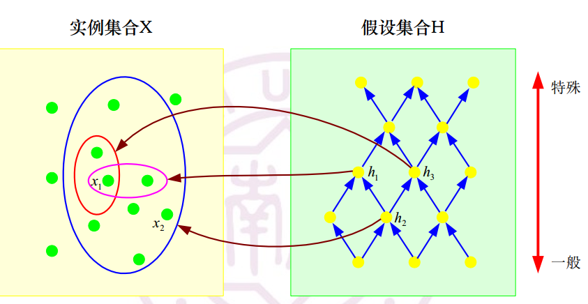
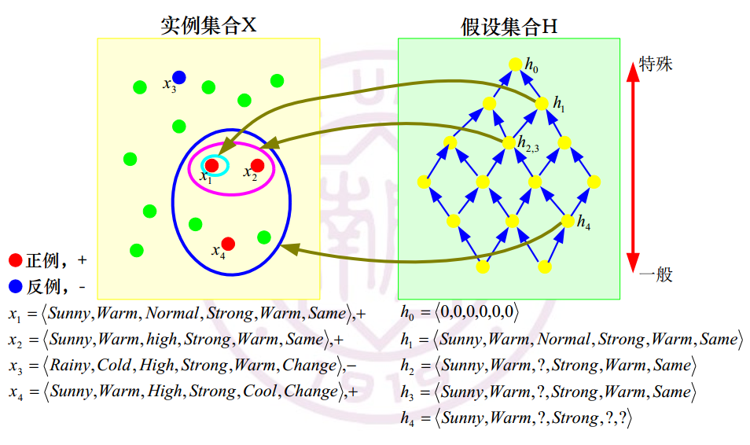

# 机器学习

## 概念学习

### 概念学习原型

已知：

* 实例空间X： 使用属性描述的实例集合
* 概念空间C：所有可能目标概念的集合
* 假设空间H： 所有可能假设的集合
* 训练样本集合S：满足目标概念$c \in C$的正例和反例集合$\{ <x_1, c(x_1)>, <x_2, c(x_2)>, ..., <x_N, c(x_N)> \}$

求解：

* 对于所有$x \in S$， 存在$h \in H$，满足$h(x) = c(x)$，即所有训练样本满足假设
* 对于所有$x \in X$，存在$h \in H$，满足$h(x) = c(x)$，即所有实例满足假设

过程：

* 训练样本集合S随机均匀抽取于实例空间X，力求分布一致
* 通过学习$h \in H$来估计概念C
* 通过对独立抽取于实例空间X中实例x的决策性能来评估假设h

错误率

* 假设h对目标概念c的样本错误率：训练样本集合中，被错误决策的训练样本占训练样本总数的比例
* 假设h对目标概念c的真实错误率：实际样本被错误决策的样本数占总数的比例

$$
error_D(h) = \underset{x \in D}{Pr} [ h(x) \neq c(x)]
$$

### 集合上的关系

令$h_j, h_k$为在X上定义的布尔函数，则当

$(\forall x \in X)[(h_k(x)=1) \rightarrow (h_j(x)=1)]，称h_j更加一般或相等于h_k，记作h_j \geq_g h_k$

$(h_j \geq_g h_k) \and (h_k \ngeq_g h_j)，则称h_j严格地更加一般于h_k，记作h_j >_g h_k$

通俗来说即定义了一个概念的范围是否包含另一个概念

该关系定义了假设空间H上的一个**偏序**关系

如图，h2和h1，h2和h3存在偏序关系，但h1和h3没有偏序关系

### Find-S算法

* 将假设 ℎ 初始化为假设空间H中的最特殊假设  
* 对每个训练样本正例x
  * 对假设h中的每个属性约束ai = v
    * 如果x不满足h中的约束ai = v
    * 则将ai = v替换为x满足的更一般的约束
* 输出假设h

其实思路很简单，一开始把假设定义为最特殊的一种，此后根据所有的**正例**扩展假设的范围

### Version Space(VS)

#### 一致性

一条假设h与训练样本集合D是一致的当且仅当对D中每个样本`<x, c(x)>`都有`h(x) = c(x)`，即
$$
Cons(h, D) = (\forall \  <x, c(x)> \ \in D) \ h(x) = c(x)
$$

#### Version Space

假设空间H和训练样本集合D的Version Space，是H中与训练样本集合D**相一致的**所有假设构成的子集合，记为$VS_{H, D}$
$$
VS_{H,D} = \{ h \in H | Cons(h, D) \}
$$

#### 列表消除算法

原理很简单，先记录假设空间中所有的假设列表，此后对于每个样本删除不符合的假设

* VS = 假设空间中所有假设列表
* 对每个训练样本<x, c(x)>，从VS中删除所有$h(x) \neq c(x)$的假设h
* 输出假设列表

实际实现中假设列表往往可能比较大，因此有其他方法来简化（网上查到的列表消除算法实现都会复杂一些）

#### VS边界

* 一般边界G：最一般成员的集合，即

$$
G = \{ g \in H | Cons(g,D) \and (\neg \exist g' \in H)[(g' >_g g) \and Cons(g', D)] \}
$$

即，g是一个与样本集合D一致的假设，且不存在一个与样本集合一致的假设g'使得g'严格一般于g

（意思就是没有假设比g更一般了）

* 特殊边界S：最特殊成员的集合，即

$$
S = \{ s \in H | Cons(s,D) \and (\neg \exist s' \in H)[(s >_g s) \and Cons(s', D)] \}
$$

即，s是一个与样本集合D一致的假设，且不存在一个与样本集合一致的假设s'使得s严格一般于s'

（意思就是没有假设比s更特殊了）

* VS边界：由上述定义可知，VS中的每个成员（每个假设）都位于边界G和S之间，即

$$
VS_{H,D} = \{ h \in H | (\exist s \in S) (\exist g \in G) \ (g \geq_g h \geq_g s) \}
$$

### 贝叶斯概念学习

将概念学习视为一个二分类问题，因为概念学习只有正例和反例

#### 似然率

* 概念延伸：由一个概念延伸出的属于该概念的集合
* 强采样假设：该假设规定样本是从概念延伸中随机均匀采样得到的
* 尺度原则：倾向于选择与数据相一致的最简单假设（奥坎姆剃刀）

似然率计算方法如下：

假设在某个范围内假设h1的概念延伸有n个元素，h2的概念延伸有m个元素

依据强采样假设，从h独立采样N项的概率为
$$
p(D|h) = (\frac{1}{size(h)})^N
$$
则似然率可以计算如下
$$
likelihood \ ratio = \frac{p(D|h_1)}{p(D|h_2)} = \frac{(\frac{1}{n})^N}{(\frac{1}{m})^N}
$$

#### 先验概率

根据人总结的先验知识，对各种假设设定一个先验概率

#### 后验概率

$$
p(h|D) = \frac{p(D|h) p(h)}{\sum_{h' \in H} p(D, h')} = \frac{p(h) I(D \in h) / |h|^N }{ \sum_{h' \in H} p(h') I(D \in h') / |h'|^N }
$$

其中$I(D \in h)$是一个指示函数，当且仅当所有数据D都在假设h的概念延伸中时等于1，其余情况都为0

这个式子的简单理解，首先分母是归一化因子，因此是按照分子的所有情况之和构造的。分子将p(D|h)化为了$\frac{I(D \in h)}{|h|^N}$，因为似然函数的计算要满足强采样假设，所以需要指示函数

### 朴素贝叶斯分类器

#### 模型

离散数值特征矢量$x \in \{1, ..., K\}^D$，K为最大值，D为特征数目
$$
p(x|y=c, \theta) = \prod^D_{j=1} p(x_j | y=c, \theta_{jc})
$$
朴素的含义：假设各个属性是条件独立的，因此上式成立，即x属于c类的条件概率等于x各分量属于c类的条件概率的乘积

公式含义：对于特征向量x，其为c类的概率为每个分量在c类中的条件概率之积

#### 条件密度

根据每个特征类型应该使用不同的条件分布

* 实数值：可以用高斯分布
  $$
  p(x|y=c, \theta) = \prod^D_{j=1} N(x_j | \mu_{jc}, \sigma^2_{jc})
  $$

* 二值特征：可以用伯努利分布
  $$
  p(x|y=c, \theta) = \prod^D_{j=1} Ber(x_j | \mu_{jc})
  $$
  其中$\mu_{jc}$是在类别c中特征xj发生的概率

* 范畴特征（x取值为K个整数）：可以使用Multinoulli分布
  $$
  p(x|y=c, \theta) = \prod^D_{j=1} Cat(x_j | \mu_{jc})
  $$
  其中$\mu_{jc}$是在类别c中特征xj的K柱直方图

## 计算学习理论基础

## 回归模型1

### 数学基础

* 期望和样本均值
  $$
  E_{X \sim P} \{ X \} = E \{ X \} \approx \bar x = - \frac{1}{N} \sum_{i=1}^N x_i
  $$

* 方差和样本方差
  $$
  Var \{ X \} = E\{ (X - E\{X\})^2 \} \approx \frac{1}{N} \sum_{i=1}^N (x_i - \bar x)^2
  $$

* 协方差和样本方差
  $$
  Cov\{X_1, X_2\} = E\{ (X_1 - E\{X_1\}) (X_2 - E\{X_2\}) \} \approx \frac{1}{N} \sum_{i=1}^N (x_{1i} - \bar x_1) (x_{2i} - \bar x_2)
  $$
  其中$(x_{1i}, x_{2i})$是来自分布P的第i个联合样本

* 条件期望

* 