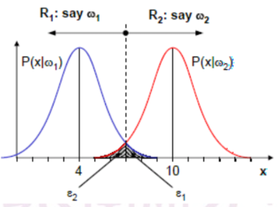

## 贝叶斯决策

### 贝叶斯规则

#### 基础

由于
$$
P(A,B) = P(A|B)P(B) = P(B|A)P(A)
$$
所以
$$
\begin{aligned}
P(A|B) &= \frac{P(B|A)P(A)}{P(B)}
\\
~
\\
P(\omega_i | x) &= \frac{p(\boldsymbol x|\omega_i)P(\omega_i)}{p(\boldsymbol x)}
\end{aligned}
$$
其中

* $P(\omega_i)$  模式类别$\omega_i$的**先验概率**
* $p(\boldsymbol x|\omega_i)$  模式特征x的**似然函数**
* $P(x)$  归一化因子
* $p(\omega_i|\boldsymbol x)$  模式类别$\omega_i$的**后验概率**

**注意：用p表示的为概率密度函数**

先验概率表示在观察到当前模式特征x之前，认为$\omega_i$发生的概率

后验概率表示观察到当前模式x之后，认为$\omega_i$发生的概率

#### 变形

如果C个模式类别是互斥且完备的
$$
\sum^C_{i=1} p(\omega_i|\boldsymbol x) = 1
$$
因此贝叶斯公式可以写为
$$
\begin{aligned}
P(\omega_i|\boldsymbol x) &= \frac{p(\boldsymbol x|\omega_i) P(\omega_i)}{p(\boldsymbol x)}
\\
&= \frac{p(\boldsymbol x|\omega_i) P(\omega_i)}{\sum^C_{i=1}p(\boldsymbol x|\omega_i) P(\omega_i)}
\end{aligned}
$$

### 决策规则

#### 决策错误概率

用于度量决策规则的性能，即表示为发生错误决策的概率
$$
\begin{aligned}P(error) &= \sum_{i=1}^C P(error|\omega_i)P(\omega_i)
\\~\\
P(error|\omega_i) &= P(decide\  \omega_j | \omega_i) = \int_{R_j} p(\boldsymbol x | \omega_i) d \boldsymbol x\end{aligned}
$$
其中，$P(decide\  \omega_j | \omega_i)$表示实际为$\omega_i$但误判为$\omega_j$的概率，即在$R_j$范围内（Rj表示判断为$\omega_j$的范围）对概率密度函数$p(\boldsymbol x | \omega_i)$进行积分，如下图为二分类问题的P(error)

$$
P(error) = P(\omega_1) \int_{R_2}p(\boldsymbol x | \omega_1) d \boldsymbol x + P(\omega_2) \int_{R_1} p(\boldsymbol x| \omega_2) d \boldsymbol x
$$
另一种形式为
$$
P(error) = \int P(error | \boldsymbol x) p(\boldsymbol x) d \boldsymbol x
$$

#### 最大先验概率

即直接根据先验概率大小来判断，用于在未观测模式x之前的判断

若$P(\omega_i) > P(\omega_j)$，则分类为$\omega_i$

#### 最大后验概率

也即**最小错误率贝叶斯决策**

##### 决策标准

根据后验概率大小判断

即当$P(\omega_i|\boldsymbol x) > P(\omega_j | \boldsymbol x)$时决策为$\omega_i$

因此可以化为
$$
\frac{p(\boldsymbol x | \omega_i) P(\omega_i)}{p(\boldsymbol x)} > \frac{p(\boldsymbol x | \omega_j) P(\omega_j)}{p(\boldsymbol x)}
\\
~
\\
即\ \ \ 
p(\boldsymbol x | \omega_i) P(\omega_i) > p(\boldsymbol x | \omega_j) P(\omega_j)
\\
~
\\
或\ \ \ \frac{p(\boldsymbol x | \omega_i) }{p(\boldsymbol x | \omega_j) } > \frac{P(\omega_j)}{P(\omega_i)}
$$
其中最大似然率$\Lambda(\boldsymbol x) = \frac{p(\boldsymbol x | \omega_i) }{p(\boldsymbol x | \omega_j) }$

##### 错误率

