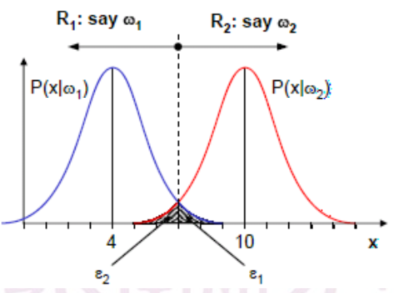
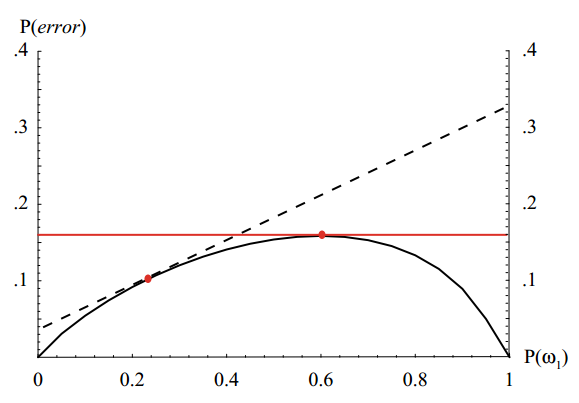

# 模式识别

## 贝叶斯决策

### 贝叶斯规则

#### 基础

由于
$$
P(A,B) = P(A|B)P(B) = P(B|A)P(A)
$$
所以
$$
\begin{aligned}
P(A|B) &= \frac{P(B|A)P(A)}{P(B)}
\\
~
\\
P(\omega_i | x) &= \frac{p(\boldsymbol x|\omega_i)P(\omega_i)}{p(\boldsymbol x)}
\end{aligned}
$$
其中

* $P(\omega_i)$  模式类别$\omega_i$的**先验概率**
* $p(\boldsymbol x|\omega_i)$  模式特征x的**似然函数**
* $p(x)$  归一化因子
* $P(\omega_i|\boldsymbol x)$  模式类别$\omega_i$的**后验概率**

**注意：用p表示的为概率密度函数**

先验概率表示在观察到当前模式特征x之前，认为$\omega_i$发生的概率

后验概率表示观察到当前模式x之后，认为$\omega_i$发生的概率

#### 推广

如果C个模式类别是互斥且完备的
$$
\sum^C_{i=1} P(\omega_i|\boldsymbol x) = 1
$$
因此贝叶斯公式可以写为
$$
\begin{aligned}
P(\omega_i|\boldsymbol x) &= \frac{p(\boldsymbol x|\omega_i) P(\omega_i)}{p(\boldsymbol x)}
\\
&= \frac{p(\boldsymbol x|\omega_i) P(\omega_i)}{\sum^C_{i=1}p(\boldsymbol x|\omega_i) P(\omega_i)}
\end{aligned}
$$

### 决策规则

#### 决策错误概率

用于度量决策规则的性能，即表示为发生错误决策的概率
$$
\begin{aligned}P(error) &= \int P(error|x) p(x) dx
\\~\\
P(error|\omega_i) &= P(decide\  \omega_j | \omega_i) = \int_{R_j} p(\boldsymbol x | \omega_i) d \boldsymbol x\end{aligned}
$$
其中，$P(decide\  \omega_j | \omega_i)$表示实际为$\omega_i$但误判为$\omega_j$的概率，即在$R_j$范围内（Rj表示判断为$\omega_j$的范围）对概率密度函数$p(\boldsymbol x | \omega_i)$进行积分，如下图为二分类问题的P(error)，中间这条虚线称为**决策边界**或**分类线**，多维情况下称为**决策面**或**分类面**

$$
P(error) = P(\omega_1) \int_{R_2}p(\boldsymbol x | \omega_1) d \boldsymbol x + P(\omega_2) \int_{R_1} p(\boldsymbol x| \omega_2) d \boldsymbol x
$$
#### 决策风险

在实际问题中，对于不同类别的误分类往往会导致不同的损失，如将1元硬币识别为0.1元与将0.1元硬币识别为1元所带来的损失是不同的。

##### 损失函数与决策表

设损失函数
$$
\lambda(a_i, \omega_j)
$$
表示错误地将实际状态为$\omega_i$分类为$a_i$。由此形成的表称为决策表

##### 期望损失

对于某样本x，假设属于各个状态的后验概率为$P(\omega_j|x)$，对其采取决策$a_i$，期望损失为
$$
R(a_i | x) = E[\lambda(a_i, \omega_j) | x] = \sum_{j=1}^c \lambda(a_i, \omega_j) P(\omega_j | x)
$$
设有决策规则a(x)，则对于特征空间中所有样本x采取决策造成的期望损失为
$$
R(a) = \int R(a(x)|x) \ p(x)dx
$$

称为平均风险或期望风险

#### 最大先验概率

即直接根据先验概率大小来判断，用于在未观测模式x之前的判断

若$P(\omega_i) > P(\omega_j)$，则分类为$\omega_i$

#### 最大后验概率

##### 决策标准

根据后验概率大小判断

即当$P(\omega_i|\boldsymbol x) > P(\omega_j | \boldsymbol x)$时决策为$\omega_i$

因此可以化为
$$
\frac{p(\boldsymbol x | \omega_i) P(\omega_i)}{p(\boldsymbol x)} > \frac{p(\boldsymbol x | \omega_j) P(\omega_j)}{p(\boldsymbol x)}
\\
~
\\
即\ \ \ 
p(\boldsymbol x | \omega_i) P(\omega_i) > p(\boldsymbol x | \omega_j) P(\omega_j)
\\
~
\\
或\ \ \ \frac{p(\boldsymbol x | \omega_i) }{p(\boldsymbol x | \omega_j) } > \frac{P(\omega_j)}{P(\omega_i)}
$$
其中最大似然率$\Lambda(\boldsymbol x) = \frac{p(\boldsymbol x | \omega_i) }{p(\boldsymbol x | \omega_j) }$

#### 最小错误率贝叶斯决策

要使错误率最小，因为错误率定义为
$$
P(error|\omega_i) = P(decide\  \omega_j | \omega_i) = \sum_{i \neq j} P(\omega_j|x) \ \ \ \ \ 其中i \neq j
$$
由于错误率与正确率之和是1，即
$$
P(\omega_i|x) = 1 - \sum_{i \neq j} P(\omega_j|x)
$$
要使其最小，其实就是让后验概率变大，因此最小错误率贝叶斯决策就是最大后验概率决策

#### 最小风险贝叶斯决策

最小化贝叶斯风险决策规则等价于似然率测试规则

即让R(a)最小。因为p(x)固定，所以该决策使得R(a|x)最小
$$
若\ R(a_i|x) = min \ R(a_j | x)，则a=a_i
$$

##### 对两类问题的讨论

依旧是这张图，注意$p(x|\omega_i)$为似然函数

###### 状态与决策的关系

| 决策\状态 | 阳性                     | 阴性                     |
| --------- | ------------------------ | ------------------------ |
| 阳性      | 真阳性（True Positive）  | 假阳性（False Positive） |
| 阴性      | 假阴性（False Negative） | 真阴性（True Negative）  |

灵敏度，真阳性与实际是阳性的比值
$$
S_n = \frac{TP}{TP+FN}
$$
特异度，真阳性与决策为阳性的比值
$$
S_p = \frac{TN}{TN+FP}
$$
第一类错误率（假阴性率），真实阳性样本被判断为阴性的比例
$$
\alpha = \frac{FN}{TP+FN} = 1-S_n
$$
第二类错误率（假阳性率），真实阴性样本被判断为阳性的比例
$$
\beta = \frac{FP}{TN+FP} = 1-S_p
$$

###### 第一类与第二类错误率

第一类和第二类错误率
$$
\begin{aligned}
P_1 &= \int_{R_2} p(x|\omega_1)dx
\\
P_2 &= \int_{R_1} p(x|\omega_2)dx
\end{aligned}
$$
即上图的两个阴影部分。第一类错误率与第二类往往是冲突的，即要求第一类错误率变小必然导致第二类错误率变大

###### 贝叶斯风险

对于两类问题，贝叶斯风险分别为
$$
\begin{aligned}
R(a_1 | x) = \lambda(a_1, \omega_1) P(\omega_1 | x) + \lambda(a_1, \omega_2) P(\omega_2 | x)
\\
R(a_2 | x) = \lambda(a_2, \omega_1) P(\omega_1 | x) + \lambda(a_2, \omega_2) P(\omega_2 | x)
\end{aligned}
$$
因此最小贝叶斯风险决策，若
$$
\lambda(a_1, \omega_1) P(\omega_1 | x) + \lambda(a_1, \omega_2) P(\omega_2 | x) > \lambda(a_2, \omega_1) P(\omega_1 | x) + \lambda(a_2, \omega_2) P(\omega_2 | x)
$$
则决策为a2

可以变形为
$$
\frac{P(\omega_1 | x)}{P(\omega_2 | x)} = \frac{\lambda_{22} - \lambda_{12}}{\lambda_{21} - \lambda_{11}}
$$
或
$$
\begin{aligned}
\frac{P(\omega_1 | x)}{P(\omega_2 | x)} &= \frac{p(x|\omega_1)P(\omega_1)}{p(x|\omega_2)P(\omega_2)} = \frac{\lambda_{22} - \lambda_{12}}{\lambda_{21} - \lambda_{11}}
\\
~
\\
\frac{p(x|\omega_1)}{p(x|\omega_2)} &= \frac{\lambda_{22} - \lambda_{12}}{\lambda_{21} - \lambda_{11}} \frac{P(\omega_2)}{P(\omega_1)}
\end{aligned}
$$

###### Neyman-Pearson决策

有时应用希望保证某一类错误率在某个范围的前提下再考虑降低另一类错误率（指第一类或第二类错误率）

假设固定第二类的错误率$P_2 = \epsilon_0$，再尽量降低第一类错误率$P_1$

可以使用拉格朗日乘子法求解，推导见问题的解释

结论是，决策规则为
$$
\begin{aligned}
\lambda &= \frac{p(x|\omega_1)}{p(x|\omega_2)}
\\
l(x) &= \frac{p(x|\omega_1)}{p(x|\omega_2)} > \lambda & & 则x \in \omega_1
\end{aligned}
$$
一般在实际中，拉格朗日乘子法的解析解较难求，因此用如下公式求解

因为**似然比**为$l(x) = \frac{p(x|\omega_1)}{p(x|\omega_2)}$，**似然比密度函数**为$p(l|\omega_2)$，则
$$
\begin{aligned}
P_2(e) &= \int_{R_1} p(x|\omega_2) dx = \epsilon_0
\\
&= 1 - \int_{R_2} p(x|\omega_2) dx
\\
&= 1 - \int_0^\lambda p(l | \omega_2) dl
\end{aligned}
$$

### 二分类问题总结

#### 贝叶斯判据

最小化贝叶斯风险的似然率测试规则
$$
若 \ \Lambda(x) = \frac{p(x | \omega_1)}{p(x | \omega_2)} > \frac{\lambda_{12} - \lambda_{22}}{\lambda_{21} - \lambda_{11}} \frac{P(\omega_2)}{P(\omega_1)}\ \ \ \ x \in \omega_1
$$

#### 最大后验概率（MAP）判据

即当i=j时，$\lambda_{ij} = 0$，否则$\lambda_{ij} = 1$时的贝叶斯判据
$$
若 \ \Lambda(x) = \frac{p(x | \omega_1)}{p(x | \omega_2)} > \frac{P(\omega_2)}{P(\omega_1)} \ \ \ \ 则x \in \omega_1
$$
或者
$$
若 \ \frac{p(\omega_1|x)}{p(\omega_2|x)} > 1 \ \ \ \ 则x \in \omega_1
$$

#### 最大似然（ML）判据

先验概率相同，当i=j时，$\lambda_{ij} = 0$，否则$\lambda_{ij} = 1$时的贝叶斯判据
$$
若 \ \Lambda(x) = \frac{p(x | \omega_1)}{p(x | \omega_2)} > 1 \ \ \ \ 则x \in \omega_1
$$

#### Neyman-Pearson判据

在固定某一类错误率的情况下最小化其余类别错误率
$$
\begin{aligned}
\lambda &= \frac{p(x|\omega_1)}{p(x|\omega_2)}
\\
l(x) &= \frac{p(x|\omega_1)}{p(x|\omega_2)} > \lambda & & 则x \in \omega_1
\end{aligned}
$$

#### 最小最大判据

最小化最大贝叶斯风险的决策规则。具体见一些问题的解释

### 多分类问题

在多分类问题中，方法与二分类相同，但一般我们会定义一个判别式函数$g_i(x)$。当进行分类时计算样本对于每个类别的判别式函数，最后分类选择使判别式函数最大的类别

判别式函数的选取可以是多样的，且判别式函数可以与任意单调增函数结合而不会改变结果。如对于最大后验概率判据，可以有下列判别式函数
$$
\begin{aligned}
g_i(x) &= P(\omega_i|x) = \frac{p(x|\omega_i)P(\omega_i)}{\sum_{j=1}^c p(x|\omega_j) P(\omega_j)}
\\
g_i(x) &= p(x|\omega_i) P(\omega_i)
\\
g_i(x) &= ln \ p(x|\omega_i) | ln \ P(\omega_i)
\end{aligned}
$$

### 正态分布

#### 一元正态分布

概率密度函数，一般记为$p(x) ~ N(\mu, \sigma^2)$
$$
p(x) = \frac{1}{\sqrt{2 \pi} \sigma} e^{-\frac{1}{2}(\frac{x-\mu}{\sigma})^2}
$$
期望值（平均值）
$$
\mu = E(x) = \int_{-\infty}^{\infty} x p(x) dx
$$
方差
$$
\sigma^2 = E[(x-\mu)^2] = \int_{-\infty}^{\infty} (x-\mu)^2 p(x) dx
$$

#### 多元正态分布

概率密度函数
$$
p(x) = \frac{1}{(2\pi)^{\frac{d}{2}} |\sum|^{\frac{1}{2}}} e^{-\frac{1}{2}(x-\mu)^T \sum^{-1}(x-\mu)}
$$
其中x是d维向量，$\mu$也是d维向量，$\sum$是协方差矩阵，$|\sum|$是协方差矩阵的行列式，$\sum^{-1}$是协方差矩阵的逆，$(x-\mu)^T$是列向量的转置

期望值
$$
\mu = E(x) = \int x p(x) dx
$$
其中每维的期望值为
$$
\mu_i = E(x_i)
$$
协方差矩阵
$$
\sum = E[(x-\mu) (x-\mu)^T] = \int (x-\mu)(x-\mu)^T p(x) dx
$$
协方差矩阵每个元素为
$$
\sigma_{ij} = E[(x_i - \mu_i)(x_j - \mu_j)]
$$
协方差矩阵反映了第i维变量和第j维的相关性，因此若两维变量无相关性，则$\sigma_{ij}=0$。此外，对角元$\sigma_{ii}$即为方差。对于完全独立的n维变量，协方差矩阵为对角阵，且对角元为各维的方差

#### 多变量的线性组合

对于多个正态分布随机变量的线性组合，无论随机变量之间是否有相关性，最终都得到一个正态分布

## 概率密度函数的估计

### 概率密度估计的非参数方法

即，在不知道概率密度函数形式的情况下，通过样本估计概率密度函数的方法

#### 基本原理与直方图方法

考虑样本所在空间的某个小区域R，某个随机向量落入该区域的概率是
$$
P_R = \int_R p(x)dx
$$
根据二项分布，样本集中恰好有k个落入小区域R的概率是
$$
P_k = C_N^k P_R^k (1-P_R)^{N-k}
$$
k的期望为
$$
E(k) = NP_R
$$
概率最大的k为

# 一些问题的解释

## 贝叶斯决策

### 决策规则

#### 最小最大判据

##### 二分类的贝叶斯风险

为了好看用$\lambda_{ij}$表示$\lambda(a_i, \omega_j)$

这种推导方式的思路是，假设两个类别所处的区域R1 R2不是固定的，通过化简平均风险的公式，来推导出满足最小化风险要求的R1或R2的区域范围

二分类平均风险可以展开如下
$$
\begin{aligned}
R &= \lambda_{11} P(\omega_1 | x) + \lambda_{12} P(\omega_2 | x) + \lambda_{21} P(\omega_1 | x) + \lambda_{22} P(\omega_2 | x)
\\
&= \int_{R_1} \lambda_{11} p(x|\omega_1) P(\omega_1)dx + \int_{R_1} \lambda_{12} p(x|\omega_2) P(\omega_2)dx +
\\
& \ \ \ \ \int_{R_2} \lambda_{21} p(x|\omega_1) P(\omega_1)dx + \int_{R_2} \lambda_{22} p(x|\omega_2) P(\omega_2)dx
\\
&= \lambda_{11} P(\omega_1) \int_{R_1} p(x|\omega_1) dx + \lambda_{12} P(\omega_2) \int_{R_1} p(x|\omega_2) dx +
\\
& \ \ \ \ \ \lambda_{21} P(\omega_1) \int_{R_2} p(x|\omega_1) dx + \lambda_{22} P(\omega_2) \int_{R_2} p(x|\omega_2) dx
\end{aligned}
$$
由于，对于二分类问题，似然函数在定义域的积分必为1
$$
\int_{R_1} p(x|\omega_i) dx + \int_{R_2} p(x|\omega_i) dx = 1
$$
###### PPT上的证明

带入上式可以化为（这里将区域全部化为R1）
$$
\begin{aligned}R =& \lambda_{21} P(\omega_1) + \lambda_{22} P(\omega_2) \\ & + (\lambda_{12}-\lambda_{22})P(\omega_2) \int_{R_1} p(x|\omega_2) dx\\ & + (\lambda_{11}-\lambda_{21})P(\omega_1) \int_{R_1} p(x|\omega_1) dx\end{aligned}
$$

因为前两项为定值，所以在**二分类问题中**要最小化贝叶斯风险，在这里的含义就是选定一个决策区域R1，使得这个区域的R最小。这里显然可以选择所有使g(x)小于0的区域
$$
R_1 = argmin \{ \int_R [ (\lambda_{12} - \lambda_{22}) P(\omega_2) p(x|\omega_2) + (\lambda_{11} - \lambda_{21}) P(\omega_1) p(x|\omega_1) ] dx \} = argmin \{ \int_R g(x)dx \}
$$
若g(x)小于0，说明判定为1的损失小于判定为2的，
$$
(\lambda_{21} - \lambda_{11}) P(\omega_1) p(x|\omega_1) > (\lambda_{12} - \lambda_{22}) P(\omega_2) p(x|\omega_2)
$$
即
$$
\frac{p(x|\omega_1)}{p(x|\omega_2)} > \frac{\lambda_{12} - \lambda_{22}}{\lambda_{21} - \lambda_{11}} \frac{P(\omega_2)}{P(\omega_1)}
$$

###### Pattern Classification上的证明

中间结果引用PPT上证明的公式
$$
\begin{aligned}
R =& \lambda_{21} P(\omega_1) + \lambda_{22} P(\omega_2)
\\ & + (\lambda_{12}-\lambda_{22})P(\omega_2) \int_{R_1} p(x|\omega_2) dx
\\ & + (\lambda_{11}-\lambda_{21})P(\omega_1) \int_{R_1} p(x|\omega_1) dx
\end{aligned}
$$
将先验概率全部化为只含$P(\omega_1)$的
$$
\begin{aligned}
R =& \lambda_{21} P(\omega_1) + \lambda_{22} (1 - P(\omega_1))
\\ & + (\lambda_{12}-\lambda_{22})(1 - P(\omega_1)) \int_{R_1} p(x|\omega_2) dx
\\ & + (\lambda_{11}-\lambda_{21})P(\omega_1) \int_{R_1} p(x|\omega_1) dx
\\
=& \lambda_{22} + (\lambda_{21} - \lambda_{22})P(\omega_1)
\\
& + (\lambda_{12}-\lambda_{22})\int_{R_1} p(x|\omega_2) dx
\\
& - (\lambda_{12}-\lambda_{22})P(\omega_1)\int_{R_1} p(x|\omega_2) dx
\\
& + (\lambda_{11}-\lambda_{21})P(\omega_1) \int_{R_1} p(x|\omega_1) dx
\\
=& \lambda_{22} + (\lambda_{12}-\lambda_{22})\int_{R_1} p(x|\omega_2) dx
\\ &+ P(\omega_1)\ [ \  (\lambda_{21} - \lambda_{22}) - (\lambda_{12}-\lambda_{22})\int_{R_1} p(x|\omega_2) dx - (\lambda_{21}-\lambda_{11}) \int_{R_1} p(x|\omega_1) dx \ ]
\end{aligned}
$$
再换一下最后一项的取值范围
$$
\begin{aligned}
R =& \lambda_{22} + (\lambda_{12}-\lambda_{22})\int_{R_1} p(x|\omega_2) dx
\\
&+ P(\omega_1)\ [ \  (\lambda_{21} - \lambda_{22}) - (\lambda_{12}-\lambda_{22})\int_{R_1} p(x|\omega_2) dx - (\lambda_{21}-\lambda_{11}) (1 - \int_{R_2} p(x|\omega_1) dx) \ ]
\\
=& \lambda_{22} + (\lambda_{12}-\lambda_{22})\int_{R_1} p(x|\omega_2) dx
\\
&+ P(\omega_1)\ [ \  (\lambda_{11} - \lambda_{22}) - (\lambda_{12}-\lambda_{22})\int_{R_1} p(x|\omega_2) dx - (\lambda_{21}-\lambda_{11}) \int_{R_2} p(x|\omega_1) dx \ ]
\end{aligned}
$$
其中$\lambda_{22} + (\lambda_{12}-\lambda_{22})\int_{R_1} p(x|\omega_2) dx$被称为最小最大风险（$R_{mm}$  minimax risk）

由上式可得，当决策边界确定了以后，即R1 R2范围确定了以后，R与$P(\omega_1)$呈线性关系（因为最后一项在R1 R2确定的情况下为常数）。**我们可以令后一项为零，使得R与$P(\omega_i)$无关，称为最小最大方法**

如图，下面的曲线为二分类问题中最小贝叶斯风险与先验概率的函数，对于每一个先验概率，根据上式都可以得到一个R与$P(\omega_i)$线性相关的决策边界（如图中的虚线，由于上式即为R的计算式，因此对于每个$P(\omega_i)$有且只有一点与曲线相交，即必为切线）。当$P(\omega_i)$取极值时R取最大值。为了最小化R，应将决策边界取在曲线R的拐点上，即贝叶斯风险的最大值，而该处切线为平行于x轴的线（即该切线与$P(\omega_i)$无关，如图中红线）。

因此反过来，要最小化最大贝叶斯风险，只需要确定R1 R2的范围，使得R与$P(\omega_i)$无关即可

#### Neyman-Pearson决策

设第一类错误率$P_1(e) = \int_{R_2} p(x|\omega_1)dx$，第二类错误率$P_2(e) = \int_{R_1} p(x|\omega_2) dx$
$$
\begin{aligned}
\gamma &= P_1(e) + \lambda (P_2(e) - \epsilon_0)
\\
&= \int_{R_2} p(x|\omega_1) dx + \lambda (\int_{R_1} p(x|\omega_2) dx - \epsilon_0)
\\
&= \big (1 - \int_{R_1} p(x|\omega_1) dx \big ) + \lambda (\int_{R_1} p(x|\omega_2) dx - \epsilon_0)
\\
&= (1-\lambda \epsilon_0) + \int_{R_1} \big [ \lambda p(x|\omega_2) - p(x|\omega_1) \big ] dx
\end{aligned}
$$
对x求导，令其为0，得
$$
\begin{aligned}
\gamma' &= \lambda p(x|\omega_2) - p(x|\omega_1) = 0
\\
~
\\
\lambda &= \frac{p(x|\omega_1)}{p(x|\omega_2)}
\end{aligned}
$$