##气缸
###普通气缸
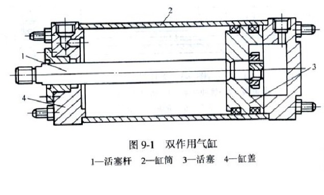

###薄膜气缸
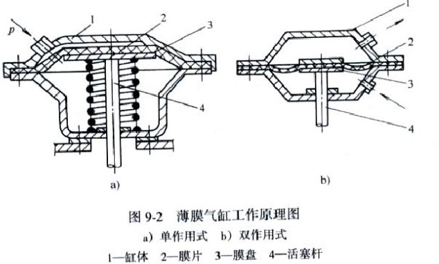

###无缸气缸
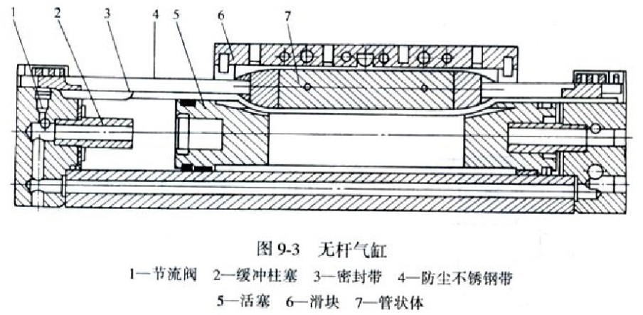

##阀门
###或门型梭阀
* P1进，P2断，P1->A
* P2进，P1断，P2->A
* P1,P2进，高压->A
* P1=P2，先进气->A

###与门型梭阀
* P1进，P2进，低压侧->A
* P1，P2无输出，A口无输出
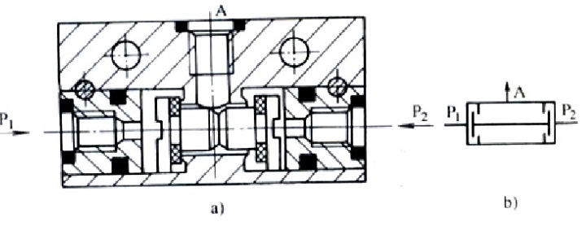

###快排阀
* P进气，膜片封住排气口  P->A
* 气流反向流动，P压力下降，膜片封住P，A->O
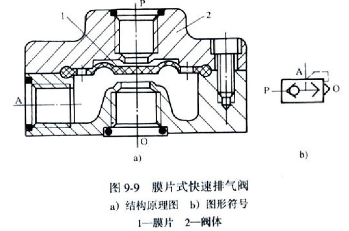

##减压阀
气源压力应大于最高输出压力0.1MPa以上

安装在空气过滤后，油雾器前
###直动型减压阀
* 气路：P1->11->P2
* 减压原理：通过阀口11的节流作用
* 动作：1下压，膜5下凹，7下降，阀口11开
* 反馈：气流经6进入12，使膜5上升
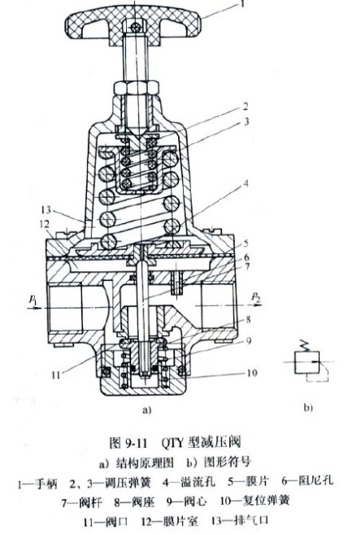

###先导型减压阀
* 气路：P1->9->P2
* 一部分：节流孔1->中气室5->喷嘴2->挡板3-反馈->下气室6->阀杆7->排气孔8
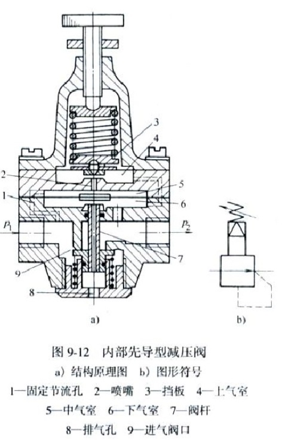

###定值器

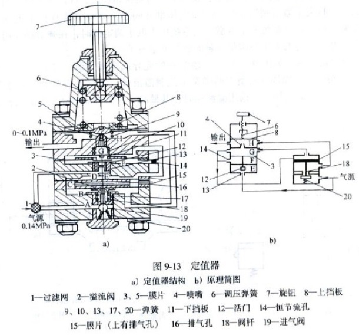
高精度减压阀

* 输入： 0.14MPa   输出： 0~0.1
* 输入： 0.35MPa   输出： 0~0.25

##溢流阀
###直动型

P口连系统，O口通大气，系统压力大于调定压力时气体推开阀芯经O口排至大气

###先导型
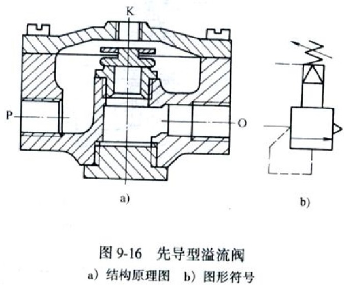
由减压阀减压后的空气从K口进入阀内，代替直动型的弹簧

##顺序阀
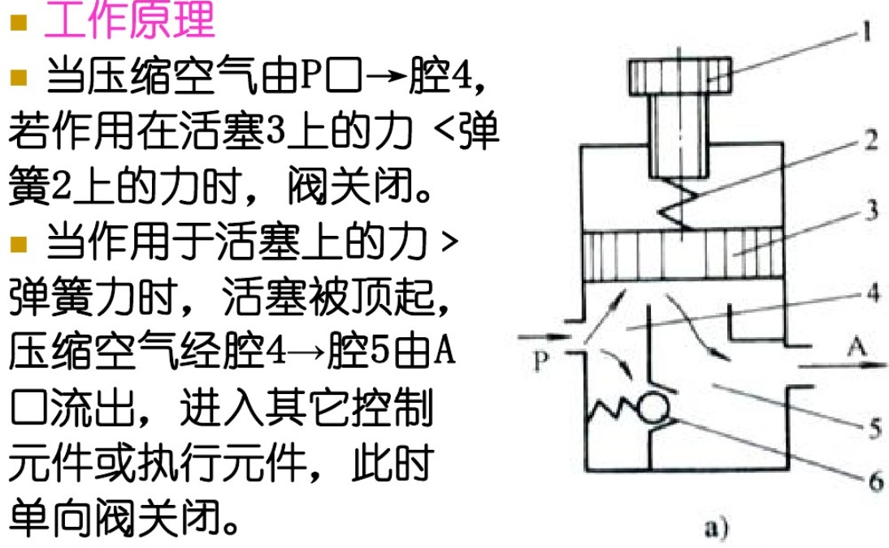
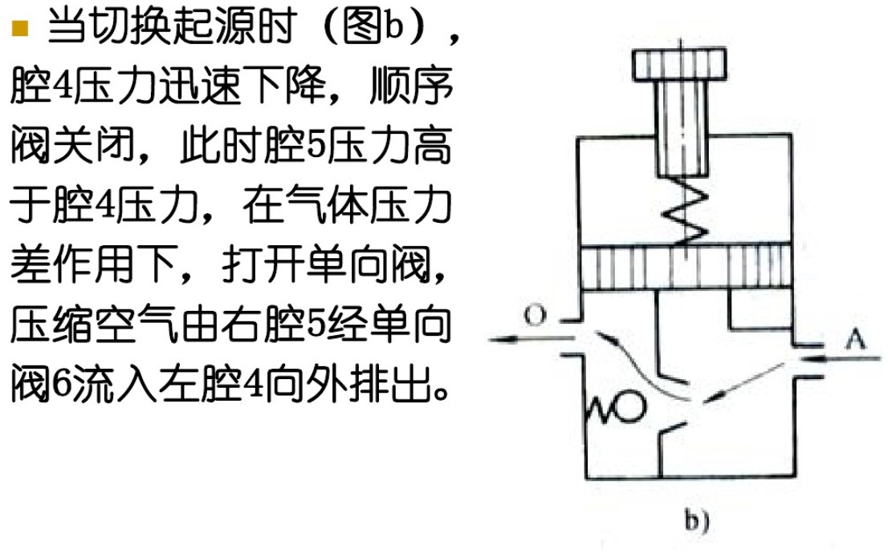
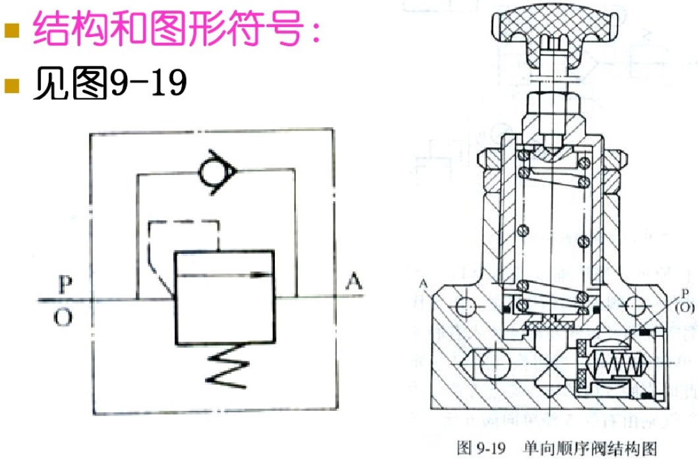

##节流阀
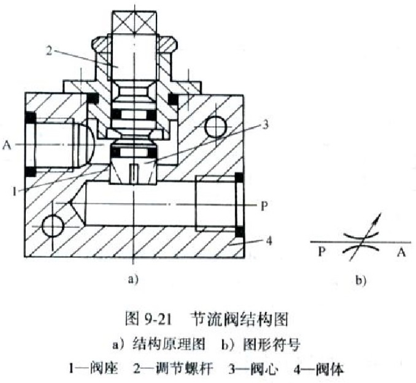
###单向节流阀
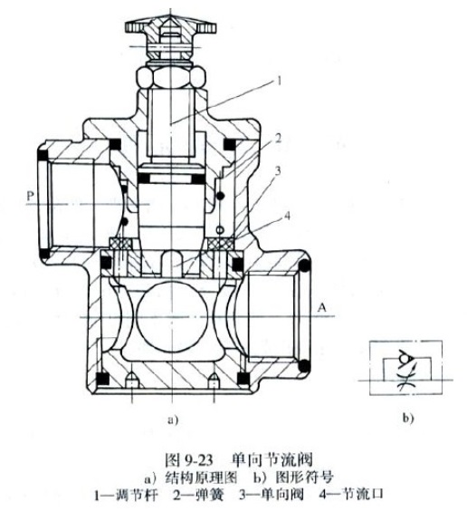
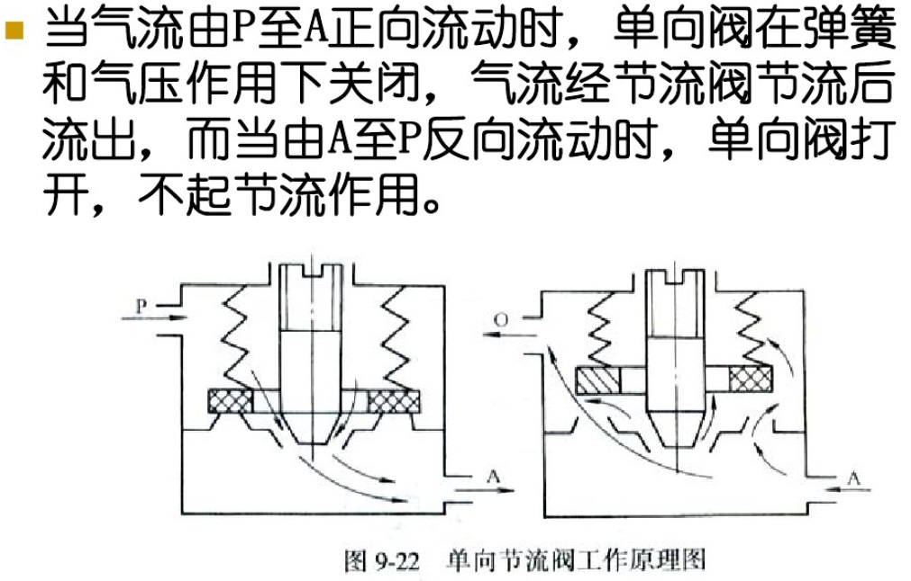

###消音节流阀
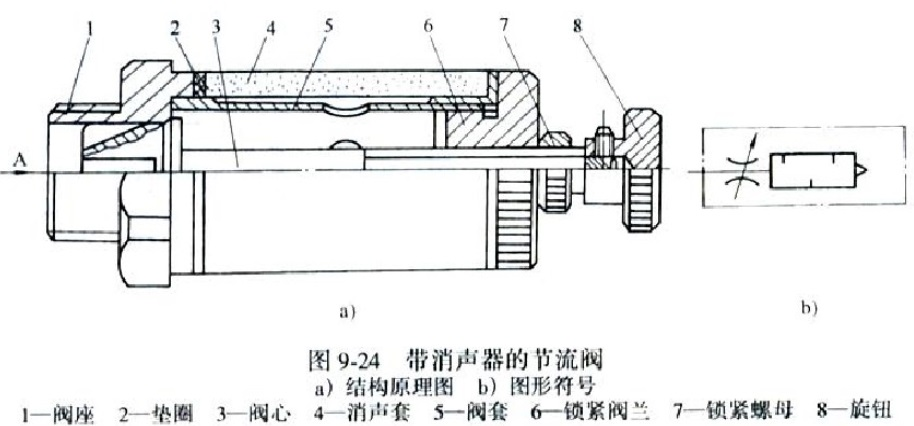

##高压截止式逻辑元件
###与门
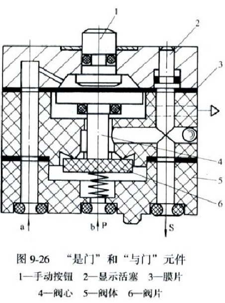
P:气源口 a:信号输入口 S:输出口

* a无气压，阀门关，S无输出
* a有气压，S输出
* 气源P改为信号b时即为与门

###或门

如图不解释

##气瓶
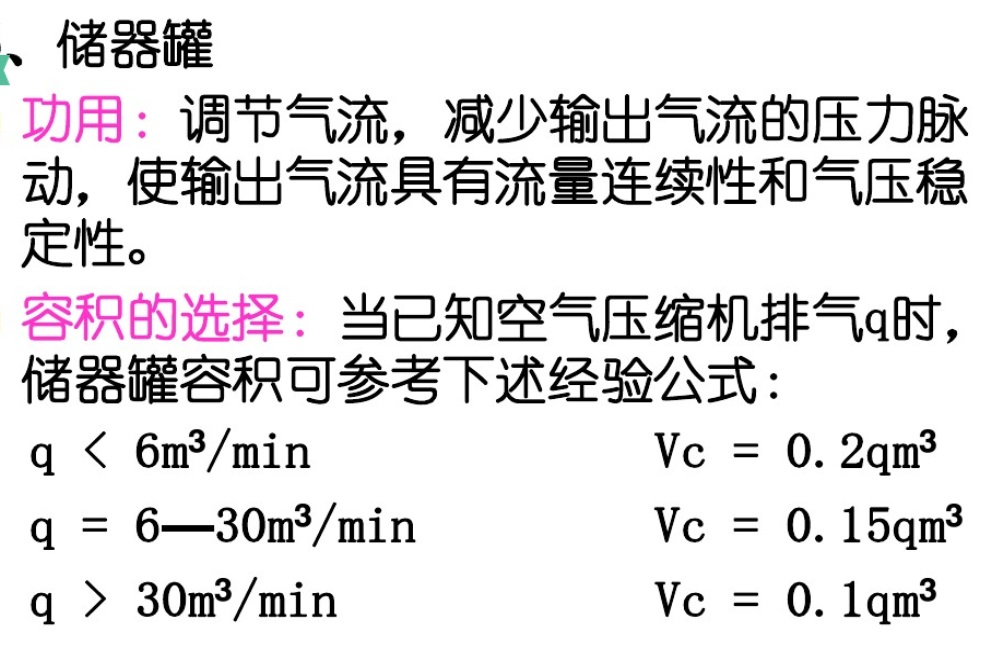

##各种气动元件符号
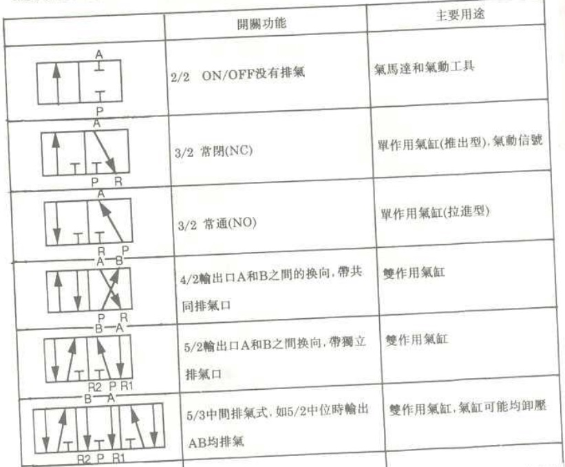

