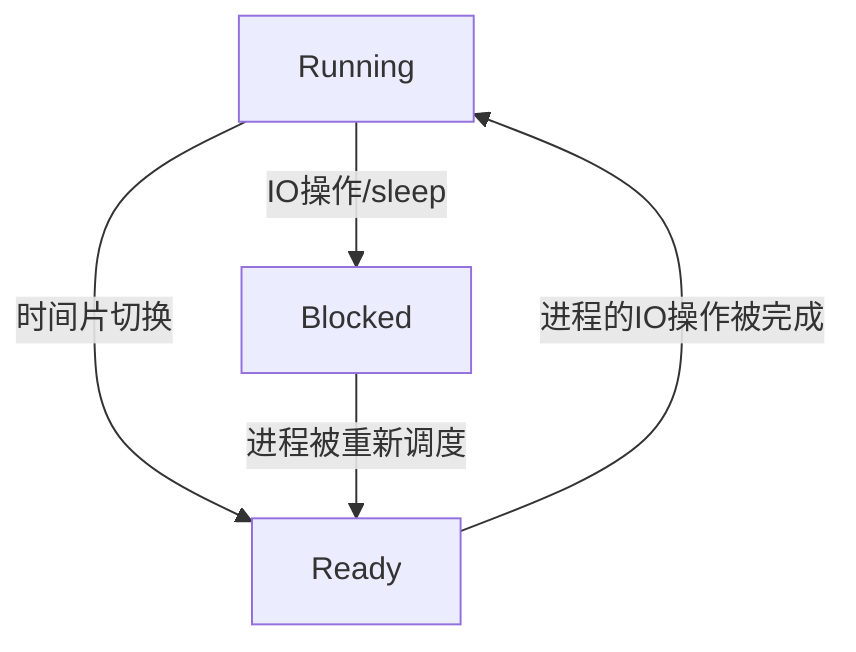
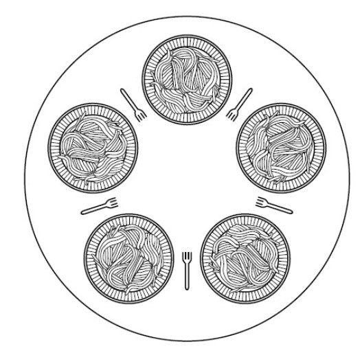
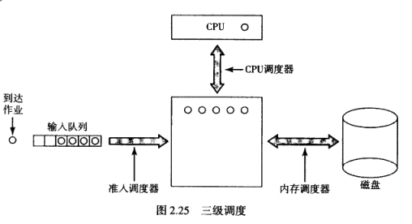

## 进程

### 进程介绍

#### 进程模型




* Running -> Blocked   遇到IO操作 sleep等阻塞操作
* Running -> Ready      进程时间片切换
* Ready      -> Running   进程被重新调度
* Blocked  -> Ready      进程所要求的IO操作被完成

#### 进程实现

存储一个结构体记录每个进程的数据，包括

```
通用寄存器
pc
psw
栈指针
进程状态
进程开始时间
已使用CPU时间
children's CPU time(没懂指什么，子进程？)
下次alarm的时间
消息队列指针
Pending signal bits(信号阻塞位)
pid
其他flag bits
```

最简单的通过中断的进程切换过程

* pc压栈
* 从IVT读取新的pc
* 保存上下文
* 装入新栈指针
* 执行中断服务程序(Scheduler)
* Scheduler更新原进程状态
* Scheduler选取下一个执行的进程
* 装入新上下文
* 执行新进程

#### 线程

线程的实现可以在内核中也可以在用户代码中，但需考虑下面问题

* 对于只在内核实现的线程，调度效率可能很低，并且若操作系统以与进程相同的方式调度内存则可下次调度可能是不同进程的线程，也可能是同一个进程的线程，导致效率急剧下降
* 对于只在用户空间实现的线程，因为操作系统并不知道线程的存在，可能出现当一个线程阻塞时，整个进程都被阻塞的情况

因此一般采用混合的模式

此外还有下列问题需要考虑

* 对于fork
  * 若父进程有多个线程，子进程是否继承
  * 若父进程单个线程阻塞，子进程fork后会不会出现两个进程的对应线程都阻塞在同一个地方的情况
  * 上述问题在资源共享，网络连接时的情况
* 一个线程在读文件另一个线程想关闭文件
* 旧线程发现内存不够要申请，此时发生切换，新线程也发现内存不够，会不会申请2份
* 函数可重入性
* 错误报告：线程1进行了系统调用，读取前发生切换，线程2也执行了系统调用将errno的值刷新
* 线程与信号机制协同运作
  * 线程库需要负责信号的申请 接收与分配
  * 单个进程只能调用一个alarm，若有多线程调用alarm的情况则可能产生问题
* 堆栈
  * 当堆栈大小不够时，操作系统会分配新的堆栈空间。但对于多线程需要有多个堆栈，因此操作系统无法获知这些堆栈的情况（因为由用户管理的线程对于操作系统是透明的），就无法分配新堆栈，导致堆栈溢出

### 进程间通信

#### 条件竞争

进程A和B共享一个服务，假设是个打印服务，正常流程是进程获取打印队列计数n，往队列第n个槽位写入要打印的文件，n = n+1

A要打印文件，于是先读入打印队列计数n。此时发生进程切换，B也要打印文件，于是读入打印队列计数n，往队列第n个槽位写入要打印的文件，n = n+1。进程再切换回A时，A并不知道n被刷新，因此还是会往n的位置写入要打印的文件（本应是第n+1的位置）

#### 临界区

把对共享内存进行访问的程序片段称为临界区

设计的思路就是让临界区代码互斥，具体应满足下列要求

* 任何两个进程不能同时处于临界区
* 不应对CPU的速度和数目作任何假设
* 临界区外的进程不得阻塞其他进程
* 不得使进程在临界区外无休止地等待


#### 使用忙信号互斥

##### 关中断

最简单的方法就是关中断，但这种方法应该是操作系统层面使用的，即操作系统在处理某些共享数据时把中断关闭防止中断突然到来导致条件竞争。对于用户程序不应允许其关闭中断

##### 锁变量

设想一个共享的变量作为锁，一个进程进入临界区时将其置1，其他进程进入前先判断锁的值，若为1则阻塞

但单纯的一个锁变量可能导致问题，即进程A进入临界区时，测试锁的值为0，但还未将锁置1。此时发生了进程切换，进程B测试锁为0，并且将其置1，进入临界区。此时如果在进程B出临界区前再切换回A，则因为A已经测试过锁的值为0，会误以为临界区没有其他线程。

##### 严格轮换

```c
//Process A
while(true)
{
    while(turn != 0);
   	critical_region();
    turn = 1;
    noncritical_region();
}

//Process B
while(true)
{
    while(turn != 1);
   	critical_region();
    turn = 0;
    noncritical_region();
}
```

这种方案严格地让A B进程轮流进入临界区，但也只能轮流进入。违背了临界区设计规则的第三条：不能让进程在临界区外无限等待。

##### Peterson方案

综合了严格轮换和锁的方法，但存在需要花大量时间死循环阻塞在忙状态的问题

```c
int turn;
int interested[2];

void enter_region(int pid)
{
    int other = 1 - pid;	//when pid=1 other=0  when pid=0 other=1
    interested[pid] = true;
    turn = pid;
    while(turn == pid && interested[other] == true);
}

void leave_region(int pid)
{
    intereseted[pid] = false;
}
```

interested数组相当于是临界区申请标志，而turn用于处理当两个进程同时进入临界区时的顺序问题。

这里通过设置turn的方法解决了使用单一锁变量的问题：

* 把锁中测试为0后置1的操作改成申请临界区前直接置位interested数组，表明当前该进程已经提出了一个临界区申请。
* 而turn代表了“最近一个申请临界区的pid”
  * 如果最近一个申请临界区的pid就是当前pid，则测试另一个进程是否提出了临界区申请。若没有则进入临界区
  * 另一个进入临界区的场景就是运行到while时`turn!=pid`，这种情况下说明进程A提出临界区申请后进程切换，而进程B刚好也提出了临界区申请。但因为进程A已经申请了（interested标志置位），因此进程B无法进入临界区。这时切换回A可以直接进入临界区

设想

* process1进行到turn = pid，`turn=1 interested[0]=false interested[1]=true`，此时进程切换
* process0运行到死循环前，`turn=0 interested[0]=true interested[1]=true`，此时因为interested[1]=true，死循环
* 此时进程切换到process1，因为turn=0，所以死循环不成立，进入临界区。
* 出临界区时，interested[1]=false，因此process1不再被死循环卡死，因此其可以进入临界区。

该方法的重点是有多个临界区申请标志时使用turn对临界区访问进行互斥，所以可能存在的竞争问题在于若有n个线程申请进入临界区，但由于进程切换使得申请标志不是对所有进程可见的情况下

##### TSL指令

用硬件支持的锁指令实现上锁，同样在忙状态死循环阻塞

tsl指令同时完成将lock处的值拷贝到寄存器与将lock处的值置1两个操作

```asm
enter_region:
	tsl register, lock
	cmp register, #0
	jne enter_region
	ret
	
leave_region:
	mov lock, #0
	ret
```

#### 睡眠和唤醒

死循环阻塞在忙状态可能导致**优先级翻转问题**

即，当进程A优先级高于B，但B已进入临界区，而A阻塞在临界区。但此时因为A优先级高，所以调度器不会调度B执行，导致死锁

##### 生产者-消费者问题

n个生产者往缓冲区写数据，m个消费者从缓冲区读数据

基本思想：生产者写数据，若缓冲区满，自己休眠；若缓冲区数据数量由0增加到1，则唤醒消费者。消费者读数据，直到缓冲区空，自己休眠；若缓冲区数据数量由N减少到N-1，则唤醒生产者

这样，若生产者产生数据速度大于消费者读取速度，则直到缓冲区满将睡眠，并在消费者读完缓冲区第一个数据时被唤醒。若生产者产生数据速度小于消费者读取速度，则消费者读到缓冲区空将睡眠，并在生产者产生下一个数据后被唤醒

```c
#define N 100
int count = 0;

void producer(void)
{
    while(true)
    {
        produce_item();		// 生产
        if(count == N)		// 若缓冲区满，睡眠
            sleep();
        enter_item();		// 放入缓冲区
        count += 1;
        if(count == 1)		// 若count由0变1，唤醒消费者
            wakeup(consumer);
    }
}

void consumer(void)
{
    while(true)
    {
        if(count == 0)		// 若缓冲区空，睡眠
       		sleep();
        remove_item();		// 读取缓冲区
        count = count - 1;
        if(count == N-1)	// 若缓冲区由满变为非满，唤醒生产者
            wakeup(producer);
        consume_item();		// 消费
    }
}
```

**条件竞争**：若consumer读取count时为0，此时进程切换到producer，producer生产了一份数据并唤醒consumer，但consumer实际并未睡眠，因此wakeup信号将丢失。此时进程切换回consumer，consumer仍认为count=0，因此将睡眠。而之前用于唤醒这次睡眠的信号已经丢失，因此consumer将一直睡眠，而producer因为产生数据后没人读取因此最后也会进入睡眠。

一个解决方案：设置一个唤醒等待位，当向清醒进程发送wakeup时将置位，但每个进程都必须有一个唤醒等待位

#### 信号量

信号量用于表示被累积下来的唤醒次数

信号量s提供DOWN（P  sleep 申请资源）和UP（V  wakeup 释放资源）两种操作，两种操作均是原子操作

信号量可以看作保存当前可以使用的资源。当执行一次P时表示申请一次资源，当`s!=0`时`s--`，否则进程阻塞（因为当前已经没有资源了）。可以有多个进程在当前信号量上阻塞（sleep）

当执行一次V时表示释放一次资源，当`s>0`时`s++`，否则唤醒一个在当前信号量上阻塞的线程

##### 使用信号量解决生产者-消费者问题

```c
#define N 100
typedef int semaphore;		// 信号量是一种特殊的整型变量
semaphore mutex = 1;		//缓冲区锁
semaphore empty = N;		//空槽数
semaphore full = 0;			//item数

void producer(void)
{
    int item;
    while(True)
    {
        produce_item(&item);
        down(&empty);		//当缓冲区满时将阻塞
        down(&mutex);
        enter_item(&item);
        up(&mutex);
        up(&full);
    }
}

void consumer(void)
{
    int item;
    while(True)
    {
        down(&full);		//当缓冲区空时将阻塞
        down(&mutex);
        remove_item(&item);
        up(&mutex);
        up(&empty);
        consume_item(item);
    }
}
```

这里注意一个问题：若生产者的代码中，`down(&empty)` 写在了 `down(&mutex)` 的后面，则可能导致死锁。当缓冲区满时，因为mutex的操作在前，因此可能mutex先被acquire，而此时发生进程切换，则consumer在acquire mutex时失败，因此缓冲区将一直是满的，两进程死锁

#### 管程

管程是一个模块，编译器可以保证在这个模块运行中**始终只有一个进程在运行**，把同步问题尽量交给编译器

##### 条件变量

引入条件变量是为了给管程在处理上述生产者/消费者问题时提供一个机制（使用信号进行唤醒的机制）进行进程的轮换

类似二元信号量，提供signal和wait两种操作

当前进程无法继续运行时执行wait，引起进程阻塞；当前进程希望唤醒另一个进程时执行signal

由于管程要求模块运行时只有一个进程在运行，因此对于signal的处理有两种：

* 遇到signal时挂起当前进程，运行新唤醒的进程
* 遇到signal时直接退出当前进程，即signal为一个进程的最后一个语句

后者实现较为简单清晰

##### 使用条件变量解决生产者-消费者问题

```c++
class monitor
{
    condition full, empty;
    int count = 0;
    
    void enter()
    {
        if(count == N)
            wait(full);		//槽位已满，等待
        enter_item();
        count += 1;
        if(count == 1)
            signal(empty);	//槽位已经非空，唤醒consumer
    }
    
    void remove()
    {
        if(count == 0)
            wait(empty);	//槽位已空，等待
        remove_item();
        count -= 1;
        if(count == N-1)
            signal(full);	//槽位已经非满，唤醒producer
    }
}

monitor ProducerConsumer;

void producer()		//进程1
{
    while(1)
    {
		produce_item();
    	ProducerConsumer.enter();
    }
}

void consumer()		//进程2
{
    while(1)
    {
        ProducerConsumer.remove();
        consume_item();
    }
}
```

#### 消息传递

对于机器间进程交换，可以用消息传递解决（这里其实算是通过网络传输，同样可以用于本地socket通信）。它们采用类似系统调用的方法实现：

```c
send(destination, &message);
receive(source, &message);
```

需考虑的问题

* 信号丢失  采用收到消息后ack的机制，若没收到ack包则重发；用序列号来保证不会重复应答
* 身份认证

##### 使用消息传递解决生产者-消费者问题

```c
#define N 100

void producer(void)
{
    int item;
    message m;
    
    while(1)
    {
        produce_item(&item);
        receive(consumer, &m);		// 接收到一个消息（这里肯定是空消息），等同于收到一块缓冲空间
        build_message(&m, item);	// 将item封装入消息
        send(consumer, &m);			// 发送该消息
    }
}

void consumer(void)
{
    int item, i;
    message m;
    
    for(i=0; i<N; i++)
        send(producer, &m);		// 这里创建发送N个空消息作为缓冲区
    
    while(1)
    {
        receive(producer, &m);		// 接收一个item
        extract_item(&m, &item);
        send(producer, &m);			// 返回空消息作为新的缓冲区
        consume_item(item);
    }
}
```

consumer开启时先发送N个空信息，作为缓冲区等待producer填充，其他机制与之前解决生产者-消费者问题的机制相同

一般采用信箱机制协调缓冲区问题，两边同时维护一个N个槽位大小的缓冲区。若不采用缓冲区，则producer和consumer在receive前会互相阻塞，称为聚合(rendezvous)原则

### 经典IPC问题

IPC(Inter-Process Communication)进程间通信

#### 哲学家进餐问题

有5个哲学家5把叉子，必须拿左右两把才能进食。哲学家生活只包括吃饭和思考两种活动，要求写一段程序描述所有哲学家行为而不会死锁



##### 解法1（错误）

这里是一种朴素的描述方法，直接顺序描述所有哲学家行为

但试想所有哲学家一起执行到`take_fork(i)`，即拿起一面的叉子，将永远无法获得另一边的叉子，即死锁在`take_fork((i+1)%N)`

```c
#define N 5

void philosopher(int i)
{
    while(1)
    {
        think();
        take_fork(i);
        take_fork((i+1)%N);
        eat();
        put_fork(i);
        put_fork((i+1)%N);
    }
}
```

##### 解法2（错误）

改进上述解法，若获取左叉子后无法获取右叉子，则放下左叉子并等待

但这样同样有问题，试想所有的哲学家试图在某个时刻`take_fork(i)`，则`can_take_fork((i+1)%N)`为假，因此所有哲学家又一起放下了叉子，同时sleep(x)后又一起试图获取叉子，导致死锁

可能的解决方案是让x为随机数，但这样无法提供一个稳定的调度算法

```c
#define N 5

void philosopher(int i)
{
    while(1)
    {
    	think();
        take_fork(i);
        if(can_take_fork((i+1)%N))
        {
            take_fork((i+1)%N);
            eat();
        	put_fork(i);
        	put_fork((i+1)%N);
        }
        else
        {
            put_fork(i);
        	sleep(x);
        	continue;
        }
    }
}
```

##### 解法3

使用一个二元信号量mutex对拿叉子的行为进行同步

这样做虽然可以保证不死锁，但同一时刻只能有一个哲学家进食，而实际可以有两个哲学家

```c
#define N 5

semaphore mutex = 1;

void philosopher(int i)
{
    while(1)
    {
        think();

        down(&mutex);
        take_fork(i);
        take_fork((i+1)%N);
        eat();
        put_fork(i);
        put_fork((i+1)%N);
        up(&mutex);
    }
}
```

##### 解法4

当且仅当哲学家左侧和右侧的哲学家没有在吃饭时，该哲学家才可以吃

```c
#define N 5
#define LEFT (i-1)%N
#define RIGHT (i+1)%N

typedef enum _state{	//当思考时为thinking，想吃饭但阻塞时为hungry，吃饭时为eating
	THINKING,
    HUNGRY,
    EATING
} state;
typedef int semaphore;

state person[N];		//指示每个哲学家状态
semaphore mutex = 1;	//用于同步person数组
semaphore s[N];			//每个哲学家对应一个二元信号量

void philosopher(int i)
{
    while(1)
    {
        think();
        take_forks(i);
        eat();
        put_forks(i);
    }
}

void take_forks(int i)
{
    down(&mutex);
    person[i] = HUNGRY;
    test(i);
    up(&mutex);			//不能在down(&s[i])后，否则将死锁。因为down(&s[i])可能阻塞
    down(&s[i]);
}

void put_forks(int i)
{
    down(&mutex);
    state[i] = THINKING;
	test(LEFT);			// 通知左邻居进餐
    test(RIGHT);		// 通知右邻居进餐
    up(&mutex);
}

int test(int i)
{
	if(person[i]==HUNGRY && person[LEFT]!=EATING && person[RIGHT]!=EATING)
    {
        person[i] = EATING;
        up(&s[i]);		//因为左右的人都没在吃饭因此i可以吃饭，相当于在这里给了s[i]吃饭的资源
    }
}
```

* 注意，这里若哲学家无法进食，则没有阻塞在test函数中，而是在test函数后的`down(&s[i])`过程阻塞
* 若test条件通过，则`up(&s[i])`，使得之后的`down(&s[i])`不会被阻塞
* 注意这里若哲学家无法进餐，则阻塞在take_fork的down中，此时唯有其他进程`up(&s[i])`才能让他进餐，因此putfork后还有`test(RIGHT)`和`test(LEFT)`

#### 读者-写者问题

类似一个数据库访问模型，对于多进程的数据库，多个进程同时读一个数据是可接受的，但当一个进程写时，则其他进程都不能访问数据库（不论读写）

下面给出一种解法

```c
typedef int semaphore;
semaphore mutex = 1;	// 变量rc的锁
semaphore db = 1;		// 控制对数据库的访问
int rc = 0;				// 正在读或想读数据库的进程数

void reader(void)
{
    while(true)
    {
        down(&mutex);
        rc += 1;
        up(&mutex);		// 读者人数加一
        if(rc == 1)
            down(&db);	// 若是第一个读者，则获取数据库锁

        read_data_base();

        down(&mutex);
        rc -= 1;		// 读者人数减一
        up(&mutex);
        if(rc == 0)		// 若是最后一个读者，则释放数据库
            up(&db);
    }
}

void writer(void)
{
    while(true)
    {
        think_up_data();
        down(&db);		// 数据库上锁，所有访问都不能进行
        write_data_base();
        up(&db);		// 恢复访问
    }
}
```

但这个实现有个明显的问题：若读者数量长期大于0，则将始终持有数据库锁，则写者无法获取锁进行写入

### 进程调度

#### 何时调度

必然发生调度

* 当一个进程退出时
* 当一个进程在IO或信号量上阻塞时

可能发生调度

* 当一个新进程创建时： 重新评估优先级
* 当一个IO中断发生时： IO设备完成工作，可以唤醒等待进程
* 当一个时钟中断发生时： 判断当前进程是否运行了足够长的时间

#### 分类

**调度算法分类**：

* 非抢占式  运行进程直到阻塞
* 抢占式  根据时间片等划分，当一个进程运行了足够的时间或其他指标达标，则切换成其他进程

**系统类型**：

* 批处理  因为没有用户在终端等待，所以可以使用非抢占式或有很长时间片的抢占式，从而减少调度开销
* 交互式  一般使用抢占式
* 实时  大多抢占，但有时不用，因为实时系统上的程序一般运行一段时间就阻塞

##### 调度算法目标

有下列一些设计目标

首先，对于**所有系统**：

* 公平  每个进程CPU份额公平
* 策略强制执行  保证强制执行一些规定的策略
* 平衡  保持系统所有部分忙碌

根据不同系统，有下列一些目标

* 批处理系统
  * 吞吐量  最大化每小时作业数
  * 周转时间  最小化从提交到完成的时间间隔
  * CPU利用率  保持CPU忙碌
* 交互式系统
  * 响应时间  快速响应请求
  * 均衡性  满足所有用户的需求
* 实时系统
  * 满足截止时间  一些处理有截止时间，应保证满足，防止数据丢失
  * 可预测性  在多媒体系统中避免失真，如对于一个按频率进行采样的进程，应保证其的周期性不会差别过大

#### 批处理系统中的调度

##### 先到先服务

实现简单

##### 最短作业优先

作业时间短的优先运行

当所有作业**同时启动**时是最优的

##### 最短剩余时间优先

作业剩余时间短的任务优先运行。前提是需要知道作业的剩余时间

##### 三级调度

实际上是一个调度模型，由**准入调度器**、**内存调度器**和**CPU调度器**组成



* 准入调度器  用于判断哪些作业允许进入系统。常用的算法，如短作业很快准入，长作业则需要等待；再如计算密集型进程和IO密集型进程混合运行
* 内存调度器  可能由于正在运行的作业申请过多内存导致内存不够，这时就需要内存调度器判断并控制将一些进程的内存临时换进换出磁盘。
* 