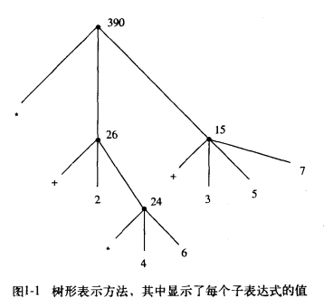
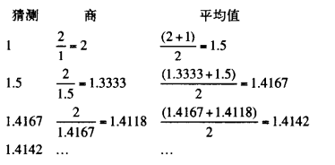
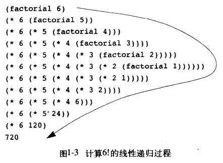
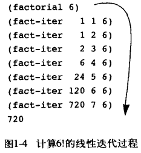
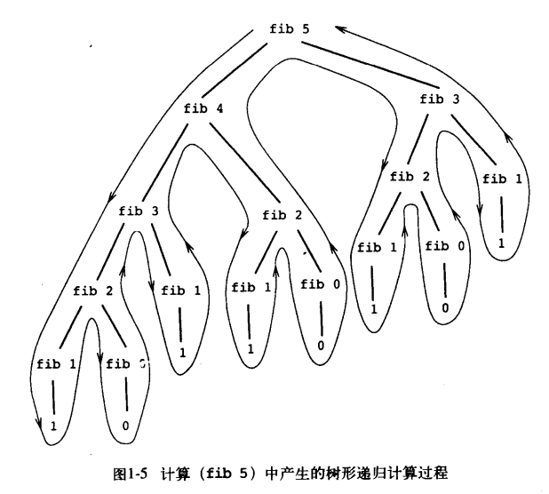
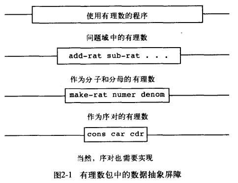

## 计算机程序的构造和解释

### 第1章 构造过程抽象

#### 程序设计的基本元素

主要包含三个方面，分别为

* **基本表达形式**  用于表示语言所关心的最简单的个体
* **组合的方法**  通过它们可以从较简单的东西出发构造出复合的元素
* **抽象的方法**  通过它们可以为复合对象命名，并将它们当作单元去操作

##### 表达式

算术表达式主要使用的是前缀表示，即计算 137+349 时，输入为

```
(+ 137 349)
```

##### 命名和环境

变量定义的方法如下

```
(define <name> <value>)
```

如

```
(define size 2)
```

解释器需要将值与符号相关联，因此必须维护某种存储能力，这种存储被称为环境

##### 组合式的求值

一般符合下列的步骤

* 求值该组合式的各个子表达式
* 将作为最左子表达式（运算符）的值的那个过程应用于相应的实际参数

如对下列表达式求值

```
( * ( + 2 (* 4 6) ) (+ 3 5 7) )
即对应正常写法的 (2+4*6) * (3+5+7)
```

在解释器求值时，会先迭代到最底层，直到可以代入实参对表达式进行计算，自底向上求解各个子表达式的值，如下图



##### 复合过程

这里的复合过程类似编程语言中函数的概念

```
(define (<name> <formal parameters>) <body>)
```

如

```
(define (square x) (* x x))
(define (sum-of-squares x y) (+ (square x) (square y)))
(define (f a) (sum-of-squares (+ a 1) (* a 2)))
```

##### 过程应用的代换模型

对于复合过程，过程应用的计算过程是

* 将复合过程应用于实参，就是在将过程体中的每个形参用相应的实参取代后对这一过程体求值

其中又分为正则序和应用序

如

```
(f 5)
```

###### 正则序

求值过程即为，首先将sum-of-squares中的定义x y替换为3 4，然后迭代，继续替换square中的x

```
(f 5) => (sum-of-squares (+ 5 1) (* 5 2)) => (+ (square (+ 5 1)) (square (* 5 2)))
      => ( + (* (+ 5 1) (+ 5 1)) (* (* 5 2) (* 5 2)) )
```

此后再归约

###### 应用序

```
(f 5) => (sum-of-squares (+ 5 1) (* 5 2)) => (sum-of-squares 6 10)
      => (+ (square 6) (square 10)) => (+ (* 6 6) (* 10 10))
```

可以看到应用序与正则序的区别就是正则序是在完全展开后才带入实参求值的，因此正则序需要多一些冗余运算（如上述例子中5+1被计算了两次）。所以实际应用中一般不使用正则序。

##### 条件表达式和谓词

###### 条件表达式

```
(cond (<p1> <e1>)
      (<p2> <e2>)
       ...
      (<pn> <en>))
```

其中每个pn的返回值只有真或假，被称为**谓词**

如

```lisp
(define (abs x)
  (cond ((> x 0) x)
        ((= x 0) 0)
        ((< x 0) -x)
  )
)
```

也可以写成

```lisp
(define (abs x)
  (cond ((< x 0) (-x))
        (else x)
  )
)
```

这里的else在上述所有谓词都不成立时执行

也可以写成

```lisp
(define (abs x)
  (if (< x 0)
      (-x)
      x
  )
)
```

注意这里的if语法如下

```
(if <predicate> <consequent> <alternative>)
```

若predicate为真，则求值consequent并返回其值，否则求值alternative并返回其值

###### 谓词

表示返回真或假的过程或表达式

常用的谓词由关系运算符（> < =等）组成，此外可以通过逻辑复合运算符组成复合谓词

```
(and <e1> ... <en>)
(or <e1> ... <en>)
(not <e>)
```

##### 实例：采用牛顿法求平方根

原理：



思路：迭代更新猜测值，直到猜测值小于一个阈值

```lisp
(define (sqrt-iter guess x)
    (if (good-enough guess x)
        guess
        (sqrt-iter (improve guess x) x)
     )
)
```

而improve函数根据上面所示，可以定义为

```lisp
(define (average x y)
    (/ (+ x y) 2)    
)

(define (improve guess x)
    (average guess (/ x guess))
)
```

最后实现good-enough，误差值小于0.001即可接受

```lisp
(define (good-enough guess x)
    (< (abs (- x (square guess))) 0.001)
)
```

最后，以1为初始的猜测值，于是

```lisp
(define (sqrt x)
    (sqrt-iter 1.0 x)
)
```

##### 过程作为黑箱抽象

###### 局部名

过程的形式参数的具体名字是什么，对于过程来说没有任何影响，这样的名字称为**约束变量**。因此我们称，一个过程的定义**约束**了它的所有形式参数。

若在一个完整的过程定义里将某个约束变量统一换名，这一过程的定义不会有任何的改变。若一个变量不是被约束的，则称它为**自由**的

若一个名字定义被约束于一集表达式中，则这一集表达式被称为这个名字的**作用域**。

如在good-enough过程中，guess和x是约束变量，< - abs square是自由变量

```lisp
(define (good-enough guess x)
    (< (abs (- x (square guess))) 0.001)
)
```

###### 内部定义和块结构

在上面sqrt的程序中，调用了多个函数，而当我们在写一个稍微大一些的程序时就有可能出现重名的问题，因此可以改写如下

```lisp
(define (sqrt x)
    (define (good-enough guess x)
        (< (abs (- x (square guess))) 0.001)
    )
    (define (improve guess x)
        (average guess (/ x guess))
    )
    (define (sqrt-iter guess x)
        (if (good-enough guess x)
            guess
            (sqrt-iter (improve guess x) x)
        )
    )

    (sqrt-iter 1.0 x)
)
```

这样的嵌套定义被称为块结构

此外，由于这些过程都定义在sqrt过程的内部，因此也在sqrt的约束变量x的作用域内。因此可以让x作为内部定义的这些过程的自由变量，这样可以使得内部定义的各个过程省去一个参数。这种方式称为 **词法作用域** （过程中的自由变量实际上是引用外围过程定义所出现的约束）

```lisp
(define (sqrt x)
    (define (good-enough guess)
        (< (abs (- x (square guess))) 0.001)
    )
    (define (improve guess)
        (average guess (/ x guess))
    )
    (define (sqrt-iter guess)
        (if (good-enough guess)
            guess
            (sqrt-iter (improve guess))
        )
    )

    (sqrt-iter 1.0)
)
```

#### 过程与它们所产生的计算

##### 线性递归和迭代

考虑计算阶乘的过程

采用递归的方式如下

```lisp
(define (factorial n)
    (if (= n 1)
        1
        (* n (factorial (- n 1)))
    )
)
```



采用迭代的方式如下

```lisp
(define (factorial n)
    (fact-iter 1 1 n)
)

(define (fact-iter product counter max-count)
    (if (> counter max-count)
        product
        (fact-iter (* counter product)
                   (+ counter 1)
                   max-count
        )
    )
)
```



* 线性递归过程：先展开后收缩，展开时构造起一个推迟进行的操作所形成的链条，收缩阶段表现为这些运算的实际执行
* 线性迭代过程：状态可以用固定数目的状态变量描述的计算过程，且存在一套固定的规则，描述了计算过程在从一个状态到下一个状态转换时这些变量的更新方式

注意，上述的线性递归过程和线性迭代过程描述的是程序执行时展开的方式，需要与 *递归过程* 区分，因为后者描述的是语法形式，即在一个过程中引用了该过程本身

##### 树形递归

典型例子如斐波那契数列

```lisp
(define (fib n)
    (cond ( (= n 0) 0 )
          ( (= n 1) 1 )
          ( else (+ (fib (- n 1) (fib (- n 2)))) )
    )
)
```



斐波那契数列也可以写成迭代形式

```lisp
(define (fib n)
    (fib-iter 1 0 n)
)

(define (fib-iter a b count)
    (if (= count 0)
        b
        (fib-iter (+ a b) a (- count 1))
    )
)
```

##### 实例 换零钱方式

有50 25 10 5 1美分的硬币，将n美元换成零钱有多少种换法

思路：将总数为a的现金换成n种硬币的方式数可以归纳为两类

* 将现金数a换成除第b种硬币之外的所有其他硬币的方式数
* 将现金数a-d换成所有种类的硬币的方式数，其中d是第b种硬币的币值

上述分法是合理的，因为这相当于把换钱方法分成了使用第b种硬币和不使用第b种硬币这两种方法。且用这种方法设计递归也是合理的，因为它每次递归都减少了硬币种类，或减少了现金数。

下面可以设定递归的边界条件

* 如果a=0，算作有1种换零钱的方式
* 如果a<0，算作有0种换零钱的方式
* 如果n=0，算作有0种换零钱的方式

这里为了清晰，a命名为amount，n命名为kinds-of-coins

```lisp
(define (count-change amount)
    (cc amount 5)
)

(define (cc amount kinds-of-coins)
    (cond  ((= amount 0) 1)    ; a=0的情况
           ((or (< amount 0) (= kinds-of-coins 0)) 0)    ; a<0或n=0的情况
           (else
               ( + (cc amount (- kinds-of-coins 1)) (cc (- amount (first-denomination kinds-of-coins)) kinds-of-coins) )
           )  ; 前一种是不使用当前硬币的情况，后一种是使用当前硬币的情况
    )
)

(define (first-denomination kinds-of-coins)
    (cond
        ( (= kinds-of-coins 1) 1 )
        ( (= kinds-of-coins 2) 5 )
        ( (= kinds-of-coins 3) 10 )
        ( (= kinds-of-coins 4) 25 )
        ( (= kinds-of-coins 5) 50 )
    )
)
```

可以演算一个简单的例子：10美分

```
由于演算的是10美分，因此直接从kinds-of-coins=3开始计算
(cc 10 3) = (+ (cc 10 2) (cc 0 3)) = (+ (cc 10 2) 1)
(cc 10 2) = (+ (cc 10 1) (cc 5 2))

(cc 5 2)  = (+ (cc 5 1) (cc 0 2)) = (+ (cc 5 1) 1)
(cc 5 1)  = (+ (cc 5 0) (cc 4 1)) = ... = 1

(cc 10 1) = (+ (cc 10 0) (cc 9 1)) = (+ 0 (cc 9 1))
(cc 9 1)  = (+ (cc 9 0) (cc 8 1)) = ... = 1
```

因此最终结果为4

##### 增长的阶

其实就是在讲渐进界
$$
\begin{aligned}
& 若存在与n无关的整数k1 \ k2，使得
\\
& k_1 f(n) \leq R(n) \leq k_2 f(n)
\\
& 我们称R(n)具有\Theta(f(n))的增长阶，记为R(n) = \Theta(f(n))
\end{aligned}
$$

##### 实例 求幂

基于以下事实
$$
\begin{aligned}
b^n &= b * b^{n-1}
\\
b^0 &= 1
\end{aligned}
$$
递归

```lisp
(define (expt b n)
    (if (= n 0)
        1
        (* b (expt b (- n 1)))
    )
)
```

迭代

```lisp
(define (expt-iter b product n)
    (if (= n 0)
        product
        (expt-iter b (* b product) (- n 1))
    )
)

(define (expt b n)
    (expt-iter b 1 n)
)
```

基于下列事实可以优化算法
$$
\begin{aligned}
b^n &= (b^{\frac{n}{2}})^2 & n是偶数
\\
b^n &= b * b^{n-1} & n是奇数
\end{aligned}
$$

```lisp
(define (even n)
    (= (remainder n 2) 0)
)

(define (fast-expt b n)
    (if (= n 0)
        1
        (if (even n)
            (square (fast-expt b (/ n 2)) )
            ( * b (fast-expt b (- n 1)) )
        )
    )
)
```

此外，习题1.16 1.17 1.18分别为对上述算法的迭代优化和按同样方式只用加法的方式设计两数相乘的算法。其中1.16和1.18说明了将递归转为迭代的设计方式（用状态变量，保证每次状态转移时某个公式的不变性），可以重点看一下。1.19提供了一种斐波那契数列计算的logn算法，很强

##### 最大公约数

###### 算法

欧几里得算法主要基于下列事实：若 r = a mod b，则a和b的公约数也是b和r的公约数，因此可以得到下列等式
$$
GCD(a, b) = GCD(b, r)
$$
递归的终止条件是b整除a（或者b=0，因为若上次递归b整除a，这次递归b=0）

```lisp
(define (GCD a b)
    (if (= b 0)
        a
        (GCD b (remainder a b))
    )
)
```

###### lame定理

如果欧几里得算法需要用k步计算出一对整数的GCD，那么这对数中较小的那个数必然大于或者等于第k个斐波那契数

利用上述定理可以估计gcd算法的增长阶：假设n是较小的那个数，则有 $n \geq Fib(k) \approx \frac{\phi^k}{\sqrt{5}}$ ，因此步数k的增长阶就是 $\Theta(log \ n)$

证明见 [附录](#1.lame定理) 

##### 实例：素数检测

###### 寻找因子

常规的寻找因子算法，循环直到除法余数为0

```lisp
(define (smallest-divisor n)
    (find-divisor n 2)   ; 从2开始测试
)

(define (divide a b)
    (= (remainder a b) 0)
)

(define (find-divisor n test-divisor)
    (cond
        ( (> (square test-divisor) n)  n )           ; 若test-divisor^2 > n，说明没有找到因子，这里直接返回n
        ( (divide n test-divisor)  test-divisor )    ; 若能被整除，则找到因子
        ( else (find-divisor n (+ test-divisor 1)) ) ; 否则测试下一个数是否为因子
    )
)

(define (prime n)
    (= n (smallest-divisor n))
)
```

###### 费马检验

费马小定理：若p是一个素数，对于任意不被p整除的a，有 $a^{p-1} \equiv 1 \ (mod \ p)$ （或书里其实用到的是 $a^p \equiv a (mod \ p)$ ）

这里为了方便，直接选取 $1 \leq a \leq p-1$ 

费马素性检验的原理即：若选取的a不满足上式，则一定是合数，否则可能是素数。测试通过的a数目越多，p是素数的可能性越大

要实现费马检查，首先应该实现一个expmod过程，即计算 $x^y \ mod \  m$ ，该算法也可以通过logn算法实现，这基于以下事实
$$
(a*b) \ mod \ m = ( (a \ mod \ m) * (b \ mod \ m) ) \ mod \ m
$$
所以可以用下面的递归法则来计算

* 当y为偶数， $x^y \ mod \ m = ((x^{\frac{y}{2}} \ mod \ m) * (x^{\frac{y}{2}} \ mod \ m)) \ mod \ m$ 
* 当y为奇数， $x^y \ mod \ m = ((x \ mod \ m) * (x^{y-1} \ mod \ m)) \ mod \ m$ 

```lisp
(define (expmod base exp m)
    (cond
        ( (= exp 0) 1 )
        ( (even exp) (remainder (square (expmod base (/ exp 2) m)) m) )
        (else (remainder (* base (expmod base (- exp 1) m)) m))
    )
)
```

素性检验逻辑如下，times指定了需要检验的次数

```lisp
(define (fermat-test n)
    (define (try-it a)
        (= (expmod a n n) a)     ; 注意这里的判断是 a^n mod n == a，这是因为选取的a < n，所以必有 a mod n = a
    )
    (try-it (+ 1 (random (- n 1))))  ; 注意这里+1，是因为random n的返回值是0 ~ n-1，而需要的a满足 1 <= a <= n-1
)

(define (fast-prime n times)
    (cond
        ( (= times 0) true )
        ( (fermat-test n) (fast-prime n (- times 1)))
        (else false)
    )
)
```

#### 用高阶函数抽象

##### 过程作为参数

将过程作为参数的思想其实可以与数学中的算子相类比，如
$$
\sum_{n=a}^b f(n) = f(a) + f(a+1) + \cdots + f(b)
$$
可以编程如下

```lisp
(define (sum func a b)
    (if (> a b)
        0
        (+ (func a) (sum func (+ a 1) b))
    )
)
```

其中func就是以函数作为参数传入的。因此sum函数就相当于一个算子程序，接受func函数，func(a)到func(b)之和

若f(n)=x^2，则

```lisp
(define (func x)
    (square x)
)
```

（程序见sicp_program/sum.scm）

##### 用lambda构造过程

scheme中的lambda也是一种创建匿名函数的方法，如上述计算平方和的程序可以写作

```lisp
(sum (lambda (x) (square x)) a b)
```

##### 用let创建局部变量

let表达式一般形式是

```lisp
(let
   ( (<var1>  <exp1>)
     (<var2>  <exp2>)
     ...
     (<varn>  <expn>)
   )
   <body>
)
```

注意这里的let其实是有一个作用域的

因此let也可以被视作lambda的一种语法糖，因为上式等价于

```lisp
( (lambda (<var1>, <var2>, ... , <varn>)
      <body>
  )
  <exp1>
  <exp2>
  ...
  <expn>
)
```

即使用varn替代expn

**注意：** 当expn的表达式依赖于与局部变量同名的变量时，使用的依然是局部作用域外的变量，如下例，假设外部作用域中x的值是2

```lisp
(let ((x 3)
      (y (+ x 2)))
    (* x y)
)
```

这里在计算 `x*y` 时，x=3，y=4，这是由于在计算y=x+2时，x取值为2而不是3


假设希望计算的函数为
$$
f(x,y) = x(1+xy)^2 + y(1-y) + (1+xy)(1-y)
$$
很自然的想法就是将其表示为
$$
f(x,y) = xa^2 + yb + ab
$$
之前的做法是利用辅助过程来约束局部变量

```lisp
(define (f x y)
    (define (f-helper a b)
        ( + (* x (square a))
            (* y b)
            (* a b)
        )
    )
    (f-helper (+ 1 (* x y)) (- 1 y))
)
```

使用lambda可以改写如下

```lisp
(define (f x y)
    ( (lambda (a b)
        ( + (* x (square a))
            (* y b)
            (* a b)
        )
       )
       (+ 1 (* x y))
       (- 1 y)
    )
)
```

也可以使用let创建局部变量，可以改写如下

```lisp
(define (f x y)
    (let (
           (a (+ 1 (* x y)))
           (b (- 1 y))
         )
      (+ (* x (square a))
         (* y b)
         (* a b))
     )
)
```

##### 过程作为一般性的方法

两个表述过程的一般性的实例

一个是通过区间折半的方法求方程的根，见sicp_program/1_3_3.scm

一个是找出函数的不动点，即满足f(x)=x的点，如下

```lisp
(define (fixed-point f first-guess)
    (define (try guess)
        (let
            ( (next (f guess)) )

            (if (close-enough guess next)
                next
                (try next)
            )
        )
    )
    (try first-guess)
)
```

这里查找不动点的迭代方式是：首先选取一个初始的猜测值first-guess，若f(first-guess)与first-guess的误差不到范围内，则迭代调用`f(f(first-guess))`

但这种方法的坏处在于，不一定会收敛，且收敛速度较慢，因此一个改进是每次迭代使用 `guess = (average guess f(guess))` 来替代 `guess = f(guess)`

```lisp
(define (fixed-point-avr f first-guess)
    (define (try guess)
        (let
            ( (next (average (f guess) guess)) )

            (if (close-enough guess next)
                next
                (try next)
           )
        )
    )
    (try first-guess)
)
```

##### 过程作为返回值

如果一个过程的返回值是另一个过程，程序可以更加灵活。以上面的找不动点改进方法为例

```lisp
(define (average-damp f)
    (lambda (x) (average x (f x)))
)
```

这个函数传入f，返回值为一个计算 `average x f(x)` 的函数

因此若将这个函数作为参数传入fixed-point函数，如使用fixed-point求根号，则

```lisp
(define (mysqrt2 x)
    ( fixed-point (average-damp (lambda (y) (/ x y))) 1.0 )
)
```

可以达到与fixed-point-avr相似的效果，因为在fixed-point中使用上述参数调用时， `(f guess)` 会被展开为 `( (average-damp (lambda (y) (/ x  y))) guess )` ，最后返回值为 ` ( ( lambda (n) (average n ((lambda (y) (/ x y)) n)) ) guess )` 即 `( average guess ((lambda (y) (/ x y)) guess) )` ，这与fixed-point-avr的迭代方式相同，优点在于采用这样的设计可以使得程序得以重用fixed-point算法，通过传入不同的函数来实现不同的迭代方式

##### 牛顿法

牛顿法的基本原理是，若函数g(x)是一个可微函数，则g(x)=0的一个解是f(x)的不动点，其中f(x)为
$$
f(x) = x - \frac{g(x)}{Dg(x)}
$$
Dg(x)为g(x)的导数，即
$$
Dg(x) = \frac{g(x+dx)-g(x)}{dx}
$$
则可以使用牛顿法来作为fixed-point算法的更新函数，即

```lisp
(define (deriv g)
    (lambda (x)
        (/ (- (g (+ x dx)) (g x)) dx)
    )
)

(define (newton-transform g)
    (lambda (x)
        ( - x (/ (g x) ((deriv g) x)) )
    )
)

(define (newtons-method g guess)
    (fixed-point (newton-transform g) guess)
)
```

##### 抽象和第一级过程

如上面的几种求不动点方法所示，实际上可以对几种不动点求法进行进一步的抽象，即定义如下函数

```lisp
(define (fixe-point-of-transform g transform guess)
    (fixed-point (tranform g) guess)
)
```

其中g是要求不动点的函数，transform描述了每次迭代时应如何逼近


一般而言，程序设计语言会对计算元素的可能使用方式强加上某些限制，带有最少限制的元素被称为具有**第一级**的状态。第一级元素一般有如下特性

* 可以用变量命名
* 可以提供给过程作为参数
* 可以以过程作为结果返回
* 可以包含在数据结构中

### 第2章  构造数据抽象

##### 序对

是一个二元组，使用car访问第一个元素，cdr访问第二个元素。

```lisp
(define x (cons 1 2))
(define y (cons 3 4))
(define z (cons x y))

(car (car z))
=> 1

(car (cdr z))
=> 3
```

##### 抽象屏障

主要描述了程序设计中将程序根据用途封装成不同层次，例子给了一个有理数计算的程序（sicp_program/2_1_1.scm）



##### 数据的过程性表示

可以用过程来表示数据，这章节应该介绍了scheme函数的闭包性质，书中给了一个使用过程实现cons的例子

```lisp
(define (cons x y)
    (define (dispatch m)
        (cond
            ( (= m 0) x)
            ( (= m 1) y)
            ( else (error "Argument must be 0 or 1") )
        )
    )
    dispatch		; 注意这里返回的是一个函数，其定义在cons内
)

(define (car m)
    (m 0)
)

(define (cdr m)
    (m 1)
)
```


### 附录

#### 1.lame定理

如果欧几里得算法需要用k步计算出一对整数的GCD，那么这对数中较小的那个数必然大于或者等于第k个斐波那契数
$$
\begin{aligned}
& 考虑数对序列 (a_k, b_k)，其中a_k \geq b_k，假设欧几里得算法在第k步结束。注意因为使用GCD，所以数对序列遵循变换
\\
& a_{k-1} = b_k \ \ \  b_{k-1} = a_k \ mod \ b_k
\\
& 则由第一个变换式，b_{k+1} = a_k，由第二个变换式a_k = q b_k + b_{k-1}，因此有b_{k+1} \geq b_k + b_{k-1}
\\
& 假设k是算法结束所需要的步数，使用归纳法来证明上述定理
\\
& 首先对k=1成立，因为此时Fib(k) = Fib(1) = 1，仅要求b \geq 1
\\
& 假设结论对所有小于等于k的整数成立，此时证明k+1的结果
\\
& 由假设，b_k \geq Fib(k)，b_{k-1} \geq Fib(k-1)，则有b_{k+1} \geq b_k + b_{k-1} \geq Fib(k) + Fib(k-1) = Fib(k+1)
\\
& 所以命题得证
\end{aligned}
$$
