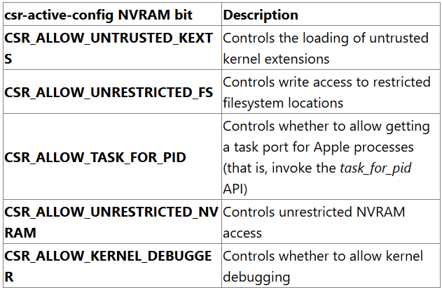

[macOS 中四类 TCC BYPASS 绕过案例分析 | 天工实验室](https://tiangonglab.github.io/blog/tiangongarticle034/)

# 1

[Microsoft finds new macOS vulnerability, Shrootless, that could bypass System Integrity Protection | Microsoft Security Blog](https://www.microsoft.com/en-us/security/blog/2021/10/28/microsoft-finds-new-macos-vulnerability-shrootless-that-could-bypass-system-integrity-protection/)

## SIP

### 简介

[System Integrity Protection](https://developer.apple.com/documentation/security/disabling_and_enabling_system_integrity_protection)

由两个NVRAM中的变量配置，该选项只能在引导或恢复模式中修改

* csr-active-config

* csr-data

此外还有一些配置可以在源码中找到[XNU source code](https://opensource.apple.com/source/xnu/xnu-4570.71.2/bsd/sys/csr.h)

其中若关闭一些设置，可能会导致程序可以直接绕过SIP机制

### 文件系统保护

SIP可以保护特定的文件，保护的文件列表可以在`/System/Library/Sandbox/rootless.conf`中设置。包含`com.apple.rootless`扩展属性的文件同样受到SIP保护

SIP文件保护不能由程序直接指定，否则攻击者同样可以利用SIP机制保护恶意文件

`/System`下的很多子目录都有SIP保护

### Rootless权限

SIP文件保护可能存在一些特殊情况需要绕过SIP机制，比如系统更新。因此引入了Rootless权限来绕过SIP检查，这些权限只能由苹果官方分配给指定进程

本文关注两个Rootless权限：

* com.apple.rootless.install  完全绕过SIP检查

* com.apple.rootless.install.heritable  将com.apple.rootless.install权限继承给子进程

## 历史绕过手法

### 滥用动态库

以前特权程序可以任意加载动态库，因此可以通过让特权程序加载一个恶意的dylib实现SIP绕过

[Objective-See](https://objective-see.org/blog/blog_0x14.html)

### 挂载

