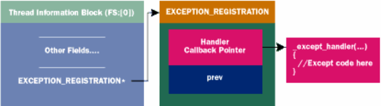
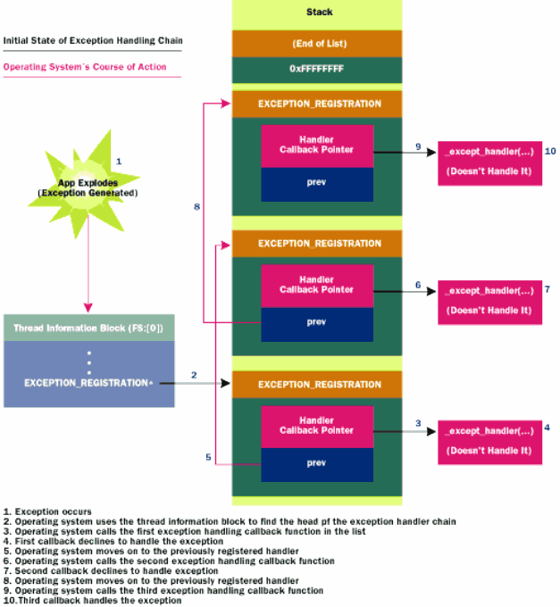
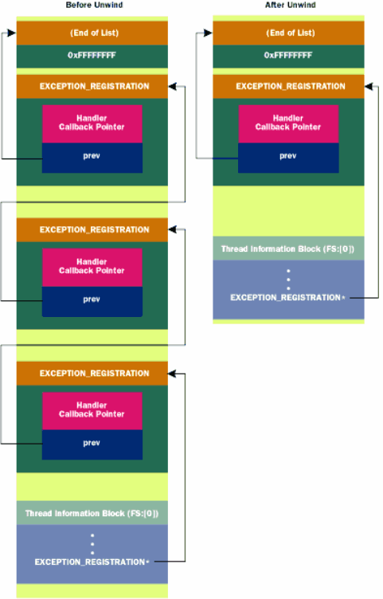

https://www.cnblogs.com/awpatp/archive/2010/06/15/1758763.html

### 结构体和函数定义

#### 函数

##### _except_handler

```c
EXCEPTION_DISPOSITION
__cdecl _except_handler(
    struct _EXCEPTION_RECORD *ExceptionRecord,
    void * EstablisherFrame,
    struct _CONTEXT *ContextRecord,
    void * DispatcherContext
    );
```

##### _EXCEPTION_RECORD

```c
typedef struct _EXCEPTION_RECORD 
{
   DWORD ExceptionCode;				// 异常号
   DWORD ExceptionFlags;
   struct _EXCEPTION_RECORD *ExceptionRecord;
   PVOID ExceptionAddress;			// 异常发生地址
   DWORD NumberParameters;
   DWORD ExceptionInformation[EXCEPTION_MAXIMUM_PARAMETERS];
}  EXCEPTION_RECORD;
```

##### _CONTEXT

```c
 typedef struct _CONTEXT
 {
     DWORD ContextFlags;
     DWORD   Dr0;
     DWORD   Dr1;
     DWORD   Dr2;
     DWORD   Dr3;
     DWORD   Dr6;
     DWORD   Dr7;
     FLOATING_SAVE_AREA FloatSave;
     DWORD   SegGs;
     DWORD   SegFs;
     DWORD   SegEs;
     DWORD   SegDs;
     DWORD   Edi;
     DWORD   Esi;
     DWORD   Ebx;
     DWORD   Edx;
     DWORD   Ecx;
     DWORD   Eax;
     DWORD   Ebp;
     DWORD   Eip;
     DWORD   SegCs;
     DWORD   EFlags;
     DWORD   Esp;
     DWORD   SegSs;
 } CONTEXT;
```

##### _EXCEPTION_REGISTRATION

```asm
_EXCEPTION_REGISTRATION struct
     prev    dd      ?
     handler dd      ?
 _EXCEPTION_REGISTRATION ends
```

### 工作机制

**Win32中**每个线程都有自己的exception handler链，其头指针保存在线程信息块（TIB/TEB）的第一个成员上，而fs寄存器始终指向TIB。所以handler链的头指针在`FS:[0]`



#### 简单例子

```c
#define WIN32_LEAN_AND_MEAN
#include <windows.h>
#include <stdio.h>

DWORD  scratch;

EXCEPTION_DISPOSITION
__cdecl
_except_handler(
    struct _EXCEPTION_RECORD *ExceptionRecord,
    void * EstablisherFrame,
    struct _CONTEXT *ContextRecord,
    void * DispatcherContext )
{
    unsigned i;

    // Indicate that we made it to our exception handler
    printf( "Hello from an exception handler\n" );

    // Change EAX in the context record so that it points to someplace
    // where we can successfully write
    ContextRecord->Eax = (DWORD)&scratch;

    // Tell the OS to restart the faulting instruction
    return ExceptionContinueExecution;
}

int main()
{
    DWORD handler = (DWORD)_except_handler;

    __asm
    {                           // Build EXCEPTION_REGISTRATION record:
        push    handler         // Address of handler function
        push    FS:[0]          // Address of previous handler
        mov     FS:[0],ESP      // Install new EXECEPTION_REGISTRATION
    }

    __asm
    {
        mov     eax,0           // Zero out EAX
        mov     [eax], 1        // Write to EAX to deliberately cause a fault
    }

    printf( "After writing!\n" );

    __asm
    {                           // Remove our EXECEPTION_REGISTRATION record
        mov     eax,[ESP]       // Get pointer to previous record
        mov     FS:[0], EAX     // Install previous record
        add     esp, 8          // Clean our EXECEPTION_REGISTRATION off stack
    }
    return 0;
}
```

* SEH安装
  * `push handler  push FS:[0]`  在栈上构造了一个`_EXCEPTION_REGISTRATION`结构
  * `mov FS:[0], ESP`  将链表头指针更新为当前节点
* SEH触发
  * 这里赋值给0地址触发异常
* SEH执行内容
  * 将eax赋值为可访问地址&scratch
  * 返回值为ExceptionContinueExecution，表示继续执行代码
* SEH退出
  * `mov eax, [ESP]  mov FS:[0], eax`  将构造的`_EXCEPTION_REGISTRATION`结构的prev赋值回`FS:[0]`
  * `add esp, 8`  销毁`_EXCEPTION_REGISTRATION`

#### SEH链

实际SEH是被设置成一个链表的，操作系统根据每个handler的返回值判断该handler是否处理了异常。若没有处理则会调用链上的下一个handler



##### 另一个例子

```c
#define WIN32_LEAN_AND_MEAN
 #include <windows.h>
 #include <stdio.h>
 
 EXCEPTION_DISPOSITION
 __cdecl
 _except_handler(
     struct _EXCEPTION_RECORD *ExceptionRecord,
     void * EstablisherFrame,
     struct _CONTEXT *ContextRecord,
     void * DispatcherContext )
 {
     printf( "Home Grown handler: Exception Code: %08X Exception Flags %X",
              ExceptionRecord->ExceptionCode, ExceptionRecord->ExceptionFlags );
 
     if ( ExceptionRecord->ExceptionFlags & 1 )
         printf( " EH_NONCONTINUABLE" );
     if ( ExceptionRecord->ExceptionFlags & 2 )
         printf( " EH_UNWINDING" );
     if ( ExceptionRecord->ExceptionFlags & 4 )
         printf( " EH_EXIT_UNWIND" );
     if ( ExceptionRecord->ExceptionFlags & 8 )
         printf( " EH_STACK_INVALID" );
     if ( ExceptionRecord->ExceptionFlags & 0x10 )
         printf( " EH_NESTED_CALL" );
 
     printf( "\n" );
 
     // Punt... We don't want to handle this... Let somebody else handle it
     return ExceptionContinueSearch;
 }
 
 void HomeGrownFrame( void )
 {
     DWORD handler = (DWORD)_except_handler;
 
     __asm
     {                           // Build EXCEPTION_REGISTRATION record:
         push    handler         // Address of handler function
         push    FS:[0]          // Address of previous handler
         mov     FS:[0],ESP      // Install new EXECEPTION_REGISTRATION
     }
 
     *(PDWORD)0 = 0;             // Write to address 0 to cause a fault
 
     printf( "I should never get here!\n" );
 
     __asm
     {                           // Remove our EXECEPTION_REGISTRATION record
         mov     eax,[ESP]       // Get pointer to previous record
         mov     FS:[0], EAX     // Install previous record
         add     esp, 8          // Clean our EXECEPTION_REGISTRATION off stack
     }
 }
 
 int main()
 {
     _try
     {
         HomeGrownFrame(); 
     }
     _except( EXCEPTION_EXECUTE_HANDLER )
     {
         printf( "Caught the exception in main()\n" );
     }
 
     return 0;
}
```

这里在HomeGrownFrame中同样安装了一个SEH，给0地址赋值产生异常。差别就是SEH执行完后返回ExceptionContinueSearch，这会使操作系统继续搜索下一个SEH执行

运行结果如下

```
Home Grown handler: Exception Code: C0000005 Exception Flags 0
Home Grown handler: Exception Code: C0000027 Exception Flags 2
                                             EH_UNWINDING
Caught the Exception in main()
```

##### unwinding

当系统找到一个可以处理异常的handler时，会首先执行一遍handler。此后系统会**第二次遍历链表**直到刚刚处理异常的handler，并且**将ExceptionFlags置为2（EH_UNWINDING）**。这是为了让所有可能被该exception影响到的执行析构函数和finally块（所以在设计handler时，EH_UNWINDING对应的处理内容应该是调用析构或执行finally块代码），因为在代码抛出exception的情况下，通常情况下函数无法正常退出，而像C++的局部类的析构函数大多是在函数结尾被调用的。

在handler中，若需要指定接下来的运行地址，应考虑到设置ebp和esp的问题（比如如果在handler中希望跳到某函数的中间执行）



SEH unwinding之后，所有unwinding的SEH都从链表上被移除

##### exception中的错误

文章里没细讲，就是提到了如果用户代码写的handler也引发了异常的情况是可能出现的，因此提供了**ExceptionNestedException**和**ExceptionCollidedUnwind**两个返回值

#### 默认handler

下面这段代码显示，在系统创建进程并且调用主函数时，整个调用过程都是写在try块中的，因此即使程序没有安装任何SEH，最终BaseProcessStart的SEH也可以捕获到异常

```c
BaseProcessStart( PVOID lpfnEntryPoint )
{
    DWORD retValue
    DWORD currentESP;
    DWORD exceptionCode;

    currentESP = ESP;

    _try
    {
        NtSetInformationThread( GetCurrentThread(),
                                ThreadQuerySetWin32StartAddress,
                                &lpfnEntryPoint, sizeof(lpfnEntryPoint) );

        retValue = lpfnEntryPoint();

        ExitThread( retValue );
    }
    _except(// filter-expression code
            exceptionCode = GetExceptionInformation(),
            UnhandledExceptionFilter( GetExceptionInformation() ) )
    {
        ESP = currentESP;

        if ( !_BaseRunningInServerProcess )         // Regular process
            ExitProcess( exceptionCode );
        else                                        // Service
            ExitThread( exceptionCode );
    }
}
```

若UnhandledExceptionFilter返回了EXCEPTION_EXECUTE_HANDLER，则会调用except的内容，其中对当前运行的进程进行判断，若是一个服务进程，则终止当前线程，若是一个普通进程则终止进程