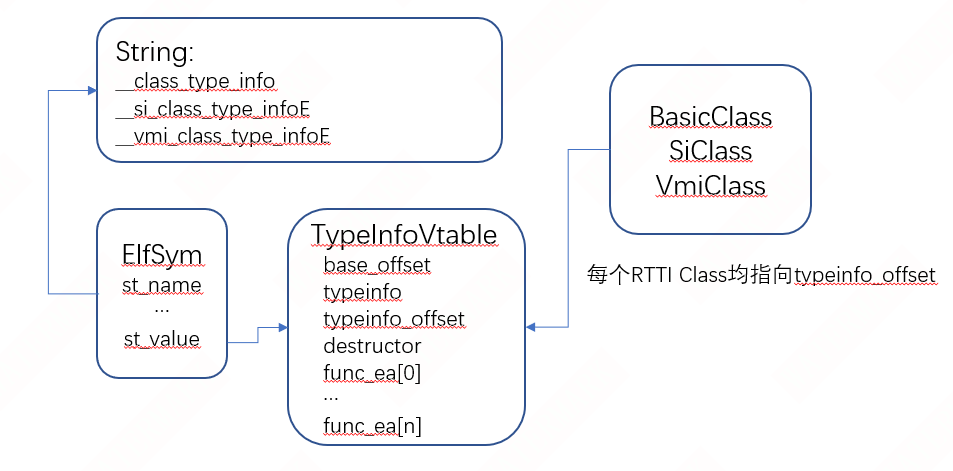

主要有三个开源插件用于解析

https://github.com/MlsDmitry/better-rtti-parser

https://github.com/medigateio/ida_medigate

https://github.com/nccgroup/SusanRTTI

## RTTI表结构

### gcc



## rtfsc

### better-rtti-parser

支持gcc，支持重命名

#### 源码解析

##### rtti_parser_core/common.py

主要是一些utils，比如在文件中搜索16进制pattern，生成函数/类的名字等

##### rtti_parser_core/binary_stream.py

读取byte word dword等的包装类，包装为流式读取

##### rtti_parser_core/elf.py

用于解析elf的符号表。符号表格式（[ELF_Format.pdf (yale.edu)](https://flint.cs.yale.edu/cs422/doc/ELF_Format.pdf)）为

```c
struct Elf32_Sym {
  Elf32_Word st_name;     // Symbol name (index into string table)
  Elf32_Addr st_value;    // Value or address associated with the symbol
  Elf32_Word st_size;     // Size of the symbol
  unsigned char st_info;  // Symbol's type and binding attributes
  unsigned char st_other; // Must be zero; reserved
  Elf32_Half st_shndx;    // Which section (header table index) it's defined in
};

struct Elf64_Sym {
  Elf64_Word st_name;     // Symbol name (index into string table)
  unsigned char st_info;  // Symbol's type and binding attributes
  unsigned char st_other; // Must be zero; reserved
  Elf64_Half st_shndx;    // Which section (header tbl index) it's defined in
  Elf64_Addr st_value;    // Value or address associated with the symbol
  Elf64_Xword st_size;    // Size of the symbol
};
```

##### rtti_parser_core/vtable.py

声明了用于维护vtable的类

##### rtti_parser_core/rtti.py

定义了基类BasicClass（无继承），以及SiClass（Single-inherited Class）和VmiClass（Multi-inherited Class），用于维护RTTI对应的类的属性

##### rtti_parser.py

解析RTTI的主逻辑

* 大循环中会遍历字符串，gcc的RTTI信息会包含这些字符串来标识类的继承情况
  
  * __class_type_info  类，无继承关系
  
  * __si_class_type_infoE  单继承的类
  
  * __vmi_class_type_infoE  多继承的类

* 若找到上述字符串，则获取第一个引用字符串所在地址的地方（假设为addr），并认为这是一个符号表项

* 以符号表项结构（ElfSym）解析addr

* 符号表项的st_value指向这一系列类的信息表（TypeInfoVtable），读取该表

### SusanRTTI

### ida_medigate

#### cpp_plugin

主要定义了一系列IDA界面动作的回调（CPPHooks CPPUIHooks），hexray的回调（HexRaysHooks）以及一个可以处理hexray ctree结构的类（Polymorphism_fixer_visitor_t）

## ref

* [C++基础之运行时类型识别RTTI - 箐茗 - 博客园 (cnblogs.com)](https://www.cnblogs.com/MinPage/p/14638823.html)

* [spockwangs.github.com/_posts/2011-01-31-cpp-object-model.md at master · spockwangs/spockwangs.github.com](https://github.com/spockwangs/spockwangs.github.com/blob/master/_posts/2011-01-31-cpp-object-model.md)
