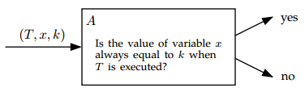
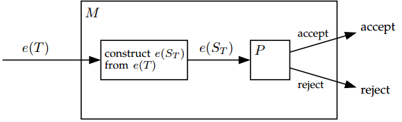
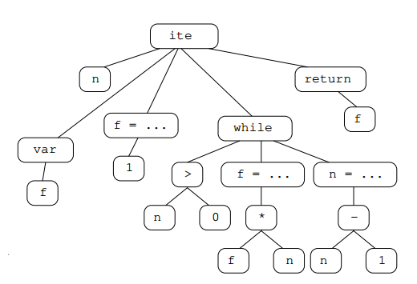
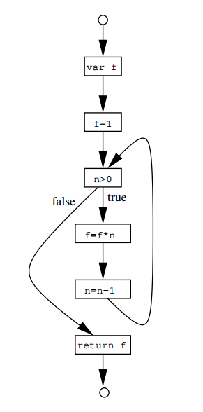

## 参考文档

[静态程序分析_消逝者的博客-CSDN博客](https://blog.csdn.net/little_ant_/category_11203462.html)  一个专栏，总结得挺好的

## 第一章 介绍

### 近似的答案

程序静态分析需要面临的一个理论问题：

```
因为一个程序静态分析器的作用是，输入一个程序，确定它是否有一些特定的属性。
但Rice Theorem告诉我们，对于任何用图灵完备语言写成的程序，关于程序的输入和输出的行为是不确定的。

试想一个实验：
  一个分析器A，它接受输入程序T、T的一个变量x和一些值k，A需要判断当T以x为变量运行时，x的值是否总是等于一个常数k
  若A可以满足上述的条件，那么可以构造如下的T'
    x = 17; if (TM()) x = 18;
  其中TM是一个输入为空的图灵机。
  因此，若A可以满足上述条件，那么就说明它可以判断T'中的x最终输出是17还是18。而x的值只有在TM可以停机时才会变成18。

也就是说，上述的问题被归纳为了图灵机的停机问题。而图灵机的停机问题明显是一个不可解的问题，因此从理论上来说并不存在符合上述条件的分析器A
```



上述理论告诉我们，一个能确定程序所有行为的静态分析器是不存在的。但对于实际生活中的程序，我们依然可以通过静态分析给出很多有用的近似结果。这被称为full employment theorem for static program analysis designers

### 程序正确性的不可判定性

首先说明一个重要结论：使用程序静态分析技术无法判定一个程序是否会执行失败

为了说明问题，这里将程序建模为一个确定的图灵机（deterministic Turing machines），其中包含三个状态：

* 接受状态 *yes*
* 拒绝状态 *no*
* 程序执行失败状态 *fail*

若图灵机的fail状态是不可达的，则称该图灵机正确（*correct*）

下面证明上面的那个结论

* 首先构造图灵机M

```
假设P是一个可以判定完全图灵机（total Turing Machine）是否正确的程序（因为这里不关注停机问题，因此要求是一个完全图灵机）。
称P到达接受状态（accept），当且仅当输入的图灵机是correct的
否则称P到达拒绝状态（reject）

若存在上述P，则说明一个程序是否会执行失败是可判定的。因此下面证明不存在这样的图灵机：

若存在P，则我们可以构造另一个图灵机M，它以一个图灵机T的编码e(T)作为输入，并以此构造另一个图灵机ST的编码e(ST)，其中构造的规则如下：ST是一个通用图灵机（universal Turing Machine），设w是ST的输入，则它接受图灵机的编码e(T)，模拟T的运行，运行步数最大为|w|步。
ST的运行规则如下：若该模拟T的图灵机在T的接受状态停下，则ST到达fail状态；若模拟没有在T的接受状态停下（即ST模拟了|w|步还未到达某个状态，或是到达了T的拒绝状态或fail状态），则ST到达接受或拒绝状态（两个都行）。此外需要注意，ST是一个总是停机的图灵机，它最多只模拟T的|w|步。
在构造完e(ST)后，有一个假想的程序分析器P。P的运行规则如下：若ST是correct的，则P输出accept，并使得整个图灵机M到达accept状态；其他情况下，P输出reject，并使得M到达reject状态。
```



* 下面进行证明

```
考虑一个问题：当M接受输入e(M)时，会到达accept状态么？
* 假设M接受e(M)，则P接受e(SM)，即SM是correct的，则无论输入w是什么，SM都不会到达fail状态。所以模拟M的图灵机SM没有在M的接受状态停下，而这可以推出M不接受输入e(M)，与假设矛盾。
* 假设M拒绝e(M)，则P拒绝e(SM)，说明存在输入w，使得SM到达fail状态。这说明模拟M的图灵机SM此时接受输入e(M)，与假设矛盾。
```

* 通过上面构造，M理应只能到达accept或reject两种状态，但对于输入e(M)，两种状态都不可能，因此可以推断出图灵机M不存在，因此程序分析器P不存在

##### 一些解释

* deterministic Turing machines  对于一个确定的源状态和输入，只对应了一个目的状态
* total Turing Machine  最终一定会到达停机状态的图灵机

## 第二章 一种微型命令式语言

这章定义了一种命令式语言TIP（Tiny Imperative Programming Language），其中具有大多数编程语言的主要特性，用于解释下面几章关于程序分析的概念

### TIP的语法

#### 基本表达式

```
Int -> 0 | 1 | -1 | 2 | -2 ...
Id  -> x | y | z ...
Exp -> Int
     | Id
     | Exp+Exp | Exp-Exp | Exp*Exp | Exp/Exp | Exp>Exp | Exp==Exp | (Exp)
     | Input
```

#### 语句

```
Stm  -> Id = Exp;
      | output Exp;
      | Stm Stm
      |
      | if (Exp) { Stm } [else { Stm }]
      | while (Exp) { Stm }
```

#### 函数

```
声明：
Fun  -> Id (Id, ... , Id) { [var Id, ... , Id;] Stm return Exp; }

调用：
Exp  -> ... | Id(Exp , ... , Exp)
```

#### 函数指针（原文是Functions as Values）

为了支持这个特性，加入下面这条文法

```
Exp  -> ... | Exp(Exp, ... , Exp)
```

这条特性使得我们可以分析面向对象型语言中的方法，或是函数型语言中的高阶函数

#### 指针

加入下面文法以支持内存分配、引用、解引用和赋值空指针

```
Exp  -> ...
      | alloc Exp
      | & Id
      | * Exp
      | null
```

加入下面文法以解引用指针变量并赋值

```
Stm  -> ... | *Exp=Exp;
```

#### 字典类型（原文为records）

用于存放键值对的类型

```
Exp  -> ...
      | {Id:Exp, ... , Id:Exp}
      | Exp.Id
```

```
Stm  -> ...
      | Id.Id = Exp;
      | (*Exp).Id = Exp;
```

TIP的records类型是按值传递的，因此赋值的行为是直接复制。此外，records的值不能是records类型，但可以是records指针

#### 程序

文法中的程序即函数的集合

```
Prog  -> Fun ... Fun
```

程序总是以main为入口点，main的参数以序列的形式放在输入流的开头，返回值则附加在输出流尾

### 正规化

一般来说，编程语言为了程序的灵活性会提供丰富的语法特性，但对于程序静态分析而言，语法结构简单的语言分析起来更为方便。因此一般会对语言先进行正规化

```
如
x = f(y+3)*5

可以被规范化为
t1 = y+3
t2 = f(t1)
x = t2*5
```

### 抽象语法树

```
iterate(n) {
  var f;
  f = 1;
  while(n>0) {
    f = f * n;
    n = n - 1;
  }
  return f;
}
```



### 控制流图

跟普通的定义一样，上述程序的CFG如下



## 第三章 类型分析

虽然TIP没有显式的类型定义，但对TIP来说，下列规则是合理的

* 算术操作和比较操作只对integer有效
* 控制语句的条件必须是integer
* main函数的输入输出只能是integer
* 解引用运算符只能对指针类型使用（包括null）
* 字段访问运算符只能对record类型使用，且需要保证访问的字段存在于record中

由第一章的讨论可知，程序分析无法获知运行时上述规则是否会被违反。

因此我们采取一个近似的概念：typability。当一个程序满足一系列系统衍生的类型约束，我们称其是typable的。在进行类型分析时，构造的类型约束将保证程序在运行中也可以满足约束的要求；但反之不然，即无法对所有实际运行中可以满足约束要求的语句都构造类型约束。这也是因为上面讨论的“程序分析无法准确获知运行时约束是否会被违反”，因此构造类型约束时会采用保守的方式。

很多语言存在type annotation语法来声明变量的类型，这有助于程序分析。但TIP没有，因此只能通过程序行为来推断类型

本章提及的类型分析技术是Damas-Hindley-Milner技术的一个变型，这种技术是很多编程语言的类型系统的基础，如ML/OCaml/Haskell。

此外，TIP语言中的局部变量初值是未定义的，但在下面讨论的类型分析算法中，我们假设所有的变量在使用前都会被初始化。即该算法只有在程序从未读取一个未初始化变量时才是完备的。

### 类型

下面定义types的描述

```
Type -> int     描述一个整数
      | ↑Type   描述一个指针
      | (Type, ... , Type) -> Type  描述一个函数
```

如第二章抽象语法树中的例子iterate函数，可以表示为`(int) -> int`

下面扩展一个语法来增加对于递归函数的支持，例子如下列foo函数

```
foo(p, x)
{
  var f, q;
  if(*p == 0)
  {
    f = 1;
  }
  else
  {
    q = alloc 0;
    *q = (*p)-1;
    f = (*p) * ( x(q, x) );
  }
  return f;
}
```

注意这里的q是一个指针，x是一个函数指针，所以写成上述表达式可能是

```
(↑int, (↑int, (↑int, (↑int, ...) -> int) -> int) -> int) -> int
```

为了简洁地表示，增加下列语法

```
Type -> ...
      | μ TypeVar . Type
      | TypeVar

TypeVar -> t | u | ...
```

其中，先介绍一种记法：假设 $\tau \in Type, \alpha \in TypeVar$ ， µα.τ表示一个TypeVar α 与一个Type子项 τ 的绑定。若 α 在项 τ 中不受闭包 µα 的约束，则称项 α 是自由（free）的。而 $\tau_1 [\tau_2 / a]$ 表示返回一个将 $\tau_1中所有free的\alpha全部替换为\tau_2$ 的函数拷贝

则定义 µα.τ 这一记法与 $\tau[\mu \alpha.\tau / \alpha]$ 是相同的。

因此上面的foo的类型可以表示为 $\mu t.(\uparrow int, t) \rightarrow int$ 

此外，这里的类型分析是允许
