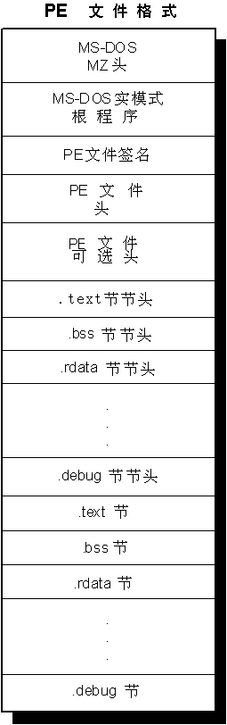

#PE文件格式

##概览





##1.MS-DOS头
**头文件**
	WINNT.H

	typedef struct _IMAGE_DOS_HEADER	  // DOS下的.EXE文件头
	 {
		USHORT e_magic;         // 魔数						+00
	    USHORT e_cblp;          // 文件最后一页的字节数				+02
	    USHORT e_cp;            // 文件的页数					+04
	    USHORT e_crlc;          // 重定位						+06
	    USHORT e_cparhdr;       // 段中头的大小					+08
	    USHORT e_minalloc;      // 需要的最少额外段					+0A
	    USHORT e_maxalloc;      // 需要的最多额外段					+0C
	    USHORT e_ss;            // 初始的(相对的)SS寄存器值				+0E
	     USHORT e_sp;            // 初始的SP寄存器值				+10
	     USHORT e_csum;          // 校验和						+12
	     USHORT e_ip;            // 初始的IP寄存器值				+14
	     USHORT e_cs;            // 初始的(相对的)CS寄存器值			+16
	     USHORT e_lfarlc;        // 重定位表在文件中的地址				+18
	     USHORT e_ovno;          // 交叠数						+1A
	     USHORT e_res[4];        // 保留字						+1C
	     USHORT e_oemid;         // OEM识别符(用于e_oeminfo成员)			+24
	     USHORT e_oeminfo;       // OEM信息; e_oemid中指定的			+26
	     USHORT e_res2[10];      // 保留字						+28
	     LONG   e_lfanew;        // 新exe头在文件中的地址				+3C
	} IMAGE_DOS_HEADER, *PIMAGE_DOS_HEADER;


###重点字段
	e_magic		#define IMAGE_DOS_SIGNATURE 0x5A4D	//'M' 'Z'	+00
	e_lfanew	//PE头偏移量	+3C
##2.PE文件头
**头文件**
WINNT.H

###PE头位置

	PNTHeader = ImageBase + dosHeader->e_lfanew

###文件头

由三个部分组成

* 签名 IMAGE_NT_SIGNATURE 内容是PE00
* IMAGE_FILE_HEADER  文件头
* IMAGE_OPTIONAL_HEADER  可选文件头，对于PE32和PE32+有不同的文件头

	typedef struct _IMAGE_NT_HEADERS {
		DWORD Signature;				//+00
		IMAGE_FILE_HEADER FileHeader;			//+04
		IMAGE_OPTIONAL_HEADER32 OptionalHeader;		//+18
	}IMAGE_NT_HEADERS;

####Signature
	#define IMAGE_DOS_SIGNATURE             0x5A4D      // MZ	DOS
	#define IMAGE_OS2_SIGNATURE             0x454E      // NE	OS/2
	#define IMAGE_OS2_SIGNATURE_LE          0x454C      // LE	OS/2 LE
	#define IMAGE_NT_SIGNATURE              0x00004550  // PE00	WINNT

####IMAGE_FILE_HEADER

	typedef struct _IMAGE_FILE_HEADER {
	     USHORT  Machine;                 //机器			+00
	     USHORT  NumberOfSections;        //节数			+02
	     ULONG   TimeDateStamp;           //时间日期戳		+04
	     ULONG   PointerToSymbolTable;    //指向COFF符号表的指针	+08
	     ULONG   NumberOfSymbols;         //符号表中符号数		+0C
	     USHORT  SizeOfOptionalHeader;    //可选头的大小		+10
	     USHORT  Characteristics;         //特性			+12
	} IMAGE_FILE_HEADER, *PIMAGE_FILE_HEADER;

####IMAGE_OPTIONAL_HEADER


##3.PE可选头

### IMAGE_OPTIONAL_HEADER32

```c
typedef struct _IMAGE_OPTIONAL_HEADER {
    //
    // Standard fields.
    //
    WORD    Magic;							//魔数			+00
    BYTE    MajorLinkerVersion;				//链接器主版本号	+02
    BYTE    MinorLinkerVersion;				//链接器小版本号	+03
    DWORD   SizeOfCode;						//代码大小		+04
    DWORD   SizeOfInitializedData;			//已初始化数据大小	+08
    DWORD   SizeOfUninitializedData;		//未初始化数据大小 	+0C
    DWORD   AddressOfEntryPoint;			//入口点地址		+10
    DWORD   BaseOfCode;						//代码基址		+14
    DWORD   BaseOfData;						//数据基址		+18
    //
    // NT additional fields.
    //
    DWORD   ImageBase;						//映像文件基址	+1C
    DWORD   SectionAlignment;				//节对齐		+20
    DWORD   FileAlignment;					//文件对齐		+24
    WORD    MajorOperatingSystemVersion;	//操作系统主版本号	+28
    WORD    MinorOperatingSystemVersion;	//操作系统小版本号	+2A
    WORD    MajorImageVersion;				//映像文件主版本号	+2C
    WORD    MinorImageVersion;				//映像文件小版本号	+2E
    WORD    MajorSubsystemVersion;			//子系统主版本号	+30
    WORD    MinorSubsystemVersion;			//子系统小版本号	+32
    DWORD   Win32VersionValue;				//保留项1，通常为0	+34
    DWORD   SizeOfImage;					//映像文件大小	+38
    DWORD   SizeOfHeaders;					//所有头的大小	+3C
    DWORD   CheckSum;						//校验和		+40
    WORD    Subsystem;						//子系统		+44
    WORD    DllCharacteristics;				//DLL特性		+46
    DWORD   SizeOfStackReserve;				//保留栈的大小	+48
    DWORD   SizeOfStackCommit;				//指定栈的大小	+4C
    DWORD   SizeOfHeapReserve;				//保留堆的大小	+50
    DWORD   SizeOfHeapCommit;				//指定堆的大小	+54
    DWORD   LoaderFlags;					//加载器标志	+58
    DWORD   NumberOfRvaAndSizes;			//RVA的数量和大小	+5C
    IMAGE_DATA_DIRECTORY DataDirectory[IMAGE_NUMBEROF_DIRECTORY_ENTRIES];	//数据目录数组  +60
} IMAGE_OPTIONAL_HEADER32, *PIMAGE_OPTIONAL_HEADER32;
```

### IMAGE_OPTIONAL_HEADER64

```c
typedef struct _IMAGE_OPTIONAL_HEADER64 {
    WORD    Magic;							//魔数			+00
    BYTE    MajorLinkerVersion;				//链接器主版本号	+02
    BYTE    MinorLinkerVersion;				//链接器小版本号	+03
    DWORD   SizeOfCode;						//代码大小		+04
    DWORD   SizeOfInitializedData;			//已初始化数据大小	+08
    DWORD   SizeOfUninitializedData;		//未初始化数据大小 	+0C
    DWORD   AddressOfEntryPoint;			//入口点地址		+10
    DWORD   BaseOfCode;						//代码基址		+14
    ULONGLONG   ImageBase;					//映像文件基址	+18
    DWORD   SectionAlignment;				//节对齐		+20
    DWORD   FileAlignment;					//文件对齐		+24
    WORD    MajorOperatingSystemVersion;	//操作系统主版本号	+28
    WORD    MinorOperatingSystemVersion;	//操作系统小版本号	+2A
    WORD    MajorImageVersion;				//映像文件主版本号	+2C
    WORD    MinorImageVersion;				//映像文件小版本号	+2E
    WORD    MajorSubsystemVersion;			//子系统主版本号	+30
    WORD    MinorSubsystemVersion;			//子系统小版本号	+32
    DWORD   Win32VersionValue;				//保留项1，通常为0	+34
    DWORD   SizeOfImage;					//映像文件大小	+38
    DWORD   SizeOfHeaders;					//所有头的大小	+3C
    DWORD   CheckSum;						//校验和		+40
    WORD    Subsystem;						//子系统		+44
    WORD    DllCharacteristics;				//DLL特性		+46
    ULONGLONG   SizeOfStackReserve;			//保留栈的大小	+48
    ULONGLONG   SizeOfStackCommit;			//指定栈的大小	+50
    ULONGLONG   SizeOfHeapReserve;			//保留堆的大小	+58
    ULONGLONG   SizeOfHeapCommit;			//指定堆的大小	+60
    DWORD   LoaderFlags;					//加载器标志	+68
    DWORD   NumberOfRvaAndSizes;			//RVA的数量和大小	+6C
    IMAGE_DATA_DIRECTORY DataDirectory[IMAGE_NUMBEROF_DIRECTORY_ENTRIES];	//数据目录数组  +70
} IMAGE_OPTIONAL_HEADER64, *PIMAGE_OPTIONAL_HEADER64;
```


##数据目录
```c
// 各个目录项
// 输出目录
#define IMAGE_DIRECTORY_ENTRY_EXPORT         0
// 输入目录
#define IMAGE_DIRECTORY_ENTRY_IMPORT         1
// 资源目录
#define IMAGE_DIRECTORY_ENTRY_RESOURCE       2
// 异常目录
#define IMAGE_DIRECTORY_ENTRY_EXCEPTION      3
// 安全目录
#define IMAGE_DIRECTORY_ENTRY_SECURITY       4
// 基址重定位表
#define IMAGE_DIRECTORY_ENTRY_BASERELOC      5
// 调试目录
#define IMAGE_DIRECTORY_ENTRY_DEBUG          6
// 描述字符串
#define IMAGE_DIRECTORY_ENTRY_COPYRIGHT      7
// 机器值(MIPS GP)
#define IMAGE_DIRECTORY_ENTRY_GLOBALPTR      8
// TLS（线程本地存储）⑥目录
#define IMAGE_DIRECTORY_ENTRY_TLS            9
// 载入配置目录
#define IMAGE_DIRECTORY_ENTRY_LOAD_CONFIG    10
// Bound Import
#define IMAGE_DIRECTORY_ENTRY_BOUND_IMPORT   11
// IAT表
#define IMAGE_DIRECTORY_ENTRY_IAT            12
// Delay Import
#define IMAGE_DIRECTORY_ENTRY_DELAY_IMPORT   13
// COM描述符
#define IMAGE_DIRECTORY_ENTRY_COM_DESCRIPTOR 14
// 第15项为保留项，必须为0
```

## 4. Section Table

### 区块表

```c
typedef struct _IMAGE_SECTION_HEADER {
    BYTE    Name[IMAGE_SIZEOF_SHORT_NAME];		// 块名
    union {									 // 区块尺寸
            DWORD   PhysicalAddress;
            DWORD   VirtualSize;
    } Misc;
    DWORD   VirtualAddress;						// 区块RVA地址
    DWORD   SizeOfRawData;						// 在文件对齐后尺寸
    DWORD   PointerToRawData;					// 在文件中的偏移
    DWORD   PointerToRelocations;				// 在OBJ文件中使用，重定位的偏移
    DWORD   PointerToLinenumbers;				// 行号表的偏移
    WORD    NumberOfRelocations;				// 在OBJ文件中使用，重定位项数目
    WORD    NumberOfLinenumbers;				// 行号表中行号的数目
    DWORD   Characteristics;					// 区块属性
} IMAGE_SECTION_HEADER, *PIMAGE_SECTION_HEADER;
```

### 常见区块

| 区块名   | 描述                                     |
| -------- | ---------------------------------------- |
| .text    | 代码段                                   |
| .data    | 数据段                                   |
| .rdata   | 只读数据段                               |
| .idata   | 导入表                                   |
| .edata   | 导出表                                   |
| .rsrc    | 资源段                                   |
| .bss     | 未初始化数据段                           |
| .crt     | C++运行时数据                            |
| .tls     | TLS数据段                                |
| .reloc   | 可执行文件的基址重定位                   |
| .sdata   | 相对于全局指针的可被定位的“短的”读写数据 |
| .srdata  | 相对于全局指针的可被定位的“短的”只读数据 |
| .pdata   | 异常表                                   |
| .debug$S | OBJ文件中Codeview格式的符号              |
| .debug$T | OBJ文件中Codeview格式的类型记录          |
| .debug$P | OBJ文件使用预编译头时用到的段            |
| .drectve | OBJ文件中包含链接器命令的段              |
| .didat   | 延迟载入的输入数据                       |

## 5.输入表

