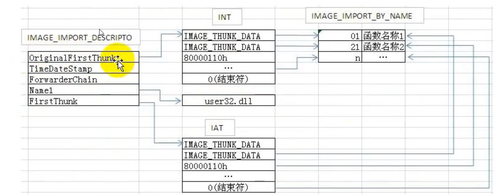

### Optional Header

区分PE32和PE64的方法就是使用Optional header的第一个字段Magic，若为0x10b则表示PE32，若为0x20b则表示PE64

### Import Table

导入表的结构如下



每个IMAGE_IMPORT_DESCRIPTOR记录了一个dll的导入信息，该结构32 64通用

```c
typedef struct _IMAGE_IMPORT_DESCRIPTOR {
    union {
        DWORD   Characteristics;            // 0 for terminating null import descriptor
        DWORD   OriginalFirstThunk;         // RVA to original unbound IAT (PIMAGE_THUNK_DATA)
    } DUMMYUNIONNAME;
    DWORD   TimeDateStamp;                  // 0 if not bound,
                                            // -1 if bound, and real date\time stamp
                                            //     in IMAGE_DIRECTORY_ENTRY_BOUND_IMPORT (new BIND)
                                            // O.W. date/time stamp of DLL bound to (Old BIND)

    DWORD   ForwarderChain;                 // -1 if no forwarders
    DWORD   Name;
    DWORD   FirstThunk;                     // RVA to IAT (if bound this IAT has actual addresses)
} IMAGE_IMPORT_DESCRIPTOR;
```

IMAGE_THUNK_DATA则记录了每个导入项的信息，该结构与架构相关

32位：

```c
typedef struct _IMAGE_THUNK_DATA32 {
    union {
        DWORD ForwarderString;      // PBYTE 
        DWORD Function;             // PDWORD
        DWORD Ordinal;
        DWORD AddressOfData;        // PIMAGE_IMPORT_BY_NAME
    } u1;
} IMAGE_THUNK_DATA32;
typedef IMAGE_THUNK_DATA32 * PIMAGE_THUNK_DATA32;
```

64位

```c
typedef struct _IMAGE_THUNK_DATA64 {
    union {
        ULONGLONG ForwarderString;  // PBYTE 
        ULONGLONG Function;         // PDWORD
        ULONGLONG Ordinal;
        ULONGLONG AddressOfData;    // PIMAGE_IMPORT_BY_NAME
    } u1;
} IMAGE_THUNK_DATA64;
typedef IMAGE_THUNK_DATA64 * PIMAGE_THUNK_DATA64;
```

一般导入有import by ordinal和import by name两种方式，前者为一个序数，直接由Ordinal成员的低16位给出，后者为一个指向IMAGE_IMPORT_BY_NAME的RVA

32位 64位通用

```c
typedef struct _IMAGE_IMPORT_BY_NAME {
    WORD    Hint;
    CHAR   Name[1];
} IMAGE_IMPORT_BY_NAME, *PIMAGE_IMPORT_BY_NAME;
```

### Relocation Table

重定位表的基本结构体

```c
typedef struct _IMAGE_BASE_RELOCATION {
    DWORD   VirtualAddress;
    DWORD   SizeOfBlock;
//  WORD    TypeOffset[1];
} IMAGE_BASE_RELOCATION;
typedef IMAGE_BASE_RELOCATION UNALIGNED * PIMAGE_BASE_RELOCATION;
```

每个重定位块都记录了一个页面中需要重定位的信息


SizeOfBlock为重定位记录的个数

### ref

[PE Format - Win32 apps | Microsoft Learn](https://learn.microsoft.com/en-us/windows/win32/debug/pe-format)

[Reloc Section - PE Format - Win32 apps | Microsoft Learn](https://learn.microsoft.com/en-us/windows/win32/debug/pe-format#the-reloc-section-image-only)
