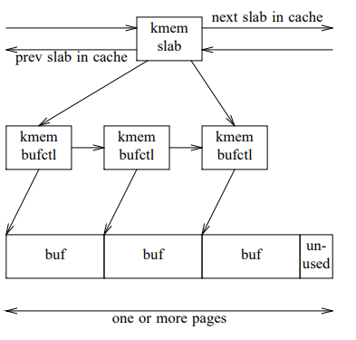
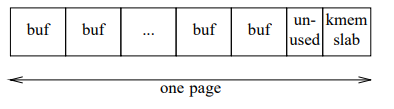
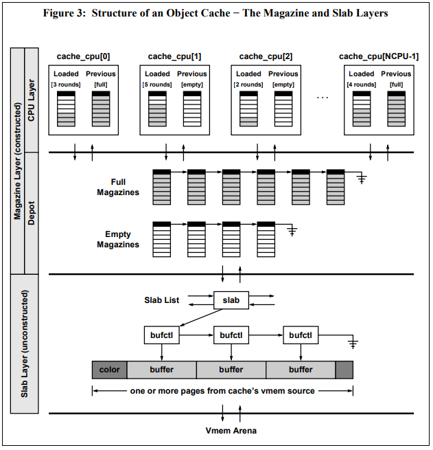
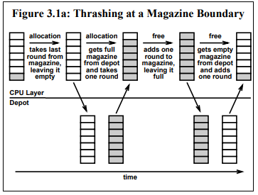
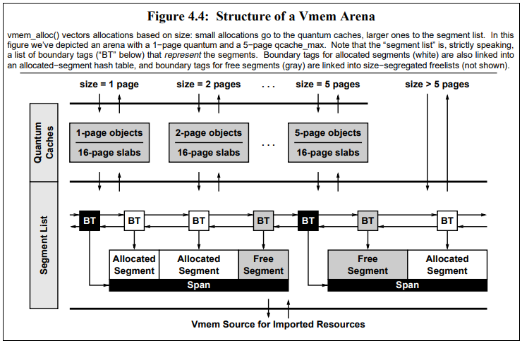

## Paper & Ref

https://people.eecs.berkeley.edu/~kubitron/courses/cs194-24-S14/hand-outs/bonwick_slab.pdf

http://www.parrot.org/sites/www.parrot.org/files/vmem.pdf

## slab

### Object Caching

对象cache的生命周期设计如下

#### 设计思想

##### 对象分配

```
if (cache中有一块可以用于分配的内存)
    take it (不需要构造对象);
else {
    分配内存;
    构造对象;
}
```

##### 对象释放

```
将对象返回给cache (不需要析构对象)
```

##### 回收内存

```
获取cache中的对象;
析构对象;
回收内存;
```

#### 一个典型的例子

```c
struct foo {
    kmutex_t foo_lock;
    kcondvar_t foo_cv;
    struct bar *foo_barlist;
    int foo_refcnt;
};
```

考虑这样一个结构体，当`foo_refcnt==0`且`foo_barlist==NULL`时回收，则其的生命周期如下

```c
foo = kmem_alloc(sizeof (struct foo), KM_SLEEP);
mutex_init(&foo->foo_lock, ...);
cv_init(&foo->foo_cv, ...);
foo->foo_refcnt = 0;
foo->foo_barlist = NULL;

use foo;

ASSERT(foo->foo_barlist == NULL);
ASSERT(foo->foo_refcnt == 0);
cv_destroy(&foo->foo_cv);
mutex_destroy(&foo->foo_lock);
kmem_free(foo);
```

这里没有用到cache，每次构造和析构的开销很大

#### 设计原则

* 对于object的描述`name, size, alignment, constructor, and destructor`，应由应用程序给出，分配器不应对其有任何假设
* 分配器对内存的管理对于应用程序应是不可见的

#### 接口

kmem_cache提供了对创建cache的参数的描述并创建初始cache池（注意这个是函数不是结构体）

```c
struct kmem_cache *kmem_cache_create(
    char *name,
    size_t size,
    int align,
    void (*constructor)(void *, size_t),
    void (*destructor)(void *, size_t) );
```

kmem_cache_alloc用于获取一个cache块，flags可以是KM_SLEEP或KM_NOSLEEP，用于指示当没有内存块可以分配时应不应马上分配新的池以满足需求

```c
void *kmem_cache_alloc(struct kmem_cache *cp, int flags);
```

kmem_cache_free用于返回一个块到cache

```c
void kmem_cache_free(struct kmem_cache *cp, void *buf);
```

kmem_cache_destroy用于释放整个cache

```c
void kmem_cache_destroy(struct kmem_cache *cp);
```

##### 一个使用的例子

```c
void foo_constructor(void *buf, int size)
{
    struct foo *foo = buf;
    mutex_init(&foo->foo_lock, ...);
    cv_init(&foo->foo_cv, ...);
    foo->foo_refcnt = 0;
    foo->foo_barlist = NULL;
}

void foo_destructor(void *buf, int size)
{
    struct foo *foo = buf;
    ASSERT(foo->foo_barlist == NULL);
    ASSERT(foo->foo_refcnt == 0);
    cv_destroy(&foo->foo_cv);
    mutex_destroy(&foo->foo_lock);
}

int main()
{
    struct foo foo_cache = kmem_cache_create("foo_cache", sizeof(struct foo), 0,
                                  foo_constructor, foo_destructor);
    
    void *foo = kmem_cache_alloc(foo_cache, KM_SLEEP);
    use foo;
    kmem_cache_free(foo_cache, foo);
    
    kmem_cache_destroy(foo_cache);
}
```

### slab

该allocator使用一个简单的数据结构slab来描述，一个slab对应一个**内存页**，将内存页切分成等大的n份，并使用引用计数来统计使用次数，若引用计数由1变0则回收页面

#### 碎片

##### 外部碎片

指内存分配时，未被分配出去，但因为当前内存块太小而难以被分配的内存

##### 内部碎片

指内存被分配给程序，但因为对齐等原因无法使用的内存

#### 逻辑结构



#### 实际结构

##### 分块较小的情况

当块在free链上时，buf本身就包含了bufctl，这样布局的好处不仅在于节约空间，还在于很多索引都可以直接计算得到而非通过指针



##### 分块较大的情况

对于分块较大的情况，实际内存布局与逻辑结构相同

### freelist

freelist是一个双向链表，用于连接slab

freelist的最前端为全部分配的slab，其后是部分分配的slab，最后是全部空闲的slab

每个slab也有自己的freelist。这样做的好处在于如果要回收内存，可以直接将全部空闲的slab整体回收

### 内存回收

当slab的refcount为0时，马上回收内存，而是将该slab放到freelist的末尾

当内核执行回收时，首先回收完全空闲的slab，若需要回收其他内存，则先从部分空闲slab回收，最后才是全部分配的slab。但系统遵循一个原则，即对于15秒内有被使用过的内存不予回收

### allocator与硬件cache

#### 缓存地址分配对cache使用率的影响

实际上大多数allocator使用的2^n字节对齐的分配块大小对于cache是不友好的，因为一般cache的cacheline大小也为2^n，若某些结构体有部分字节会被频繁访问，则会出现这样一种情况：结构体stru1与结构体stru2的内存地址低n位相同。这将使两次访问命中同一个cacheline，从而降低cache命中率

#### 缓存地址分配对总线吞吐率的影响

上面所描述的问题同样影响了总线吞吐率，因为对于总线也有与cache类似的局部性结构

### slab染色

为解决上述问题提出的策略

每当一个新slab创建，第一块buffer的起始地址将发生变换（注意因为一个slab对应一个page，因此每个slab都是页对齐的）

如对于每块200B，8字节对齐的slab，第一个slab的各个buf起始地址为0 200 400...，而第二个slab起始地址为8 208 408...

假设页面大小4K，kmem_slab结构体32B，块大小200B，则一个slab可以有20个分块，64B的内部碎片，该内部碎片则用于内存染色，即，若对齐大小为8B，则染色序列为0 8 16 24...意思就是第一个slab的块相对slab起始地址的offset为0，第二块为8，以此类推


## vmem

### Magazines



magazine是一个M元素的指针数组，以**栈**的方式操作，其用于存储可用空间的对象。每个cpu（即每个thread）都维护独立的magazine，当magazine满时，则与depot处的magazine仓库进行交换，注意这个仓库是全局共享的，因此也被全局锁保护

当需要分配元素时

```
obj = magazine[--rounds];
```

当要释放元素时

```
magazine[round++] = obj;
```

但试想下面的情况：cpu的magazine只剩一个元素，分配新空间后magazine空，再次分配新空间时需与depot交换新的full magazine

此时free一次，magazine将变满，再free一次又需与depot交换新的empty magazine。

因此若经常发生连续alloc两次后free两次，cpu将频繁访问全局空间



解决方案是一个thread维护两个magazine，一个是当前的magazine一个是先前的，相当于增加了M个缓冲区

#### 对象构造

设想若所有的待分配对象都预先被构造，可能造成很大的空间浪费（例如构造函数里额外分配了内存）。解决方案是待分配对象在slab层不分配，只有进入到magazine层时才分配

#### magazine分配算法

##### Alloc

```c
Alloc:
	if (loaded_round > 0)
		obj = loaded_magazine[--loaded_round];	//若loaded magazine非空则直接分配
	else if (previous_round == M)
	{
		exchange(loaded_magazine, previous_magazine);
		exchange(loaded_round, previous_round);
		goto Alloc;			
         //若loaded magazine空且previous magazine满，则交换loaded magazine和previous magazine
	}
	else		//若loaded和previous magazine都空
    {
        if ( depot_hasfull(depot) )	//若depot有满的magazine
        {
            magazine_putback(previous_magazine, depot);	//归还previous magazine到depot
            
            exchange(loaded_magazine, previous_magazine);
            exchange(loaded_round, previous_round);		//将loaded移动到previous
            
            loaded_magazine = magazine_takeout(depot);
            loaded_round = M;						//获取新的magazine作为loaded
            goto Alloc;
        }
        else					//若depot无满的magazine
        {
            magazine_alloc(depot, slab);	//从slab层分配新的magazine到depot
            magazine_construct();			//构造函数在此调用
            goto Alloc;
        }
    }
	return obj;
```

##### Free

```c
Free:
	if (loaded_round < M)		//若loaded magazine非满
        loaded_magazine[loaded_round++] = obj;
	else if (previous_round == 0)	//若loaded magazine满previous magazine空
    {
    	exchange(loaded_magazine, previous_magazine);
		exchange(loaded_round, previous_round);
        goto Free;
    }
	else					//若loaded和previous皆满
    {
        if ( depot_hasempty(depot) )	//若depot有空的magazine
        {
            magazine_putback(previous_magazine, depot);
            
            exchange(loaded_magazine, previous_magazine);
            exchange(loaded_round, previous_round);		//将loaded移动到previous
            
            loaded_magazine = magazine_takeout(depot);
            loaded_round = 0;						//获取新的magazine作为loaded
            goto Free;
        }
        else						//若depot无空magazine
        {
            if (can alloc an  magazine)	//若可以从slab分配一个magazine
            {
               	magazine_alloc(depot, slab);
                goto Free;
            }
            else
            {
                
            }
        }
    }
```

## 未完


#### magazine大小调整

因为M越大可以降低cpu对全局空间的访问，但增大M也使得更多内存被浪费

这里通过一种自适应算法，通过统计depot被访问的概率来调整magazine的大小


### vmem

#### 设计目标

* 接口使用方便，用途明确
* 不论申请的块大小或当前的碎片多少，其的复杂度为常数
* 可以在不同cpu间截图
* 产生的碎片少

#### 结构




