# 参考文档

https://mp.weixin.qq.com/s?__biz=MzU0NjgzMDIxMQ==&mid=2247601352&idx=1&sn=080e64b063f9c7c9b69d8ee7c3e526d1&chksm=fb54ae24cc2327325b628cbe903b3daa82f10c73c3afc470f68fc85b82b1cf5aa3c228e82246&scene=27

https://www.bilibili.com/video/BV1ez4y1X7eR  视频，推荐

[滤波笔记一：卡尔曼滤波（Kalman Filtering）详解_scoutee的博客-CSDN博客](https://blog.csdn.net/ouok000/article/details/125578636)  上一个视频的笔记

https://zhuanlan.zhihu.com/p/58675854  从贝叶斯滤波出发推导卡尔曼滤波

# 图解（参考文档1）

## 背景

### 滤波

滤波即加权，本质就是给不同的信号不同的权重

卡尔曼滤波是一种**递推预测滤波算法**，它是一种具有高斯误差统计的一维线性系统的最优估计器

**限制**：卡尔曼滤波器只能减小**均值为0**的测量噪声带来的影响

### 问题描述

假设要预测的是机器人的状态

$$
\vec x =
\begin{bmatrix}
p \\
v
\end{bmatrix}
$$

其中p为位置，v为速度。如图，颜色越白表示概率越大，这里展示了p和v的分布规律

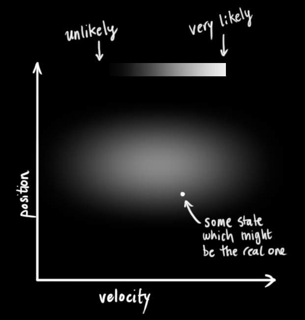

卡尔曼滤波假设所有变量都是随机的，且服从高斯分布，所以每个变量都有均值μ和方差σ^2

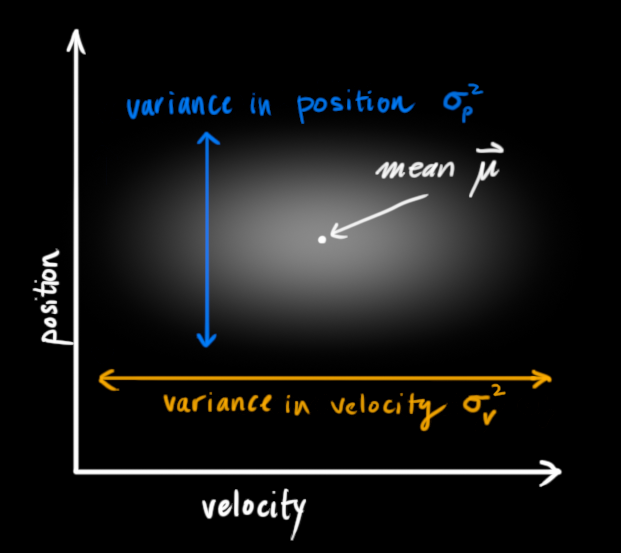

### 基础建模

上图中，速度和位置不相关，但实际上两者有一定关系，可能如下图

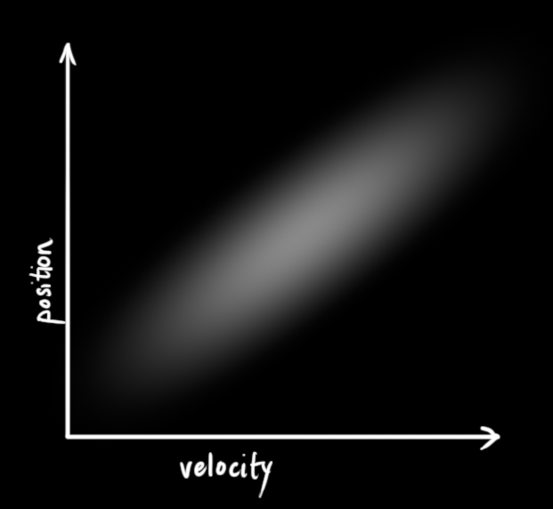

这里表示的关系就是：速度越快我们可能就会走得更远

由于两者有一定相关性，所以我们可以将其写为协方差矩阵：

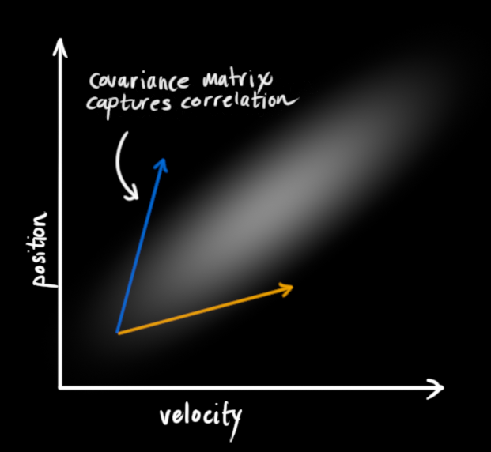

$$
\begin{aligned}
\hat x_k &= 
\begin{bmatrix}
p
\\
v
\end{bmatrix}
\\
~
\\
P_k &=
\begin{bmatrix}
\Sigma_{pp} & \Sigma_{pv}
\\
\Sigma_{vp} & \Sigma_{vv}
\end{bmatrix}
\end{aligned}
$$

下面考虑这样一个问题：从当前状态 $x_{k-1}$ 预测下一个状态 $x_k$ ,分布如图所示

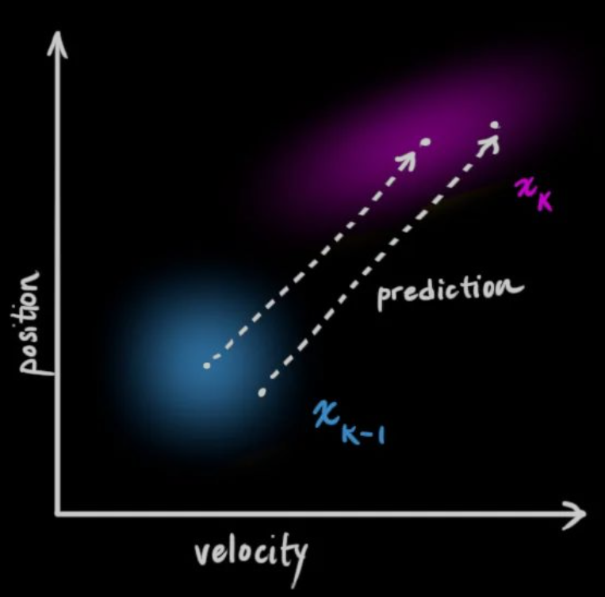

则可以使用一个转移矩阵来表示该过程

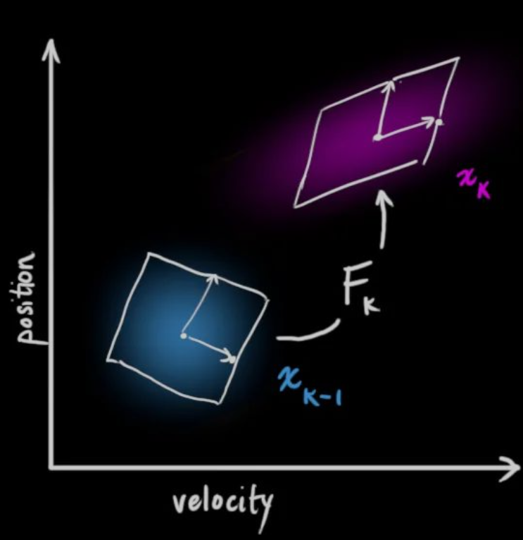

这里我们根据速度和位置的关系可以推出转移矩阵

$$
\begin{aligned}
p_k &= p_{k-1} + \Delta t v_{k-1}
\\
v_k &= v_{k-1}
\end{aligned}
$$

所以有

$$
\begin{aligned}
\hat x_k &=
\begin{bmatrix}
1 & \Delta t
\\
0 & 1
\end{bmatrix}
\hat x_{k-1}
\\
&= F_k \hat x_{k-1}
\end{aligned}
$$

对应的，协方差矩阵也可以被更新，因为协方差矩阵的运算公式为

$$
\begin{aligned}
Cov(x) &= \Sigma
\\
Cov(Ax) &= A \Sigma A^T
\end{aligned}
$$

因此可以得到

$$
\begin{aligned}
\hat x_k &= F_k \hat x_{k-1}
\\
P_k &= F_k P_{k-1} F^T_k
\end{aligned}
$$

### 外部影响

外部环境肯定会对运动状态造成影响，这时候我们可以将一些测量的量加入建模中以便修正结果

如刚刚的例子中，我们知道由于油门设置会产生预期加速度a，则可以进一步建模如下

$$
\begin{aligned}
p_k &= p_{k-1} + \Delta t v_{k-1} + \frac{1}{2} a \Delta t^2
\\
v_k &= v_{k-1} + a \Delta t
\end{aligned}
$$

写成矩阵如下

$$
\begin{aligned}
\hat x_k &= F_k \hat x_{k-1} +
\begin{bmatrix}
\frac{\Delta t^2}{2}
\\
\Delta t
\end{bmatrix}
a
\\
&= F_k \hat x_{k-1} + B_k \vec u_k
\end{aligned}
$$

对于这个控制方程，Bk被称为控制矩阵，uk被称为控制向量

### 外部不确定性

由于现实中各个系统存在不确定性，所以原始估计中的每个状态都可能迁移到多个状态，一般我们使用高斯分布进行建模

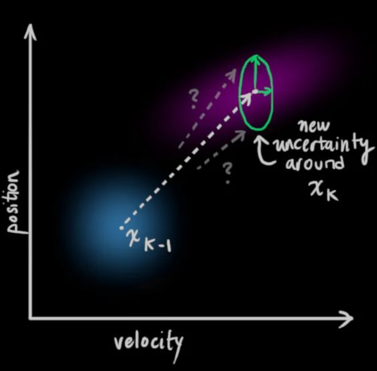如图，xk-1的每个点都可能转移到具有协方差Qk的高斯分布内的某个位置，所以多个位置的迁移可以表示为

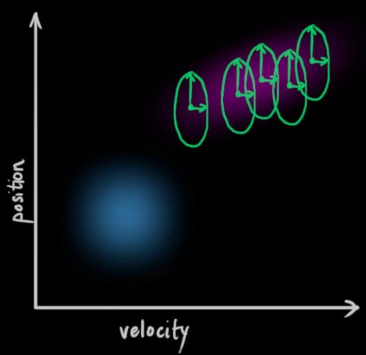

最终会形成一个新的分布

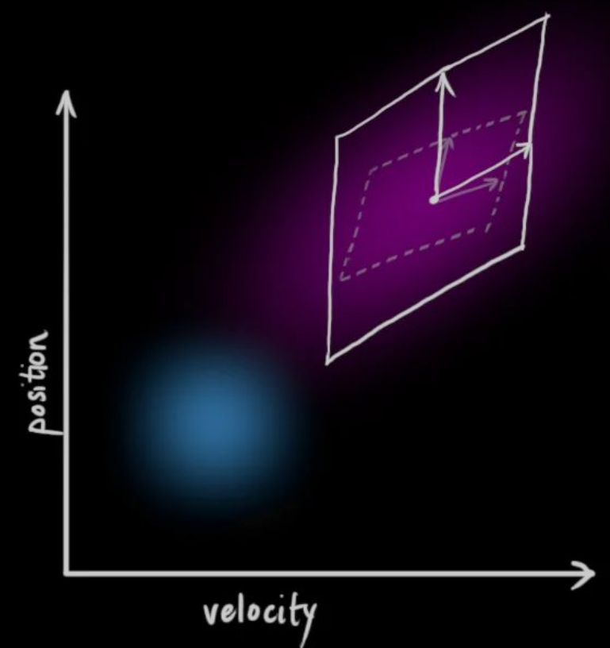

即，在状态量的协方差中添加额外的协方差Qk，所以预测阶段的完整状态转移方程为

$$
\begin{aligned}
\hat x_k &= F_k \hat x_{k-1} + B_k \vec u_k
\\
P_k &= F_k P_{k-1} F^T_k + Q_k
\end{aligned}
$$

方程说明了两点

* 新的最佳估计是根据先前的最佳估计（$\hat x_{k-1} \  B_k$）做出的预测，再加上对已知外部影响的校正 $\vec u_k$
* 新的不确定度是根据先前的不确定度（$P_{k-1} \ F^T_k$）做出的预测，再加上来自环境额外的不确定度 $Q_k$

## 状态更新

### 利用测量修正

假设此时有两个传感器，一个测量位置一个测量速度，如图，左侧是实际的位置-速度图，右侧是对应测量的结果

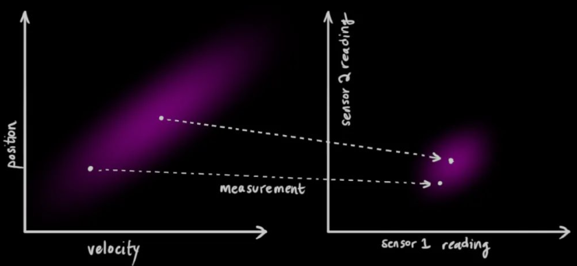

我们希望传感器的读数可以建模为

$$
\begin{aligned}
\vec \mu_{expected} &= H_k \hat x_k
\\
\Sigma_{expected} &= H_k P_k H_k^T
\end{aligned}
$$

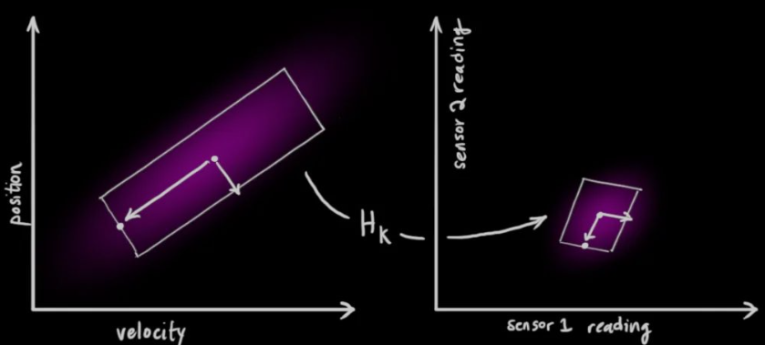

### 测量的噪声

由于传感器本身也存在噪声，因此每个状态也都可能导致一定范围的传感器读数

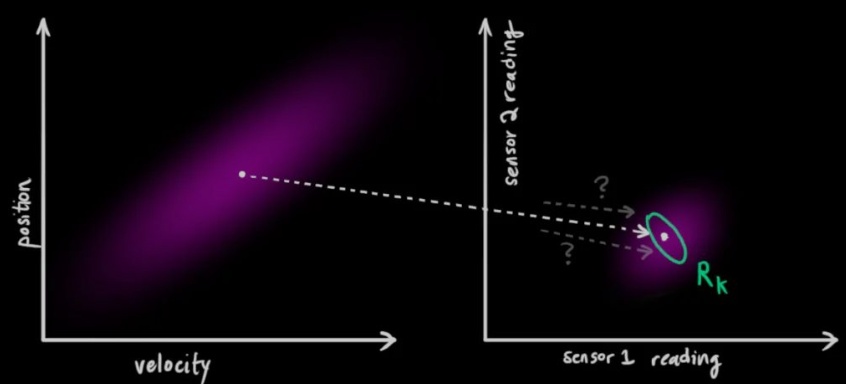

控制本质上就是我们根据传感器的读数，猜测系统正处于某个特定状态。但由于不确定性的存在，某些状态比其他状态更可能产生我们看到的读数

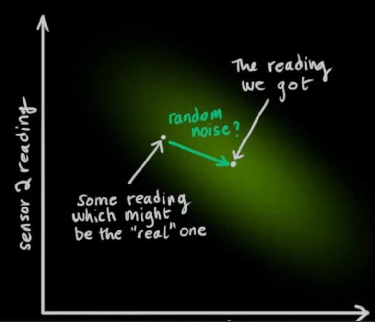

将这种不确定性（如传感器噪声）的协方差表示为 $R_k$ ，读数的分布均值相当于我们观察到的传感器读数，表示为 $\vec z_k$

### 预测结果与测量结果

**这样，我们此时就有了两个高斯分布**

* 通过状态转移方程预测得到的分布

* 通过读取传感器得到的分布

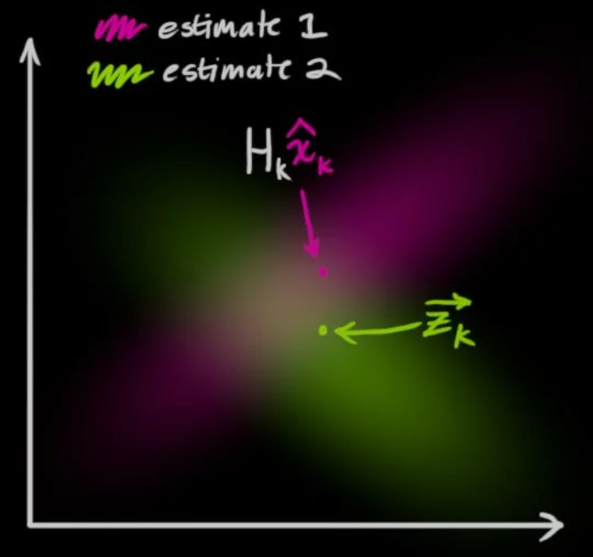

此时我们就需要将状态方程的预测与测量值进行融合。思路即计算融合后最有可能的新状态，原理很简单，对于某个值对 (z1, z2) 考虑如下两个概率

* (z1, z2) 为测量值的概率

* (z1, z2) 为状态方程预测结果的概率

计算的方法即将两个高斯分布相乘，得到新的分布

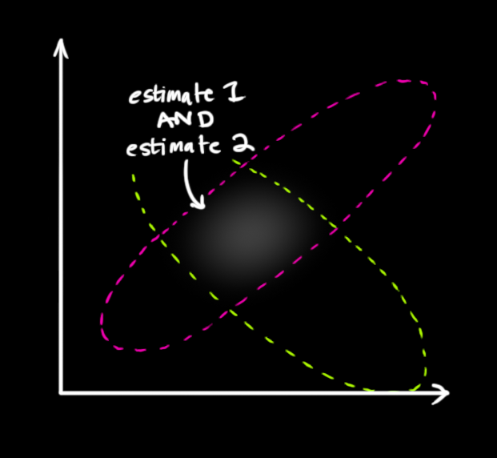

由此得到新的分布即为两种估计中最有可能的

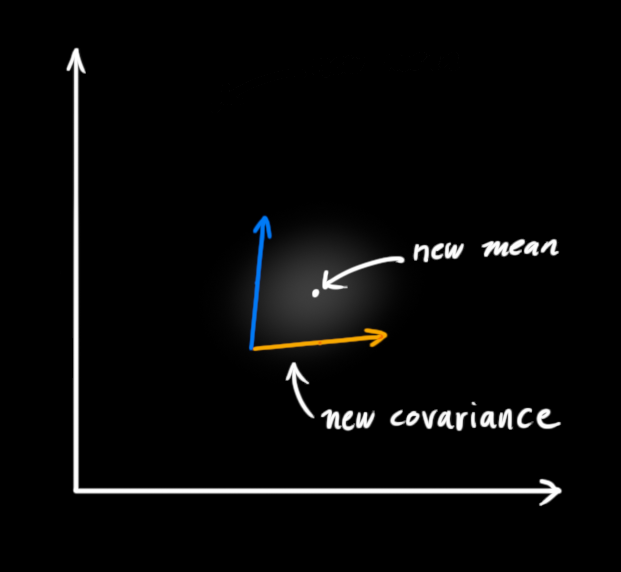

## 公式相关

### 合并两个高斯分布

由前面讨论可知，卡尔曼滤波需要合并两个高斯分布，这推导一维情况的公式

$$
\begin{aligned}
& N_1(x, \mu_1, \sigma_1) \cdot N_2(x, \mu_2, \sigma_2)
\\
=& \frac{1}{\sigma_1 \sqrt{2 \pi}} e^{-\frac{(x-\mu_1)^2}{2 \sigma_1^2}} \cdot \frac{1}{\sigma_2 \sqrt{2 \pi}} e^{-\frac{(x-\mu_2)^2}{2 \sigma_2^2}}
\\
=& \frac{1}{2 \pi \sigma_1 \sigma_2} e^{-(\frac{(x-\mu_1)^2}{2 \sigma_1^2}+\frac{(x-\mu_2)^2}{2 \sigma_2^2})}
\\
& 经过一系列化简
\\
=& \frac{1}{2 \pi \sigma_1 \sigma_2} e^{-(\frac{ (x-\frac{\mu_1 \sigma_2^2 + \mu_2 \sigma_1^2}{\sigma_1^2+\sigma_2^2})^2 }{ \frac{2 \sigma_1^2 \sigma_2^2}{\sigma_1^2+ \sigma_2^2} } + \frac{(\mu_1 - \mu_2)^2}{2 (\sigma_1^2 + \sigma_2^2)})}
\\
~
\\
& 令 \mu' = \frac{\mu_1 \sigma_2^2 + \mu_2 \sigma_1^2}{\sigma_1^2+\sigma_2^2} ， \sigma' = \sqrt{\frac{ \sigma_1^2 \sigma_2^2}{\sigma_1^2+ \sigma_2^2 }}
\\
=& \frac{1}{2 \pi \sigma_1 \sigma_2} e^{-\frac{(x-\mu')^2}{2 \sigma'^2}} \cdot e^{ -\frac{(\mu_1 - \mu_2)^2}{2 (\sigma_1^2 + \sigma_2^2)} }
\\
=& \frac{1}{\sqrt{2 \pi (\sigma_1^2+\sigma_2^2)}} e^{ -\frac{(\mu_1 - \mu_2)^2}{2 (\sigma_1^2 + \sigma_2^2)} } \ \cdot \ \frac{1}{\sqrt{2 \pi} \sigma'} e^{-\frac{(x-\mu')^2}{2 \sigma'^2}}
\end{aligned}
$$

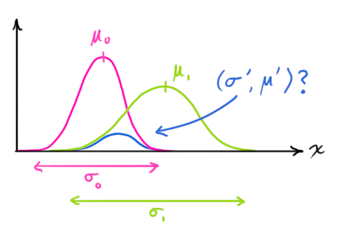

### 新的高斯分布

由上式，可得新的高斯分布均值和方差为

$$
\begin{aligned}
\mu' &= \mu_1 + \frac{\sigma_1^2(\mu_2 - \mu_1)}{\sigma_1^2 + \sigma_2^2}
\\
\sigma'^2 &= \sigma_1^2 - \frac{\sigma_1^4}{\sigma_1^2 + \sigma_2^2}
\end{aligned}
$$

令 $k = \frac{\sigma_1^2}{\sigma_1^2 + \sigma_2^2}$ ，则

$$
\begin{aligned}
\mu' &= \mu_1 + k (\mu_2 - \mu_1)
\\
\sigma'^2 &= \sigma_1^2 - k \sigma_1^2
\end{aligned}
$$

所以其矩阵形式可以写为

$$
\begin{aligned}
K &= \frac{\Sigma_1}{\Sigma_1 + \Sigma_2}
\\
\vec \mu' &= \vec \mu_1 + K (\vec \mu_2 - \vec \mu_1)
\\
\Sigma' &= \Sigma_1 - K \Sigma_1
\end{aligned}
$$

Σ'表示新的高斯分布的协方差矩阵， μ'是每个维度的均值，K则是**卡尔曼增益**

### 卡尔曼滤波的公式

假设有两个高斯分布，一个是我们的预测值，由前面推导的式子有

$$
(\mu_1, \Sigma_1) = (H_k \hat x_k, \  H_k P_k H_k^T)
$$

另一个是观测值，由传感器给出

$$
(\mu_2, \Sigma_2) = (\vec z_k, R_k)
$$

将两个高斯分布代入公式中，可得

$$
\begin{aligned}
K &= \frac{H_k P_k H_k^T}{H_k P_k H_k^T + R_k}
\\
\vec \mu' &= H_k \hat x_k' = H_k \hat x_k + K(\vec z_k - H_k \hat x_k)
\\
\Sigma' &= H_k P_k' H_k^T = H_k P_k H_k^T - K \ H_k P_k H_k^T
\end{aligned}
$$

上式可以将Hk化简，变为

$$
\begin{aligned}
K' &= \frac{P_k H_k^T}{H_k P_k H_k^T + R_k}
\\
\hat x_k' &= \hat x_k + K'(\vec z_k - H_k \hat x_k)
\\
P_k' &= P_k - K' H_k P_k
\end{aligned}
$$

## 总体架构

总体来看，信息流如下图：

* 上一时刻状态 $\hat x_{k-1} \ P_{k-1}$ 先推测根据状态方程得到当前状态 $\hat x \ P_k$

* 使用测量值 $\vec z_k \ R_k$ 修正预测值 $\hat x \ P_k$ ，得到滤波后的真实状态

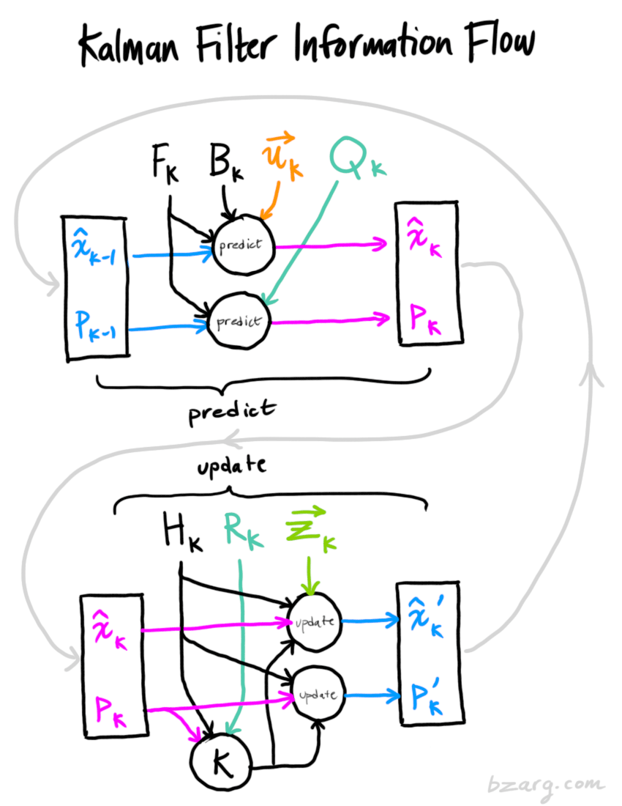

# 更为数学的解释（参考文档2）

## 测量数据的递归关系

### 不确定性

系统中不确定性的主要来源有三个方面

* 数学模型本身造成的偏差

* 系统的扰动不可控，也很难建模

* 测量传感器存在误差

### 卡尔曼增益

假设时刻1 2 ... k分别对x测量一个值，得到一系列测量数据z1 z2 ... zk，则对x的估计值为（均值估计）

$$
\begin{aligned}
\hat x_k &= \frac{1}{k} (z_1 + z_2 + \cdots + z_k)
\\
&= \frac{k-1}{k} \frac{1}{k-1} (z_1 + z_2 + \cdots + z_{k-1}) + \frac{1}{k} z_k
\\
&= \frac{k-1}{k} \hat x_{k-1} + \frac{1}{k} z_k
\\
&= \hat x_{k-1} + \frac{1}{k} (z_k - \hat x_{k-1})
\\
& 令K_k = \frac{1}{k}，则
\\
&= \hat x_{k-1} + K_k(z_k - \hat x_{k-1})
\end{aligned}
$$

所以有

```
当前的估计值 = 上一次的估计值 + 系数 * (当前的测量值 - 上一次的估计值)
```

这里的K被称为卡尔曼增益/因数

从公式里可以看出，当k越大，当前测量值zk对于估计值的影响越小（原因也很直观）

### 误差的引入

一般我们讨论两种误差

* 估计误差 $e_{EST}$

* 测量误差 $e_{MEA}$

所以上述的公式又可以写为

## 数学基础

### 数据融合

假设有两个测量同一个量的测量设备，得到的值分别是z1和z2，标准差为σ1 σ2，求将两个测量数据融合后的值（均为高斯分布）

这个问题可以见上面讨论过的 [合并两个高斯分布](#合并两个高斯分布) ，视频里从卡尔曼增益的角度解决该问题：

假设此时我们有两个测量值 z1 z2，要得到真实值，由卡尔曼增益公式可得（实际上这里我更倾向于将k看做一个比例系数或者权重，相当于希望找到一个权重分配z1和z2的测量值，使得结果最优）

$$
\hat z = z_1 + k(z_2 - z_1)
$$

最优化结果的方法即使得最终得到的估计值方差最小，所以有

$$
\begin{aligned}
Var(\hat z) &= Var ( z_1 + k(z_2 - z_1) )
\\
&= Var [ (1-k) z_1 + k z_2 ]
\\
& 由于z_1和z_2独立
\\
&= (1-k)^2 Var(z_1) + k^2 Var(z_2)
\\
&= (1-k)^2 \sigma_1^2 + k^2 \sigma_2^2
\end{aligned}
$$

要求极值，则对k求导

$$
\frac{\mathrm{d} Var(\hat z)}{\mathrm d k} = -2 \sigma_1^2 (1-k) + 2 \sigma_2^2 k = 0
\\
解得 k = \frac{\sigma_1^2}{\sigma_1^2 + \sigma_2^2}
$$

这里得到的结果与直接使用高斯分布相乘得到的一致，即

$$
\begin{aligned}
\hat z &= z_1 + \frac{\sigma_1^2}{\sigma_1^2 + \sigma_2^2} (z_2 - z_1)
\\
\hat \sigma^2 &= \frac{\sigma_1^2}{\sigma_1^2 + \sigma_2^2}
\end{aligned}
$$

## 状态空间与卡尔曼滤波器的推导

### 方程

离散状态空间方程的表达形式：

$$
x_k = A x_{k-1} + B u_{k-1} + w_{k-1}
$$

其中x为状态变量，u为控制量，A为状态矩阵，B为控制矩阵，w则为**过程噪声**（会造成前文讨论的估计误差）

测量量则可以表示为方程：

$$
z_k = H x_k + v_k
$$

H为测量矩阵（用于变换测量的数据与需要得到的数据），v为测量噪声（会造成前文讨论的测量误差）

### 分析与推导

由上面两式，由于噪声是无法建模的，即未知的，所以不考虑噪声的情况下

$$
\begin{aligned}
& 令 \hat x_k^- = A x_{k-1} + B u_{k-1} ，可以认为\hat x_k^- 是由模型本身计算得到的先验值
\\
& 令 \hat x_{k_{MEA}} = H^{-1} z_k ，则\hat x_{k_{MEA}}是我们得到的测量值
\end{aligned}
$$

这里则涉及到了上面提到的数据融合的内容：此时我们有两个值来估计真实值，一个是由模型本身得到的估计值，一个是传感器得到的测量值

因此可以代入上述的数据融合方程，设系数G

$$
\hat x_k = \hat x_k^- + G(H^{-1} z_k - \hat x_k^-)
$$

为了更方便表示，令 $G = K_k H$

$$
\hat x_k = \hat x_k^- + K_k(z_k - H \hat x_k^-)
$$

该式即卡尔曼滤波器的表达式

**我们的目标是找到一个合适的 $K_k$ ，使得估计值与真实值的误差最小**

因此需要最小化误差，因此误差可以表示为

$$
e_k = x_k - \hat x_k
$$

代入可得

$$
\begin{aligned}
e_k &= x_k - [ \hat x_k^- + K_k(z_k - H \hat x_k^-) ]
\\
&= x_k - \hat x_k^- - K_k z_k + K_k H \hat x_k^-
\\
&= x_k - \hat x_k^- - K_k (H x_k + v_k) + K_k H \hat x_k^-
\\
&= (x_k - \hat x_k^-) - K_k H (x_k - \hat x_k^-) - K_k v_k
\\
&= (I-K_k H) (x_k - \hat x_k^-) - K_k v_k
\end{aligned}
$$

其中 $x_k - \hat x_k^-$ 可以视作误差的先验 $e_k^-$
