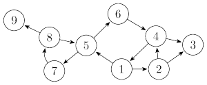
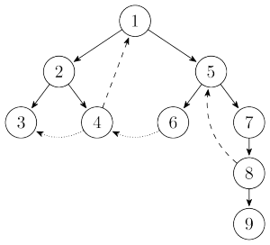
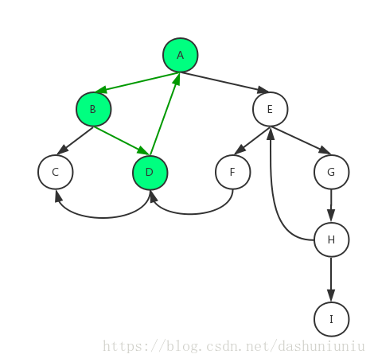
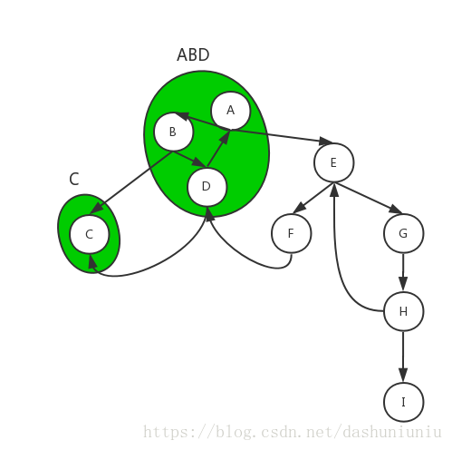
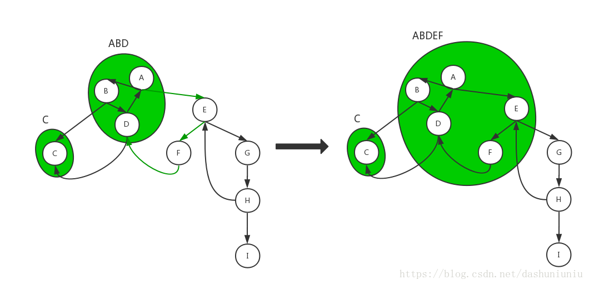
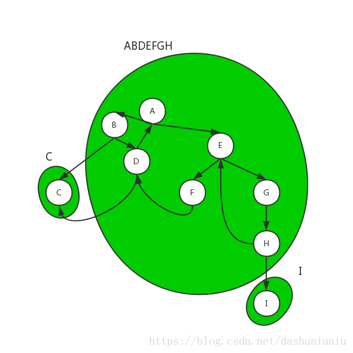
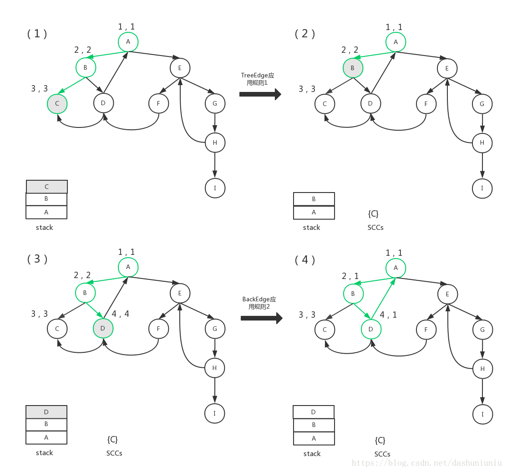
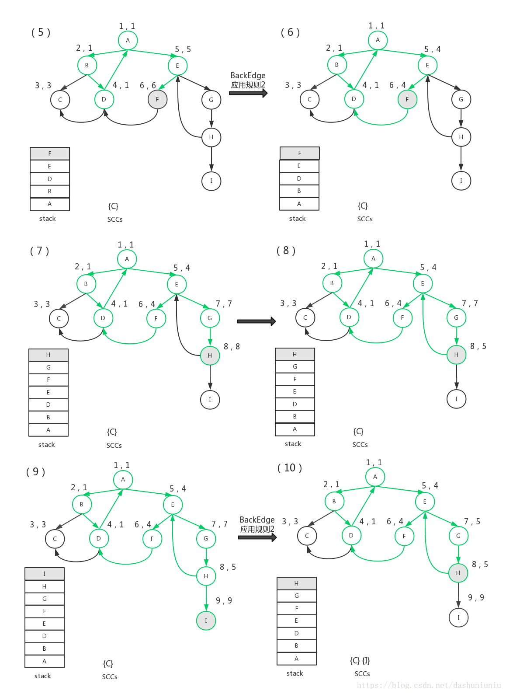
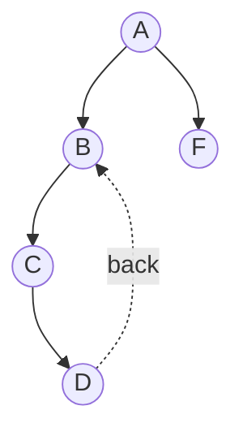

## 概念

### 强连通

一个有向图被成为是**强连通的**（strongly connected）当且仅当每一对不相同结点 u 和 v 间**既存在从 u 到 v 的路径也存在从 v 到 u 的路径**。有向图的极大强连通子图（这里指点数极大）被称为**强连通分量**（strongly connected component）。



## 搜索树

### 基本概念

随机选取一个节点作为根，使用DFS遍历连通的节点，有下列四种可能的边

* 树边 （tree edge  实线）：每次从当前节点出发搜索到一个没访问过的节点
* 回边/反祖边 （back edge  长虚线）：从当前节点出发搜索到一个父节点
* 横叉边 （cross edge  短虚线）：从当前节点出发搜索到一个被访问过，且不是父节点的节点



若节点u是某个强连通分量的一个节点，那么该强连通分量的其余节点肯定都在上图所示的搜索树中。因为u和v同属一个强连通分量说明必定有一条从u到v的路径

### 搜索树思路的推广

来源于[[1](https://blog.csdn.net/dashuniuniu/article/details/80777752)]，这里采用的例子依然是上述例子，差别在于编号换了

从上面的搜索树，可以很容易地找出从节点1出发的最后回到节点1的强连通子图，但无法找出极大强连通子图

#### 例子



这里的思路是，当找到一个强连通子图后，将该子图的所有节点坍缩为一个节点。这里ABD（124）是强连通子图，因此坍缩为下图



从坍缩后的节点ABD出发，继续遍历，发现EF（56）与节点是连通的，于是



继续从ABDEF节点出发，发现GH是连通的，于是



#### 总结思路

标识节点时使用两个标识符，一个代表节点序号，另一个代表节点当前所属的强连通图。这里可以简单地使用强连通图的所有组成节点的最小序号作为强连通图序号。搜索的时候就可以按照强连通图序号来进行搜索

## Tarjan算法

#### 算法规则

##### 算法维护的变量

每个节点分配两个序号

* dfn是唯一的序号，**根据遍历顺序确定**，也被称为时间戳（因为早遍历到的序号小）

* low表示上面所提的强连通图序号。其实low的定义如下：

  它表示从 u 或者以 u 为根的子树中的结点，再通过一条**反祖边或者横叉边**可以到达的**时间戳最小的结点** v 的时间戳，并且要求 v 有一些额外的性质：**v 还要能够到达 u**。显然通过反祖边到达的结点 v 满足 low 的性质，但是通过横叉边到达的却不一定。

  此外，low[v]初始化值为dfn[v]

此外，维护一个栈。这个栈保存的是当前可能的连通子图的所有节点，加上正在遍历的节点。实际上这个栈的存在就是为了便于检查正在遍历的节点中是否存在回边或者连接到当前子图的横叉边

##### 变量更新规则

设当前节点为u，遍历的下一个节点为v

* 若v没有被遍历过（树边），则在**v节点遍历结束后**，`low[u] = min(low[u], low[v])`
* 若v被遍历过，且v在栈中，则在**v节点遍历结束后**，`low[u] = min(low[u], dfn[v])`。若v不在栈中则不执行操作

当有新节点v被遍历时，v将入栈。当一个节点v遍历完且`low[v] == dfn[v]`，则pop该节点

#### 例子



* [1] -> [2]
  * A遍历B，B遍历左节点C
  * C没有子节点，因此结束遍历，因为`low[C]==dfn[C]`，所以出栈。C一个节点单独作为一个连通子图
* [3] -> [4]
  * B遍历右节点D
  * D有一条横叉边和一条回边。由于横叉边没在栈中，因此不更新。由于有回边指向A，`low[D] = min(low[D], dfn[A])`，`low[D]=1`
  * 由于`low[D] < dfn[D]`，不出栈
  * B结束了搜索，`low[B]=min(low[B], low[D])`，`low[B]=1`
  * 由于`low[B] < dfn[B]`，不出栈
  * 回退到A，A尚未结束搜索，但需要更新low值。`low[A]=min(low[A], low[B])`



* [5] -> [6]
  * A继续遍历E，E遍历左节点F
  * F有一条横叉边到D，因为D在栈中，所以`low[F] = min(low[F], dfn[D])`
  * 因为`low[F]<dfn[F]`，F不出栈，回退到E
  * 更新E节点，`low[E] = min(low[E], low[F])`
* [7] -> [8]
  * E继续遍历G，G遍历左节点H
  * H有一条回边到E，因为E在栈中，所以`low[H] = min(low[H], dfn[E])`
* [9] -> [10]
  * H有一条树边到I，遍历I
  * I没有其他边，回溯。因为`low[I] == dfn[I]`，出栈
  * H回溯到G，`low[G] = min(low[G], low[H])`
* 继续回溯两次直到A，结束遍历。此时栈中保存的所有元素即为极大强连通子图

#### dfn与low

从上面例子看出，因为节点v的pop规则是只有在`dfn[v] == low[v]`时pop。因为dfn数组是按照遍历顺序赋值的，所以若遍历顺序靠后的节点有任何指向遍历顺序靠前的边，就说明这可能构成一个连通图。当然还有一个条件就是指向的边在栈上。而此时更新`low[u]=min(low[u], dfn[v])`，实际上就是令`low[u]!=dfn[u]`，使得当前节点可以继续保留在栈上。

而考虑low值的来源，首先在初始化时，`low[u]==dfn[u]`。更新时，`low[u]=min(low[u], low[v])`或`low[u]=min(low[u], dfn[v])`，因此肯定有`low[u]<=dfn[v]`。而对于连通图的根节点，必有`low[u]==dfn[u]`，因此更新被遍历过节点时，理论上`low[u]=min(low[v], dfn[u])`等价于`low[u]=min(low[u], low[v])`（没有严格证明，这块内容在[2]中被提及）

那何时应该清栈呢



上述例子遍历到D时，栈为

```
D  4 4
C  3 3
B  2 2
A  1 1
```

此时回溯并更新节点，更新D时为

```
D  4 2
```

回溯到C，更新C为

```
C  3 2
```

回溯到B，更新B为

```c
B  2 2
```

此时B应该被pop，因此B上面的所有节点视为一个连通子图，同时被pop出

#### 代码

```c
/* 寻找有向图强连通分量的tarjan算法
 * dfn_index 表示的就是时间戳
 * scc_index 表示强连通分量的个数
 * scc[u] 表示结点u属于那一个强连通分量
 * on_stack[u] 表示结点u是否仍然在栈中
 * stack 和 st 分辨表示栈和栈顶位置 */
void tarjan(int u)
{
	dfn[u] = low[u] = ++dfn_index;
	on_stack[u] = 1; stack[st++] = u;
	for(int k = head[u]; k; k = next[k])
	{
		int v = point[k];
		if(!dfn[v])
		{
			// 树边的情况
			tarjan(v);
			if(low[v] < low[u])
				low[u] = low[v];
		} else if(on_stack[v] && dfn[v] < low[u]) {
			// 横叉边或者反祖边的情况
			low[u] = dfn[v];
		}
	}

	if(low[u] == dfn[u])
	{
		++scc_index, tmp = 0;
		while(tmp != u)
		{
			tmp = stack[--st];
			scc[tmp] = scc_index;
			on_stack[tmp] = 0;
		}
	}
}
```

## ref

[1] https://blog.csdn.net/dashuniuniu/article/details/80777752

[2] http://blog.miskcoo.com/2016/07/tarjan-algorithm-strongly-connected-components