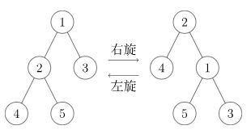

[Splay 树 - OI Wiki](https://oi-wiki.org/ds/splay/)

[伸展树(Splay Tree) | 算法数据结构可视化](https://algo.hufeifei.cn/SplayTree.html)

### 特性

最近一次访问的节点会被放到根节点，这里最近一次访问包括查询和插入（删除时也会先把节点放到根节点再删除）

### 基本操作

最基本的操作为左旋和右旋，如图

该操作可以将根节点的左右孩子提升为新的根节点，同时保持二叉查找树的性质不变

### Splay操作

splay树的核心操作，根据被调整节点本身及其父节点的性质进行旋转

#### zig

待调整节点x的父节点p为根节点，直接通过左旋或者右旋将待调整节点调整为根节点

#### zig-zig

p节点不为根节点，且x和p都在同侧

#### zig-zag

p节点不为根节点，且p节点和x节点不在同侧

