## cache

### cache基本原理

#### cache组织结构

cache分为一系列cacheline

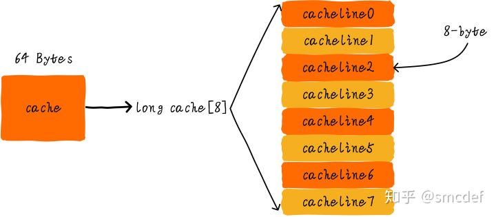

这里假设cache大小为64B，分为8个cacheline，每个cacheline大小为8B

##### 直接映射缓存

直接映射缓存的寻址方式是，将地址分为3部分tag index和offset

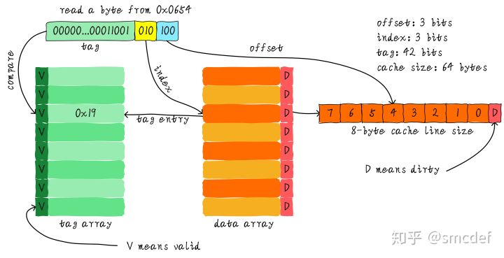

这里采用了之前的cacheline分划，因为每个cacheline 8B，所以offset有3位；因为一共8个cacheline，所以index也有3位，剩下位数作为tag。

注意，每个tag与cacheline是一一对应的。这种方式会导致所有index相同的内存地址占据同一个cacheline，如下图

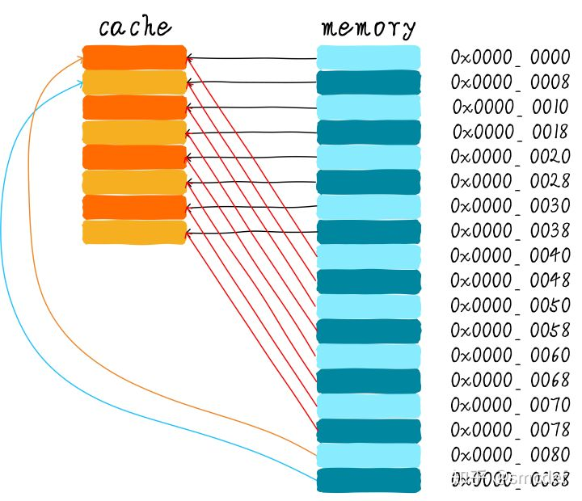

因此如上面这种情况，当程序在0x00000000和0x00000040来回访问的时候，每次都会导致cache无法命中

##### 多路组相连缓存

这里以两路为例

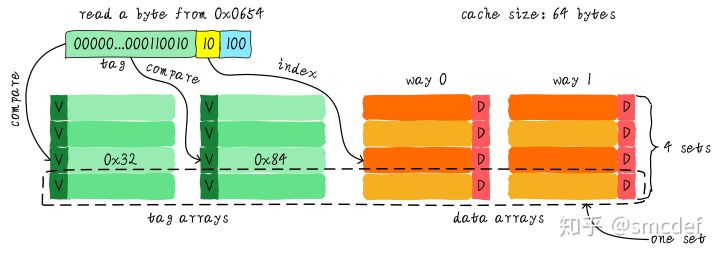

在cache大小同样，cacheline数量同样的条件下，把cacheline分成两个way，index减半，增加一路tag，使得同样的index能对应两个tag

地址映射关系如下，这可以一定程度上缓解直接映射缓存的问题

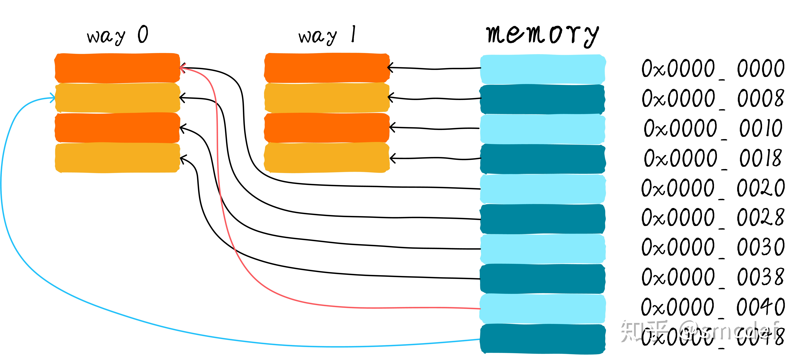

##### 全相连缓存

多路组相连缓存的极端情况，即取消index

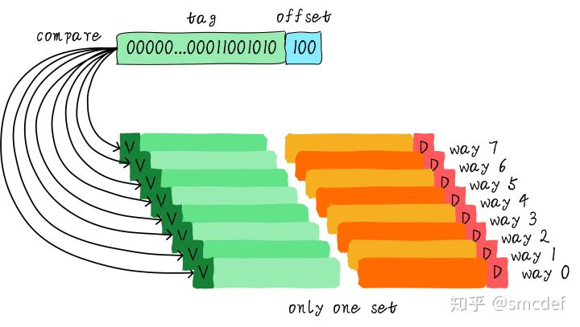

这样任意一个tag对应的cacheline可以缓存任意地址的数据，因此速度更快，但是显然复杂度也较高

注意这里直接映射缓存（其实也就是单路组相连缓存）与多路组相连缓存乃至全相连缓存的主要差别就是，直接映射缓存可以直接通过index确定要访问的cacheline，因此tag的比较器只需要一个就够了。多路组相连缓存则是需要多个比较器，因为一个cacheline对应了多个tag

#### cache分配策略

##### 读分配

CPU读数据时cache缺页。分配一个cacheline读入主存数据

##### 写分配

CPU写数据时cache缺页。

* 若支持写分配，CPU先将内存读入cache，再修改
* 若不支持，则直接更新主存数据

#### cache更新策略

##### 写直通（write through）

每次写cache后都更新主存数据（图中是不支持写分配的情况，但**write through模式一般不支持写分配**）

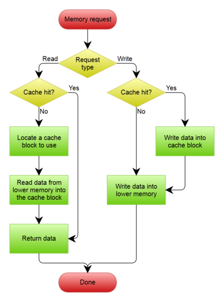

##### 写回（write back）

每个cacheline有一个D位（dirty bit），当发生写操作时只更改cache内容，并置位D位。但只有cacheline被替换时或者显示clear cache时更新到内存。在cacheline更新时根据D位是否为1来决定是否需要先将原来的数据回写到内存（注意这里只考虑单处理器的情况，实际上若多处理器访问同一块内存时需要一系列机制通知cache及时回写）

图中的cache分配策略采取了写分配，一般来说**write back模式支持写分配**，因为多次写入同一缓存时，write back采用写分配可以提升性能，但对write through没有帮助

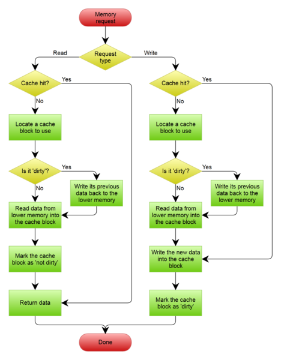

### cache组织方式

由于程序中对地址的访问都是虚拟地址，实际访问时先由MMU转换为物理地址。因此cache理论上既可以使用虚拟地址也可以使用物理地址

#### 虚拟高速缓存（VIVT）

Virtually Indexed Virtually Tagged

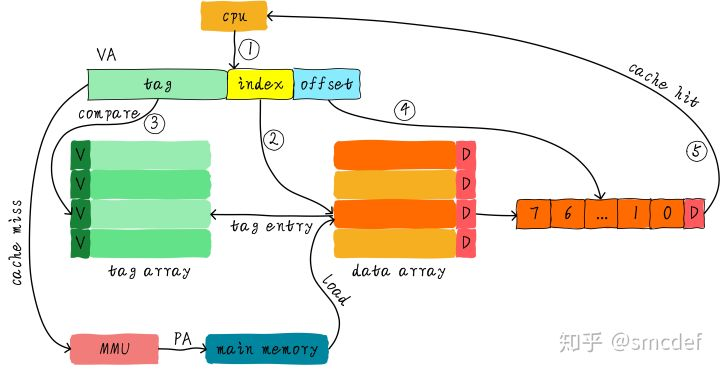

优点是不需要每次都经过MMU，加快速度，缺点是可能导致**歧义和别名**

##### 歧义与别名

* 歧义  当进程切换时，存在同样的虚拟地址映射不同的物理地址的情况。因此VIVT切换进程时需要flush cache，这会导致切换之初有大量cache miss

* 别名  当同一个进程内，不同的虚拟地址被映射到同一个物理地址，会产生别名的情况

  假设A和B两个虚拟地址都映射了同一个物理地址，而cache采取write back机制，就可能导致A和B都被修改了，但是互相无法知道对方被修改的情况，导致数据不一致

#### 物理高速缓存（PIPT）

Physically Indexed Physically Tagged

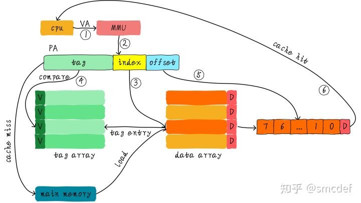

缺点就是要等MMU寻址，访问慢。优点是没有歧义和别名问题

#### 物理标记的虚拟高速缓存(VIPT)

Virtually Indexed Physically Tagged

一个折中方案，index使用虚拟地址的，tag使用物理地址的，这样可以在等待MMU处理tag的同时使用index找到cacheline

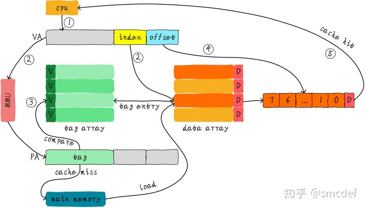

##### 歧义

VIPT虽然理论上会导致歧义，但实际上可以解决歧义问题。这是由于处理器在映射内存时只支持将一整个页进行映射。如32位CPU页映射最小单位是4KB。因此cache的tag长度可以直接根据页表映射单位选取，这样就不会导致歧义

如对于4KB的页映射，低12位是页内地址，高20位是页地址，因此tag只要选取大于等于高20位（如可以选取高20位[31:12]，高21位[31:11]。当然实际情况下肯定选高20位节约成本）就不会导致歧义（无论index和offset占了几位，tag都选取大于等于20位的数）

##### 别名

VIPT还是存在别名问题，但可以也可以不存在别名

因为别名问题是两个虚拟地址映射到同一个物理地址导致的，VIPT只有index使用虚拟地址，因此若存在别名情况，则说明存在两个index映射到同一个物理地址的情况。因为操作系统按页映射，同样假设一页是4KB，因此只有在index+offset大于12位（即4KB的寻址空间）的情况下才会导致别名问题。

同样的，对于多路组相连缓存来说，只要单路cache大小小于等于4KB就没有别名问题

###### 别名问题例子

例如，虚拟地址0x08000000和0x08001000都映射到物理地址0x10004000，一个页为4KB，对于4KB的直接映射高速缓存来说，tag为0x10004（高20位物理地址），对于虚拟地址0x08000100和0x08001100来说，他们的index和offset都是相同的（0x100），即映射到相同的物理空间。因此不存在别名问题

而若直接映射高速缓存大小为8KB，tag同样为0x10004（因为页大小同样是4KB），对于虚拟地址0x08000100和0x08001100来说，前者index和offset（13位）为0x0100，后者为0x1100，因此会导致别名问题

###### 解决别名问题

解决方法很简单，在操作系统层面上建立共享映射的时候地址按照一路cache大小对齐即可，如一路cache为8KB，虽然页大小为4KB，但建立映射时只能按照8KB对齐

### cache一致性

#### cache和DMA一致性

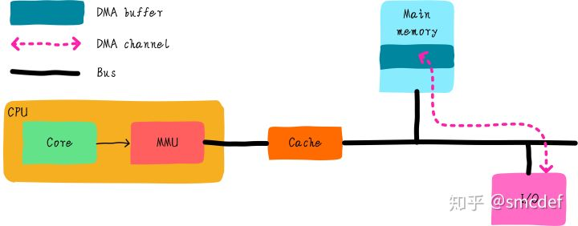

在DMA存在的情况下有一个显著的问题：当DMA传输内存时，如果修改了cache中缓存的内存，cache如果不更新内存内容则会导致cpu读取的数据错误

##### 总线监视技术

有的cache支持总线监视技术。这种技术会实时监视总线上的内存访问，并检查是否命中

但由于总线的内存访问都是物理地址，因此这种技术只适用于PIPT或不存在别名问题的VIPT

但这种技术只有部分cache支持，下面是对于不支持总线监视技术的cache的解决方法

##### nocache

可以在申请DMA缓存时指定nocache选项，使DMA操作的内存不使用cache

##### 软件维护cache一致性

由软件手工控制何时刷新cache

* 若DMA读取数据到buffer中，则在DMA传输前invalid buffer地址范围的高速缓存，使得接下来读取DMA传输后的数据不会读到旧的
* 若DMA发送buffer中的数据，则在DMA传输前clean buffer地址范围的高速缓存，避免传输旧数据

注意，这里在DMA传输过程中，CPU不能访问或者修改buffer，前者会导致cache提前加载旧的buffer数据，后者会导致新的修改无法提交到buffer上（对于write back机制）

###### DMA buffer对齐问题

若使用软件维护cache一致性，可能存在这样的问题

```c
int temp = 5;
char buffer[64] = { 0 };
```

对于上述代码，对应的cacheline可能是这样的


这样若DMA传输期间访问或修改了temp，就会导致违反上述软件维护原则的情况。因此DMA的buffer**首地址和大小**都必须跟cacheline对齐

在linux中DMA buffer只能从堆分配（如kmalloc），来保证对齐

###### 一个问题

知乎回复下面有这样一个问题

这点有疑惑，在做DMA的时候会LOCK住总线的，这个时候temp不会被Load到cache中，会被总线仲裁器阻塞的；所以在DMA的时候不会出现影响cache行中的temp的；DMA使用对齐地址是DMA控制器的要求，有地址对齐的限制；但是会配合MASK或者OFFSET来做非对齐的地址操作的；

不知道这个说法是否正确，有待考证

#### Icache和Dcache一致性

一般来说L1才区分Icache和Dcache

Icache因为指令通常不会被修改，所以设计为只读的cache。而由于对于只读的cache，VIPT不存在别名问题（因为就算有别名也不会有写回内存的操作），所以Icache可以直接选用VIPT。

但还是有问题，比如对于self-modifying code或者JIT，这种情况下合理的运行方式是指令从dcache加载并修改，此后写回内存。之后Icache加载指令。面临的问题主要有两个

* 旧指令缓存在Icache中
* 新指令没有从Dcache写回内存

##### 硬件维护

* 每次修改Dcache时，Icache也监听是否命中，若命中也更新Icache
* 加载指令时，先寻找Icache是否命中，若无则寻找Dcache是否命中，若无才找内存

##### 软件维护

由操作系统控制，如果要写入的页有可执行属性，则

* 要写入的地址加载进Dcache
* 修改，写回Dcache
* clean该地址的cacheline
* invaild该地址的cacheline

#### 多核cache一致性

在多核系统中，不同CPU的L1 cache是独占的，因此可能出现一致性问题，如CPU0和CPU1访问同一个地址，CPU0写入的结果只会缓存在自己的cache上而无法通知CPU1，导致数据一致性问题


### TLB

Translation Lookaside Buffer

为了加速MMU的寻址速度，为页表设立的高速缓存。下图为64位系统的4级页表寻址

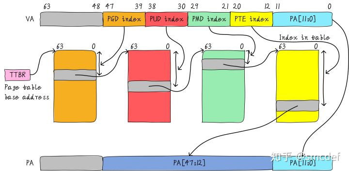

因为MMU是用于虚拟地址到物理地址的映射，所以必是VIVT

由于内存映射是根据页来的，所以低12位不需要经过MMU（若页面大小为4KB），即TLB不存在offset地址。此外如上图所示，64位系统很多时候并没有使用过多的地址位（可以但没必要），上图所示的48~63位就是没有使用的。因此可以缩减TLB的tag大小。至于TLB有没有index则根据TLB有几路来决定，若为全相连则没有index

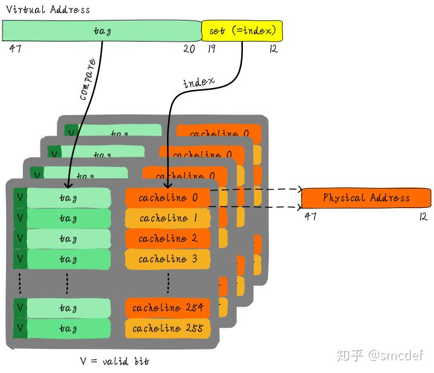

#### 别名和歧义

##### 别名

因为对于TLB来说，其缓存对象是存在于内存中的页表。如果存在别名问题，意味着页表本身被映射到不同的虚拟地址空间，但实际上不存在这种情况。或者换个角度说，别名问题是由于多个VA转换成相同PA导致的，但TLB本身访问的对象就是PA，所以不存在这个问题

##### 歧义

当进程切换时明显会导致歧义问题，即进程A的虚拟地址p与进程B的虚拟地址p指向的是不同的物理地址，因为进程切换时页表被替换

因此进程切换时需要flush TLB

#### ASID

由上面讨论可知，因为歧义问题，TLB需要在进程切换时flush。但如何避免整个TLB全部flush？很自然的想法就是为TLB增加一个进程ID字段，称为ASID（Address Space ID）

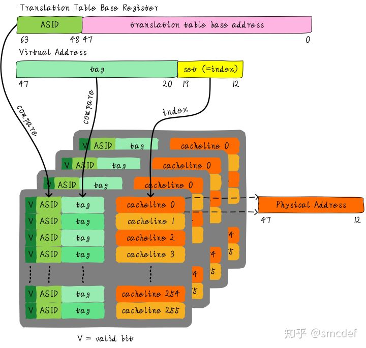

##### ASID管理

ASID是硬件定死的，而且一般不大（8b或16b），因此不可能每个pid都对应一个ASID。因此操作系统有一套机制分配和回收ASID

#### global映射

虽然上面引入了ASID减少了TLB flush，但在实际操作系统中内核空间和用户空间是分开的，其中内核空间是共享的，且经常被访问。但对于不同进程，同样一块内核空间的ASID不同，增加了TLB flush。解决方法是引入一个nG bit（non-global）来代表是不是global映射。如果是global映射（内核空间的映射）则不比较ASID

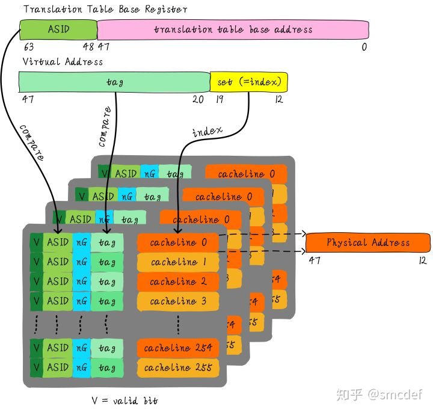

#### 什么时候应该flush TLB

- 当ASID分配完的时候，需要flush全部TLB。ASID的管理可以使用bitmap管理，flush TLB后clear整个bitmap。
- 当我们建立页表映射的时候，就需要flush虚拟地址对应的TLB表项。第一印象可能是修改页表映射的时候才需要flush TLB，但是实际情况是只要建立映射就需要flush TLB。原因是，建立映射时你并不知道之前是否存在映射。例如，建立虚拟地址A到物理地址B的映射，我们并不知道之前是否存在虚拟地址A到物理地址C的映射情况。所以就统一在建立映射关系的时候flush TLB。

## ref

https://zhuanlan.zhihu.com/p/102293437  cache基本原理

https://zhuanlan.zhihu.com/p/107096130  cache组织方式

http://witmax.cn/cache-writing-policies.html  Cache写机制：Write-through与Write-back

https://zhuanlan.zhihu.com/p/109919756  cache和DMA一致性

https://zhuanlan.zhihu.com/p/112704770  Dcache和Icache一致性

https://zhuanlan.zhihu.com/p/115114220  多核cache一致性

https://zhuanlan.zhihu.com/p/108425561  TLB原理