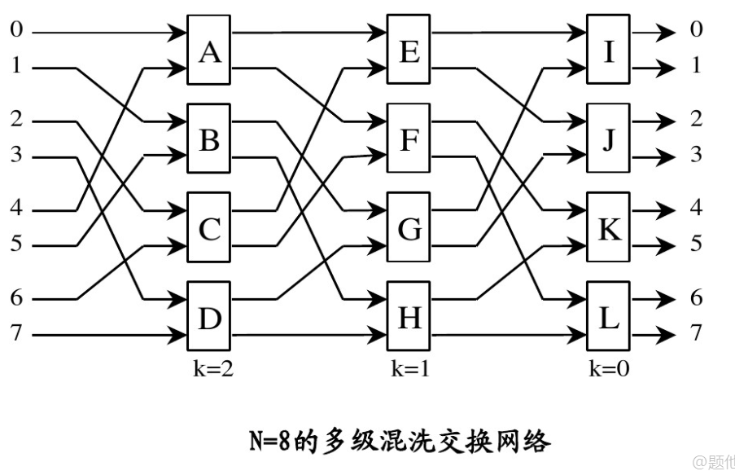

### 题目

反Omega网构造方法和路由方法

### 解

#### Omega网

Omega网示意如上图

##### 混洗策略

网络的混洗策略如下：

* 在每一层，第 $ [x_{n-1} \cdots x_1 x_0] $ 个输入口与第 $[x_{n-2} \cdots x_0 x_{n-1}]$ 个输出口相连

因此输入每经过一层网络，地址都会循环左移一位，再输入当前层的交换单元

##### 路由策略

假设输入为 $[x_{n-1} \cdots x_1 x_0]$ ，路由目的地址为 $[y_{n-1} \cdots y_1 y_0]$ ，omega网的特点就是经过每层交换单元时，路由策略只与输出端口地址有关，与输入端口地址无关

路由策略为，在经过第m层的交换网络时，对应`2*2`交换单元的开关状态为$y_m$

因为一个`2*2`路由单元本质上是替换最低位，即对于输入$[x_{n-1} \cdots x_1 x_0]$，若开关状态为$y_m$，实际上输出为$[x_{n-1} \cdots x_1 y_m]$

因此Omega网的1层混洗+路由实际上将地址$[x_{n-1} \cdots x_1 x_0]$变换为$[x_{n-2} \cdots x_0 y_{n-1}]$

由此迭代m次，将地址$[x_{n-1} \cdots x_1 x_0]$变换为$[x_{n-m-1} \cdots x_0 y_{n-1} \cdots y_{n-m}]$

迭代n次后地址即为$[y_{n-1} \cdots y_1 y_0]$

#### 反Omega网

通过观察上面Omega网的结构，可以得到

##### 混洗策略

因为Omega网正向连接是输出端口为输入端口号循环左移一位，因此反向Omega网混洗为：输出端口号为输入端口号**循环右移一位**

##### 路由策略

假设输入为 $[y_{n-1} \cdots y_1 y_0]$ ，路由目的地址为 $[x_{n-1} \cdots x_1 x_0]$ ，则

经过一层混洗将$[y_{n-1} y_{n-2} \cdots y_1 y_0]$变换为$[y_0y_{n-1} \cdots y_2 y_1]$

按照Omega网的路由思路，我们应该先通过交换单元将$y_0$替换为$x_0$，然后混洗一次，循环右移，此后将$y_1$替换为$x_1$，迭代。而反Omega网每一层是先经过路由再经过混洗，因此可以总结路由策略如下
$$
\begin{aligned}
& 对于输入[y_{n-1} \cdots y_1 y_0]， 目的地址为[x_{n-1} \cdots x_1 x_0]的路由，第m层交换单元的开关状态为x_m
\\
& 其中m的编码方式如上图正Omega网所示
\end{aligned}
$$
**证明如下**
$$
\begin{aligned}
& 对于输入[y_{n-1} \cdots y_1 y_0]， 目的地址为[x_{n-1} \cdots x_1 x_0]
\\
& 经过第一层路由时，由于开关状态为x_0，因此输出为[y_{n-1} \cdots y_1 x_0]
\\
& 此后经过一层混洗，输出为[x_0 y_{n-1} \cdots y_1]。以上两步为一层网络的操作
\\
& 以此类推，经过m层网络，输出为[x_{m-1} \cdots x_0 y_{n-1} \cdots y_{m}]
\\
& 因此经过n层网络时输出为[x_{n-1} \cdots x_1 x_0]
\\
& 证毕
\end{aligned}
$$
