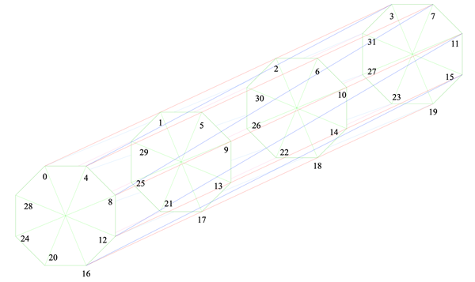
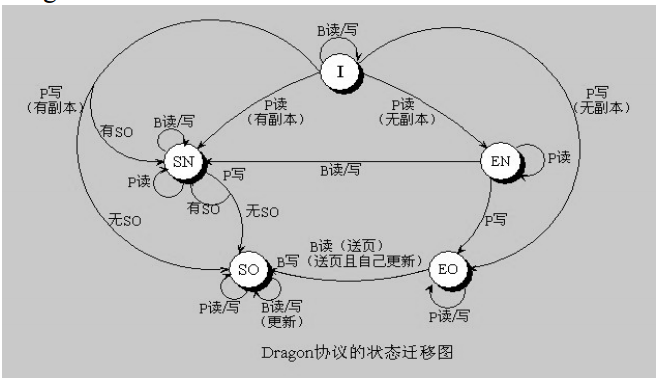

**姓名：陈启源**      **学号：2120200478**

 

## 题目：

有NUMA型结构如图1所示：



节点处的结构如图2所示，每个节点处有一个Home Memory。


该结构共有32个节点，以十进制给与各节点编号。

给定号码n的连接方式:

n → mod( (n + 4i ),32 )，i为0, 1, 2。

（1）请给出用于该结构的数据一致性管理方案， 并评价其效率的优劣。

（2）请给出该拓扑结构的路由算法，并证明其正确。


## 解答

### 第一题

​        从节点结构可以直接看出，这是CC-NUMA架构的并行机。对于CC-NUMA的并行机，数据一致性管理方案分为两个方面：

* home memory中数据的管理，主要是记录当前页在其他节点的使用情况
* 数据一致性协议

#### Home memory数据管理：

##### 方案比较

一般有如下几种方案，这里列出方案并比较优劣，最后选择较符合当前架构要求的方案。

* Limited pointed法：

  一般实践可证明，同时使用同一页的 PU 的个数不会超过 4 个，因此设 4 个标志字段存储 P 的编号。如下图

  

  ​       因为当前结构共32个节点，编号长度为5位，因此4个pointer的长度为20位。即每个内存页面需要额外的20bit来表示其在其他节点的使用情况。

  ​       该方法的优点在于额外的内存使用量小，缺点在于当共享当前页面的节点数大于4时，就需要取消某个节点对该页面的共享（将其无效化），有额外的时间开销。

* Full Map法：

  用一个位来表示对应节点的cache中是否存在本页，如下图

  

  ​        这里$PU_n$表示一个bit，该bit表示第n个节点中是否包含当前页的数据。

  ​        因为当前结构共32个节点，因此每个内存页面需要32个bit作为标志位。

  ​        该方法的优点在于可以一次性记录一个页面在所有节点中的使用情况，避免了limited pointed记录满后需要换页的额外开销。缺点在于内存使用较多。

* 链接法

  ​        每个页面只保存一个P的编号，其指向下一个使用该页面的节点的cache。下一个节点的cache上也有一个指针指向另一个使用该页面的节点。直到最后一个cache页将其设置为结束标志。形成一个类似链表的结构。如下图：

  

  ​        这种方法的优点在于内存消耗小，当前结构中一个节点编号为5位，则只需要5位的额外空间。若加上一个专门表示结束状态的位则为6位。缺点在于需要n次访问才能找到第n个使用该页的节点，时间开销大。

##### 总结

​        综上所述，若主要考虑时间开销小，则应使用full map法或limited pointed法；若主要考虑内存消耗小，应主要考虑链接法，limited pointed法次之。若主要考虑适用性强，应主要考虑full map法，链接法次之。

​        折中考虑，似乎limited pointed更优，但个人认为首先因为20位与32位仅相差12位，且32位是字节对齐的，可能有利于处理，因此若单个内存页面大小较大时，可以考虑使用full map法。


#### 数据一致性协议

数据一致性协议分为即写型，后写无效化型与更新型。即写型因为bus开销太大这里不考虑，主要讨论后写无效化型与更新型。

##### 后写无效化型

​        后写无效化型的基本思想是，当一个P改写cache的一页，有同样页的其他节点的cache中该页被无效化。改写后的cache不立即写入内存和其他共享该页的cache，而是等到其他cache对该页发起读或写时才进行该操作。

典型代表是Berkley协议


​        Berkley协议结合了所有权（owner/non-owner）与是否独有（exclusive/shared）的概念，前者使得大量内存访问可以转移到cache上，提高了速度；后者可以减少总线上冗余的无效化信息。

​        后写无效化型协议主要缺陷在于，当总线上多个节点对同一块内存交替写入时，会导致ping-pong效应，使总线繁忙。

##### 更新型协议

​        更新型协议的基本思想是，当cache中的页面被修改时，所有拥有该副本的位置应同时进行修改。

典型代表是Dragon协议



​        Dragon协议也引入了所有权与是否独有的概念，但因为更新型协议在数据被修改时同时更新所有副本，因此不需要像Berkley协议一样让渡owner，因此Dragon协议中的owner即第一个对该页面发起写请求的节点。

​        更新型协议的主要缺陷在于，当一个节点对某个页面操作，此后该工作换到另一个节点，但因为内存页面在两个节点间共享，因此虽然第一个节点当前不处理该工作，但其cache仍然在进行无用的更新。

##### 总结

​        无效化型适用于一个节点连续处理的情况，更新型适用于多个节点交替处理的情况。这里个人认为采用后写无效化型的Berkley协议通用性较强，因为更新型协议要求各个数据副本保持同步的思想必然对于总线的要求较后写无效化要高。


### 第二题

该结构的连接方式如下式

n → mod( (n + 4i ),32 )，i为0, 1, 2。

#### 方案1

​        对于一个节点n，与它连接的共有五个节点，分别为n-16，n-4，n-1，n+1，n+4，n+16，其中因为序号是模32的，n-16与n+16是同一个节点。因为共有32个节点，因此可以以5个bit表示一个节点的序号（因为$2^5=32$）。

​        最简单的想法就是以这几个数为加法元，根据源节点与目的节点的序号差值，每次选择小于差值的最大元来跳转。如节点3到节点8，差值为5，因此第一跳选择3+4=7，第二跳选择7+1=8。具体的跳转规则如下：

设目的地址为d，源地址为s，定义序号差值为
$$
diff = d - s
$$
则跳转规则为
$$
下一跳地址 = \left \{
\begin{aligned}
s-16 & & -32 < diff \leq -16 \\
s-4 & & -16 < diff \leq -4 \\
s-1 & & -4 < diff \leq -1 \\
s+1 & & 1 \leq diff < 4  \\
s+4 & & 4 \leq diff < 16 \\
s+16 & & 16 \leq diff < 32
\end{aligned}
\right.
$$
显然按照上述规则跳转并不能得到最优解，如s=0，d=15，路由过程为 0 -> 4 -> 8 -> 12 -> 13 -> 14 -> 15；相反，s=15，d=0的情况下，路由过程为 15 -> 11 -> 7 -> 3 -> 2 -> 1 -> 0

##### 方案正确性

实际上这个路由方案就是求解下式
$$
diff = \pm ( 16a_0 + 4a_1 + a_2 )
$$
其中会使得序号较小的a尽量大的值，且a一定大于0。

由于-31~31的所有数都可以表示为以上形式，即所有的diff值都可以表示，因此路由算法是正确的


#### 方案2

首先注意到该结构的各节点序号是模32的，也就是说31与0节点的实际距离为1。但在方案1中距离为31。

此外可以进一步推导，对于节点s和节点d，假设d>s，两节点间正序和逆序的距离分别为
$$
\begin{aligned}
正序距离 &= d - s \\
逆序距离 &= 32 - d + s
\end{aligned}
$$
所以可以先比较两个距离，选择较小的那个进行跳转，经过化简得，当$|d-s|<16$，正序距离较近，跳转规则如下：
$$
下一跳地址 = \left \{
\begin{aligned}
s+1 & & -32 < diff \leq -29 \\
s+4 & & -29 < diff \leq -16 \\
s-4 & & -16 < diff \leq -4 \\
s-1 & & -4 < diff \leq -1 \\
s+1 & & 1 \leq diff < 4  \\
s+4 & & 4 \leq diff < 16 \\
s-4 & & 16 \leq diff < 29 \\
s-1 & & 29 \leq diff < 32
\end{aligned}
\right.
$$

##### 方案正确性

实际上这个路由方案就是求解下式
$$
diff = \left \{
\begin{aligned}
& \pm ( 4a_1 + a_2 ) & &when \ |diff| < 16

\\

& [32 \pm (4a_1 + a_2)] \ mod \ 32 & &when \ \ |diff| \geq 16
\end{aligned}
\right .
$$
由于-31~31的所有数都可以表示为以上形式，因此路由算法是正确的


#### 方案3

方案2也不是总能找到最优路径，原因在于，该路由算法只能从一个方向逼近目的地址。假如s<d，则路由的中间节点n必满足$s<n<d$，或$s-32<n<d$

改进思路就是将其变为可以向另一个方向路由的算法，这种方式下不单纯是靠两个节点序号的差值判断下一跳地址，而是根据可能的下一跳地址与目的地址的差值来选择。如s=0，d=15，最优跳转应是 0 -> 16 -> 15 。具体思路如下：

设目的地址为d，源地址为s，定义序号差值为
$$
diff = d - s
$$
假设两节点间距离
$$
D_{d, s} = 
\left \{
\begin{aligned}
|d-s| & & when \ |d-s| < 16 \\
|(32-d+s) \ mod \ 32| & & when \ |d-s| \geq 16
\end{aligned}
\right.
$$
当前跳转地址的最优解应为
$$
min\{ D_{d, s+4}, D_{d, s+1}, D_{d, s+16}, D_{d, s-4}, D_{d, s-1} \}
$$


​        按照上述方案的规则可以直接推导出一个只与s和d差值有关，与s和d本身无关的表。

​        若考虑模32下的运算，减法可以转换为加法，如`(a-b) mod 32 = (a-b+32) mod 32`

​        对于节点n，因为其路由的可能性只有32种，可以列出全部情况，这里假设每个节点n相连的5个节点n-16，n-4，n-1，n+1，n+4，端口号分别为0 1 2 3 4，则可以列出下表，该表为n到每个节点的最优跳转方法。这里将减法写作模32下的加法

```
n+1   n+1					3
n+2   n+1+1					33
n+3   n+4-1					42
n+4   n+4					4
n+5   n+4+1					43
n+6   n+4+1+1				433
n+7   n+4+4-1				442
n+8   n+4+4					44
n+9   n+4+4+1				443
n+10  n+4+4+1+1 n+16-4-1-1	 4433  0122
n+11  n+16-4-1				012
n+12  n+16-4				01
n+13  n+16-4+1				013
n+14  n+16-1-1				022
n+15  n+16-1				02
n+16  n+16					0
n+17  n-16+1				03
n+18  n-16+1+1				033
n+19  n-16+4-1				042
n+20  n-16+4				04
n+21  n-16+4+1				043
n+22  n-4-4-1-1 n-16+4+1+1	 1122 0433
n+23  n-4-4-1				112
n+24  n-4-4					11
n+25  n-4-4+1				113
n+26  n-4-1-1				122
n+27  n-4-1					12
n+28  n-4					1
n+29  n-4+1					13
n+30  n-1-1					22
n+31  n-1					2
```

根据该表，可以简单地得到一个路由规则：

设目的地址为d，源地址为s，定义序号差值
$$
distance = \left \{
\begin{aligned}
d - s & & d \geq s
\\
32+d-s & & d<s
\end{aligned}
\right.
$$
这个序号差值实际上就是将d-s的补码直接按位转换为无符号数，从实现上来看很简单
$$
下一跳地址 = \left \{
\begin{aligned}
s+1 & & 0 < distance \leq 2
\\
s+4 & & 2 < distance \leq 9
\\
s+16 & & 9 < distance \leq 22
\\
s-4 & & 22 < distance \leq 29
\\
s-1 & & 29 < distance \leq 31
\end{aligned}
\right.
$$

##### 方案正确性

​        上述方案难以用解析式直接描述，但由于每次路由的目的地址是这5个地址的最小值，因此该方案的路由必然是收敛的，即可以在有限次路由下到达目的地址。此外每个地址都对应上表的一个表项，因此是正确的。

#### 总结

上述方案显然方案三拥有最优的路径选择，且在打表的方式下路由算法可以较为简单。因此选用方案三作为路由方案。