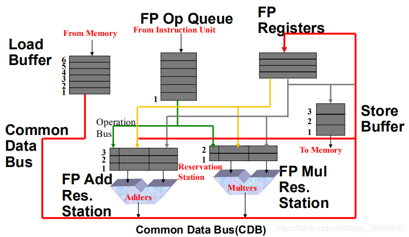
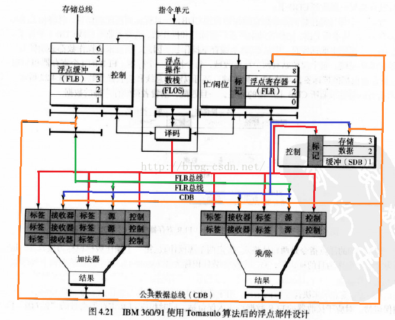

这个系列的blog讲的很不错，内容是主要是计算机体系结构——量化研究方法这本书里的

https://blog.csdn.net/sinat_36945592/category_8781678.html

注意，看这系列的时候，到 **动态调度中的计分板算法** 这里，一定要注意例子里的不同指令运行周期数不同，即一条指令卡在exec这个部分的周期数不同（其他几个部分都是1个周期），分别为

| 指令 | 周期数 |
| ---- | ------ |
| LD   | 1      |
| SD   | 1      |
| ADDD | 2      |
| SUBD | 2      |
| MULT | 10     |
| DIVD | 40     |

（这里因为不知道这个前置条件让我蒙了好久）

下面链接给出了一个演示代码

https://blog.csdn.net/lady_killer9/article/details/102787391

这段代码现在放在program/python文件夹的SystemStructure里，使用的时候

* 运行django服务器

```
python3 manage.py runserver
```

* 然后到web/dist下打开index.html


### 动态调度算法

#### 冲突类型

* 结构冲突  不同指令使用同一个器件
* 数据冲突
  * RAW  写后读，指对于同一个寄存器，如果A指令是写入，后续的指令B是读出，则必须保证A执行完后才能执行B，因为B的源操作数依赖于A
  * WAW  写后写，指对于同一个寄存器，如果A指令是写入，后续的指令B也是写入，则必须保证A写回后B才写回，从而保证指令执行到B以后，寄存器内的数据是B写入的
  * WAR  读后写，指对于同一个寄存器，如果A指令是读出，后续的指令B是写入，则必须保证A读完后B才写回，保证A读到的是B写之前的数
* 控制冲突  条件跳转时在发生跳转前，跳转语句下面的指令可能已经进入流水线

#### 记分板算法

思想比较简单，通过一系列表来记录正在运行的指令对各个寄存器、器件的使用，令存在冲突的指令进行等待

##### 流水线

* 流出  对当前指令译码，检查是否有**结构冲突**与**WAW冲突**（当前指令的目的寄存器与其他正在运行的指令相同）。若都没有则送入流水线，否则**停顿等待**
* 读数  读取源操作数，这里检查是否有**RAW冲突**（当前指令的源寄存器是否是其他正在运行指令的目的寄存器），若有则等待
* 执行  执行运算
* 写回  这里检查是否有**WAR冲突**（当前指令的目的寄存器是否是其他正在运行指令的源寄存器），若有则等待

##### 状态表

为了记录当前指令对各个部分的使用情况，记分板算法保存了下面两个表

* 功能部件状态表  表的纵轴是CPU的各个功能单元，如加法器 乘法器等。下面为横轴
  * Busy  记录当前器件是否可用
  * Op  说明当前哪条指令正在占用该功能单元
  * Fi  记录目标寄存器
  * Fj Fk  记录源寄存器/操作数
  * Rj Rk  标识当前源寄存器是否可用
  * Qj Qk  记录当前哪个单元正在占用源寄存器
* 寄存器写入状态表  若正在运行的指令中有需要写入寄存器的，则在对应项上标识当前哪个部件正在使用

PS：个人觉得实际实现中应该不需要Qj Qk，寄存器写入状态表也不需要具体标识哪个部件正在使用。因为指令只需要在进入新的周期时判断Rj Rk是否可用即可。而各个表项的清空工作应该是一条指令运行完后清对应的表项

##### 例子

下面以那篇文章的例子说明（好像所有说明记分板算法的blog都用了这个例子）

指令如下（MIPS汇编），注意这里各条指令的执行时间不等，见开头的那张表

```
LD F6 34+ R2
LD F2 45+ R3
MULT F0 F2 F4
SUBD F8 F6 F2
DIVD F10 F0 F6
ADDD F6 F8 F2
```

这里应注意一点：假设每种运算只有一个对应的功能部件，则如果两条使用了同样部件的指令同时出现，指令只能顺序运行。如例子中的两个LD，在执行第一条LD的时候，第二条LD因为结构冲突无法流出，此时整个流水线会停在这里，也就是说即使下一条MULT与LD不存在结构冲突，也会停顿

这里**使用ABCD简单标注各个部件**

* 1-4周期

```
				Issue	Read	Exec	Write	
LD F6 34+ R2		1		2		3		4
LD F2 45+ R3
MULT F0 F2 F4
SUBD F8 F6 F2
DIVD F10 F0 F6
ADDD F6 F8 F2

			Busy	Op		Fi	Fj/Fk	Rj/Rk	Qj/Qk
A:LOADER_1		1	LD		F6	34+/R2	1/1		0/0
B:ADDER_1
C:MULT_1
D:DIV_1

		F0	F2	F4	F6	F8	F10
FLag				A
```

* 5-7周期  此时MUL和SUB因为依赖于F2，所以卡住

```
				Issue	Read	Exec	Write	
LD F6 34+ R2		1		2		3		4
LD F2 45+ R3		5		6		7
MULT F0 F2 F4		6
SUBD F8 F6 F2		7
DIVD F10 F0 F6
ADDD F6 F8 F2

			Busy	Op		Fi	Fj/Fk	Rj/Rk	Qj/Qk
A:LOADER_1		1	LD		F2	45+/R3	1/1		0/0
B:ADDER_1		1	SUBD	F8	F6/F2	0/1		0/A
C:MULT_1		1	MULT	F0	F2/F4	0/1		A/0
D:DIV_1

		F0	F2	F4	F6	F8	F10
FLag	C	A			B
```

* 8-10周期
  * 此时由于LD运行完，F2可以使用，因此MULT和SUBD同时进入Read阶段
  * DIVD由于依赖于F0，因此继续等待
  * 注意在第10周期，原本应该读入ADDD指令，但由于加法器被SUBD指令占用，因此进入等待

```
				Issue	Read	Exec	Write	
LD F6 34+ R2		1		2		3		4
LD F2 45+ R3		5		6		7		8
MULT F0 F2 F4		6		9
SUBD F8 F6 F2		7		9
DIVD F10 F0 F6		8
ADDD F6 F8 F2

			Busy	Op		Fi	Fj/Fk	Rj/Rk	Qj/Qk
A:LOADER_1
B:ADDER_1		1	SUBD	F8	F6/F2	1/1		0/0
C:MULT_1		1	MULT	F0	F2/F4	1/1		0/0
D:DIV_1			1	DIVD	F10	F0/F6	0/1		C/0

		F0	F2	F4	F6	F8	F10
FLag	C				B	D
```

* 11-16周期
  * SUBD执行完毕，ADDD进入流水线并运行，但在写回阶段，发现有一个WAR冲突（DIV需要读取F6但还未读），因此等待

```
				Issue	Read	Exec	Write	
LD F6 34+ R2		1		2		3		4
LD F2 45+ R3		5		6		7		8
MULT F0 F2 F4		6		9
SUBD F8 F6 F2		7		9		11		12
DIVD F10 F0 F6		8
ADDD F6 F8 F2		13		14		16

			Busy	Op		Fi	Fj/Fk	Rj/Rk	Qj/Qk
A:LOADER_1
B:ADDER_1		1	ADDD	F6	F8/F2	1/1		0/0
C:MULT_1		1	MULT	F0	F2/F4	1/1		0/0
D:DIV_1			1	DIVD	F10	F0/F6	0/1		C/0

		F0	F2	F4	F6	F8	F10
FLag	C			B		D
```

* 17-21周期
  * MUL终于在20周期执行完成并写回，因此21周期DIVD进入Read阶段

```
				Issue	Read	Exec	Write	
LD F6 34+ R2		1		2		3		4
LD F2 45+ R3		5		6		7		8
MULT F0 F2 F4		6		9		19		20
SUBD F8 F6 F2		7		9		11		12
DIVD F10 F0 F6		8		21
ADDD F6 F8 F2		13		14		16

			Busy	Op		Fi	Fj/Fk	Rj/Rk	Qj/Qk
A:LOADER_1
B:ADDER_1		1	ADDD	F6	F8/F2	1/1		0/0
C:MULT_1
D:DIV_1			1	DIVD	F10	F0/F6	1/1		0/0

		F0	F2	F4	F6	F8	F10
FLag				B		D
```

* 22周期
  * ADDD的WAR冲突解除，写入F6，执行完毕

```
				Issue	Read	Exec	Write	
LD F6 34+ R2		1		2		3		4
LD F2 45+ R3		5		6		7		8
MULT F0 F2 F4		6		9		19		20
SUBD F8 F6 F2		7		9		11		12
DIVD F10 F0 F6		8		21
ADDD F6 F8 F2		13		14		16		22

			Busy	Op		Fi	Fj/Fk	Rj/Rk	Qj/Qk
A:LOADER_1
B:ADDER_1
C:MULT_1
D:DIV_1			1	DIVD	F10	F0/F6	1/1		0/0

		F0	F2	F4	F6	F8	F10
FLag						D
```

* 23-62周期
  * DIVD指令执行完成

```
				Issue	Read	Exec	Write	
LD F6 34+ R2		1		2		3		4
LD F2 45+ R3		5		6		7		8
MULT F0 F2 F4		6		9		19		20
SUBD F8 F6 F2		7		9		11		12
DIVD F10 F0 F6		8		21		61		62
ADDD F6 F8 F2		13		14		16		22

			Busy	Op		Fi	Fj/Fk	Rj/Rk	Qj/Qk
A:LOADER_1
B:ADDER_1
C:MULT_1
D:DIV_1			1	DIVD	F10	F0/F6	1/1		0/0

		F0	F2	F4	F6	F8	F10
FLag						D
```

#### Tomasulo算法

https://blog.csdn.net/qq100440110/article/details/51378919



核心思想是使用**寄存器重命名**的方法，将寄存器替换成虚拟寄存器以**解决WAW冲突和WAR冲突**，并存入缓冲器，称为保留站（Reservation station）。这里保留站要比寄存器数量多，从而解决上述冲突

##### 流水线

* Issue  取指令，若保留站空闲（无**结构冲突**），则发射指令及操作数到保留站（对寄存器换名）。
* Execution  若两个操作数都**已就绪**，则执行。若没就绪，则观察公共总线等待结果（这里解决**RAW冲突**）
* Write Result  完成执行，并通过公共数据总线（CDB）将结果写入所有等待的部件，此后标记保留站可用

##### 例子



```
ADDD F4 F0 F8
MULT F2 F0 F4
ADDD F4 F4 F8
MULT F8 F4 F2
```

下面表中，RS为保留站（Reservation Station），FLR为浮点寄存器（Float Register）

这里的例子中，上面网页中的流水线可以一个周期发射两条指令，下面的表还是按照一条来写。此外指令的周期数与上个例子相同

* 第1周期  发射第一条指令`ADDD F4 F0 F8`。
  * 因为写入F4，所以FLR忙位为T，标签对应保留站编号1（这里相当于将F4重命名为1）。
  * 此外将两个源操作数放入Adder的保留站，因为两个源操作数的忙标签为空，因此可以直接被装入

```
FLR
	忙	标签	数据
0				6.0
2				3.5
4	T	  1		10.0
8				7.8

Adder RS
	标签	接收器	标签	源
1	0	  6.0	 0	  7.8
2
3

Mul RS
	标签	接收器	标签	源
4
5
6
```

* 第2周期  发射第二条指令`MULT F2 F0 F4`。
  * 注意这里MULT使用了F4，此时忙位为T，且被保留站1使用，因此这两条指令存在RAW，需要等待

```
FLR
	忙	标签	数据
0				6.0
2	T	  4		3.5
4	T	  1		10.0
8				7.8

Adder RS
	标签	接收器	标签	源
1	0	  6.0	 0	  7.8
2
3

Mul RS
	标签	接收器	标签	源
4	0	  6.0	 1	  ---
5
6
```

* 第3-4周期  发射第三第四条指令`ADDD F4 F4 F8  MULT F8 F4 F2`，第一条指令执行，第二条指令还是在等待。
  * ADDD的源操作数F4因为状态为忙，因此标签为1
  * ADDD的目的操作数F4此前由保留站1维护，在ADDD指令后应该由保留站2维护（即当前ADDD指令所在位置），因此更新F4标签为2
  * MULT的目的操作数为F8，因此F8标签为5

此时的状态，除了第一条指令（保留站1）在执行，其他皆在等待。到第4周期恰好第一条指令写回（加法操作2周期）

```
FLR
	忙	标签	数据
0				6.0
2	T	  4		3.5
4	T	  2		10.0
8	T	  5		7.8

Adder RS
	标签	接收器	标签	源
1	0	  6.0	 0	  7.8
2	1	  ---	 0	  7.8
3

Mul RS
	标签	接收器	标签	源
4	0	  6.0	 1	  ---
5	2	  ---	 4	  ---
6
```

* 第5周期  保留站1的指令执行完后（即第一条指令），向公共数据总线广播结果。
  * **注意**，此时FLR中的F4已经依赖于保留站2（即寄存器重命名为2），因此保留站1的指令虽然写入的是F4，但实际上由于寄存器重命名并不会写入FLR中的F4
  * 此时几个依赖于保留站1的指令接收结果，并且将标签置为0

此时保留站2和保留站4的指令（第3条和第2条指令）都开始执行

```
FLR
	忙	标签	数据
0				6.0
2	T	  4		3.5
4	T	  2		10.0
8	T	  5		7.8

Adder RS
	标签	接收器	标签	源
1	
2	0	  13.8	 0	  7.8
3

Mul RS
	标签	接收器	标签	源
4	0	  6.0	 0	  13.8
5	2	  ---	 4	  ---
6
```

* 第7周期  保留站2的指令执行完，向公共数据总线广播结果
  * **注意**，这次的结果会写入FLR的F4。
  * 此外保留站5的第一个源操作数确定

```
FLR
	忙	标签	数据
0				6.0
2	T	  4		3.5
4		  		21.6
8	T	  5		7.8

Adder RS
	标签	接收器	标签	源
1	
2	
3

Mul RS
	标签	接收器	标签	源
4	0	  6.0	 0	  13.8
5	0	  21.6	 4	  ---
6
```

* 第16周期  保留站4的指令执行完并写回，保留站5的第二个源操作数确定，并开始执行

```
FLR
	忙	标签	数据
0				6.0
2		  		82.8
4		  		21.6
8	T	  5		7.8

Adder RS
	标签	接收器	标签	源
1	
2	
3

Mul RS
	标签	接收器	标签	源
4	
5	0	  21.6	 0	  82.8
6
```

* 第27周期  保留站5的指令执行完并写回。执行结束

```
FLR
	忙	标签	数据
0				6.0
2		  		82.8
4		  		21.6
8				1788.48

Adder RS
	标签	接收器	标签	源
1	
2	
3

Mul RS
	标签	接收器	标签	源
4	
5
6
```

