# 第0部分

## 第一章 计算机系统漫游

主要内容可以在计组或者程序员自我修养看到，主要讲了

* 程序链接编译执行过程
* 指令怎么在计算机上运行，计算机的架构
* 计算机的存储结构
* 进程 线程 虚拟内存
* 文件的概念
* Amdahl定律
* 并行与并发相关
  * 线程级并发
    * 超线程技术原理是在一个处理器中有多个寄存器作为context，这使得处理器在切换线程的时候不需要保存context
  * 指令级并发
    * 流水线
    * 超标量
  * SIMD


下面是几张比较概括性的图

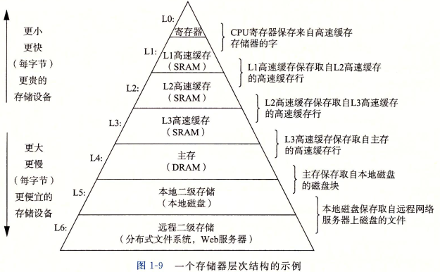

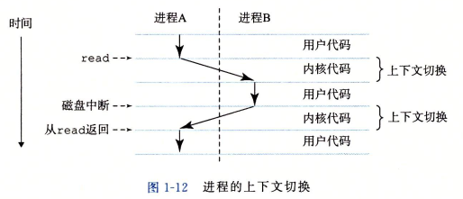

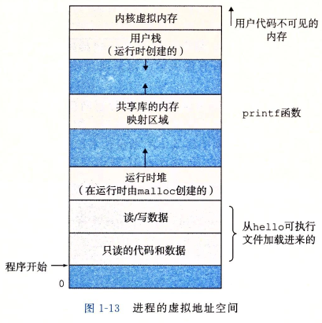

# 第一部分 程序结构和执行

## 第二章 信息的表示和处理

### 信息存储

* 十六进制

* C语言中对应数据的字节大小

* 字节序

* C语言中各种数据结构的十六进制表示

* 布尔代数
  
  * **布尔环** 若定义`^`为环的加法，则布尔代数可以形成环

#### C语言的位运算

位运算 逻辑运算以及掩码

##### 逻辑右移

位移时补0，对于无符号数使用

##### 算术右移

位移时补最高位，对于有符号数使用

**当位移数大于操作数位数时，实际位移量为位移数的模**

```
int val = 1 << 36;
```

实际位移为4

##### 左移

左移不分逻辑和算术移位，统一补0

##### 循环移位

左移时高n位补到低n位，右移时低n位补到高n位

### 整数表示

这里用数学的方法量化编码的方式

首先假设一个**二进制串**有w位，每个位只有0或1，可以将其写为向量形式
$$
\vec{x} = [x_{w-1}, x_{w-2}, \cdots, x_0]
$$
下面定义的各个函数将上述二进制串映射到对应的数

#### 无符号数

与数的二进制表示编码方式相同
$$
B2U_w(\vec x) = \sum_{i=0}^{w-1} x_i 2^i
$$

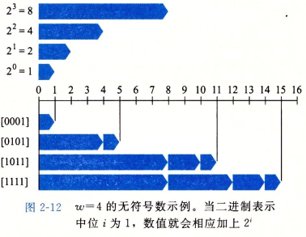

#### 原码

最高位是符号位
$$
B2S_w(\vec x) = (-1)^{x_{w-1}} \cdot (\sum_{i=0}^{w-2} x_i 2^i)
$$
这种表示方式就是以二进制直接表示数字的字面值（无论正负），再使用一个最高位表示正负。如1和-1的表示分别为`00000001`和`10000001`

这种方式存在负0，编码为`10000000`，对应正0为`00000000`

#### 反码

最高位权重是$2^{w-1}-1$（注意与补码区分）
$$
B2O_w(\vec x) = -x_{w-1}(2^{w-1}-1)+\sum_{i=0}^{w-2} x_i 2^i
$$

在正数部分与原码相同，负数部分的数值总是$[11...1] - x$，在计算时即为x取反

这种方式同样存在负0，编码为`11111111`，正0同样为`00000000`

#### 补码

$$
B2T_w(\vec x) = - x_{w-1} 2^{w-1} + \sum_{i=0}^{w-2} x_i 2^i
$$

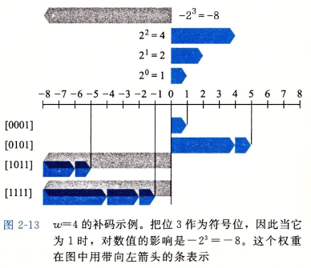

补码需要注意一点：负数部分比正数部分多了一个数。如对于8位补码，表示范围为`-128~127`，这是因为在补码中存在两个非符号位全为0的数`00000000`和`10000000`，由于对于0，不存在对应的负0，因此在正数域或负数域肯定有一个数是没有对应相反数的。

#### 有符号数

有符号数一般直接以补码表示

#### 有符号与无符号的转换

对于同一个二进制串x，有符号表示为
$$
B2T_w(\vec x) = - x_{w-1} 2^{w-1} + \sum_{i=0}^{w-2} x_i 2^i
$$
无符号表示为
$$
B2U_w(\vec x) = \sum_{i=0}^{w-1} x_i 2^i
$$
由于
$$
\begin{aligned}
B2T_w(\vec x) - B2U_w(\vec x) &= - x_{w-1} 2^{w-1} + \sum_{i=0}^{w-2} x_i 2^i - \sum_{i=0}^{w-1} x_i 2^i
\\
&= - x_{w-1} 2^{w-1} - x_{w-1} 2^{w-1}
\\
&= - x_{w-1} 2^w
\end{aligned}
$$
所以
$$
B2T_w(\vec x) = -x_{w-1} 2^w + B2U_w(\vec x)
$$
即**有符号转无符号**为
$$
T2U_w(\vec x) = x_{w-1} 2^w + x
$$

**无符号转有符号**为
$$
U2T_w(\vec x) = -x_{w-1} 2^w + x
$$
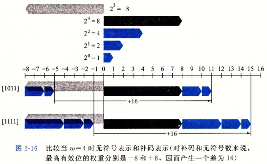

有符号与无符号间的互相转换是数域的转换

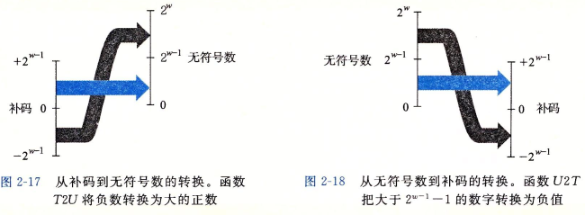

#### 位扩展

指一个数从位数少的存储空间扩展到位数多的存储空间时的扩展方式

##### 无符号数

直接以0扩展。假设从w位扩展到w'位，扩展方式为
$$
\vec x = [x_{w-1}, x_{w-2}, \cdots, x_0] \rightarrow \vec x' = [0, \cdots, 0, x_{w-1}, x_{w-2}, \cdots, x_0]
$$

##### 有符号数

有符号数以符号位做扩展，推导见最后
$$
\vec x = [x_{w-1}, x_{w-2}, \cdots, x_0] \rightarrow \vec x' = [x_{w-1}, \cdots, x_{w-1}, x_{w-1}, x_{w-2}, \cdots, x_0]
$$
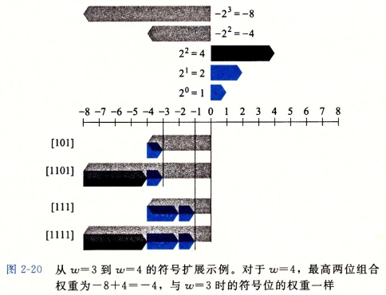

#### 截断数字

##### 无符号数

对于w位无符号数截断为k位
$$
B2U_k(\vec x) = B2U_w(\vec x) \ mod \ 2^k
$$

##### 有符号数

对于w位有符号数截断为k位
$$
B2T_k(\vec x) = U2T_k(B2U_w(\vec x) \ mod \ 2^k)
$$

##### 有符号与无符号互转

这里有个漏洞的例子

```c
void *memccpy(void* dst, void* src, size_t len);
#define KSIZE 1024
char kbuf[KSIZE];
int copy_from_kernel(void *user_dest, int maxlen)
{
    int len = KSIZE < maxlen ? KSIZE : maxlen;
    memcpy(user_dest, kbuf, len);
    return len;
}
```

这里size_t是unsigned，maxlen是int，因此若传入一个负数，可能造成未授权读取

### 整数运算

#### 无符号加法

$$
x+y = \left \{
\begin{aligned}
& x+y & & x+y < 2^w
\\
& x+y-2^w & & 2^w < x+y < 2^{w+1}
\end{aligned}
\right.
$$

即结果为$x+y \ mod \ 2^w $

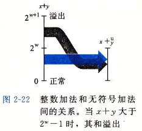

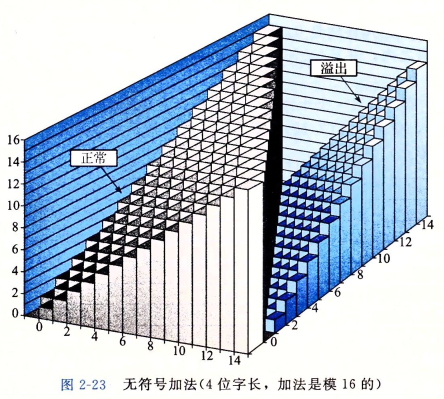

##### 检测无符号加法的溢出

若s=x+y，则当s<x或s<y时为溢出

##### 加法逆元

x的加法逆元为$2^w-x$，因为$(2^w - x + x) \ mod \ 2^w=0$

#### 有符号加法

$$
x+y = \left \{
\begin{aligned}
& x+y-2^w & & x+y \geq 2^{w-1} & & 上溢出（正溢出） \\
& x+y & & -2^{w-1} < x+y \leq 2^{w-1} & & 正常 \\
& x+y+2^w & & x+y < -2^{w-1} & & 下溢出（负溢出）
\end{aligned}
\right.
$$

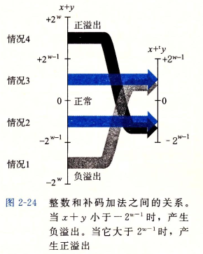

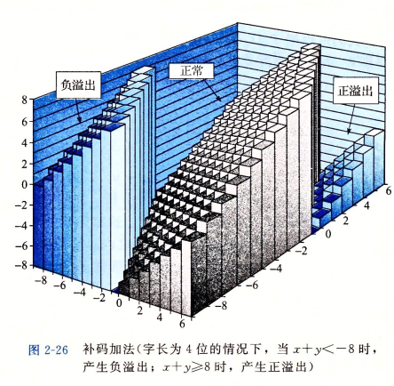

##### 补码加法溢出检测

* 正溢出： x>0 y>0且x+y<=0
* 负溢出： x<0 y<0且x+y>=0


# 一些问题的解释

## 第一部分

### 第二章 信息的表示和处理

#### 整数表示

##### 有符号数位扩展

因为扩展后为
$$
\begin{aligned}
\vec x' &= [x_{w-1}, \cdots, x_{w-1}, x_{w-1}, \cdots, x_0]
\\
&= -x_{w-1} 2^{w'-1} + \sum_{i=0}^{w'-2} x_{i} 2^i
\\
&= -x_{w-1} 2^{w'-1} + \sum_{i=w-1}^{w'-2} x_{w-1} 2^i + \sum_{i=0}^{w-2} x_i 2^i
\\
&= -x_{w-1} 2^{w-1} + \sum_{i=0}^{w-2} x_i 2^i
\end{aligned}
$$

#### 截断数字

##### 无符号数

$$
\begin{aligned}
B2U_k(\vec x) &= \sum_{i=0}^{k-1} x_i 2^i
\\
B2U_w(\vec x) &= \sum_{i=0}^{w-1} x_i 2^i = \sum_{i=k}^{w-1} x_i 2^i + \sum_{i=1}^{k-1} x_i 2^i
\\
&= \sum_{i=k}^{w-1} x_i 2^i + B2U_k(\vec x)
\\
&= 2^k \sum_{i=0}^{w-1-k} x_{k+i} 2^i + B2U_k(\vec x)
\end{aligned}
$$

由于$(2^k \sum_{i=0}^{w-1-k} x_{k+i} 2^i) \ mod \ 2^k = 0$，所以
$$
B2U_k = B2U_w(\vec x) \ mod \ 2^k
$$

##### 有符号数

$$
\begin{aligned}
U2T_k(B2U_w(\vec x) \ mod \ 2^k) &= U2T_k(x \ mod \ 2^k)
\\
&= -x_{k-1} 2^k + \sum_{i=0}^{k-1} x_i 2^i
\\
&= -x_{k-1} 2^{k-1} + \sum_{i=0}^{k-2} x_i 2^i
\\
&= B2T_k(\vec x)
\end{aligned}
$$

或者正向推
$$
\begin{aligned}
B2T_k(\vec x) &= -x_{k-1} 2^{k-1} + \sum_{i=0}^{k-2} x_i 2^i
\\
B2T_w(\vec x) &= -x_{w-1} 2^{w-1} + \sum_{i=0}^{w-2} x_i 2^i
\\
&= -x_{w-1} 2^{w-1} + \sum_{i=k}^{w-2} x_i 2^i + x_{k-1} 2^{k-1} + \sum_{i=0}^{k-2} x_i 2^i
\end{aligned}
$$
对于k位截断，剩下的数字为
$$
\begin{aligned}
B2T_w(\vec x) \ mod \ 2^k &= x_{k-1} 2^{k-1} + \sum_{i=0}^{k-2} x_i 2^i
\\
&= x_{k-1} 2^k + B2T_k(\vec x)
\end{aligned}
$$

#### 整数运算

##### 有符号加法

因为有符号加法在实际运算时与无符号相同，因此可以写为
$$
\begin{aligned}
x + y &= U2T_w( T2U_w(x) + T2U_w(y) )
\\
&= U2T_w( (x_{w-1}2^w+x + y_{w-1}2^w + y) \ mod \ 2^w )
\\
&= U2T_w( (x+y)\ mod \ 2^w )
\end{aligned}
$$
