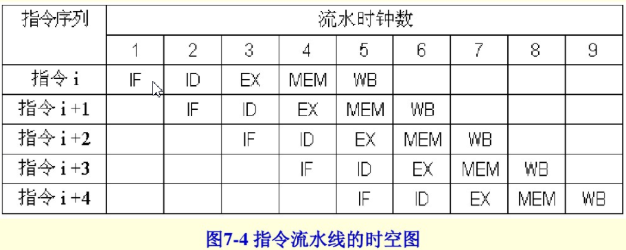

# rep ret

**翻译自[repz ret](https://repzret.org/p/repzret/)**

最近，我们在用一个二进制静态分析工具。

当读到一些反汇编代码的时候，我们遇到了一些看起来怪怪的结构，在我们用objdump反汇编的代码中大部分都存在着这一段

	f3 c3	repz ret
在现在的IA-32（x86/x86-64）指令集中，**repz** 是一个前缀，用于循环执行repz后面的指令直到rcx/ecx/cx寄存器为0

这个前缀有两种变型，这两种变型的终止条件取决于zero标志位的值（ZF标志位）

repne/repnz		当ZF=1时停止

repe/repz		当ZF=0时停止

IA-32手册中提到 “当前缀后的指令是非字符串操作指令时，这些前缀的行为未定义”

**ret** 显然是一个非字符串操作指令

这种结构是当gcc的优化选项打开时产生的，用clang编译则不会产生。

查找下gcc的邮件列表（此处感觉翻译有误）找到了如下的信息：https://gcc.gnu.org/ml/gcc-patches/2003-05/msg02117.html

```
Subject: K8 tweak 2
Hi,
AMD recommends to avoid the penalty by adding rep prefix instead of nop
because it saves decode bandwidth.
AMD建议使用rep前缀以取代nop因为它节省指令译码的带宽（速度）（感觉是这个意思）
```

查看旧版的《AMD K8微处理器优化手册》（第一本64位x86处理器的手册），里面提到了“2字节的Near-Return（翻译成。。。短跳？）结构”

书里在解释了这种写法：“一个2字节短跳结构有一个rep指令在ret前，这样写的效果和单字节跳转ret功能一致”

书里说在ret指令作为分支、条件或非条件跳转指令的目标时，或ret指令下直接是一个跳转语句的情况下这种写法比单个ret指令要更好

也就是说当一个分支结构后的第一条语句就是ret时，不论分支中的跳转有没有实现，这条ret指令前应该有一个rep前缀

为什么？因为“处理器在遇到单字节短跳结构时无法提供分支预测取指令的功能”，因此，“使用双字节短跳可以使处理器提供这种功能”，因为双字节指令不受影响

分支预测是现代微处理器最重要的功能之一：在执行分支指令前预测程序将跳转到哪里，可以极大地提高流水线的作用

流水线是另一个有趣的结构：现代CPU将一条指令拆分成若干个原子操作，从而实现多条指令的并行执行，以代替老式CPU一个时钟周期执行一条语句的做法。RISC流水线包含以下几个操作：

Fetch（取指令，从cache（高速缓存）或内存中取要执行的指令）

Decode（指令分析（译码），用于支持更高级的指令集）

Execute（指令执行）

Memory access（寻址）

Writeback（写回）

指令在流水线中的行为如下图（这图是我自己加的）



指令i在进行指令执行（EX）这步的同时，指令i+1进行指令分析（ID），同时指令i+2在进行取指（IF）

分支预测有利于流水线的效率，设想以下这种情况

```
...
    cmp r8, r9
    je equal

different:
    mov rax, 1
equal:
    xor rax, rax
```

要怎么知道下一个应该进入流水线的是哪个指令？是在defferent标识处的mov还是equal标识处的xor？在cmp和je两条指令执行完前你无法预知（注：因为如上图的流水线，je跳转的结果至少是在ID这一步才会修改ZF标志位，在EX这一步计算目标地址，而在此时按照流水线的执行过程，je后的第一条语句应已在进行指令译码，第二条指令已在执行取指令操作，此处存在的矛盾即：若要提高程序执行的效率则应该使流水线正常工作，然而因为还不能确定跳转语句je的条件是否达到，因此无法确定je下一条语句是什么）。

这也是分支预测这个功能要解决的事：预测将转移到哪个分支使CPU知道下一条要处理的语句是什么。或者至少努力达到预测的这个目标。如果预测失误，整个流水线就需要被刷新，因为当前的流水线充满了接下来不会执行的代码。

现在我们知道了为什么分支预测的失误将导致性能下降，但我们还不知道为什么简单且普遍的ret语句会使分支预测失效。

K8处理器的分支预测是这样工作的：每个16字节的代码块有三个分支预测器入口（分支“选择器”）并共享9个（每个奇数字节一个，byte0单独一个）分支“指示器”。分支预测器与高速缓存相连，且16字节的代码块分成4组4字节，这与第1级高速缓存的字长相同

分支指示器有两个输出位，当当前分支将不会执行时编码为0（00），否则指示选用哪个分支选择器（1 2 3）。分支选择器可以知道当前分支是return还是call还是永真/永假跳转，或者是其他条件跳转。

显然，要使代码更好地运行，最好是让每16字节代码只有三个跳转，或者更好的做法是只有一个跳转。

但若使用ret指令，这是唯一一个只有1字节的分支指令。如果一个ret指令偏移量为奇数，且ret下面的指令是另一个跳转，两条语句将共享一个分支预测器。如果一个ret指令是某个跳转语句的目标，且它的偏移量为偶数且不是16位对齐的（不在byte0），它也无法使用分支预测器。

在使用repz ret前，gcc使用

```
nop
ret
```

但存取两条指令明显比一条开销大

K10处理器优化指南与其他处理器相比有一个有趣的修改：使用ret 0代替repz ret，这里的ret 0其实是ret imm16，是个3字节指令

ret imm16用于指定ret时应该从栈顶弹出多少字节，这种结构很少用于cdecl的程序（虽然在UNIX C程序中无处不在），因为调用者负责清理栈。而在64位UNIX调用约定中，大多数参数使用寄存器传递。

因为在K10处理器家族中，ret imm16指令被优化了（这条指令没有被细分成一系列微指令）

对于新一代的AMD CPU，buildozer，我们发现将ret替换的建议消失了。因为分支预测器被重新设计，这些指令在性能上的限制已经不存在了。


有趣的是之前有人在qemu上运行valgrind时曾经出现过一个bug

```
> vex amd64->IR: unhandled instruction bytes: 0xF3 0xB8 0x92 0xE0

Last good BB seems like good code at 0x017043d5 but there is a problem decoding instruction starting at 0x017043d7. I asked qemu to output dyn-gen-code; qemu insists that it is a correct repz mov sequence:

###V's BB 10047
0x017043cf:  mov    -13631749(%rip),%eax        # 0xa042d0
0x017043d5:  jmpq   *%eax

###V's BB 10048
0x017043d7:  repz mov $0xe092,%eax
###V's choke here

0x017043dd:  mov    %eax,0x20(%rbp)
0x017043e0:  lea    -13631837(%rip),%ebx        # 0xa04289
0x017043e6:  retq
```

这说明qemu在解码的时候没有将repz ret当做一条指令，而是将ret移除，并把repz前缀加在后续的指令上

### ref

[浅谈分支预测、流水线与条件转移](https://www.cnblogs.com/yangecnu/p/4196026.html)

[第7章流水线结构RISC CPU设计](https://wenku.baidu.com/view/6daa90f871fe910ef02df838.html)

[分支预测器(Branch Predictor) 汇总介绍](https://wenku.baidu.com/view/31ec66b980eb6294dc886c6d.html)

[动态转移预测](http://blog.csdn.net/hivivi/article/details/6697422)