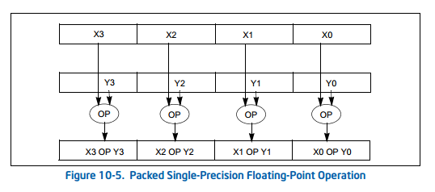
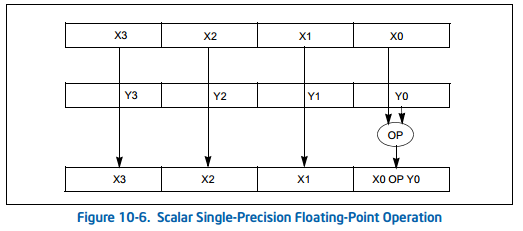
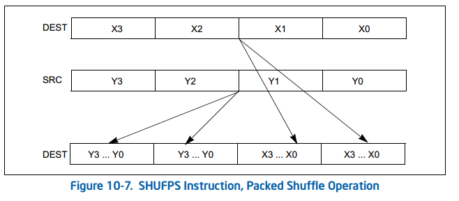
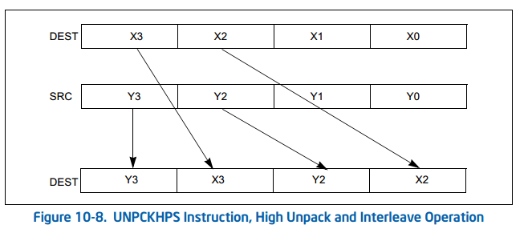
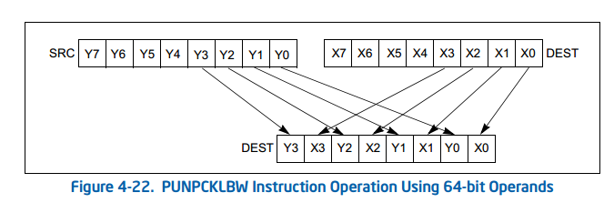
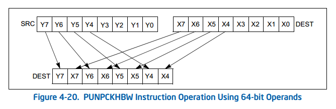
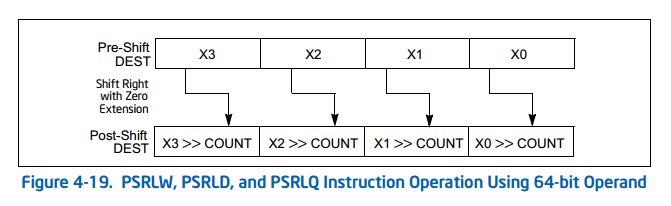

https://www.intel.com/content/www/us/en/docs/intrinsics-guide/index.html

### 函数命名

SIMD指令的intrinsics函数名称一般为如下形式

```
_mm_<bit_width>_<name>_<data_type>
```

* bit_width 表明了向量的位长度，即操作对象的数据类型大小，对于128位的向量，这个参数为空，对于256位的向量，这个参数为256

* name 描述了内联函数的算术操作。一般由两部分组成：

  * 第一部分是表示指令的作用，比如加法add等

  * 第二部分是可选的修饰符，表示一些特殊的作用，比如从内存对齐，逆序加载等

    | 可选修饰符 | 示例      | 描述                                                         |
    | ---------- | --------- | ------------------------------------------------------------ |
    | u          | loadu     | Unaligned memory: 对内存未对齐的数据进行操作                 |
    | s          | subs/adds | Saturate: 饱和计算将考虑内存能够存储的最小/最大值。非饱和计算略内存问题。即计算的上溢和下溢 |
    | h          | hsub/hadd | Horizontally: 在水平方向上做加减法                           |
    | hi/lo      | mulhi     | 高位/低位                                                    |
    | r          | setr      | Reverse order: 逆序初始化向量                                |
    | fm         | fmadd     | Fused-Multiply-Add(FMA)运算，单一指令进行三元运算            |

* data_type 表明了操作的粒度，具体情形见下表：

  | <data_type>标识  | 数据类型              | 备注                                        |
  | ---------------- | --------------------- | ------------------------------------------- |
  | epi8/epi16/epi32 | 有符号的8,16,32位整数 |                                             |
  | epu8/epu16/epu32 | 无符号的8,16.32位整数 |                                             |
  | si128/si256      | 未指定的128,256位向量 |                                             |
  | ps               | 包装型单精度浮点数    |                                             |
  | ss               | 数量型单精度浮点数    | scalar single precision floating point data |
  | pd               | 包装型双精度浮点数    | pached double precision floating point data |
  | sd               | 数量型双精度浮点数    |                                             |

##### 饱和模式

上面提到了饱和模式（可选修饰符中的s）。在饱和模式下，当计算结果发生溢出（上溢或下溢）时，CPU会自动去掉溢出的部分，使计算结果取该数据类型表示数值的上限值（如果上溢）或下限值（如果下溢）。

### 数据操作

#### 运算模式

##### pack



##### scalar



#### 数据转移

##### packed shuffle



在X3~X0中任选两个放到DEST的低64位，在Y3~Y0中任选两个放到DEST的高64位。若DEST和SRC使用相同的寄存器则可以任意打乱数据顺序

##### unpack interleave



这里是high unpack and interleave操作，对应的还有低位的操作

### 指令

##### _mm_loadu_si128

```
# __m128i _mm_loadu_si128 (__m128i const* mem_addr)
# movdqu xmm, m128
dst[127:0] := MEM[mem_addr+127:mem_addr]
```

从某个地址load一个128位的数到变量

##### _mm_unpacklo_epi8

```
# __m128i _mm_unpacklo_epi8 (__m128i a, __m128i b)
# punpcklbw xmm, xmm
```

操作直接看下图



其中l是low的意思

##### _mm_unpackhi_epi8

```
# __m128i _mm_unpackhi_epi8 (__m128i a, __m128i b)
# punpckhbw xmm, xmm
```



##### _mm_packus_epi16

```
# __m128i _mm_packus_epi16 (__m128i a, __m128i b)
# packuswb xmm, xmm
dst[7:0] := SaturateU8(a[15:0])
dst[15:8] := SaturateU8(a[31:16])
dst[23:16] := SaturateU8(a[47:32])
dst[31:24] := SaturateU8(a[63:48])
dst[39:32] := SaturateU8(a[79:64])
dst[47:40] := SaturateU8(a[95:80])
dst[55:48] := SaturateU8(a[111:96])
dst[63:56] := SaturateU8(a[127:112])
dst[71:64] := SaturateU8(b[15:0])
dst[79:72] := SaturateU8(b[31:16])
dst[87:80] := SaturateU8(b[47:32])
dst[95:88] := SaturateU8(b[63:48])
dst[103:96] := SaturateU8(b[79:64])
dst[111:104] := SaturateU8(b[95:80])
dst[119:112] := SaturateU8(b[111:96])
dst[127:120] := SaturateU8(b[127:112])
```

这里的a和b各是8个16位的数，该指令的作用是将一共16个16位的**有符号**数压缩为16个8位的**无符号**数，超过部分分别取255和0

##### _mm_and_si128

```
# __m128i _mm_and_si128 (__m128i a, __m128i b)
# pand xmm, xmm
dst[127:0] := (a[127:0] AND b[127:0])
```

两个数相与

##### _mm_srli_epi16

```
# __m128i _mm_srli_epi16 (__m128i a, int imm8)
# psrlw xmm, imm8
```

操作见下图


