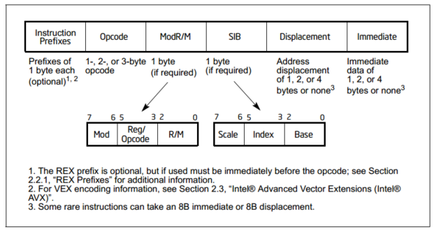

## Instruction Format

### 基本格式



#### 前缀（prefix）

前缀一共分为四组，每组在同一条指令中只能出现一次，因此前缀最长有4字节

##### group 1

* lock repeat
  * LOCK  F0H  指定原子指令，只有下列命令可以使用
  
    ```
    ADC, ADD, AND, BTC, BTR, BTS, CMPXCHG, CMPXCHG8B, CMPXCHG16B, DEC, INC, NEG, NOT, OR, SBB, SUB, XADD, XCHG and XOR
    ```
  
  * REP  F3H
  
    ```
    INS, LODS, MOVS, OUTS and STOS
    ```
  
  * REPNZ  F2H
  
    ```
    CMPS, CMPSB, CMPSD, CMPSW, SCAS, SCASB, SCASD and SCASW
    ```
  
  * REPZ  F3H  两个REP前缀F2 F3可能在不能使用REP前缀的指令中表示其他意思
  
    ```
    CMPS, CMPSB, CMPSD, CMPSW, SCAS, SCASB, SCASD and SCASW
    ```
* BND  intel memory protection extensions扩展前缀

##### group 2

* 段寄存器前缀，指定该条指令使用的段寄存器。64位模式下只有FS和GS有效
  * CS  2EH
  * SS  36H
  * DS  3EH
  * ES  26H
  * FS  64H
  * GS  65H
* branch hints  用于告诉处理器某个跳转是否倾向于执行，只有奔腾4以后的支持，AMD似乎不支持
  * 2EH  跳转未执行
  * 3EH  跳转执行

##### group 3

* Operand-size override prefix  66H  选择某个操作数应该为16b或32b

##### group 4

* Address-size override prefix  67H  选择寻址为16b或32b模式

**上述两个前缀对应的操作数关系可见[oprand-size/address-size](https://wiki.osdev.org/X86-64_Instruction_Encoding#Usage)**

#### Opcode

长度1 2 3字节。opcode中的各个位可能代表了不同的含义，如寄存器编码 符号扩展等。取决于opcode的类型

##### legacy opcodes

大多数基本指令和x87指令

###### 强制性的prefix

放在REX前缀前，不同指令可能有不同前缀，如movsb前面可以加rep等

###### REX

REX prefix  64位长模式下可用

* REX在下面几种情况中需要使用

  * 指令使用了64位操作数但该指令默认不是64位
  * 使用了64位扩展寄存器（R8~R15  XMM8~XMM15  YMM8~YMM15  CR8~CR15  DR8~DR15）
  * 使用了SPL BPL SIL DIL

* REX在下面情况中不应该使用

  * 使用了AH CH BH DH

* 默认为64位操作数的指令

  | 指令         |            |             |
  | ------------ | ---------- | ----------- |
  | CALL (near)  | ENTER      | Jcc         |
  | JrCXZ        | JMP (near) | LEAVE       |
  | LGDT         | LIDT       | LLDT        |
  | LOOP         | LOOPcc     | LTR         |
  | MOV CR(n)    | MOV DR(n)  | POP reg/mem |
  | POP reg      | POP FS     | POP GS      |
  | POPFQ        | PUSH imm8  | PUSH imm32  |
  | PUSH reg/mem | PUSH reg   | PUSH FS     |
  | PUSH GS      | PUSHFQ     | RET (near)  |

###### REX编码

```
  7                           0
+---+---+---+---+---+---+---+---+
| 0   1   0   0 | W | R | X | B |
+---+---+---+---+---+---+---+---+
```

| Field | Length | Description                                                  |
| ----- | ------ | ------------------------------------------------------------ |
| 0100  | 4 bits | 固定编码                                                     |
| W     | 1 bit  | 为1时，使用一个64位操作数。否则使用默认长度的操作数 (大多是32位，看[this table](https://wiki.osdev.org/X86-64_Instruction_Encoding#Operand-size_and_address-size_override_prefix)). |
| R     | 1 bit  | *MODRM.reg* 字段的一个描述符 See [Registers](https://wiki.osdev.org/X86-64_Instruction_Encoding#Registers). |
| X     | 1 bit  | *SIB.index* 字段的一个描述符 See [64-bit addressing](https://wiki.osdev.org/X86-64_Instruction_Encoding#64-bit_addressing). |
| B     | 1 bit  | *MODRM.rm*字段或*SIB.base*字段的一个描述符 See [64-bit addressing](https://wiki.osdev.org/X86-64_Instruction_Encoding#64-bit_addressing). |

###### opcode 

可以是1 2或3字节，可以是下面几种。此外，ModRM中的三位也可以是opcode

- [op]
- 0x0F [op]
- 0x0F 0x38 [op]
- 0x0F 0x3A [op]

##### VEX/XOP prefix

* VEX/XOP在下列情况下应使用
  * 指令是VEX/XOP指令
  * 256b的YMM寄存器被使用
  * 指令拥有大于三个操作数
  * 当使用XMM寄存器时，对应YMM寄存器的高128位需要清零
* VEX/XOP在下列情况下不应使用
  * 当使用XMM寄存器时，对应YMM寄存器的高128位不能改变

###### 编码

VEX/XOP前缀分为三种

* 0xC4  3字节VEX

  ```
   7                      0    7                      0    7                      0
  +--+--+--+--+--+--+--+--+   +--+--+--+--+--+--+--+--+   +---+--+--+--+--+--+--+--+
  |1  1  0  0  0  1  0  0 |   |~R|~X|~B|  map_select  |   |W/E|   ~vvvv   |L | pp  |
  +--+--+--+--+--+--+--+--+   +--+--+--+--+--+--+--+--+   +---+--+--+--+--+--+--+--+
  ```

* 0x8F  3字节XOP

  ```
   7                      0    7                      0    7                      0
  +--+--+--+--+--+--+--+--+   +--+--+--+--+--+--+--+--+   +---+--+--+--+--+--+--+--+
  |1  0  0  0  1  1  1  1 |   |~R|~X|~B|  map_select  |   |W/E|   ~vvvv   |L | pp  |
  +--+--+--+--+--+--+--+--+   +--+--+--+--+--+--+--+--+   +---+--+--+--+--+--+--+--+
  ```

* 0xC5  2字节VEX

  ```
    7                           0       7                           0
  +---+---+---+---+---+---+---+---+   +---+---+---+---+---+---+---+---+
  | 1   1   0   0   0   1   0   1 |   |~R |     ~vvvv     | L |   pp  |
  +---+---+---+---+---+---+---+---+   +---+---+---+---+---+---+---+---+
  ```

其中各个字段如下

| Field      | Length/bit | Description                                                  |
| ---------- | ---------- | ------------------------------------------------------------ |
| ~R         | 1          | 可以作为MODRM.reg的一位                                      |
| ~X         | 1          | 可以作为SIB.index的一位                                      |
| ~B         | 1          | 可以作为MODRM.rm或SIB.base的一位                             |
| map_select | 5          | opcode                                                       |
| W/E        | 1          | 对于整数指令，当为1时表示操作数为64位，否则为默认位数 <br/>对于非整数指令，作为opcode的一个扩展位 |
| ~vvvv      | 4          | 一个额外的XMM或YMM操作数                                     |
| L          | 1          | 当为0时vector为128位，否则为256位                            |
| pp         | 2          | 表示隐含的opcode prefix<br/>00  none<br/>01  0x66<br/>10  0xF3<br/>11  0xF2 |


#### ModR/M

```
  7                           0
+---+---+---+---+---+---+---+---+
|  mod  |    reg    |     rm    |
+---+---+---+---+---+---+---+---+
```

* MODRM.mod  2bit 

  可以与R/M字段一起，指定8个寄存器或24种寻址方式

  * 当mod为11，表示直接寻址模式
  * 当mod不为11，表示3类间接寻址模式

* MODRM.reg  3bit

  可能用于指定寄存器号，也可能是其他信息，取决于指令

  * opcode  当该字段表示opcode时，没有其他编码意义，仅仅是作为opcode标识符

  * reg  当该字段表示寄存器时，可以是源寄存器也可以是目的寄存器。具体指定的寄存器根据指令和operand-size/address-size（见前缀group3 group4）而不同

    `REX.R  VEX.~R XOP.~R` 这些前缀可以将reg扩展为4位（作为最高位），从而实现对16个寄存器的寻址

* MODRM.rm  3bit

  可以与Mod字段合用，也可以单独用于指定一个寄存器操作数。

  `REX.B  VEX.~B XOP.~B` 这些前缀可以将reg扩展为4位（作为最高位），从而实现对16个寄存器的寻址

##### 16位寻址

16位寻址中不使用SIB，长模式中不支持16位寻址

具体编码见[此表](https://wiki.osdev.org/X86-64_Instruction_Encoding#16-bit_addressing)

##### 32/64位寻址

具体编码见[此表](https://wiki.osdev.org/X86-64_Instruction_Encoding#32.2F64-bit_addressing)


最上面行对应opcode/reg，第二三列是mod和R/M的值。

mod确定了操作数的类型，对于`[--][--]`的行来说，具体的操作数需要到SIB取得

reg/opcode有可能表示操作数也可能表示opcode的一部分，在表示操作数时一定表示的是寄存器

R/M对应mod的不同表示不同的寻址操作数 

##### 一个例子

对于机器码

```
mov edi, ecx    8B F9
sub edi, ecx    2B F9
```

8B和2B是opcode，F9对应二进制 11 111 001，即mod=11，reg=111，R/M=001，因此对应mod=11那栏的最后一列，即一个reg操作数为`BH/DI/EDI/MM7/XMM7`，另一个操作数为`ECX/CXCL/MM1/XMM1`，具体使用了哪个操作数根据当前指令类型和opcode确定

#### SIB

用于基址变址寻址（[eax+edx]  [eax+8*edx]）

```
  7                           0
+---+---+---+---+---+---+---+---+
| scale |   index   |    base   |
+---+---+---+---+---+---+---+---+
```

* Scale  2bit 比例因子
  * b00  1
  * b01  2
  * b10  4
  * b11  8
* Index  变址寄存器，与`REX.X  VEX.~X XOP.~X`结合可以将reg扩展为4位（作为最高位），从而实现对16个寄存器的寻址
* Base  基址寄存器，与`REX.B  VEX.~B XOP.~B`结合可以将reg扩展为4位（作为最高位），从而实现对16个寄存器的寻址

具体编码见[此表](https://wiki.osdev.org/X86-64_Instruction_Encoding#32.2F64-bit_addressing_2)

#### Displacement

一些寻址指令在ModR/M和SIB后有Displacement字段，可能有1 2 4字节（[eax+0x12345678]）

#### Immediate Bytes

立即数，可能有1 2 4字节。若有一个8字节的displacement，将不能使用立即数操作数

#### 寻址编码

ModR/M与SIB共同编码内存地址可见Intel Software Manual P509开始的三张表。

ModR/M编码下列类型的寻址

* [reg]
* [reg+reg]
* [reg]+off

SIB编码下列类型的寻址

* [reg]
* [reg*2]
* [reg*4]
* [reg*8]

注意：

* disp32意思是后面跟着一个32位的displacement指定地址
* [eax]+disp8  意思是eax为基址，后面跟着一个8位displacement指定增加的地址
* `[--][--]+disp32`  意思是在当前ModR/M后有一个SIB，此外还有一个32位的displacement指定增加的地址。因此这种形式可以用于编码[reg + 8*reg + off]

## 一些例子

### prefix

#### 操作数长度

```
mov ax, bx
66 89 d8
mov eax, ebx
89 d8
mov rax, rbx
48 89 d8
```


## ref

https://wiki.osdev.org/X86-64_Instruction_Encoding  osdev，永远滴神

Opcode #1 http://www.asmcommunity.net/board/index.php?topic=8963

Opcode #2 http://www.asmcommunity.net/board/index.php?topic=8967

Opcode #3 http://www.asmcommunity.net/board/index.php?topic=8982

Opcode #4 http://www.asmcommunity.net/board/index.php?topic=9062

Opcode #5 http://www.asmcommunity.net/board/index.php?topic=9063

Opcode #6 http://www.asmcommunity.net/board/index.php?topic=9741

Opcode #7 http://www.asmcommunity.net/board/index.php?topic=10554

Opcode #8 http://www.asmcommunity.net/board/index.php?topic=14153

https://bbs.pediy.com/thread-66501.htm  上面的翻译

