# 实模式

## 编写主引导扇区代码

### 主引导扇区

Main Boot Sector(MBR)  硬盘的**0面0磁道1扇区**

有**512字节，结尾为0x55 0xAA**，BIOS初始化后将其加载到**0000:7c00**执行

### 在屏幕上显示文字

#### 显卡和显存

8086显存地址：**0xB8000~0xBFFFF**，共0x8000字节

一般BIOS加电自检后会初始化图形模式为80\*25

#### 显示字符

在**字符模式**下，一个字符显示占用两个字节，第一个字节为ASCII码，第二个为显示属性

##### 显示属性

1字节

```
  背景色 | 前景色
   4b   |   4b
K R G B | I R G B
```

* K：闪烁位
* I：亮度位

#### 声明并初始化数据

标号 类型 数据

```
data db 0x11, 0x12
```

##### 类型

* db
* dw
* dd
* dq

#### 在末尾加0xAA55

```c
times 510-($-$$) db 0
                 db 0x55,0xaa
```

`$`为当前行的地址，`$$`

## 相同的功能不同的代码

### 处理器标志位

#### EFLAGS

```
15 14 13 12 11 10  9  8  7  6  5  4  3  2  1  0
  |  |  |  |OF|DF|IF|TF|SF|ZF|  |AF|  |PF|  |CF
```

* OF  overflow
* DF  direct
* IF  中断允许
* TF  调试标志位
* SF  sign  符号
* ZF  zero
* AF  辅助进位（最后四位向前进位，用于BCD码计算
* PF  奇偶
* CF  进位

##### CF与OF

* CF  MSB进位，用于无符号数的溢出判断
* OF  被减数MSB异或结果MSB，用于有符号数的溢出判断

###### CF

进位/借位符号。当加法进位/减法借位时置1。用于判断无符号数是否溢出

无符号数的溢出场景

* 上溢  `A+B > 2^n-1`
* 下溢  `A-B < 0`

CF判断不仅仅是根据补码运算是否溢出  https://stackoverflow.com/questions/12237725/carry-flag-in-substraction

```asm
MOV AX, 5
MOV BX, 10
SUB AX, BX

MOV AX, 5
MOV BX, 10
NOT BX
INC BX
ADD AX, BX
```

上面的sub与下面的add看似运算上等价（上面是减去某数，下面是加上某数补码），但对于flag的影响不一样。sub运行后CF=1，add运行后CF=0

这是因为在X86处理器中，对于sub运算，**CF值会被取反**，即没有溢出时反而CF会置1，有溢出时置0。不同处理器在这点的处置上不同。但对于所有处理器，add指令执行时CF都不会被取反

这样做的理由是，对于add，无符号数只会上溢（即结果大于2^n-1），而对于sub，无符号数只会下溢（即结果小于0）。对于`A-B = A+(-B)`，当A>B时，补码运算将溢出，但此时实际上sub并没有下溢；相反当A<B时，将发生下溢，但补码运算并没有溢出。因此部分处理器对于add与sub的处理不同

###### OF

用于判断有符号数是否溢出。当数据超出有符号数表示范围时置位，如对于 0x70+0x70 ，OF置位而CF不置位

有符号数的溢出场景

**计算场景**

* $$
  A > 0, B > 0 \ \ A,B \in [0, 2^{n-1}-1]
  \\
  A+B \in [0,2^n-2]
  $$

* $$
  A < 0, B < 0 \ \ A,B \in [-2^{n-1}, -1]
  \\
  A+B \in [-2^n, -2]
  $$

* $$
  A > 0, B < 0 \ \ A \in [0, 2^{n-1}-1], \ \ B \in [-2^{n-1}, -1]
  \\
  A-B \in [1, 2^n-1]
  $$

* $$
  A < 0, B > 0 \ \ A \in [-2^{n-1}, -1] \ \ B \in [0, 2^{n-1}-1],
  \\
  A-B \in [-2^n-1, -1]
  $$

**对于8位数据**

* ```
  A,B in (0x00, 0x7F)
  A+B in (0x00, 0xFE)
  ```

* ```
  A,B in (0x80, 0xFF)
  A+B in (0x100, 0x1FE)
  ```

* ```
  A in (0x00, 0x7F)  B in (0x80, 0xFF)
  A-B in (0x01, 0xFF)
  ```

* ```
  A in (0x80, 0xFF)  B in (0x00, 0x7F)
  A-B in (0x101, 0x1FF)
  ```

**溢出情景**

|          | 正+正   | 负+负   | 正-负   | 负-正   |
| -------- | ------- | ------- | ------- | ------- |
| MSB(A)   | 0       | 1       | 0       | 1       |
| MSB(B)   | 0       | 1       | 1       | 0       |
| MSB(SUM) | 0  /  1 | 0  /  1 | 0  /  1 | 0  /  1 |
| OF       | 0  /  1 | 1  /  0 | 0  /  1 | 1  /  0 |

即，当sum的符号与预期不一致时，则为溢出

整理上面真值表，可得解析式`OF = MSB(A) xor MSB(SUM)`

#### 跳转条件

##### 条件表

| 指令      | 条件   | 描述                 |
| --------- | ------ | -------------------- |
| je / jz   | ZF = 1 | Equal / Zero         |
| jne / jnz | ZF = 0 | Not Equal / Not Zero |
|  **有符号数**  |                  |                         |
| jg / jnle | ZF = 0 && SF = OF    | Greater / Not Less or Equal |
| jge / jnl | SF = OF              | Greater or Equal / Not Less |
| jle / jng | ZF = 1 \|\| SF != OF | Less or Equal / Not Greater |
| jl / jnge | SF != OF             | Less / Not Greater or Equal |
| **无符号数** | ||
| ja / jnbe | CF = 0 && ZF = 0 | Above / Not Below or Equal |
| jnb / jae | CF = 0 | Not Below / Above or Equal |
| jbe / jna | CF = 1 \|\| ZF = 1 | Below or Equal / Not Above |
| jb / jnae | CF = 1 | Below / Not Above or Equal |
| jpe  | PF = 1 | Parity Even |
| jpo  | PF = 0 | Parity Odd |

##### 说明

首先A-B = A+(-B)，-B在计算机中即为B的补码

* 相等判断： cmp A,B 实际上执行的是A-B，若结果为0，即A=B，则ZF = 1
* 无符号数的比较，主要看CF位
  * 若A>B，A-B运算不溢出，因此CF=0，对应a（above）
  * 若A<B，A-B运算溢出，因此CF=1，对应b（below）
* 有符号数的比较，主要看OF位
  * 若A>B，A-B运算有两种情况
    * A B异号，A>0 B<0，可能溢出，溢出时SF=1，OF=1
    * A B同号， 由上述溢出情景可得，不可能溢出，OF=0，且因为A>B，所以对于A-B，SF=0
  * 若A<B，A-B运算有两种情况
    * A B异号，A<0 B>0，可能溢出，溢出时SF=0，OF=1
    * A B同号，不会溢出，OF=0，又因为A<B，所以A-B<0，SF=1

### 数据传送指令

`DS:SI -> ES:DI`

**movsb movsw**

#### rep

加上rep前缀后执行CX次

#### DF标志

* DF=0  每次rep后DI/SI +1
* DF=1  每次rep后DI/SI -1

**std**置1，**cld**清零

## 比高斯更快的计算

### 16位内存寻址

假设默认段寄存器DS为0x7c00

#### 直接寻址

使用立即数

```asm
mov ax, [0x5c0f]
```

地址为 0x7C000+0x5C0F=0x81C0F

#### 基址寻址

使用通用寄存器

```asm
mov ax, [bx]
```

#### 变址寻址

使用变址寄存器

```asm
mov ax, [si]
```

#### 基址变址寻址

使用基址寄存器+变址寄存器

```asm
mov ax, [bx+si]
```

#### 基址和变址寄存器

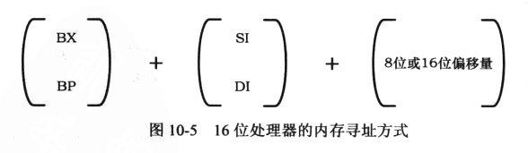

基址寄存器

* BX
* BP

变址寄存器

* SI
* DI

## 硬盘和显卡的访问与控制

### IO端口访问

#### in和out

使用in和out指令。这两条指令都不影响标志位

#### 地址空间

对于部分计算机系统来说，端口地址空间是映射到内存地址空间的，例如0x00000~0xE0000是真实的物理内存地址，而0xE0001~0xFFFFF是映射的端口地址空间。因此对于这块内存的访问实际上是在访问端口

而另一部分计算机系统则是独立编址的

实际上in/out和mov指令的主要区别就在于CPU上的一个引脚 M/IO#（#表示低电平有效）。当进行正常的内存访问时，该引脚为高；运行访问IO的指令时（如in和out）引脚为低

### x86 16位模式的地址划分

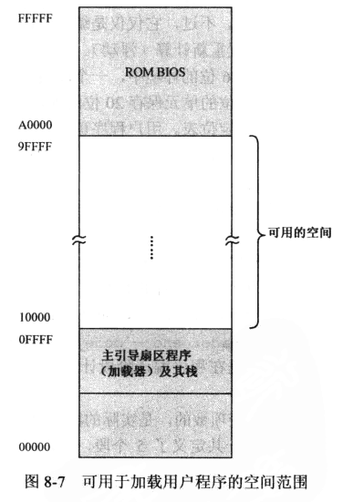

### 硬盘控制相关

#### 编址

最简单的方式是**CHS**，即磁头号、柱面号和扇区号。更好的方式是**逻辑扇区**，磁盘按某种顺序从0开始对磁盘的每个扇区进行编号，访问的时候不需要考虑磁头和柱面。

逻辑扇区的编码方式主要有LBA28和LBA48，前者使用28b来表示扇区号，因为一般一个扇区是512字节，因此可以管理 2^28 * 512 = 128G 的硬盘；而LBA48采用48b的地址，可以管理131072TB的容量。

#### 硬盘控制相关寄存器

IO地址 0x1F0~0x1F7

* 0x1F0  数据读写端口

* 0x1F1  错误寄存器

* 0x1F2  扇区号

* 0x1F3~0x1F5  LBA

  * 0x1F3  0~7
  * 0x1F4  8~15
  * 0x1F5  16~23

* 0x1F6  如图

  * 0~3位：LBA 24~27
  * 第4位：0：代表主盘  1：代表从盘
  * 5~7位： 111：代表LBA模式   101：代表CHS模式

  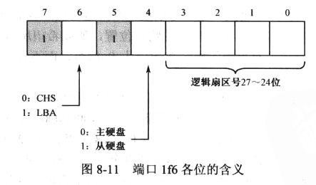

* 0x1F7  值0x20表示硬盘读。其他位如图

  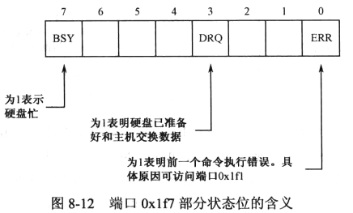

硬盘读取函数代码见[这个文件](x86_program/common/common.asm)的read_disk函数 demo见[这个文件](x86_program/08/read_disk.asm)

### 加载器的一些细节

本章写的加载器代码见 [这个文件](x86_program/08/bin_loader.asm) 基本是自己写的一套代码

#### 程序头

注意，程序头的定义如下

```
00	dd		程序长度
; ==== 入口点 ====
04	dw		入口点偏移
06	dd		入口点段地址
; ==== 重定位表 ====
0A	dw		重定位表项个数
;	==== 重定位表项 ====
0C+0	dd	每个表项都是该段对应的段地址
0C+4	dd
	...
```

其中，入口点段地址是入口点所在的segment相对应用程序文件的偏移量，而并不是其需要加载到的绝对地址。文件加载到哪个地址最终还是由加载器确定

#### 加载器工作流程

* 在要加载程序的地址先读入应用程序的一个扇区数据

* 解析程序头的程序长度信息，读入剩余的扇区数据（load_bin函数中）

* 根据加载地址对入口点段地址和重定位表项的段地址进行调整。这里的细节如下

  * 重定位表项记录的其实是每个段在文件中相对文件头的偏移，此外每个段都是16字节对齐的

    因此假设程序的加载地址是0x10000，某个段A的偏移是0xA0，那么加载后的地址应该是0x100A0，应该讲重定位表项的值修改为0x100A（重定位表项的值是直接赋给段寄存器的值）

    此外，这里修改重定位表项后，段地址是写到表项的**低位**，因为段地址只能有16位。一样如上例，段A偏移是0xA0，因此对应的表项应该是 00A0 0000（低位在低地址），而修改后应该为 10A0 0000

### 显卡控制相关

显卡的寄存器很多，为了减少占用主机的IO空间，很多寄存器只能通过索引寄存器间接访问

* 0x3d4  索引寄存器
  * 索引14  光标位置高8位
  * 索引15  光标位置低8位
* 0x3d5  数据端口  用于与索引寄存器指定的寄存器通信

### 滚动显示程序的一些细节

#### putchar函数

几个关键要考虑的内容

* 0x0a（换行）的处理
* 0x0d（回车）的处理
* 滚动显示：当显示的字符大于2000（80*25）时，将2~25行的整体上移80个字节（一行为80字节）

处理流程：

* 获取光标
* 判断当前要打印的字符
  * 若是0x0a  对光标加80
  * 若是0x0d  对光标除80再乘80（因为是整除所以可以去掉余数）
  * 其他情况光标加一
* 根据新光标位置，判断是否需要滚动（与2000比较）
  * 若需要滚动则先使用rep movsw将1~25行整体上移一行，此后使用rep stosw对最后一行清零
* 打印字符
* 设置新的光标位置

## 中断和动态时钟显示

### 外部硬件中断

分为可屏蔽中断和不可屏蔽中断（Non Maskable Interrupt）

#### 中断向量表

实模式下的中断向量表在0x00000~0x003FF处，每个表项由段地址和偏移地址组成

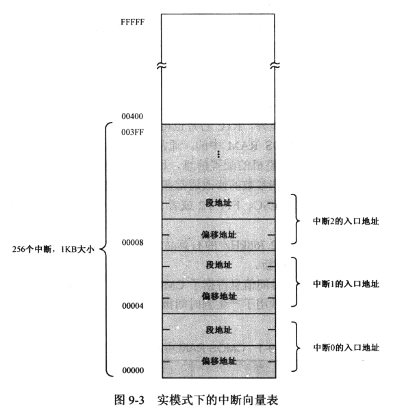

#### 中断处理程序

##### IF标志位

用于标识当前是否允许中断，为1则表示接受，为0表示当前不接受

* sti  置位IF
* cli  清零IF

##### 中断处理函数

一般做下面几件事

* 保护断点现场。首先将FLAGS压栈，然后清除IF和TF位，接着将CS和IP压栈
* 执行中断处理程序。从中断号得到中断入口点在中断向量表中的偏移地址，并从中取出偏移地址和段地址。注意因为此时IF被清零，因此若希望接受嵌套中断，则需要使用sti置位
* 返回到断点处继续执行。这里使用iret语句，会依次从栈上弹出数值到CS IP和FLAGS寄存器

此外，一个注意的点是：**当处理器执行任何一条改变栈段寄存器SS的指令时，它会在下一条指令执行完期间禁止中断**


#### CMOS RTC和8259

##### RTC

* 索引端口  0x70或0x74，其中0x70的最高位bit7还负责控制NMI中断开关，为0时允许NMI中断到达寄存器
* 数据端口  0x71或0x75

见书156页（pdf 169），内容比较多而且是寄存器具体配置相关的，应该泛用性比较低，所以就不写了

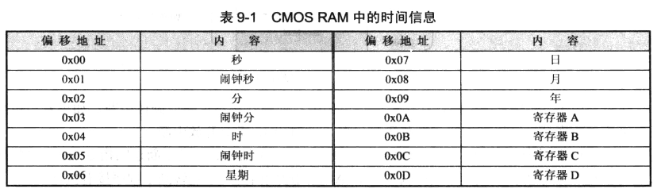

##### 8259

* 主片IO  0x20或0x21
* 从片IO  0xa0或0xa1

#### 动态时钟显示程序

该程序通过配置8259的RTC中断，来实现时钟的实时显示，程序的流程如下

程序代码在 [这里](x86_program/09/rtc.asm) ，对书上的例程没有太多改动，除了改了一下显示的格式（原来的程序没有设置显示格式导致时间无法正常显示）采用了自己实现的putchar（原来的putchar不知道为什么显示有点问题，所以该程序需要链接[display.asm](x86_program/common/display.asm)）。此外不知道为什么，bochs上的时间跳得非常快，但是vbox上正常。不过vbox也有一点问题，就是反转显示冒号和@的周期很奇怪。可能是虚拟机的RTC更新周期比较怪。

此外，还改了一个使用周期性中断的 [程序](x86_program/09/rtc_period.asm)

##### 主程序

* 打印信息
* cli禁止中断，防止在改动期间出现0x70号中断
* 安装0x70号中断，步骤如下
  * 求中断向量表位置
  * 在中断向量表放入段地址和偏移地址

* 设置RTC时钟
  * B寄存器
    * 从0x70端口索引B寄存器，注意最高位置1，用于屏蔽NMI中断（见[CMOS RTC和8259](#CMOS RTC和8259)）
    * 设置B寄存器禁止周期性中断，允许更新结束后中断，格式采用BCD码，24小时制

  * C寄存器
    * 读C寄存器，从而复位之前的中断装填

* 设置8259
  * 读取并设置8259从片的IMR寄存器（清除bit0，因为此位连接RTC）从而允许RTC中断

* sti允许中断
* 死循环，并在循环中使用hlt事CPU停机以实现低功耗

##### 中断处理程序

* 保存ax bx cx dx es
* A寄存器
  * 从0x70端口索引A寄存器，并且屏蔽NMI中断
  * 测试第七位指示处于更新中的状态位
* 从索引0的寄存器读取秒位
* 从索引2的寄存器读取分位
* 从索引4的寄存器读取时位
* C寄存器
  * 从0x70端口索引寄存器C，并开放NMI中断
  * 读取C寄存器，清除中断位
* 向主片（0x20）和从片（0xa0）发送中断结束命令EOI
* 恢复es dx cx bx ax
* iret

### 内部中断

一般是由内部硬件引起的，如除零中断等

不受IF标志影响，也不需要中断识别总线周期，且中断类型是固定的，一旦发生可以立即转入中断处理程序

### 软中断

由下列三种指令引起的中断

```asm
int3		; 触发3号中断
int imm8	; 触发任意号中断
into		; 若OF为1，触发4号中断
```

#### BIOS中断

其实就是指BIOS提供的系统调用，跟操作系统的陷阱类似

BIOS需要适配不同的硬件，一般这是通过两种方式实现的

* 一种是为一些常见的简单外围设备提供统一的初始化和调用代码
* 还有一种是外部设备有一套自己的ROM，这些ROM会映射到内存地址空间，而ROM中提供了厂商适配的设备驱动代码。

按照规范，这些ROM的前两个字节为0x55 0xAA，第三个单元是本ROM以512字节为单位的代码长度。在BIOS初始化器件，会以2KB为单位搜索内存地址C0000~E0000间的区域，当发现某区域头两字节为0x55和0xAA时说明有ROM代码存在

# 保护模式

## 32位x86处理器编程架构

### IA-32架构的基本执行环境

#### 线性地址

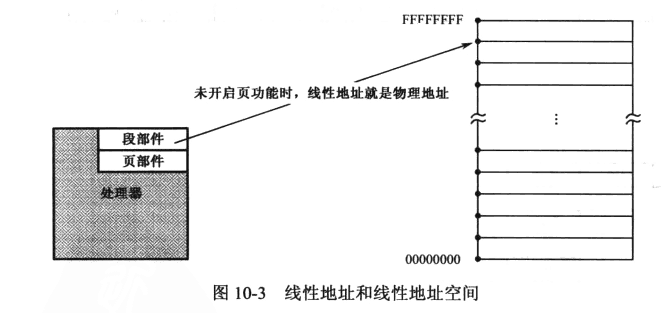

当页功能开启时，线性地址与物理地址不同，而是需要经过页部件转换后才是物理地址

### 现代处理器的结构和特点

* 流水线

  可以有很多步骤，具体流水线长度视处理器架构。一个原则就是每级操作的时间尽量保持一致。

  步骤包括：取指令、译码、寄存器分配和重命名、微操作排序、执行、引退等

* 高速缓存

* 乱序执行

* 寄存器重命名

  虽然明面上可以使用的通用寄存器只有8个，但处理器内部有大量的临时寄存器可用，处理器可以重命名这些临时寄存器以代表一个逻辑寄存器。如

  ```asm
  mov eax, [mem1]
  shl eax, 3
  mov [mem2], eax
  
  mov eax, [mem3]
  add eax, 2
  mov [mem4], eax
  ```

  可以看出前三条和后三条各有单独的数据依赖，因此实际执行的时候处理器会为后三条指令分配一个不同的临时寄存器，以实现乱序执行

  ```asm
  mov eax, [mem1]
  mov ebx, [mem2]
  add ebx, eax
  shl eax, 3
  mov [mem3], eax
  mov [mem4], ebx
  ```

  假设mem1在cache中但mem2不在，则add ebx, eax的执行会被阻塞，但是由于该指令不会改变eax的值，因此处理器会分配一个临时寄存器来先执行下面的shl eax, 3。

  这些是在流水线上发生的操作，当所有操作完成后，代表EAX寄存器结果的临时寄存器会被写入真实的EAX中，该过程称为**引退**

* 分支目标预测

  * 分支目标缓存器（Branch Target Buffer） 当处理器执行了一条分支语句后会在BTB中记录当前指令地址、目标地址、本次分支预测结果等，下次执行跳转时会查询BTB中的记录从而进行分支预测（这应该只是一种实现方式）
  * 若预测失败，则需要清空流水线并刷新BTB中的记录，代价较大

### 32位模式的指令系统

#### 32位内存寻址

##### 寻址

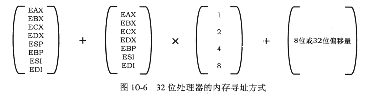

注意与 [16位内存寻址](#16位内存寻址) 区别

##### 0x66 前缀

* 16位模式时
  * 若无0x66前缀，则认为指令采用传统的16位寻址
  * 若有0x66前缀，则认为指令采用32位寻址方式
* 32位模式时
  * 无0x66前缀，为32位寻址
  * 有0x66前缀，为16位寻址

#### 操作数大小的指令前缀

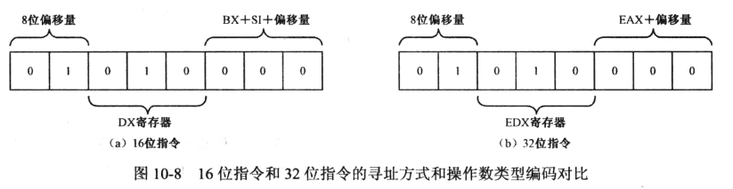

如上图，同一条机器码在16位汇编下和32位汇编下表示的意义可能不同，比如上图一字节0x50用于表示寻址方式，而同一个机器码

```
8B 50 02
16 bit:        mov dx, [bx+si+0x02]
32 bit:        mov edx, [eax+0x02]
```

因此汇编器提供了伪指令

```asm
bits 32
bits 16
```

来指定编译格式。可以放在方括号中变为 `[bits 16]`

##### 一般指令的扩展

主要是扩展了

* 各条指令对32位操作数、寄存器的支持
* push对立即数的支持，且push指令在不同位长和不同操作数下有一些行为
  * push imm
    * push byte 0xaa
      * 16位模式下符号扩展到2字节压入
      * 32位模式下符号扩展到4字节压入
    * push word 0xaa
      * 16位模式下正常压入
      * 32位模式下扩展到4字节压入
    * push dword 0xaa
      * 16位和32位模式下都是压入4字节
  * push mem
    * push word都压入2字节，push dword都压入4字节
  * push sreg
    * 16位模式下直接压入2字节的段寄存器
    * 32位模式下将段寄存器零扩展到4字节压入

## 进入保护模式

### 全局描述符表

Global Descriptor Table

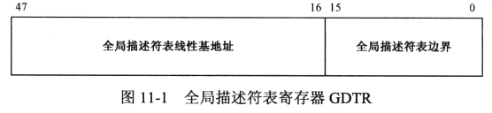

* 全局描述符表线性基地址  32位，用于定义全局描述符表所在的地址
* 全局描述符表边界  16位，用于表示全局描述符表的边界，即结束的地址

因为全局描述符表边界为16位，所以全局描述符表大小最多为64KB，而一个段描述符表项为8B，因此最多有8192项

此外，因为实模式下可寻址空间为1MB，因此在进入保护模式前，GDT必须定义在1MB以下的内存范围中

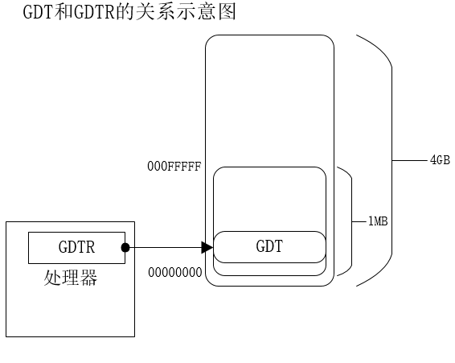

### 段描述符

描述符表的表项即为段描述符，每个描述符8字节

上面为高32位，下面为低32位

#### 段描述符格式

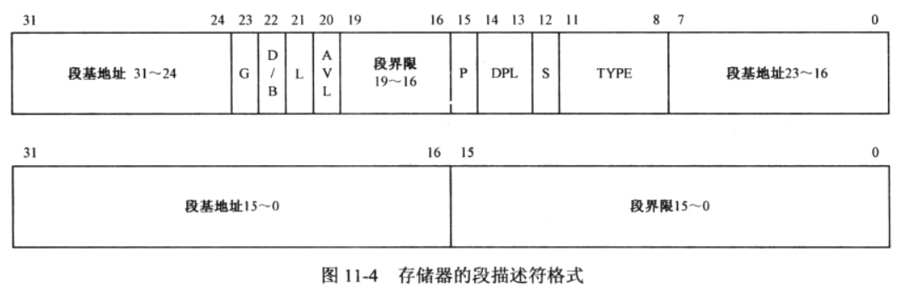

| 字段     | 长度 | 描述                                                         |
| -------- | ---- | ------------------------------------------------------------ |
| 段基地址 | 32位 | 用于表示该段的起始地址。（分为几段是因为兼容80286的16位保护模式） |
| 段界限   | 20位 | 限定段的大小，决定了段的偏移量最大/小值                      |
| G        | 1位  | 0: 段界限以1字节为单位，所以每个段最大空间为2^20B=1MB        |
|          |      | 1: 段界限以4KB为单位，所以每个段最大空间为2^20 * 4KB = 4GB   |
| S        | 1位  | 段的类型  0: 系统段  1: 代码段或数据段                       |
| DPL      | 2位  | 描述符的特权级                                               |
| P        | 1位  | 段存在位，用于支持虚拟内存。当P为0时表示描述符指向的内存不在实际的物理内存中 |
| D/B      | 1位  | 主要为了兼容16位程序，0:16位程序/数据  1:32位程序/数据，下面有具体描述 |
| L        | 1位  | 64位代码段标志，保留                                         |
| TYPE     | 4位  | 用于指示描述符的子类型，下面有具体描述                       |
| AVL | 1位 |软件可以自定义的位，保留|

##### TYPE

TYPE字段在不同的段中有不同的含义

###### 数据段

* X  是否可执行
* E  段扩展方向，0向上，1向下
* W  是否可写
* A  Accessed，后续说明


###### 代码段

* X  是否可执行
* C  Confoming  是否为特权级依从的。
  * 0为非依从，这样的代码段可以从与它特权级相同的代码段调用或者通过门调用
  * 1为依从，这样的代码段允许从低特权级的程序转移到该段执行
* R  代码段是否允许读出，为0表示不可读
* A  Accessed

###### Accessed

用于实现虚拟内存管理，当该段被访问时置1，此后定期清零。通过监视该位情况来确定该段最近是否被访问过。若较少访问则可以在内存空间紧张时换入磁盘中

##### D/B

该位主要是为了在兼容32位处理器的16位保护模式程序（很少见）。

###### 代码段

称为D位，用于指示指令中默认的偏移地址和操作数尺寸

* D=0  偏移地址/操作数为16位
* D=1  偏移地址/操作数为32位

即，若D=0，则处理器在这个段上执行时使用16位的寄存器IP来取指令

###### 栈段

称为B位，用于确定应该以何种方式访问栈的内容

* B=0  16位，使用SP寄存器，栈段上限0xFFFF
* B=1  32位，使用ESP寄存器，栈段上限0xFFFFFFFF

### 安装存储器的段描述符并加载GDTR

处理器规定，GDT中第一个描述符必须是空描述符，因为很多时候寄存器和内存单元的初始值为0，若程序设计有问题可能无意中用全0来索引描述符

加载GDTR时使用

```
lgdt m16/m32
```

地址指向一个48位的数据用于加载到GDTR寄存器中

### A20地址线

起初是因为8086只有20根地址线，因此0xFFFFF的地址+1会回绕到0x00000，有些程序依赖这个特性工作。但到286有24条地址线，为了兼容这些程序，方法就是让第21根地址线，也就是A20恒为0，而处理器使用一个与门控制A20是否恒为0

一开始与门的控制端口放在键盘控制器

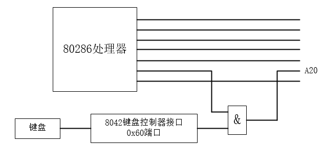

后来放在了一个叫A20M#的独立引脚上

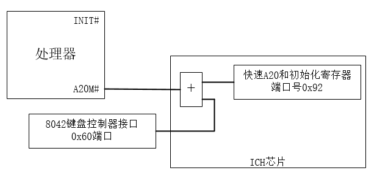

显然0x60预留的接口也是为了兼容上面的驱动方案。新的方法是通过0x92端口的bit1（第2位）来控制A20。当该位为1时启用A20地址线，否则A20恒为0

### 保护模式下的内存访问

#### CR0

CR0控制寄存器的第0位就是 PE位（Protection Enable，保护模式允许位）

进入保护模式的方式就是将该位置1

#### 段寄存器

32位处理器的段寄存器分为2部分，其中前16位和8086相同，此外还包括一个不可见部分，称为描述符高速缓存器（The Segment Descriptor Cache，可以见 [这篇文章](http://www.rcollins.org/ddj/Aug98/Aug98.html#:~:text=As%20early%20as%20the%2080286,x86%20processors%20since%20the%2080286.) ），用来存放段的线性基地址、段界限和段属性

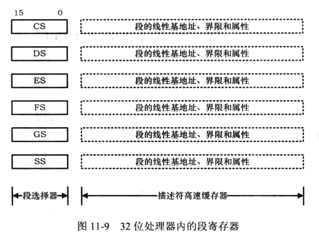

##### 实模式

在实模式下，描述符高速缓存器存放段地址左移4位的结果，访问方式跟8086一样，占据描述符高速缓存器的低20位

##### 保护模式与段选择子

保护模式下称为段选择器，段寄存器的内容实际上是段描述符在描述符表中的索引号，更确切地说是下面的内容

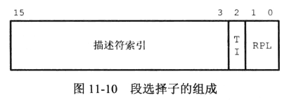

* 描述符索引  13位  因此最多可以索引8192个描述符，与GDT表项数量一致
* 描述符表指示器（Table Indicator）  1位
  * 0  描述符在GDT中
  * 1  描述符在LDT中
* 请求特权级  2位  给出当前选择子的**程序**的特权级

#### 段选择子的加载与内存的访问

##### 段选择子加载

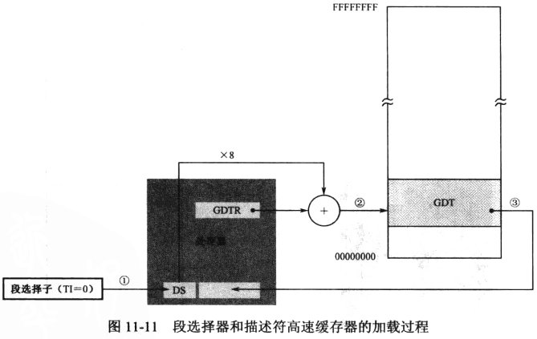

* 段选择子传入DS（这里TI=0表示为GDT中的选择子）
* 选择子的索引*8加上GDTR中的线性基地址，构成要加载的表项在GDT中的地址
* 将表项加载到描述符高速缓存上

##### 内存访问

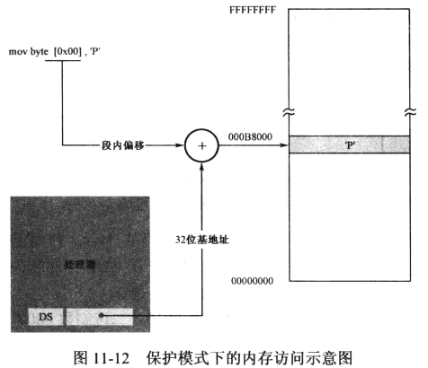

此后访问内存时，若没有段超越前缀，就用描述符高速缓存中的内容作为基址来访问

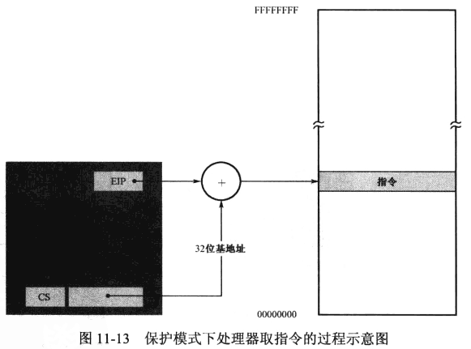

取指令也采用相同方式

#### 清空流水线并串行化处理器

在上节讨论进入保护模式时，存在两个问题

* 因为访问内存的方式不同，因此需要在进入保护模式后尽快刷新段寄存器
* 在进入保护模式前有很多指令已经进入流水线，但切换模式后译码方式改变，因此需要清空流水线

解决方案是在设置CR0的PE位后立即使用一个远转移指令

* 远转移会重新加载段选择器CS，实现对描述符高速缓存的刷新
* 远转移一般会清空流水线

因此示例程序使用一个到下一条指令的远跳转来实现切换

注意这边有一些细节，因为此时PE已经置1，进入保护模式，但CS段寄存器内容还没被刷新，因此这一刻的描述符高速缓存器的D位还是0，即处于16位保护模式下，所以两条指令都是采用bits 16编译的

```asm
jmp dword 0x0008:flush		; 32位偏移量
; 或使用
jmp 0x0008:flush			; 16位偏移量
```

而在这条之后，新的描述符被加载到CS，因此可以使用bits 32编译

### 程序流程

示例程序在 [mbr.asm](x86_program/11/mbr.asm) 

该程序与书上的程序有一些不同，首先复用了之前的如读取磁盘和显示的代码。

在主引导扇区上的程序只负责加载磁盘的下n个扇区（n视该程序大小而定），以及显示一个字符串和引用之前的asm。这种设计主要是考虑到主引导扇区512B的限制，因此只让它做最简单的加载工作方便之后扩展（即便如此引用两个asm文件基本已经占满这512B空间了）

下面重点讲解进入保护模式的步骤。

#### gdtr和gdt的配置

* gdtr寄存器的内容定义为

  ```asm
  gdtr    dw (gdt_end - gdt_begin)
          dd gdt_begin+0x7c00
  ```

  前2字节是gdt表的边界，后4字节是基地址

* gdt表的定义及每个表项的属性如下

  ```asm
  gdt_begin:
  gdt_null    dd 0, 0
  ; base 0x00007c00 limit=0x005ff G=0 D=1 L=0 AVL=0 P=1 DPL=00 S=1 TYPE=1000
  ; length=0x600
  gdt_code    dd 0x7c0005ff
              dd 0x00409800
  ; base 0x00007c00 limit=0xFFFFE G=1 D=1 L=0 AVL=0 P=1 DPL=00 S=1 TYPE=0110
  ; length=0x1000
  gdt_stack   dd 0x7c00fffe
              dd 0x00cf9600
  ; base 0x000b8000 limit=0x00F9F G=0 D=1 L=0 AVL=0 P=1 DPL=00 S=1 TYPE=0010
  ; length=0xFA0
  ; point to framebuffer
  gdt_data    dd 0x80000f9f
              dd 0x0040920b
  gdt_end:
  ```

  注意这里stack的定义，因为栈段在这里定义为了一个向下增长的段，因此对于地址的计算比较不一样，详见 [栈操作时的保护](#栈操作时的保护) ，因此需要配合4KB的粒度才能使得limit得到一个比7c00小的值。

  如上表中G=0，则界限值应该是 0x7C00+0xFFFFE = 0x107BFE，而G=1时为 0x7C00+0xFFFFEFFF = 0x5CFF

  理论上应该有办法让G=0时也取得一个小的值吧，要不感觉这个设定没什么意义。但不知道要怎么设置

#### 进入保护模式的步骤

* 加载gdtr寄存器（注意这里代码的gdtr是上面定义的要放入GDTR寄存器的数据的标号）

  ```asm
  lgdt [0x7c00+gdtr]
  ```

* 使能A20地址线

* 因为进入保护模式后，内存访问方式改变，这会影响IVT的访问。所以需要先关中断

* 设置CR0进入保护模式

* 长跳转，用途上面说了不再赘述。此时理论上是运行在16位保护模式下

  ```asm
  jmp dword 0x0008:flush
  ```

* 已经完成了进入保护模式的工作，由于段描述符的D/B=1，所以这里开始运行32位的程序


## 存储器的保护

### 修改段寄存器时的保护

在修改段寄存器时会进行一系列的检查

* 在加载段选择子的时候会与GDTR寄存器中的描述符表边界进行对比，若超出则产生异常中断13

* 取得描述符后，对描述符的类别进行确认，以确认描述符的类别是否和段寄存器的用途匹配

  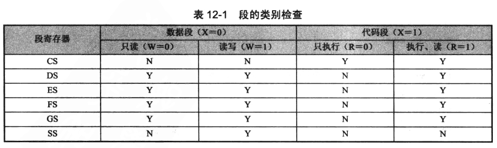

  只有符合上述检查的描述符才能加载到对应段寄存器（即表中为Y的部分）

* 检查描述符中的P位

  * 若P=0表示描述符已定义但该段不在内存中，将引发异常中断11
  * 若P=1则处理器将描述符加载到段寄存器的描述符高速缓存器，并置A位

从上面的内容可以看出，CS只允许加载代码段描述符，而要读写代码段内容可以将该描述符加载到DS/ES/FS/GS作为数据段访问

### 地址变换时的保护

#### 代码段执行时的保护

代码段执行时，EIP会与段边界对比以确定是否超出段的边界，条件是：

```
0 <= EIP+当前指令长度-1 <= 段界限
```

任何指令不允许向代码段写入数据，且只有代码段可读时才能使用指令读取内容（如 mov eax, dword ptr cs:[ebx]）

#### 栈操作时的保护

与代码段或数据段不同，栈段是向下增长的，因此判断条件是

```
段界限+1 <= ESP-操作数长度 <= 0xFFFFFFFF
```

因为ESP是从高地址向低地址生长，所以只需要限制它的下界

对于栈段的计算比较特殊，见下例

```
书上给的例子，段的粒度是G=1（4KB），段界限为0xFFFFE，基地址为0x00007C00
因为G=1，实际段界限为
0xFFFFE * 0x1000 + 0xFFF = 0xFFFFEFFF
所以ESP的取值范围为：
0xFFFFF000 <= ESP <= 0xFFFFFFFF

结合基地址，可以知道栈段的内存范围为：
下界： 0x00007C00 + 0xFFFFF000 = 0x00006C00
上界： 0x00007C00 + 0xFFFFFFFF = 0x00007BFF
大小为4KB
```

#### 数据访问时的保护

与代码段类似，但检查的是操作数长度

```
0 <= EA+操作数长度-1 <= 段界限
```

## 程序的动态加载和执行

这章主要是在对书中实现的一个32位的微型内核代码进行讲解，该内核支持的功能主要是：提供部分通用的函数调用并且能加载用户程序，并为用户程序创建内存空间（加载GDT表并分配内存），且可以通过重定位的方式支持用户对通用函数的调用

这里的内存分配非常简陋，就是记录一个起始地址a，每次分配大小为size的内存的时候返回这个地址并使 `a = 4字节对齐后的(a+size)`

### 一些知识点

#### retf

使用 call seg:offest 指令来调用函数时，应该使用 retf 进行返回。因为远调用指令不止会在栈上压入返回地址，还会压入原来代码段的段选择子

#### cpuid

用于获取CPU的属性，一般通过EAX指定信息的种类，指令执行后会将内容放在EAX EBX ECX或EDX中

#### cmovcc

这里后面的cc是条件的意思，当符合条件时才进行数据传送，如

```asm
cmovz eax, ebx		; ZF=1时 eax=ebx，否则不执行任何操作
```

#### movzx/movsx

用于将一个位数较少的操作数传入位数较多的寄存器，因为位数不同，所以自然面临高位如何填充的问题

* movzx  0扩展，即高位填充0
* movsx  符号扩展，高位填充与符号位相同的位

```
设 bx = 0xffff
movzx eax, bx  ==>  eax = 0x0000ffff
movsx eax, bx  ==>  eax = 0xffffffff
```

#### xlat

查表指令。DS:EBX指向一段内存，调用xlat时便以AL作为索引，使得 `AL = DS:[EBX+AL]`

## 任务和特权级保护

### 任务的隔离和特权级保护

#### 任务、任务的LDT和TSS

关系如下

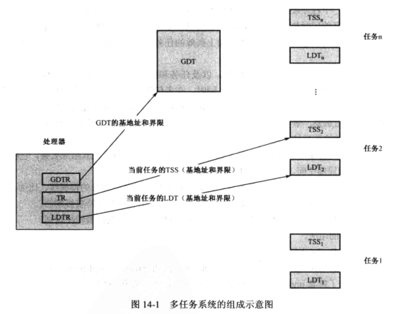

##### LDT

LDT（Local Descriptor Table）**局部描述符表**，与GDT全局描述符表相对。LDT由每个任务单独使用，来声明每个任务私有的段。而一般来说GDT只有内核使用，因此只需要一个GDT就够了

与GDTR类似，处理器中也有一个寄存器LDTR，用于存放**当前任务**的LDT

段选择子中有个TI位，就是用于指定从哪里加载选择子的位；TI=0时从GDT加载，TI=1时从LDT加载。

##### TSS

当发生任务切换时，应该保存任务的状态，或者称为上下文（context）。这段保存状态的内存叫做**任务状态段**（Task State Segment）

CPU使用一个寄存器TR（Task Register）指向当前任务的TSS

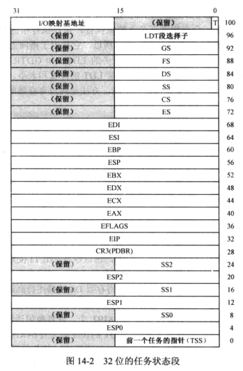

#### 特权级保护概述

intel处理器有4个特权级 0 1 2 3，数字小的权限大

特权级保护的核心就是**为所有可管理的对象赋予一个特权级，以决定谁能访问它们**

特权级分为三种，分别是

* CPL  当前特权级
* DPL  描述符特权级
* RPL  请求特权级

三者的关系其实类似于：CPL表示执行者的特权级，DPL表示资源的特权级，RPL表示请求的特权级

当访问一个资源时（某个段的内存），需要对应请求的特权级（RPL）等于或高于资源的特权级（DPL），同时还要求执行者的特权级（CPL）高于资源的特权级（DPL），才能允许资源的访问

大多数情况下，代码直接访问资源时，CPL=RPL。但也有特殊情况，如某段特权级为3的代码通过调用门向操作系统请求读取硬盘的操作，因为读取硬盘需要IO操作，而一般只有特权级0才能进行IO操作。此时的RPL应为3，因为请求是特权级为3的代码发出的；而CPL为0，因为读取硬盘的操作是特权级为0的程序进行的。

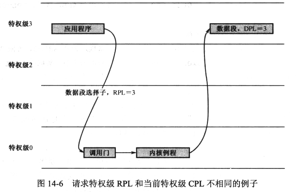

引入RPL的必要性可以由上例看出，因为发出请求的程序不一定是正在运行的程序，所以只使用CPL和DPL并不足以进行完整的访问控制。

##### 当前特权级CPL

Current Privilege Level

当处理器正在一个代码段中运行指令时，那个代码段的特权级称为CPL，放在CS的最低2位（即代码段的选择子低2位，也即代码段选择子的RPL，所以CPL=CS.RPL）

###### CPL对指令的限制

很多指令在CPL为0时才能使用

  * 如lgdt lldt ltr等控制特殊寄存器的指令

  * 当EFLAGS寄存器中的IOPL位为0时，没有进行IO操作的特权。ring0下始终有IO操作的特权

###### CPL对控制转移的限制

一般控制转移只允许发生在两个特权级相同的代码段

但也有跨特权级的调用方式：

* 依从的代码段

  在段描述符的TYPE字段有个C位，用于指定当前代码段是否为依从的。

  当CPL大于等于目标依从代码段描述符的DPL时，可以将控制转移到该代码段。此外，依从的代码段不是在它的DPL特权级上运行，而是在调用程序的特权级上运行。

  ```
  假设依从代码段DPL=1，则只有CPL为1 2 3的代码段可以调用，而CPL为0的代码段不能调用。
  此时假设CPL为3的代码调用了该依从代码段，则运行这段依从代码时CPL仍为3，而不是1。这也是这种代码段被称为“依从”的原因。
  ```

* 门

  门是另一种形式的描述符，有好几种

  * 调用门  不同特权级间的过程调用
    * call far  可以通过门转移到比CPL高的代码段，但不改变CPL
    * jmp far  可以通过门转移到比CPL高的代码段，并将CPL提升到目标代码段的DPL
  * 中断/陷阱门  作为中断处理过程使用
  * 任务门  用来执行任务切换


##### 描述符特权级DPL

Descriptor Privilege Level

对于数据段来说，若程序的特权级小于DPL，则无法读写该段

##### 请求特权级RPL

Requested Privilege Level

##### 特权级的检查

下面总结处理器对CPL DPL和RPL的检查规则

###### 控制转移

将控制**直接转移到非依从的代码段**，要求

* CPL=目标代码段描述符的DPL
* RPL=目标代码段描述符的DPL

===============================

将控制**直接转移到依从的代码段**，要求

* CPL>=目标代码段描述符的DPL
* RPL>=目标代码段描述符的DPL

即只能是低特权级向高特权级转移

===============================

通过门实施的控制转移在 [调用门](#调用门) 中描述

###### 段寄存器

当处理器执行一个将段选择子传送到段寄存器的指令时，会执行如下检查

* CPL<=目标段描述符的DPL
* RPL<=目标段描述符的DPL

===============================

栈段的特权级必须和CPL相同，因此在对栈段寄存器SS修改时，要求

* CPL=目标栈段描述符的DPL
* RPL=目标栈段描述符的DPL

### 内核程序的初始化

#### 调用门

调用门用于在不同特权级的程序间进行控制转移，其**本质只是一个描述符**，与代码段和数据段的描述符都不同，可以安装在GDT或LDT中

##### 调用门的描述符

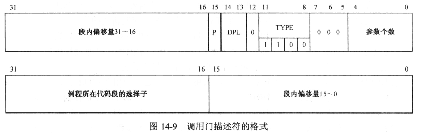

* 选择子  标识出了该服务例程所在的代码段
* 段内偏移量  提供了例程在代码段中的位置，因此在通过调用门调用例程时不使用指令中给出的偏移量
* TYPE  用于标识门的类型，1100表示调用门
* P  有效位，为0时，调用这样的门会导致处理器产生异常中断。这个机制可以用于操作系统统计某个门的调用次数
* DPL  调用门描述符的特权级，下面有说明对于特权级的限制
* 参数个数  定义这个字段的原因是，在调用调用门时，可能发生栈段的切换，那么为了正常获取参数，就需要将参数复制到新的栈上。这是由处理器自动完成的
* 注意第12位的0，在 [段描述符](#段描述符) 中对应的位名为S，S=1时为数据段和代码段。处理器通过该位判断描述符的类型

##### 调用门的调用

可以使用jmp far，也可以使用call far。后者会改变CPL；由于栈段要求与CPL特权级一致，所以也会切换栈。因此每个任务除了自己固有的栈外，还需要额外定义几套栈。如操作系统只有0和3特权级，则特权级3的程序应该定义一套特权级3的栈和一套特权级0的栈。这一点在 [TSS的定义](#TSS) 中也有体现，注意这里的SS0 SS1和SS2就是为多套栈而保留的，而栈的切换也是处理器自动进行的。

由于调用门中已经指定了对应的代码段选择子和偏移量，因此在jmp或call时调用门，处理器会先检查该描述符是一个段选择子还是调用门（通过S位），若为调用门则忽略跳转的偏移量。

##### 调用门的特权级检查

* CPL <= 调用门描述符的DPL
* RPL <= 调用门描述符的DPL
* CPL >= 目标代码段描述符的DPL

这些规则说明了：

* 调用门描述符的DPL主要是用来限制对该调用门请求的特权级，当请求的特权级（包括CPL和RPL）小于DPL时无法使用该调用门
* 若CPL大于调用门代码段的DPL时无法调用，即高特权级的代码无法调用低特权级的调用门

### 加载用户程序并创建任务

这一节主要是对示例程序的解释

#### TCB定义

示例程序中对于TCB的定义如下

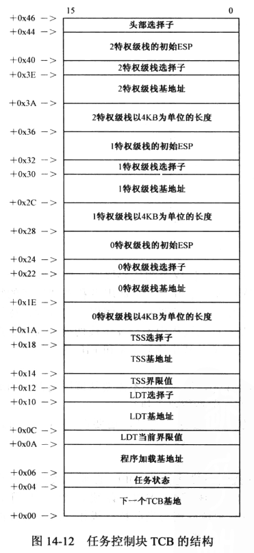

注意这里的TCB定义了三个栈段，分别是0、1、2特权级的栈，类似的定义在 [TSS](#TSS) 中也能见到，因为对于每个不同特权级的函数调用，应该使用不同的栈以防止越权访问数据，因此TCB对除了ring3外的所有特权级都定义了一系列描述其栈段的字段

#### LDT相关


# 附录

### 系统调用表

