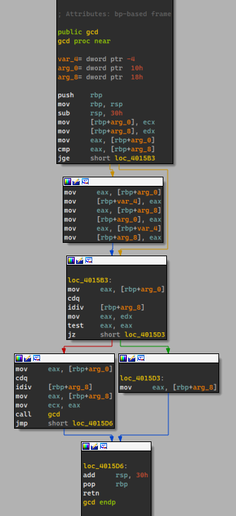
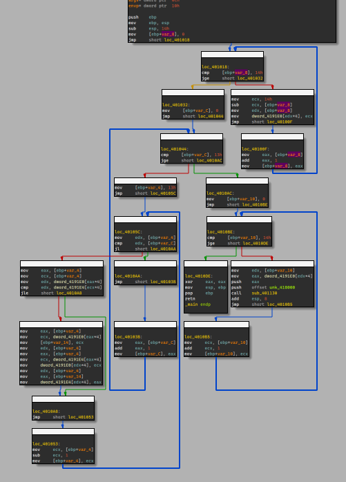
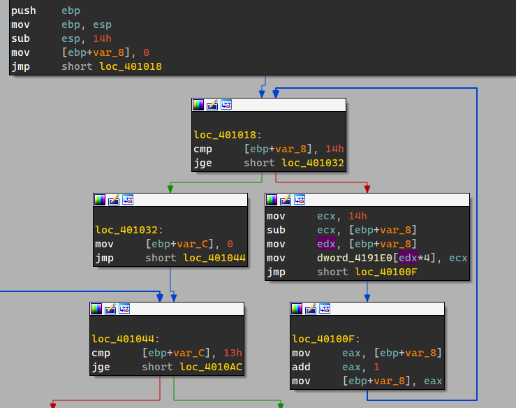
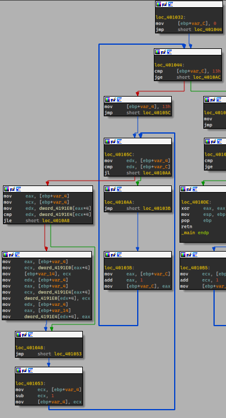
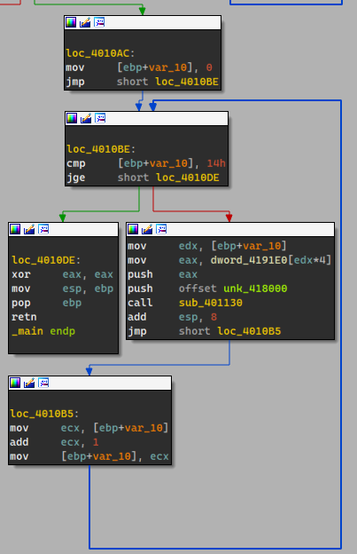
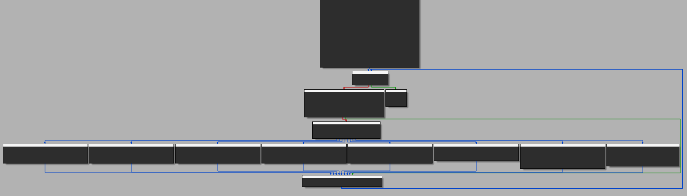

## 推荐网站

https://godbolt.org/

## 推荐书籍

《C++反汇编与逆向分析技术揭秘》

《天书夜读：从汇编语言到Windows内核编程》 第1、2、3章

## Hello World

### Source

```c
#include <stdio.h>

int main(void)
{
    printf("Hello World\n");
}
```

### 注意点

* 函数序言 / 函数末尾
* 栈空间的开辟与回收
* 函数的调用与参数的传递

###GCC

```asm
; int __cdecl main(int argc, const char **argv, const char **envp)
public main
main proc near

; function prologue
push    rbp
mov     rbp, rsp
sub     rsp, 20h
call    __main

; printf("Hello World\n")
lea     rcx, Buffer     ; "Hello World"
call    puts

; function epilogue
mov     eax, 0
add     rsp, 20h
pop     rbp
retn
main endp
```

###MSVC

#### x32

```asm
; int __cdecl main(int argc, const char **argv, const char **envp)
_main proc near

argc= dword ptr  8
argv= dword ptr  0Ch
envp= dword ptr  10h

; function prologue
push    ebp
mov     ebp, esp

; printf("Hello World\n")
push    offset aHelloWorld ; "Hello World\n"
call    sub_401060

; function epilogue
add     esp, 4
xor     eax, eax
pop     ebp
retn
_main endp
```

#### x64

```asm
; int __cdecl main(int argc, const char **argv, const char **envp)
main proc near

; function prologue
sub    rsp, 28h

; printf("Hello World\n")
lea    rcx, Format     ; "Hello World"
call   printf

; function epilogue
xor    eax, eax
add    rsp, 28h
retn
main endp
```

## 变量

### Source

```c
#include <stdio.h>
#include <string.h>

int global_var = 100;
char string[] = "Hello World";
const char *const_str = "Hello World";

int table[100];

int main(void)
{
    int local_var = 101;
    char* local_str = "Hello World";

    printf("global_var:         %d\n", global_var);
    printf("local_var:          %d\n", local_var);

    printf("global char*:       %s\n", string);
    printf("global const char*: %s\n", const_str);
    printf("local str:          %s\n", local_str);

    memset(table, 0, sizeof(table));

    return 0;
}
```

### 注意点

* 不同数据段的不同（.data / .rdata / .bss）
* 局部变量、全局变量、全局常量与全局未初始化变量的位置

### GCC

数据段

```asm
; ==== data ====
; global_var
.data:0000000000403010                 public global_var
.data:0000000000403010 global_var      dd 100                  ; DATA XREF: main+1F↑r
.data:0000000000403014                 align 8
; string
.data:0000000000403018                 public string
.data:0000000000403018 string          db 'Hello World',0      ; DATA XREF: main+58↑o
.data:0000000000403024                 align 8
; const_str
.data:0000000000403028                 public const_str
.data:0000000000403028 const_str       dq offset aHelloWorld   ; DATA XREF: main+6B↑r
; static_var
.data:0000000000403030 static_var_3775 dd 102                  ; DATA XREF: main+44↑r
.data:0000000000403034                 align 20h

; ==== rdata ====
.rdata:0000000000404000 aHelloWorld     db 'Hello World',0      ; DATA XREF: main+14↑o
.rdata:0000000000404000                                         ; .data:const_str↑o

; ==== bss ====
.bss:0000000000407980                 public table
.bss:0000000000407980 table           db    ? ;               ; DATA XREF: main+9F↑o
.bss:0000000000407981                 db    ? ;
.bss:0000000000407982                 db    ? ;
```

代码段

```asm
; int __cdecl main(int argc, const char **argv, const char **envp)
public main
main proc near

var_10= qword ptr -10h
var_4= dword ptr -4

; function prologue
push    rbp
mov     rbp, rsp
sub     rsp, 30h
call    __main

; Initialize
mov     [rbp+var_4], 101
lea     rax, aHelloWorld ; "Hello World"
mov     [rbp+var_10], rax

; printf("global_var:         %d\n", global_var);
mov     eax, cs:global_var
mov     edx, eax
lea     rcx, Format     ; "global_var:         %d\n"
call    printf

; printf("local_var:          %d\n", local_var);
mov     eax, [rbp+var_4]
mov     edx, eax
lea     rcx, aLocalVarD ; "local_var:          %d\n"
call    printf

; printf("static_var:         %d\n", static_var);
mov     eax, cs:static_var_3775
mov     edx, eax
lea     rcx, aStaticVarD ; "static_var:         %d\n"
call    printf

; printf("global char*:       %s\n", string);
lea     rdx, string     ; "Hello World"
lea     rcx, aGlobalCharS ; "global char*:       %s\n"
call    printf

; printf("global const char*: %s\n", const_str);
mov     rax, cs:const_str
mov     rdx, rax
lea     rcx, aGlobalConstCha ; "global const char*: %s\n"
call    printf

; printf("local str:          %s\n", local_str);
mov     rax, [rbp+var_10]
mov     rdx, rax
lea     rcx, aLocalStrS ; "local str:          %s\n"
call    printf

; memset(table, 0, sizeof(table));
mov     r8d, 400        ; Size
mov     edx, 0          ; Val
lea     rax, table
mov     rcx, rax        ; void *
call    memset

; function epilogue
mov     eax, 0
add     rsp, 30h
pop     rbp
retn
main endp
```

### MSVC

#### x32

数据段

```asm
.data:00418000 dword_418000    dd 100                  ; DATA XREF: _main+14↑r
.data:00418004 aHelloWorld_0   db 'Hello World',0      ; DATA XREF: _main+4C↑o
.data:00418010 off_418010      dd offset aHelloWorld_1 ; DATA XREF: _main+5E↑r
.data:00418010                                         ; "Hello World"
.data:00418014 aHelloWorld_1   db 'Hello World',0      ; DATA XREF: .data:off_418010↑o
.data:00418020 dword_418020    dd 102                  ; DATA XREF: _main+38↑r
.data:00418024 aHelloWorld     db 'Hello World',0      ; DATA XREF: _main+D↑o

.data:004192A0 unk_4192A0      db    ? ;               ; DATA XREF: _main+89↑o
.data:004192A1                 db    ? ;
.data:004192A2                 db    ? ;
```

代码段

```asm
; int __cdecl main(int argc, const char **argv, const char **envp)
_main proc near

var_8= dword ptr -8
var_4= dword ptr -4
argc= dword ptr  8
argv= dword ptr  0Ch
envp= dword ptr  10h

push    ebp
mov     ebp, esp
sub     esp, 8

mov     [ebp+var_4], 101
mov     [ebp+var_8], offset aHelloWorld ; "Hello World"

mov     eax, dword_418000
push    eax
push    offset aGlobalVarD ; "global_var:         %d\n"
call    sub_4010E0
add     esp, 8

mov     ecx, [ebp+var_4]
push    ecx
push    offset aLocalVarD ; "local_var:          %d\n"
call    sub_4010E0
add     esp, 8

mov     edx, dword_418020
push    edx
push    offset aStaticVarD ; "static_var:         %d\n"
call    sub_4010E0
add     esp, 8

push    offset aHelloWorld_0 ; "Hello World"
push    offset aGlobalCharS ; "global char*:       %s\n"
call    sub_4010E0
add     esp, 8

mov     eax, off_418010 ; "Hello World"
push    eax
push    offset aGlobalConstCha ; "global const char*: %s\n"
call    sub_4010E0
add     esp, 8

mov     ecx, [ebp+var_8]
push    ecx
push    offset aLocalStrS ; "local str:          %s\n"
call    sub_4010E0
add     esp, 8

push    400             ; Size
push    0               ; Val
push    offset unk_4192A0 ; void *
call    _memset
add     esp, 0Ch

xor     eax, eax
mov     esp, ebp
pop     ebp
retn
_main endp
```

#### x64

数据段

```asm
.data:000000014001B000 dword_14001B000 dd 102                  ; DATA XREF: main+3A↑r
.data:000000014001B004 dword_14001B004 dd 100                  ; DATA XREF: main+18↑r
.data:000000014001B008 aHelloWorld     db 'Hello World',0      ; DATA XREF: main+C↑o
.data:000000014001B014                 align 8

.data:000000014001B0A8 aHelloWorld_0   db 'Hello World',0      ; DATA XREF: main+4C↑o
.data:000000014001B0B4                 align 8
.data:000000014001B0B8 off_14001B0B8   dq offset aHelloWorld_1 ; DATA XREF: main+5F↑r
.data:000000014001B0B8                                         ; "Hello World"
.data:000000014001B0C0 aHelloWorld_1   db 'Hello World',0      ; DATA XREF: .data:off_14001B0B8↑o

.data:000000014001CC00 unk_14001CC00   db    ? ;               ; DATA XREF: main+8B↑o
.data:000000014001CC01                 db    ? ;
.data:000000014001CC02                 db    ? ;
```

代码段

```asm
; int __cdecl main(int argc, const char **argv, const char **envp)
main proc near

var_18= dword ptr -18h
var_10= qword ptr -10h

sub     rsp, 38h
mov     [rsp+38h+var_18], 101
lea     rax, aHelloWorld ; "Hello World"
mov     [rsp+38h+var_10], rax
mov     edx, cs:dword_14001B004
lea     rcx, Format     ; "global_var:         %d\n"
call    printf
mov     edx, [rsp+38h+var_18]
lea     rcx, aLocalVarD ; "local_var:          %d\n"
call    printf
mov     edx, cs:dword_14001B000
lea     rcx, aStaticVarD ; "static_var:         %d\n"
call    printf
lea     rdx, aHelloWorld_0 ; "Hello World"
lea     rcx, aGlobalCharS ; "global char*:       %s\n"
call    printf
mov     rdx, cs:off_14001B0B8 ; "Hello World"
lea     rcx, aGlobalConstCha ; "global const char*: %s\n"
call    printf
mov     rdx, [rsp+38h+var_10]
lea     rcx, aLocalStrS ; "local str:          %s\n"
call    printf
mov     r8d, 190h       ; Size
xor     edx, edx        ; Val
lea     rcx, unk_14001CC00 ; void *
call    memset
xor     eax, eax
add     rsp, 38h
retn
main endp
```

## 函数调用1：基础

### Source

```c
#include <stdio.h>

char str[] = "Hello World\n";

int print_str(const char *string, int a, int b, int c, int d)
{
    printf("%s", string);
    return a+b+c+d;
}

int main(void)
{
    print_str(str, 1, 2, 3, 4);
    return 0;
}
```

### 注意点

* 参数传递方式（寄存器和栈）
* 返回值

### GCC

```asm
; int __cdecl main(int argc, const char **argv, const char **envp)
public main
main proc near

var_10= dword ptr -10h

push    rbp
mov     rbp, rsp
sub     rsp, 30h
call    __main
mov     [rsp+30h+var_10], 4
mov     r9d, 3
mov     r8d, 2
mov     edx, 1
lea     rcx, str        ; "Hello World\n"
call    print_str
mov     eax, 0
add     rsp, 30h
pop     rbp
retn
main endp


public print_str
print_str proc near

arg_0= qword ptr  10h
arg_8= dword ptr  18h
arg_10= dword ptr  20h
arg_18= dword ptr  28h
arg_20= dword ptr  30h

push    rbp
mov     rbp, rsp
sub     rsp, 20h
mov     [rbp+arg_0], rcx
mov     [rbp+arg_8], edx
mov     [rbp+arg_10], r8d
mov     [rbp+arg_18], r9d
mov     rdx, [rbp+arg_0]
lea     rcx, Format     ; "%s"
call    printf
mov     edx, [rbp+arg_8]
mov     eax, [rbp+arg_10]
add     edx, eax
mov     eax, [rbp+arg_18]
add     edx, eax
mov     eax, [rbp+arg_20]
add     eax, edx
add     rsp, 20h
pop     rbp
retn
print_str endp
```

### MSVC

#### x32

```asm
; int __cdecl main(int argc, const char **argv, const char **envp)
_main proc near

argc= dword ptr  8
argv= dword ptr  0Ch
envp= dword ptr  10h

push    ebp
mov     ebp, esp
push    4
push    3
push    2
push    1
push    offset aHelloWorld ; "Hello World\n"
call    sub_401000
add     esp, 14h
xor     eax, eax
pop     ebp
retn
_main endp


; print_str
sub_401000 proc near

arg_0= dword ptr  8
arg_4= dword ptr  0Ch
arg_8= dword ptr  10h
arg_C= dword ptr  14h
arg_10= dword ptr  18h

push    ebp
mov     ebp, esp
mov     eax, [ebp+arg_0]
push    eax
push    offset aS       ; "%s"
call    sub_401090
add     esp, 8
mov     eax, [ebp+arg_4]
add     eax, [ebp+arg_8]
add     eax, [ebp+arg_C]
add     eax, [ebp+arg_10]
pop     ebp
retn
sub_401000 endp
```

#### x64

```asm
; int __cdecl main(int argc, const char **argv, const char **envp)
main proc near

var_18= dword ptr -18h

sub     rsp, 38h

mov     [rsp+38h+var_18], 4
mov     r9d, 3
mov     r8d, 2
mov     edx, 1
lea     rcx, aHelloWorld ; "Hello World\n"
call    sub_140001000

xor     eax, eax
add     rsp, 38h
retn
main endp


; print_str
sub_140001000 proc near

arg_0= qword ptr  8
arg_8= dword ptr  10h
arg_10= dword ptr  18h
arg_18= dword ptr  20h
arg_20= dword ptr  28h

mov     [rsp+arg_18], r9d
mov     [rsp+arg_10], r8d
mov     [rsp+arg_8], edx
mov     [rsp+arg_0], rcx
sub     rsp, 28h

mov     rdx, [rsp+28h+arg_0]
lea     rcx, Format     ; "%s"
call    printf

mov     eax, [rsp+28h+arg_10]
mov     ecx, [rsp+28h+arg_8]
add     ecx, eax
mov     eax, ecx
add     eax, [rsp+28h+arg_18]
add     eax, [rsp+28h+arg_20]

add     rsp, 28h
retn
sub_140001000 endp
```

## 函数调用2：调用约定

### Source

```c
#include <stdio.h>

char str[] = "Hello World\n";

int __cdecl print_str_1(const char *string, int a, int b, int c, int d)
{
    printf("%s", string);
    return a+b+c+d;
}

int __stdcall print_str_2(const char *string, int a, int b, int c, int d)
{
    printf("%s", string);
    return a+b+c+d;
}

int __fastcall print_str_3(const char *string, int a, int b, int c, int d)
{
    printf("%s", string);
    return a+b+c+d;
}

int main(void)
{
    print_str_1(str, 1, 2, 3, 4);
    print_str_2(str, 1, 2, 3, 4);
    print_str_3(str, 1, 2, 3, 4);
    return 0;
}

```

### 注意点

* 调用约定

  * stdcall  参数自右向左压入，由被调用的函数清理堆栈
  * cdecl   参数自右向左压入，由调用者清理堆栈
  * fastcall 通过寄存器ecx edx传递前两个参数，其他从右向左压入堆栈，由被调用的函数清理堆栈

  x64下没有上述几种不同的调用约定，一般采用下列两种调用约定。其中[XYZ]MM寄存器用于传递浮点参数

  * Microsoft x64 calling convention  一般用于Windows系统的程序
    * 参数寄存器： RCX/XMM0  RDX/XMM1  R8/XMM2  R9/XMM3
    * 顺序：右到左
  * System V AMD64 ABI  一般用于Linux BSD等系统的程序
    * 参数寄存器： RDI  RSI  RDX  RCX  R8  R9  [XYZ]MM0-7
    * 顺序：右到左

### GCC_linux

```asm
; int __cdecl main(int argc, const char **argv, const char **envp)
public main
main proc near
; __unwind {
endbr64
push    rbp
mov     rbp, rsp
mov     r8d, 4
mov     ecx, 3
mov     edx, 2
mov     esi, 1
lea     rdi, str        ; "Hello World\n"
call    print_str_1
mov     r8d, 4
mov     ecx, 3
mov     edx, 2
mov     esi, 1
lea     rdi, str        ; "Hello World\n"
call    print_str_2
mov     r8d, 4
mov     ecx, 3
mov     edx, 2
mov     esi, 1
lea     rdi, str        ; "Hello World\n"
call    print_str_3
mov     eax, 0
pop     rbp
retn
; } // starts at 1224
main endp

; print_str_1
public print_str_1
print_str_1 proc near
var_18= dword ptr -18h
var_14= dword ptr -14h
var_10= dword ptr -10h
var_C= dword ptr -0Ch
var_8= qword ptr -8

; __unwind {
endbr64
push    rbp
mov     rbp, rsp
sub     rsp, 20h
mov     [rbp+var_8], rdi
mov     [rbp+var_C], esi
mov     [rbp+var_10], edx
mov     [rbp+var_14], ecx
mov     [rbp+var_18], r8d
mov     rax, [rbp+var_8]
mov     rsi, rax
lea     rdi, format     ; "%s"
mov     eax, 0
call    _printf
mov     edx, [rbp+var_C]
mov     eax, [rbp+var_10]
add     edx, eax
mov     eax, [rbp+var_14]
add     edx, eax
mov     eax, [rbp+var_18]
add     eax, edx
leave
retn
```

### MSVC

#### x32

```asm
; int __cdecl main(int argc, const char **argv, const char **envp)
_main proc near

argc= dword ptr  8
argv= dword ptr  0Ch
envp= dword ptr  10h

push    ebp
mov     ebp, esp

push    4
push    3
push    2
push    1
push    offset aHelloWorld ; "Hello World\n"
call    sub_401060
add     esp, 14h

push    4
push    3
push    2
push    1
push    offset aHelloWorld ; "Hello World\n"
call    sub_401030

push    4
push    3
push    2
mov     edx, 1
mov     ecx, offset aHelloWorld ; "Hello World\n"
call    sub_401000

xor     eax, eax
pop     ebp
retn
_main endp


; print_str_1 (cdecl)
sub_401060 proc near
arg_0= dword ptr  8
arg_4= dword ptr  0Ch
arg_8= dword ptr  10h
arg_C= dword ptr  14h
arg_10= dword ptr  18h

push    ebp
mov     ebp, esp
mov     eax, [ebp+arg_0]
push    eax
push    offset aS_1     ; "%s"
call    sub_401120
add     esp, 8
mov     eax, [ebp+arg_4]
add     eax, [ebp+arg_8]
add     eax, [ebp+arg_C]
add     eax, [ebp+arg_10]
pop     ebp
retn
sub_401060 endp


; print_str_2 (stdcall)
sub_401030 proc near
arg_0= dword ptr  8
arg_4= dword ptr  0Ch
arg_8= dword ptr  10h
arg_C= dword ptr  14h
arg_10= dword ptr  18h

push    ebp
mov     ebp, esp
mov     eax, [ebp+arg_0]
push    eax
push    offset aS_0     ; "%s"
call    sub_401120
add     esp, 8
mov     eax, [ebp+arg_4]
add     eax, [ebp+arg_8]
add     eax, [ebp+arg_C]
add     eax, [ebp+arg_10]
pop     ebp
retn    14h
sub_401030 endp


; print_str_3 (fastcall)
sub_401000 proc near
var_8= dword ptr -8
var_4= dword ptr -4
arg_0= dword ptr  8
arg_4= dword ptr  0Ch
arg_8= dword ptr  10h

push    ebp
mov     ebp, esp
sub     esp, 8
mov     [ebp+var_8], edx
mov     [ebp+var_4], ecx
mov     eax, [ebp+var_4]
push    eax
push    offset aS       ; "%s"
call    sub_401120
add     esp, 8
mov     eax, [ebp+var_8]
add     eax, [ebp+arg_0]
add     eax, [ebp+arg_4]
add     eax, [ebp+arg_8]
mov     esp, ebp
pop     ebp
retn    0Ch
sub_401000 endp
```

#### x64

```asm
; int __cdecl main(int argc, const char **argv, const char **envp)
main proc near

var_18= dword ptr -18h

sub     rsp, 38h
mov     [rsp+38h+var_18], 4
mov     r9d, 3
mov     r8d, 2
mov     edx, 1
lea     rcx, aHelloWorld ; "Hello World\n"
call    sub_1400010A0
mov     [rsp+38h+var_18], 4
mov     r9d, 3
mov     r8d, 2
mov     edx, 1
lea     rcx, aHelloWorld ; "Hello World\n"
call    sub_140001050
mov     [rsp+38h+var_18], 4
mov     r9d, 3
mov     r8d, 2
mov     edx, 1
lea     rcx, aHelloWorld ; "Hello World\n"
call    sub_140001000
xor     eax, eax
add     rsp, 38h
retn
main endp


; print_str_1
sub_1400010A0 proc near
arg_0= qword ptr  8
arg_8= dword ptr  10h
arg_10= dword ptr  18h
arg_18= dword ptr  20h
arg_20= dword ptr  28h

mov     [rsp+arg_18], r9d
mov     [rsp+arg_10], r8d
mov     [rsp+arg_8], edx
mov     [rsp+arg_0], rcx
sub     rsp, 28h
mov     rdx, [rsp+28h+arg_0]
lea     rcx, aS_1       ; "%s"
call    printf
mov     eax, [rsp+28h+arg_10]
mov     ecx, [rsp+28h+arg_8]
add     ecx, eax
mov     eax, ecx
add     eax, [rsp+28h+arg_18]
add     eax, [rsp+28h+arg_20]
add     rsp, 28h
retn
sub_1400010A0 endp
```


## 分支

### Source

```c
#include <stdio.h>

int gcd(int a, int b);

int main(void)
{
    int a = gcd(100, 48);
    printf("%d\n", a);
    return 0;
}

int gcd(int a, int b)
{
    int c;

    if(a < b)
    {
        c = a;
        a = b;
        b = c;
    }

    if(a%b)
        return gcd(b, a%b);
    else
        return b;
}
```

### GCC

```asm
; int __cdecl main(int argc, const char **argv, const char **envp)
public main
main proc near

var_4= dword ptr -4

push    rbp
mov     rbp, rsp
sub     rsp, 30h
call    __main

mov     edx, 48
mov     ecx, 100
call    gcd

mov     [rbp+var_4], eax
mov     eax, [rbp+var_4]
mov     edx, eax
lea     rcx, Format     ; "%d\n"
call    printf

mov     eax, 0
add     rsp, 30h
pop     rbp
retn
main endp


               public gcd
gcd             proc near               ; CODE XREF: main+17↑p
var_4           = dword ptr -4
arg_0           = dword ptr  10h
arg_8           = dword ptr  18h

                push    rbp
                mov     rbp, rsp
                sub     rsp, 30h
                mov     [rbp+arg_0], ecx
                mov     [rbp+arg_8], edx
                
                ; if (a < b)
                mov     eax, [rbp+arg_0]
                cmp     eax, [rbp+arg_8]
                jge     short loc_4015B3

                mov     eax, [rbp+arg_0]
                mov     [rbp+var_4], eax
                mov     eax, [rbp+arg_8]
                mov     [rbp+arg_0], eax
                mov     eax, [rbp+var_4]
                mov     [rbp+arg_8], eax

loc_4015B3:                             ; CODE XREF: gcd+14↑j
                ; if(a % b)
                mov     eax, [rbp+arg_0]
                cdq
                idiv    [rbp+arg_8]
                mov     eax, edx
                test    eax, eax
                jz      short loc_4015D3

                ; gcd(b, a%b)
                mov     eax, [rbp+arg_0]
                cdq
                idiv    [rbp+arg_8]
                mov     eax, [rbp+arg_8]
                mov     ecx, eax
                call    gcd
                jmp     short loc_4015D6
; ---------------------------------------------------------------------------

loc_4015D3:                             ; CODE XREF: gcd+33↑j
                ; return b
                mov     eax, [rbp+arg_8]

loc_4015D6:                             ; CODE XREF: gcd+46↑j
                add     rsp, 30h
                pop     rbp
                retn
gcd             endp
```



### MSVC

#### x32

```asm
; int __cdecl main(int argc, const char **argv, const char **envp)
_main proc near

var_4= dword ptr -4
argc= dword ptr  8
argv= dword ptr  0Ch
envp= dword ptr  10h

push    ebp
mov     ebp, esp
push    ecx
push    48
push    100
call    sub_401000
add     esp, 8
mov     [ebp+var_4], eax
mov     eax, [ebp+var_4]
push    eax
push    offset unk_418000
call    sub_4010C0
add     esp, 8
xor     eax, eax
mov     esp, ebp
pop     ebp
retn
_main endp


sub_401000      proc near               ; CODE XREF: sub_401000+35↓p
var_4           = dword ptr -4
arg_0           = dword ptr  8
arg_4           = dword ptr  0Ch

                push    ebp
                mov     ebp, esp
                push    ecx
                mov     eax, [ebp+arg_0]
                cmp     eax, [ebp+arg_4]
                jge     short loc_40101E
                mov     ecx, [ebp+arg_0]
                mov     [ebp+var_4], ecx
                mov     edx, [ebp+arg_4]
                mov     [ebp+arg_0], edx
                mov     eax, [ebp+var_4]
                mov     [ebp+arg_4], eax

loc_40101E:                             ; CODE XREF: sub_401000+A↑j
                mov     eax, [ebp+arg_0]
                cdq
                idiv    [ebp+arg_4]
                test    edx, edx
                jz      short loc_401041
                mov     eax, [ebp+arg_0]
                cdq
                idiv    [ebp+arg_4]
                push    edx
                mov     ecx, [ebp+arg_4]
                push    ecx
                call    sub_401000
                add     esp, 8
                jmp     short loc_401044
; ---------------------------------------------------------------------------
                jmp     short loc_401044
; ---------------------------------------------------------------------------

loc_401041:                             ; CODE XREF: sub_401000+27↑j
                mov     eax, [ebp+arg_4]

loc_401044:                             ; CODE XREF: sub_401000+3D↑j
                                        ; sub_401000+3F↑j
                mov     esp, ebp
                pop     ebp
                retn
sub_401000      endp
```

#### x64

```asm
; int __cdecl main(int argc, const char **argv, const char **envp)
main proc near

var_18= dword ptr -18h

sub     rsp, 38h
mov     edx, 48
mov     ecx, 100
call    sub_140001000
mov     [rsp+38h+var_18], eax
mov     edx, [rsp+38h+var_18]
lea     rcx, Format     ; "%d\n"
call    printf
xor     eax, eax
add     rsp, 38h
retn
main endp


sub_140001000   proc near               ; CODE XREF: sub_140001000+4E↓p
var_18          = dword ptr -18h
arg_0           = dword ptr  8
arg_8           = dword ptr  10h

                mov     [rsp+arg_8], edx
                mov     [rsp+arg_0], ecx
                sub     rsp, 38h
                mov     eax, [rsp+38h+arg_8]
                cmp     [rsp+38h+arg_0], eax
                jge     short loc_14000102E
                mov     eax, [rsp+38h+arg_0]
                mov     [rsp+38h+var_18], eax
                mov     eax, [rsp+38h+arg_8]
                mov     [rsp+38h+arg_0], eax
                mov     eax, [rsp+38h+var_18]
                mov     [rsp+38h+arg_8], eax

loc_14000102E:                          ; CODE XREF: sub_140001000+14↑j
                mov     eax, [rsp+38h+arg_0]
                cdq
                idiv    [rsp+38h+arg_8]
                mov     eax, edx
                test    eax, eax
                jz      short loc_140001057
                mov     eax, [rsp+38h+arg_0]
                cdq
                idiv    [rsp+38h+arg_8]
                mov     eax, edx
                mov     edx, eax
                mov     ecx, [rsp+38h+arg_8]
                call    sub_140001000
                jmp     short loc_14000105B
; ---------------------------------------------------------------------------
                jmp     short loc_14000105B
; ---------------------------------------------------------------------------

loc_140001057:                          ; CODE XREF: sub_140001000+3B↑j
                mov     eax, [rsp+38h+arg_8]

loc_14000105B:                          ; CODE XREF: sub_140001000+53↑j
                                        ; sub_140001000+55↑j
                add     rsp, 38h
                retn
sub_140001000   endp
```

#### x64_Ox

```asm
; int __cdecl main(int argc, const char **argv, const char **envp)
main proc near
sub     rsp, 28h
mov     edx, 4
lea     ecx, [rdx+2Ch]
call    sub_140001000
mov     edx, eax
lea     rcx, unk_14001B000
call    sub_140001070
xor     eax, eax
add     rsp, 28h
retn
main endp


sub_140001000   proc near               ; CODE XREF: main+C↓p
                xchg    ax, ax

loc_140001002:                          ; CODE XREF: sub_140001000+1D↓j
                mov     r8d, edx
                cmp     ecx, edx
                jge     short loc_140001010
                mov     eax, ecx
                mov     ecx, edx
                mov     r8d, eax

loc_140001010:                          ; CODE XREF: sub_140001000+7↑j
                mov     eax, ecx
                cdq
                idiv    r8d
                test    edx, edx
                jz      short loc_14000101F
                mov     ecx, r8d
                jmp     short loc_140001002
; ---------------------------------------------------------------------------

loc_14000101F:                          ; CODE XREF: sub_140001000+18↑j
                mov     eax, r8d
                retn
sub_140001000   endp
```

## 循环

### Source

```c
#include <stdio.h>

#define NUM 20

int table[NUM];

int main(void)
{
    int c;
    for(int i=0; i<NUM; i++)
        table[i] = NUM - i;

    for(int i=0; i<NUM-1; i++)
        for(int j=NUM-1; j>=i; j--)
        {
            if(table[j] > table[j+1])
            {
                c = table[j];
                table[j] = table[j+1];
                table[j+1] = c;
            }
        }

    for(int i=0; i<NUM; i++)
        printf("%d ", table[i]);

    return 0;
}
```

### 注意点

* for循环结构的汇编表示：一般由三个基本块（basic block）构成，分别负责
  * 判定条件的真假
  * 循环体内容
  * 循环后的处理，如自增、自减
* 数组元素的寻址

### MSVC

#### x32

##### 代码清单

```asm
; int __cdecl main(int argc, const char **argv, const char **envp)
_main           proc near               ; CODE XREF: __scrt_common_main_seh(void)+F4↓p

var_14          = dword ptr -14h
var_10          = dword ptr -10h
var_C           = dword ptr -0Ch
var_8           = dword ptr -8
var_4           = dword ptr -4
argc            = dword ptr  8
argv            = dword ptr  0Ch
envp            = dword ptr  10h

                ; function prologue
                push    ebp
                mov     ebp, esp
                sub     esp, 14h
                
                ; initialize loop
                mov     [ebp+var_8], 0
                jmp     short loc_401018
; ---------------------------------------------------------------------------

loc_40100F:                             ; CODE XREF: _main+30↓j
                mov     eax, [ebp+var_8]
                add     eax, 1
                mov     [ebp+var_8], eax

loc_401018:                             ; CODE XREF: _main+D↑j
                cmp     [ebp+var_8], 14h
                jge     short loc_401032
                mov     ecx, 14h
                sub     ecx, [ebp+var_8]
                mov     edx, [ebp+var_8]
                mov     dword_4191E0[edx*4], ecx
                jmp     short loc_40100F
; ---------------------------------------------------------------------------


                ; first loop
loc_401032:                             ; CODE XREF: _main+1C↑j
                mov     [ebp+var_C], 0
                jmp     short loc_401044
; ---------------------------------------------------------------------------

loc_40103B:                             ; CODE XREF: _main:loc_4010AA↓j
                mov     eax, [ebp+var_C]
                add     eax, 1
                mov     [ebp+var_C], eax

loc_401044:                             ; CODE XREF: _main+39↑j
                cmp     [ebp+var_C], 13h
                jge     short loc_4010AC
                mov     [ebp+var_4], 13h
                jmp     short loc_40105C
; ---------------------------------------------------------------------------

                ; second loop
loc_401053:                             ; CODE XREF: _main:loc_4010A8↓j
                mov     ecx, [ebp+var_4]
                sub     ecx, 1
                mov     [ebp+var_4], ecx

loc_40105C:                             ; CODE XREF: _main+51↑j
                mov     edx, [ebp+var_4]
                cmp     edx, [ebp+var_C]
                jl      short loc_4010AA
                mov     eax, [ebp+var_4]
                mov     ecx, [ebp+var_4]
                mov     edx, dword_4191E0[eax*4]
                cmp     edx, dword_4191E4[ecx*4]
                jle     short loc_4010A8
                mov     eax, [ebp+var_4]
                mov     ecx, dword_4191E0[eax*4]
                mov     [ebp+var_14], ecx
                mov     edx, [ebp+var_4]
                mov     eax, [ebp+var_4]
                mov     ecx, dword_4191E4[eax*4]
                mov     dword_4191E0[edx*4], ecx
                mov     edx, [ebp+var_4]
                mov     eax, [ebp+var_14]
                mov     dword_4191E4[edx*4], eax

loc_4010A8:                             ; CODE XREF: _main+78↑j
                jmp     short loc_401053
                ; second loop end
; ---------------------------------------------------------------------------

loc_4010AA:                             ; CODE XREF: _main+62↑j
                jmp     short loc_40103B
                ; first loop end
; ---------------------------------------------------------------------------

                ; printf loop
loc_4010AC:                             ; CODE XREF: _main+48↑j
                mov     [ebp+var_10], 0
                jmp     short loc_4010BE
; ---------------------------------------------------------------------------

loc_4010B5:                             ; CODE XREF: _main+DC↓j
                mov     ecx, [ebp+var_10]
                add     ecx, 1
                mov     [ebp+var_10], ecx

loc_4010BE:                             ; CODE XREF: _main+B3↑j
                cmp     [ebp+var_10], 14h
                jge     short loc_4010DE
                mov     edx, [ebp+var_10]
                mov     eax, dword_4191E0[edx*4]
                push    eax
                push    offset unk_418000
                call    sub_401130
                add     esp, 8
                jmp     short loc_4010B5
                ; printf loop end
; ---------------------------------------------------------------------------

loc_4010DE:                             ; CODE XREF: _main+C2↑j
                ; function epilogue
                xor     eax, eax
                mov     esp, ebp
                pop     ebp
                retn
_main           endp
```

##### CFG

Control-Flow Graph



##### 解析

###### 第一个单重循环

从单个循环体结构开始，先来看第一个用于初始化的循环的代码



```asm
                mov     [ebp+var_8], 0        ; i = 0
                jmp     short loc_401018
; ---------------------------------------------------------------------------

loc_40100F:                             ; CODE XREF: _main+30↓j
                mov     eax, [ebp+var_8]
                add     eax, 1                ; i++
                mov     [ebp+var_8], eax

loc_401018:                             ; CODE XREF: _main+D↑j
                cmp     [ebp+var_8], 14h      ; if i >= 20
                jge     short loc_401032
                mov     ecx, 14h
                sub     ecx, [ebp+var_8]      ; NUM-i
                mov     edx, [ebp+var_8]      ; table index
                mov     dword_4191E0[edx*4], ecx
                jmp     short loc_40100F
```

###### 双重循环

再来看这个双重循环



```asm
                ; first loop
loc_401032:                             ; CODE XREF: _main+1C↑j
                mov     [ebp+var_C], 0        ; i = 0
                jmp     short loc_401044
; ---------------------------------------------------------------------------

loc_40103B:                             ; CODE XREF: _main:loc_4010AA↓j
                mov     eax, [ebp+var_C]
                add     eax, 1                ; i++
                mov     [ebp+var_C], eax

loc_401044:                             ; CODE XREF: _main+39↑j
                cmp     [ebp+var_C], 13h
                jge     short loc_4010AC      ; if i >= 19
                mov     [ebp+var_4], 13h      ; j = 19
                jmp     short loc_40105C
; ---------------------------------------------------------------------------

                ; second loop
loc_401053:                             ; CODE XREF: _main:loc_4010A8↓j
                mov     ecx, [ebp+var_4]
                sub     ecx, 1                ; j--
                mov     [ebp+var_4], ecx

loc_40105C:                             ; CODE XREF: _main+51↑j
                mov     edx, [ebp+var_4]
                cmp     edx, [ebp+var_C]      ; if i<j
                jl      short loc_4010AA
                mov     eax, [ebp+var_4]
                mov     ecx, [ebp+var_4]
                mov     edx, dword_4191E0[eax*4]
                cmp     edx, dword_4191E4[ecx*4]
                jle     short loc_4010A8      
                mov     eax, [ebp+var_4]
                mov     ecx, dword_4191E0[eax*4]
                mov     [ebp+var_14], ecx
                mov     edx, [ebp+var_4]
                mov     eax, [ebp+var_4]
                mov     ecx, dword_4191E4[eax*4]
                mov     dword_4191E0[edx*4], ecx
                mov     edx, [ebp+var_4]
                mov     eax, [ebp+var_14]
                mov     dword_4191E4[edx*4], eax

loc_4010A8:                             ; CODE XREF: _main+78↑j
                jmp     short loc_401053
                ; second loop end
; ---------------------------------------------------------------------------

loc_4010AA:                             ; CODE XREF: _main+62↑j
                jmp     short loc_40103B
                ; first loop end
```

###### 第二个单重循环



```asm
                ; printf loop
loc_4010AC:                             ; CODE XREF: _main+48↑j
                mov     [ebp+var_10], 0
                jmp     short loc_4010BE
; ---------------------------------------------------------------------------

loc_4010B5:                             ; CODE XREF: _main+DC↓j
                mov     ecx, [ebp+var_10]
                add     ecx, 1
                mov     [ebp+var_10], ecx

loc_4010BE:                             ; CODE XREF: _main+B3↑j
                cmp     [ebp+var_10], 14h
                jge     short loc_4010DE
                mov     edx, [ebp+var_10]
                mov     eax, dword_4191E0[edx*4]
                push    eax
                push    offset unk_418000
                call    sub_401130
                add     esp, 8
                jmp     short loc_4010B5
                ; printf loop end
```

## switch结构

### Source

```c
#include <stdio.h>

int main(void)
{
    int num;
    int i = 0;

    scanf("%d", &num);

    while(i<10)
    {
        switch (num%8)
        {
        case 0:
            num++;
            break;
        case 1:
            num += 10;
            break;
        case 2:
            num--;
            break;
        case 3:
            num -= 10;
            break;
        case 4:
            num *= 4;
            break;
        case 5:
            num *= 5;
            break;
        case 6:
            num /= 2;
            break;
        case 7:
            num /= 3;
            break;
        default:
            break;
        }
    }

    return 0;
}
```

### 注意点

* while循环的汇编实现
* switch case结构的汇编实现：jump table
* 简单的整数运算的汇编实现

### MSVC

#### x64

##### 代码清单

```asm
; int __cdecl main(int argc, const char **argv, const char **envp)
main            proc near               ; CODE XREF: __scrt_common_main_seh(void)+118↓p
                                        ; DATA XREF: .pdata:ExceptionDir↓o

var_18          = dword ptr -18h
var_14          = dword ptr -14h
var_10          = dword ptr -10h

                sub     rsp, 38h
                mov     [rsp+38h+var_10], 0
                
                ; scanf
                lea     rdx, [rsp+38h+var_18]
                lea     rcx, unk_14001D000
                call    sub_140001160

loc_14000101D:                          ; CODE XREF: main:def_14000105C↓j
                ; loop begin
                cmp     [rsp+38h+var_10], 0Ah
                jge     loc_1400010CC
                
                ; switch begin
                mov     eax, [rsp+38h+var_18]
                cdq
                and     edx, 7
                add     eax, edx
                and     eax, 7
                sub     eax, edx
                mov     [rsp+38h+var_14], eax
                cmp     [rsp+38h+var_14], 7 ; switch 8 cases
                ; jump default
                ja      def_14000105C   ; jumptable 000000014000105C default case
                
                ; calculate jump table index
                movsxd  rax, [rsp+38h+var_14]
                lea     rcx, cs:140000000h
                mov     eax, ds:(jpt_14000105C - 140000000h)[rcx+rax*4]
                add     rax, rcx
                jmp     rax             ; switch jump
; ---------------------------------------------------------------------------

loc_14000105E:                          ; CODE XREF: main+5C↑j
                                        ; DATA XREF: main:jpt_14000105C↓o
                mov     eax, [rsp+38h+var_18] ; jumptable 000000014000105C case 0
                inc     eax
                mov     [rsp+38h+var_18], eax
                jmp     short def_14000105C ; jumptable 000000014000105C default case
; ---------------------------------------------------------------------------

loc_14000106A:                          ; CODE XREF: main+5C↑j
                                        ; DATA XREF: main:jpt_14000105C↓o
                mov     eax, [rsp+38h+var_18] ; jumptable 000000014000105C case 1
                add     eax, 0Ah
                mov     [rsp+38h+var_18], eax
                jmp     short def_14000105C ; jumptable 000000014000105C default case
; ---------------------------------------------------------------------------

loc_140001077:                          ; CODE XREF: main+5C↑j
                                        ; DATA XREF: main:jpt_14000105C↓o
                mov     eax, [rsp+38h+var_18] ; jumptable 000000014000105C case 2
                dec     eax
                mov     [rsp+38h+var_18], eax
                jmp     short def_14000105C ; jumptable 000000014000105C default case
; ---------------------------------------------------------------------------

loc_140001083:                          ; CODE XREF: main+5C↑j
                                        ; DATA XREF: main:jpt_14000105C↓o
                mov     eax, [rsp+38h+var_18] ; jumptable 000000014000105C case 3
                sub     eax, 0Ah
                mov     [rsp+38h+var_18], eax
                jmp     short def_14000105C ; jumptable 000000014000105C default case
; ---------------------------------------------------------------------------

loc_140001090:                          ; CODE XREF: main+5C↑j
                                        ; DATA XREF: main:jpt_14000105C↓o
                mov     eax, [rsp+38h+var_18] ; jumptable 000000014000105C case 4
                shl     eax, 2
                mov     [rsp+38h+var_18], eax
                jmp     short def_14000105C ; jumptable 000000014000105C default case
; ---------------------------------------------------------------------------

loc_14000109D:                          ; CODE XREF: main+5C↑j
                                        ; DATA XREF: main:jpt_14000105C↓o
                imul    eax, [rsp+38h+var_18], 5 ; jumptable 000000014000105C case 5
                mov     [rsp+38h+var_18], eax
                jmp     short def_14000105C ; jumptable 000000014000105C default case
; ---------------------------------------------------------------------------

loc_1400010A8:                          ; CODE XREF: main+5C↑j
                                        ; DATA XREF: main:jpt_14000105C↓o
                mov     eax, [rsp+38h+var_18] ; jumptable 000000014000105C case 6
                cdq
                sub     eax, edx
                sar     eax, 1
                mov     [rsp+38h+var_18], eax
                jmp     short def_14000105C ; jumptable 000000014000105C default case
; ---------------------------------------------------------------------------

loc_1400010B7:                          ; CODE XREF: main+5C↑j
                                        ; DATA XREF: main:jpt_14000105C↓o
                mov     eax, [rsp+38h+var_18] ; jumptable 000000014000105C case 7
                cdq
                mov     ecx, 3
                idiv    ecx
                mov     [rsp+38h+var_18], eax

def_14000105C:                          ; CODE XREF: main+40↑j
                                        ; main+68↑j ...
                jmp     loc_14000101D   ; jumptable 000000014000105C default case
; ---------------------------------------------------------------------------

loc_1400010CC:                          ; CODE XREF: main+22↑j
                xor     eax, eax
                add     rsp, 38h
                retn
; ---------------------------------------------------------------------------
                align 4
jpt_14000105C   dd offset loc_14000105E - 140000000h
                                        ; DATA XREF: main+52↑r
                dd offset loc_14000106A - 140000000h ; jump table for switch statement
                dd offset loc_140001077 - 140000000h
                dd offset loc_140001083 - 140000000h
                dd offset loc_140001090 - 140000000h
                dd offset loc_14000109D - 140000000h
                dd offset loc_1400010A8 - 140000000h
                dd offset loc_1400010B7 - 140000000h
main            endp
```

##### CFG




