## 汇编语言基础

### 汇编与机器码

对于计算机来说，万物皆数。而CPU执行的指令本质上也是一串数字，一般我们称之为机器码。

在计算机诞生伊始，程序是直接以二进制数的形式输入到计算机内执行的，比如采用穿孔纸带的方式

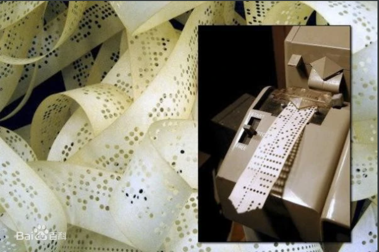

机器码本身也遵循一定的编码规则，比如下图是x86汇编语言的编码方式

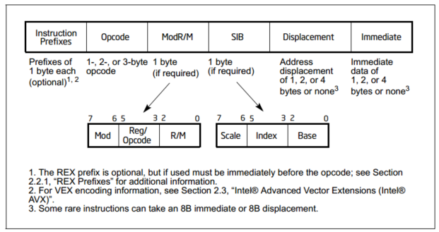

后来随着机能和存储介质的发展，出现了汇编语言。汇编语言基本可以看做是对机器码的直接翻译，与机器码是一一对应的关系，但相对于机器码来说显然更适合人类理解。

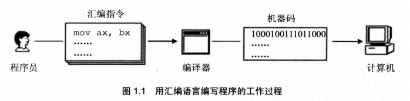

（PS：这图里的编译器应该叫汇编器准确点）


### 指令与数据

前面说机器码本质上也是一串数字，因此对于CPU来说，指令与数据没有区别，同样个数，既可以将其看做一串指令，也可以看做一串数据，取决于我们希望怎么翻译它。比如

```
10001001 11011000
					->		89D8		（数据）
					->		mov ax, bx	（指令）
```


### CPU的一些直观理解

#### 运算单元

试想现在我们想设计一个部件，它能够用来计算一个多项式 $ax^2+bx+c$ 

首先，自然而然地，我们需要一个能计算加法和一个能计算乘法的部件。每个单元接受两个输入，输出一个运算结果。


#### 寄存器

现在有了运算部件，可以对两个数进行运算。但多项式需要经过多次运算，显然我们需要一些东西来暂存结果，因此寄存器应运而生。如下图

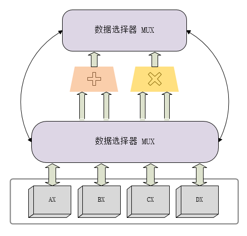

这里我们一下加入了许多部件，逐一来看

* 最下面的框就是我们加入的寄存器，这里我们暂时加入 AX BX CX DX 4个寄存器
* 数据选择器MUX是用来控制数据由哪个寄存器输入到运算部件中的，并同时控制输出的结果放到哪个寄存器中

#### 运用寄存器和运算单元进行计算

通过上面几个部件，我们可以简单地整理一下计算多项式的思路。假设初始状态，4个寄存器的内容如下：

```
AX:		a
BX:		b
CX:		c
DX:		x
```

那么运算过程可以如下

```
AX = AX * DX		;AX -> a*x
AX = AX * DX		;AX -> a*x*x
BX = BX * DX		;BX -> b*x
AX = AX + BX		;AX -> ax^2+bx
AX = AX + CX		;AX -> ax^2+bx+c
```

#### 译码器与程序

有了上述的运算流程，就需要让这些运算部件按照我们的想法来进行运算。因此就需要输入程序，而对程序进行解析的部件叫做译码器。上述这些部分就构成最简单的一个CPU的结构

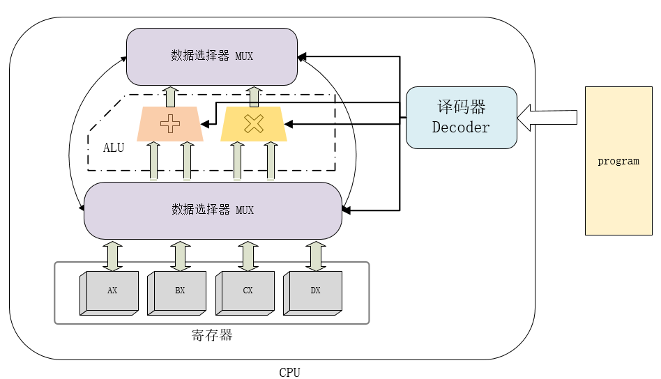

而我们可以用汇编语言（这里用的是类似伪代码的形式，并不是标准的x86汇编）来表示上面的逻辑。

这里的汇编格式为 `指令 目的操作数, 源操作数1, 源操作数2`

```
MUL AX, AX, DX		;AX -> a*x
MUL AX, AX, DX		;AX -> a*x*x
MUL BX, BX, DX		;BX -> b*x
ADD AX, AX, BX		;AX -> ax^2+bx
ADD AX, AX, CX		;AX -> ax^2+bx+c
```

#### 内存

上面的想法似乎工作得很好，可以正确计算出我们想要的结果。但如果我们需要计算一个更复杂的式子，如 $a_n x^n+a_{n-1}x^{n-1}+...+a_0$ ，那么显然4个寄存器是不够用的。因此需要引入内存单元。

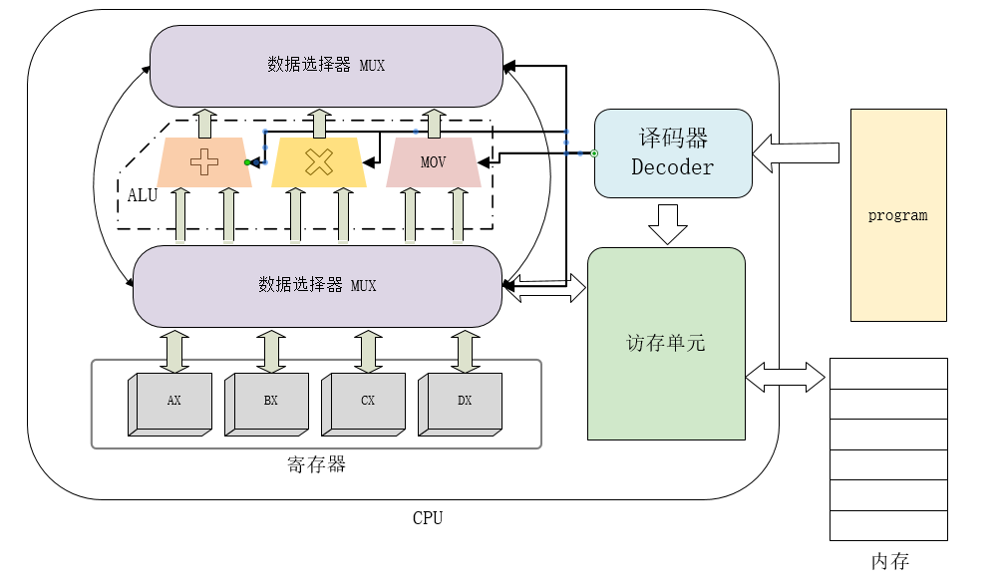

除了访存单元外，这里加了一个MOV部件用于将交换内存和寄存器的数据

相对于寄存器，内存的容量要大得多。而对内存的访问也不像寄存器一样可以使用特定的名称，而是需要根据地址来索引要访问的单元，就像房间的门牌号一样，因此内存的访问速度要比寄存器慢很多。

此外在存储方面，现代处理器还有多级高速缓存。为了方便讨论这边不提了。


### x86/x64的寄存器

#### 通用寄存器

| 8位  | 16位               | 32位 | 64位 |
| :--- | ------------------ | ---- | ---- |
|高8位 AH  低8位 AL | AX   | EAX  | RAX  |
|高8位 BH  低8位 BL | BX   | EBX  | RBX  |
| 高8位 CH  低8位 CL | CX | ECX | RCX |
| 高8位 DH  低8位 DL | DX | EDX | RDX |
| 低8位 SIL（x64 only） | SI | ESI | RSI |
| 低8位 DIL（x64 only） | DI | EDI | RDI |
| 低8位 BPL（x64 only） | BP | EBP | RBP |
| 低8位 SPL（x64 only） | SP | ESP | RSP |

其中x64 only表示只有在x64汇编中才可以使用该寄存器，如只有x64汇编中才可以用SIL寄存器

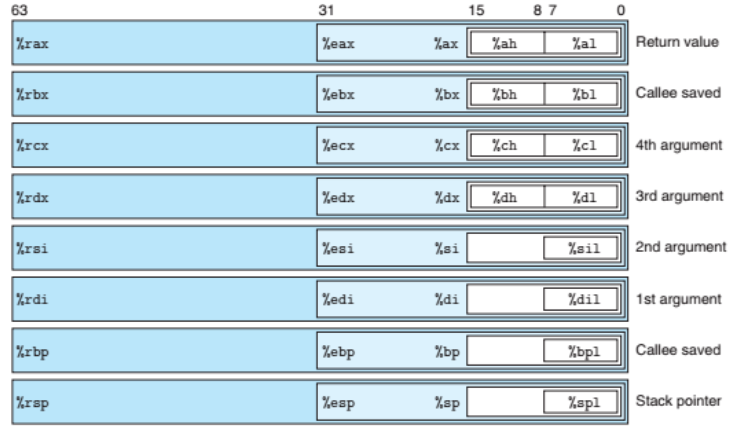

此外，在x64中加入了额外8个通用寄存器

| 8位  | 16位 | 32位 | 64位 |
| ---- | ---- | ---- | ---- |
| R8B  | R8W  | R8D  | R8   |
| R9B  | R9W  | R9D  | R9   |
| R10B | R10W | R10D | R10  |
| R11B | R11W | R11D | R11  |
| R12B | R12W | R12D | R12  |
| R13B | R13W | R13D | R13  |
| R14B | R14W | R14D | R14  |
| R15B | R15W | R15D | R15  |

通用寄存器之所以称为通用，是因为我们可以使用汇编灵活地操作这些寄存器，包括赋值、运算等。但实际上这些寄存器往往拥有不同的特殊功能，也因此有不同的特定用法（比如无符号数乘法指令mul指定AX为第一个乘数）。

#### 程序计数器

IP/EIP/RIP 是一个特殊寄存器，用于存放当前的程序指针，即当前正在运行的程序的地址。因此也被称为程序计数器。

#### 段寄存器

段寄存器用于内存的分段访问，关于分段的内容在下面介绍

| 段寄存器名 | 用途         |
| ---------- | ------------ |
| CS         | 代码段寄存器 |
| DS         | 数据段寄存器 |
| ES         | 附加段寄存器 |
| SS         | 栈段寄存器   |

一般来说，不同的内存段会配合不同的寄存器作为偏移量寻址

* CS  代码段寄存器一般配合 IP/EIP/RIP 寻址，即CS:IP指向的地址是程序指针
* SS  栈段寄存器一般配合 BP/SP 寻址
* DS  数据段寄存器是大多数内存操作数的默认段寄存器

#### 标志寄存器

标志寄存器用于存储一些运算结果的标志位，主要有下列几个标志

| 标志位 | 用途                  |
| ------ | --------------------- |
| OF     | 有符号数进位/溢出     |
| CF     | 无符号数进位/溢出     |
| ZF     | 若运算结果为0，则置1  |
| SF     | 若运算结果为负，则置1 |

注意：一定要区别有符号数和无符号数的运算。

```
假设现在操作数为16位，两数 0xFFFE 和 0x0003 相加，标志位结果如何？
mov ax, 0xFFFE
mov bx, 0x0003
add ax, bx

答案是CF为1，OF为0。
因为对于无符号运算，0xFFFE表示的数是65534, 65534+3 = 65537 > 65535，因此产生了上溢
而对于有符号运算，0xFFFE表示的数是-2，-2+3 = 1，没有溢出
```


### x86实模式的内存模型

#### 实模式

在x86的实模式下，所有程序共享同一块内存空间。也就是说如果在实模式的系统上运行着程序A和B，在程序A访问地址 [0x10000] 与程序B访问地址 [0x10000] ，访问的是同一个内存单元（这与保护模式存在巨大的区别，关于保护模式可能在后续关于操作系统的内容里提及）

#### 程序分段与内存的段式管理

一段程序一般是由数据和指令构成的，因此在设计程序时，我们一般将程序分为若干个段，如数据段、代码段、栈段。由此程序可以方便地对多块不同用途的空间进行管理。

因此，x86实模式下的内存也是使用段式管理，如下图

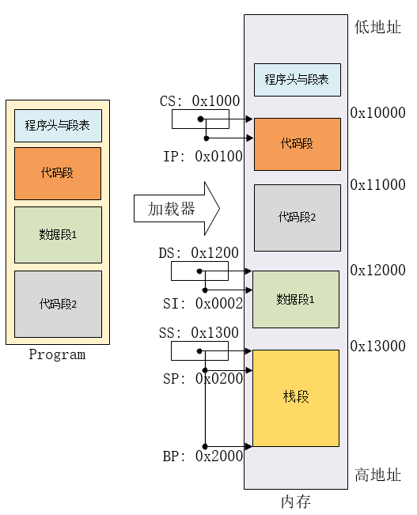

如图，加载器在加载程序的时候可以将不同的段加载到不同的内存块上，此后将段寄存器指向对应块的起始地址。

x86实模式采用20位的地址线，因此可以寻址 2^20 字节，即有1M的地址空间。寻址方式是 `段寄存器<<4 + 偏移量`

因此如图，CS段寄存器配合IP作为偏移量可以寻址 0x10000~0x1FFFF 这64KB的地址，图中指向的是 `0x1000<<4 + 0x0100 = 0x10100`

这里注意栈段，因为栈的内容是运行时生成的，因此一般在程序中不会真的有对应的段，而是在加载的时候由加载器动态分配空间

### x86的指令集

x86指令集是典型的CISC指令集，即复杂指令集，其对应的是RISC 精简指令集。从分类名称就可以知道x86的指令集十分庞大，即使只计算CPU的指令集也有多达几百条指令（x86处理器还有更加庞大的协处理器指令集，如FPU、SIMD等）。

下面会根据类别介绍一些常用的指令

#### 指令的操作数

主要有如下几类操作数

##### 寄存器

最常见的操作数就是寄存器操作数，如

```asm
add ax, bx		; 对寄存器ax和寄存器bx的内容做无符号加法，结果放在ax中
				; ax = ax + bx
mul bx			; 对寄存器ax和寄存器bx的内容做无符号乘法，结果的低16位放在ax中，高16位放在dx中
				; dx:ax = bx * 16
```

##### 立即数

```asm
add ax, 16		; ax = ax + 16
mul 16			; dx:ax = ax * 16
```

##### 内存操作数

```asm
add ax, word ptr [bx]	; 对寄存器ax和 寄存器bx指向的内存 做无符号加法
mul word ptr [bx]		; 对寄存器ax和 寄存器bx指向的内存 做无符号乘法
```


#### 部分指令介绍

##### 算术运算类

| 指令助记符 | 指令作用   | 示例       | 注释                          |
| ---------- | ---------- | ---------- | ----------------------------- |
| add        | 加法       | add ax, bx | ax = ax + bx                  |
| adc        | 带进位加法 | adc ax, bx | ax = ax + bx + CF（进位标志） |
| sub        | 减法       | sub ax, bx | ax = ax - bx                  |
| sbb        | 带借位减法 | sbb ax, bx | ax = ax - bx - CF             |
| inc        | 加1        | inc ax     | ax = ax + 1                   |
| dec        | 减1        | dec ax     | ax = ax - 1                   |
| neg        | 求相反数   | neg ax     | ax = -ax                      |
| mul        | 无符号乘法 | mul bx     | dx:ax = ax * bx               |
| imul       | 有符号乘法 | imul bx    | dx:ax = ax * bx               |
| div | 无符号除法 | div bx |ax为结果的商，dx为余数|
| idiv | 有符号除法 | idiv bx |同上|

#####  逻辑运算类

需要注意的一点是，汇编的逻辑运算和C语言的逻辑运算不同，C语言的一个逻辑运算表达式结果只有True和False。

汇编中的逻辑运算指令实际上对应的是C语言的位运算

| 指令助记符 | 指令作用 | 示例       | 注释                              |
| ---------- | -------- | ---------- | --------------------------------- |
| and        | 与       | and ax, bx | ax = ax & bx                      |
| or         | 或       | or ax, bx  | ax = ax \| bx                     |
| xor        | 异或     | xor ax, bx | ax = ax ^ bx                      |
| not        | 取反     | not ax     | ax = ~ax                          |
| shl        | 逻辑左移 | shl ax, 4  | ax = ax << 4                      |
| shr        | 逻辑右移 | shr ax, 4  | ax = ax >> 4                      |
| rol       | 循环左移 | rol ax, 4  | 低位补到高位                      |
| ror       | 循环右移 | ror ax, 4  | 高位补到低位                      |

##### 数据传送类

因为是数据传送的指令，因此会给出各种操作数的示例

###### mov

| 指令助记符 | 指令作用             | 示例                  | 注释             |
| ---------- | -------------------- | --------------------- | ---------------- |
| mov        | 数据传送             | mov ax, bx            | 寄存器到寄存器   |
|            |                      | mov ax, 0x1234        | 立即数到寄存器   |
|            |                      | mov ax, word ptr [bx] | 内存到寄存器     |
|            |                      | mov word ptr [bx], ax | 寄存器到内存     |
|            | 下面是段寄存器的传送 | mov ds, ax            | 寄存器到段寄存器 |
|            |                      | mov ax, ds            | 段寄存器到寄存器 |
|            |                      | mov ds, word ptr [ax] | 内存到段寄存器   |
|            |                      | mov word ptr [ax], ds | 段寄存器到内存   |

注意，这里对于段寄存器的读写只有在**实模式**下可用，保护模式下的段寄存器无法这样修改。或者我们可以简单地认为在写x86的16位汇编的时候才能这样写，而我们常见的应用程序不能这样写。

至于实模式和保护模式的区别，如果以后讲到操作系统相关的时候会补充

###### lea

| 指令助记符 | 指令作用 | 示例                  | 注释                                             |
| ---------- | -------- | --------------------- | ------------------------------------------------ |
| lea        | 指针传送 | lea ax, word ptr [bx] | 将内存操作数的地址赋给寄存器。这里等于mov ax, bx |

lea有一些技巧可以配合内存操作数来完成一些运算，可以留到后面讲

###### push pop

进栈/出栈操作。实际上push/pop都可以看做两条指令的组合

```asm
push ax			; = sub sp, 0x2
				;   mov word ptr [sp], ax
pop ax			; = mov ax, word ptr [sp]
				;   add sp, 0x2
```

**push**

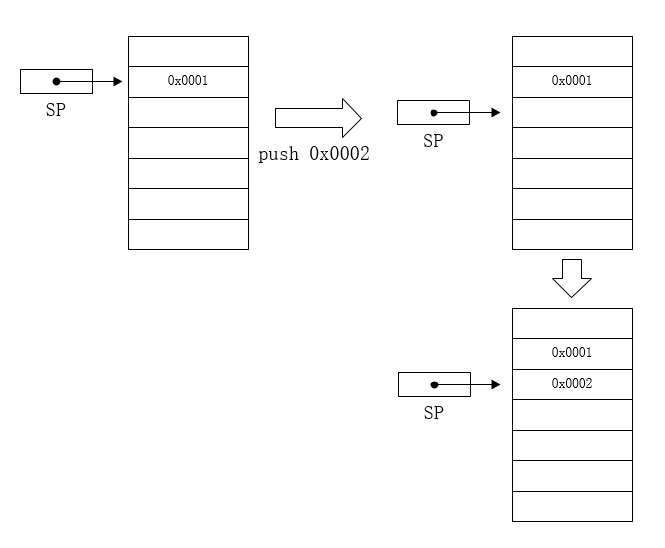

**pop**

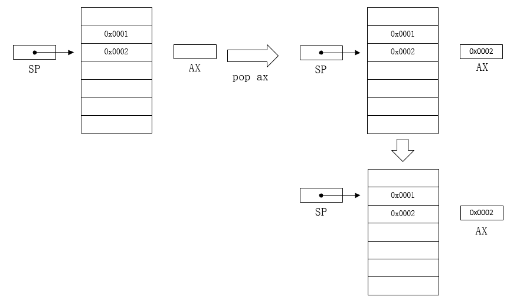

| 指令助记符 | 指令作用 | 示例               | 注释                     |
| ---------- | -------- | ------------------ | ------------------------ |
| push       | 入栈     | push ax            | 寄存器入栈               |
|            |          | push 0x1234        | 立即数入栈               |
|            |          | push word ptr [ax] | 内存操作数入栈           |
|            |          | push ds            | 段寄存器入栈             |
| pop        | 出栈     | pop ax             | 栈顶内容赋值给寄存器     |
|            |          | pop word ptr [ax]  | 栈顶内容赋值给内存操作数 |
|            |          | pop ds             | 栈顶内容赋值给段寄存器   |

push和pop有一个比较有意思的性质，它是为数不多的几个可以直接进行内存到内存的数据转移的指令

###### xchg

| 指令助记符 | 指令作用           | 示例                   | 注释 |
| ---------- | ------------------ | ---------------------- | ---- |
| xchg       | 交换两个操作数内容 | xchg ax, bx            |      |
|            |                    | xchg ax, word ptr [bx] |      |


##### 控制流转移指令

###### 条件转移

| 指令助记符 | 指令作用                        |
| ---------- | ------------------------------- |
| ja/jnbe    | 大于/不小于等于则跳转（无符号） |
| jae/jnb    | 大于等于/不小于则跳转（无符号） |
| jb/jnae    | 小于/不大于等于则跳转（无符号） |
| jbe/jna    | 小于等于/不大于则跳转（无符号） |
| jg/jnle    | 大于/不小于等于则跳转（有符号） |
| jge/jnl    | 大于等于/不小于则跳转（有符号） |
| jl/jnge    | 小于/不大于等于则跳转（有符号） |
| jle/jng    | 小于等于/不大于则跳转（有符号） |
| je/jz      | 等于/为零则跳转                 |
| jne/jnz    | 不等于/不为零则跳转             |
| jc         | 有进位则跳转（无符号）          |
| jnc        | 无进位则跳转（无符号）          |
| jo        | 有溢出则跳转（有符号）          |
| jno        | 无溢出则跳转（有符号）          |

条件转移指令实际上是按照 [标志寄存器](#标志寄存器) 结果来进行跳转的，一般的算术运算和逻辑运算指令都会导致标志位的改变。

此外还有两个常用的指令：cmp和test

| 指令助记符 | 指令作用           | 示例        | 注释                              |
| ---------- | ------------------ | ----------- | --------------------------------- |
| cmp        | 比较两个操作数大小 | cmp ax, bx  | 实际上是执行了a-b并设置对应标志位 |
| test       | 逻辑与两个操作数   | test ax, ax | 实际上是执行了a&b并设置对应标志位 |

test一般用于判断某个操作数是否为0

###### 无条件转移

**jmp**

**call/ret**

call和ret指令配合栈进行控制流的转移

```asm
call ax
	; = push next ip
	;   jmp ax
ret
    ; = pop ip
```

一般来说，这两条指令是成对出现的

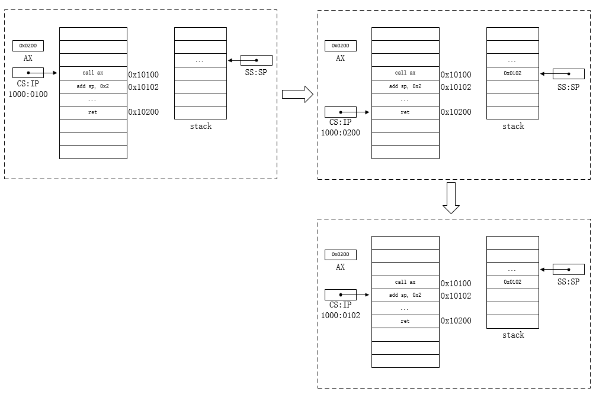


#### 关于指令手册

由于x86的指令集十分庞大，一些指令的作用可能较为复杂。下面介绍如何查找关于一条指令的资料：

* 直接百度这条

