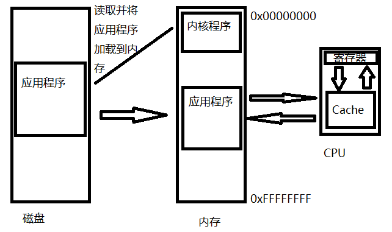
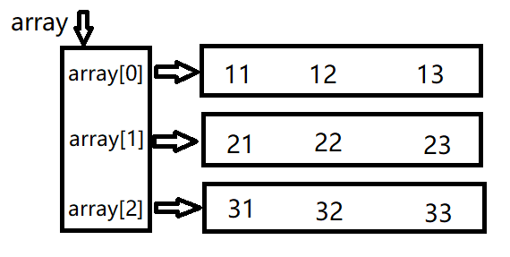
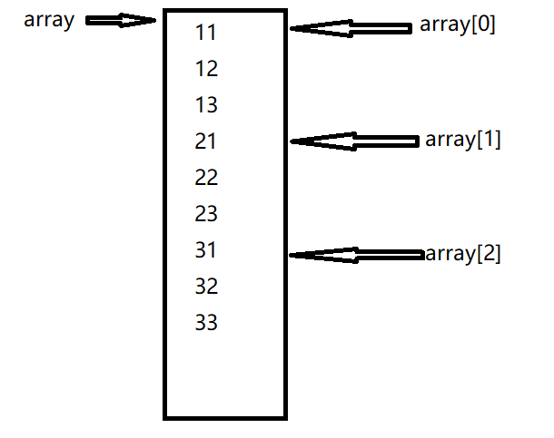

# 指针

## 基本概念

### 内存模型

x86架构系统运行时，先由内核程序将应用程序从磁盘加载到内存中，再由CPU与内存交互运行程序

CPU与内存是直接交互的，而与磁盘则需要通过程序操作磁盘控制器才可以实现交互



CPU通过内存地址对内存进行访问，内存地址长度一般来说与CPU位宽是相同的，即，对于32位CPU内存地址长度为32bit(4 bytes)，对于64位CPU内存地址长度为64bit(8 bytes)，一个内存地址可以寻址一个字节的空间，因此32位CPU可以寻址的内存大小为 2^32 bytes = 4GB

### 指针概念

指针是用于存储一个内存地址的结构，因此指针类型占用的空间大小对于不同位数的CPU是不同的

对于32位机指针类型有4 bytes，对于64位有8 bytes

### 基本语法

#### 定义

```c
int a;
int *p = &a;
```

#### *与&

##### *

`*`放在**数据类型的描述中**表示定义一个对应类型的指针，对于每种**可以在内存中分配空间的数据类型**都可以定义其指针（基本上除了enum以外的所有常见数据类型，struct结构体）

```c
unsigned char *a;				//定义一个指向unsigned char的指针
unsigned long long *b;			//定义一个指向unsigned long long的指针


typedef struct _list_node		//一个单链表节点的数据结构
{
    struct _list_node *next;	//定义一个指向下一个单链表节点的指针
    int num;
} list_node;
list_node *head;				//因为struct声明使用了typedef
							//因此可以直接用list_node*定义一个指向list_node类型的指针
```

`*`放在**语句**中表示取值，或称为**解引用**，即取一个指针变量对应的地址的值

```c
int a = 3;
int *p = &a;	//定义一个指向a的指针

(*p)++;		//因为p是指向a的指针，所以*p即为a的值，或者从C的角度来讲取得的是a这个对象。(*p)++即a++
```

##### &

`&`表示取一个对象的地址，或称为**引用**

###### 例1

[code/1.c](code/1.c)

```c
// 比如这里想实现对int a这个对象的引用
int a = 3;

int *p = &a;
(*p)++;			// p的值为&a，要取得a对象则调用*p
				// a = 4
int **pp = &p;	// 定义一个二重指针，即指向指针的指针
(**pp)++;		// 因为pp=&p 因此*pp=p，因此**pp=a
				// a = 5
```

### 与数组的关系

数组可以视为一段连续的内存空间，如int array[10]; 即分配了一段 10*sizeof(int) 的内存空间给程序

C语言中，**数组名其实是一个指向数组第一个元素的指针**

```c
int array[10];
int *p = &array[0];

printf("array:%p p:%p\n", array, p);
```

输出：

```
array:0060FEF4 p:0060FEF4
```

因此可以通过**数据类型相同**的指针对数组元素进行访问

###### 例2

[code/2.c](code/2.c)

```c
int array[10];
int *p = array;

for(int i=0; i<10; i++)
{
    *(p+i) = i;
}					//将array赋值为0~9
```

此外`*(p+i)`可以用`p[i]`代替

## 进阶

### 指针的加法

#### 一个例子

###### 例3

[code/3.c](code/3.c)

```c
    char a;
    char *pa = &a;

    int b;
    int *pb = &b;

    long long c;
    long long *pc = &c;

    struct test
    {
        int mem1;
        int mem2;
    } d;
    struct test *pd = &d;

    printf("pa:%p pa+1:%p\n", pa, pa+1);
    printf("pb:%p pb+1:%p\n", pb, pb+1);
    printf("pc:%p pc+1:%p\n", pc, pc+1);
    printf("pd:%p pd+1:%p\n", pd, pd+1);
```

输出

```
pa:0060FF0F pa+1:0060FF10
pb:0060FF08 pb+1:0060FF0C
pc:0060FF00 pc+1:0060FF08
pd:0060FEF8 pd+1:0060FF00
```

可以发现pa+1后地址与原来地址相差为1，但pb差值为4，pc差值为8，pd差值为8

也就是说指针的加法运算，实际上单位是该指针指向的数据类型的字节数，即

```
long long *a
a + 1  ==>  a + sizeof(long long)
a + n  ==>  a + n * sizeof(long long)
```

#### 为什么

再看一段程序

```c
int array[5]

for(int i=0; i<5; i++)
    printf("%p\n",&array[i]);
```

输出

```
0060FF08
0060FF0C
0060FF10
0060FF14
0060FF18
```

这段输出很好理解，因为array的元素是int型，所以每个元素占用空间是4字节

那么结合起来想想应该能理解为什么指针每次加的数值实际是sizeof(指针类型)

为了加深理解，可以看接下来这个例子

###### 例4

[code/4.c](code/4.c)

```c
unsigned int array[2] = {0x12345678, 0xabcdef66};
unsigned int *pa = array;
char *pb = array;			//这里会报指针类型不匹配的warning，要消除可以将array改为(char*)array

for(int i=0; i<2; i++)
    printf("%x\n", pa[i]);
for(int i=0; i<8; i++)
    printf("%x\n", pb[i]);
```

输出

```
12345678
abcdef66
78
56
34
12
66
ffffffef
ffffffcd
ffffffab
```

可以看出使用char\*访问相同的数据时，char\*每次只会访问一个字节的数据

至于为什么数字的顺序是倒着的，可以查下小端序大端序

至于最后为什么前面有很多ff，因为这里采用的指针是char\*，即pb[i]被当做一个char型变量，对于char型变量，0xef 0xcd 0xab都是**负数**，当用格式化字符串%x调用printf时会先将char型转换为int型，因此会有一堆ff，表示其是个负数（负数为什么会有一堆ff请查补码的相关知识）。**要消除这些ff可以将char\*改为unsigned char\***

### 二维数组

#### 二维数组的逻辑结构

现在先假设我们有如下的定义

```c
int array[3][3] = { {11,12,13},{21,22,23},{31,32,33} };
int *p[3] = array;			// 注意这里的定义是int *p[3]，需要指定数组的第二个维度
```

我们可以方便地通过`p[m][n]`使用array中的元素

那么应该怎么用p+偏移量的方式使用呢

答案是 `*( *(p+m) + n )`

如何理解？看下图



也就是说，实际上array指向一个指针数组，而指针数组又各自指向了一个一维数组，以此组成一个二维数组，这是C语言中二维数组的**逻辑结构**

回头来理解上面的代码，`*(p+m)`实际上取了`array[m]`的值，这个值指向`array[m][]`这个一维数组，因此`*(p+m)+n`指向了`array[m][n]`，最后`*( *(p+m) + n )`即为`array[m][n]`

#### 二维数组的实际结构

但在实际中，内存空间是一维的，而如果为每个二维数组都创建一个指针数组未免过于复杂，因此实际上内存布局如下



为了验证可以看看下面的代码

###### 例5-1

[code/5.c](code/5.c)

```c
printf("array:%p\n", array);
for(int i=0; i<3; i++)
    printf("array[%d]:%p\n", i, array[i]);

for(int i=0; i<3; i++)
    for(int j=0; j<3; j++)
        printf("&array[%d][%d]:%p\n", i, j, &array[i][j]);
```

输出

```
array:0060FEEC
array[0]:0060FEEC
array[1]:0060FEF8
array[2]:0060FF04
&array[0][0]:0060FEEC
&array[0][1]:0060FEF0
&array[0][2]:0060FEF4
&array[1][0]:0060FEF8
&array[1][1]:0060FEFC
&array[1][2]:0060FF00
&array[2][0]:0060FF04
&array[2][1]:0060FF08
&array[2][2]:0060FF0C
```

题外话：因此其实也可以用如下代码访问array所有元素，想想为什么

```c
int *p2 = array;
for(int i=0; i<9; i++)
    printf("array[%d][%d]:%d\n", i/3, i%3, p2[i]);
```

#### 深入思考\*p[n]

现在回过头来想想为什么定义一个指向`array[m][n]`的指针必须定义为`*p[n]`而不能是`**p`

这里可以用到之前指针的加法，看看`*p[n]`与`**p`的区别

```c
int **pp = array;
printf("pp:%p  pp+1:%p\n", p2, p2+1);
printf("p:%p  p+1:%p\n", p, p+1);
```

输出

```
pp:0060FEE0  pp+1:0060FEE4
p:0060FEE0  p+1:0060FEEC
```

可以看到，`**p`的自增单位为`sizeof(int)`，而`*p[3]`的自增单位为`3*sizeof(int)`

#### 多维数组

一样，👴就不说了

注意多维数组`array[m][n][x][y][z]`的指针定义为`*p[n][x][y][z]`，自增单位为`n*x*y*z* sizeof(type)`

## 其他指针

### 结构体指针

#### 结构体的内存对齐

结构体老生常谈的问题就是所谓的内存对齐，见下例的结构体

```c
typedef struct _test
{
    int a;
    char b;
    long long c;
    char d;
} test;
```

可以看一下各成员的内存地址

```c
test mytest;

printf("test addr: %p\n", &mytest);
printf("test.a addr: %p\n", &mytest->a);
printf("test.b addr: %p\n", &mytest->b);
printf("test.c addr: %p\n", &mytest->c);
printf("test.d addr: %p\n", &mytest->d);
printf("next test addr: %p\n", &mytest[1]);
```

在我的机子上结果如下

```
test      addr: 000000000061FE00
test.a    addr: 000000000061FE00
test.b    addr: 000000000061FE04
test.c    addr: 000000000061FE08
test.d    addr: 000000000061FE10
next test addr: 000000000061FE18
sizeof test   : 18
```

可以看到，对于b和d两个char型成员，虽然char型数据只占1字节，但由于编译器的默认对齐为4字节，因此b实际占了4字节；而有趣的是，d占了整整8个字节。这似乎是因为gcc在进行结构体间的对齐时，会根据结构体中最长的成员来对齐。见下面例子（[code/struct_1.c](code/struct_1.c)）：

```c
typedef struct _test2
{
    long long a;
    char b;
} test2;

typedef struct _test3
{
    int a;
    int b;
    char c;
} test3;
```

这两个结构体在我的编译器中的大小分别是 0x10 和 0xC（尝试了gcc和msvc）

#### pragma pack

从上面的例子可以看出，程序员很多时候并无法正确预测结构体的内存对齐方式，那有没有办法对内存对齐进行手动控制呢

见下例（[code/struct_2.c](code/struct_2.c)）

```c
#pragma pack(push, 1)		// 将原有的内存对齐压入栈，并定义新的内存对齐长度（这里为1）

typedef struct _test
{
    int a;
    char b;
    long long c;
    char d;
} test;

#pragma pack(pop)			// 将之前的内存对齐出栈
```

这里使用pragma宏将默认的结构体内存对齐设置成1字节。注意这里有一对入栈出栈的操作。

各成员的内存地址如下：

```
test      addr: 000000000061FE0A
test.a    addr: 000000000061FE0A
test.b    addr: 000000000061FE0E
test.c    addr: 000000000061FE0F
test.d    addr: 000000000061FE17
next test addr: 000000000061FE18
sizeof test   : e
```

可以看到，这里结构体的长度严格等于 4+1+8+1=14，也就是说没有任何因程序对齐需要浪费的空间

#### 结构体的常见用法

##### 特性

先来看一个有趣的例子 [code/struct_3.c](code/struct_3.c)

首先定义结构体如下

```c
#pragma pack(push, 1)

typedef struct _test
{
    unsigned char lo;
    unsigned char mid_1;
    unsigned char mid_2;
    unsigned char hi;
} test;

#pragma pack(pop)
```

主程序为

```c
unsigned int a = 0xdeadbeef;
test* p = &a;						// 这里直接将一个结构体指针指向这个unsigned int

printf("a:        %X\n", a);
printf("p->lo:    %X\n", p->lo);
printf("p->mid_1: %X\n", p->mid_1);
printf("p->mid_2: %X\n", p->mid_2);
printf("p->hi:    %X\n", p->hi);
```

结果为

```
a:        DEADBEEF
p->lo:    EF
p->mid_1: BE
p->mid_2: AD
p->hi:    DE
```

可以看到，test的每个成员都对应了unsigned int上的每个字节，也就是说可以用这种方式来以不同的格式解析一段内存的内容

当然，在实际编程中应该尽量避免上述这种 *指针乱指* 的行为，所以一般可以结合union来实现 [code/struct_4.c](code/struct_4.c)

```c
typedef union _data {
    unsigned int num;
    test all_bytes;
} data;
```

使用这种方法进行赋值

```c
    data a;
    a.num = 0xdeadbeef;

    printf("a.num:             %X\n", a.num);
    printf("a.all_bytes.lo:    %X\n", a.all_bytes.lo);
    printf("a.all_bytes.mid_1: %X\n", a.all_bytes.mid_1);
    printf("a.all_bytes.mid_2: %X\n", a.all_bytes.mid_2);
    printf("a.all_bytes.hi:    %X\n", a.all_bytes.hi);
```

结果与上个程序相同

```
a.num:             DEADBEEF
a.all_bytes.lo:    EF
a.all_bytes.mid_1: BE
a.all_bytes.mid_2: AD
a.all_bytes.hi:    DE
```

##### 位域

使用位域可以对结构体的内存进行更精准的控制，位域可以指定结构体上每个成员对应多少个二进制位。

见下例 [code/bitfield.c](code/bitfield.c)

结构体：

```c
typedef struct _test
{
    unsigned char byte0_lo_3: 3;
    unsigned char byte0_mid_2: 2;
    unsigned char byte0_hi_3: 3;
    unsigned char byte1_lo_4: 4;
    unsigned char byte1_hi_4: 4;
} test;
```

程序：

```c
printf("sizeof test:             %X\n", sizeof(test));
printf("a.all_bytes.byte0_lo_3:  %X\n", a.all_bytes.byte0_lo_3);
printf("a.all_bytes.byte0_mid_2: %X\n", a.all_bytes.byte0_mid_2);
printf("a.all_bytes.byte0_hi_3:  %X\n", a.all_bytes.byte0_hi_3);
printf("a.all_bytes.byte1_lo_4:  %X\n", a.all_bytes.byte1_lo_4);
printf("a.all_bytes.byte1_hi_4:  %X\n", a.all_bytes.byte1_hi_4);
```

结果如下：

```
sizeof test:             2
a.all_bytes.byte0_lo_3:  7
a.all_bytes.byte0_mid_2: 1
a.all_bytes.byte0_hi_3:  7
a.all_bytes.byte1_lo_4:  E
a.all_bytes.byte1_hi_4:  B
```

##### 文件/协议解析

结构体在程序中最常见的用途之一就是文件、协议的解析。众所周知，大多数文件和协议都是由多个不同的部分组成的，如PE文件有文件头，TCP协议有报文头。在解析时最常用的方法就是在内存中读入一段文件或协议的内容，再将一个结构体指针指向其对应的位置

[code/header.c](code/header.c) 展示了一个读取PE头/ELF头的程序

##### 获取偏移量的奇技淫巧

在实际编程中，有时候需要知道结构体的某个成员的相对偏移，一般采用下面这个宏

```c
#define offsetof(s,m)  (size_t)&(((s *)0)->m)
```

还有多种类似的写法，不过原理是一样的。

s是结构体的类型，m是成员名。这个宏的原理就是将NULL指针，也就是地址为0的指针转换为该结构体的指针，此后使用该指针来计算成员的地址。由于成员的地址是`结构体指针地址+成员偏移`，而这里的结构体指针地址为0，因此可以得到成员偏移

