## 二进制代码混淆

### 花指令

花指令是一类对抗反编译器/反汇编器分析的指令形式，主要是利用反编译器和反汇编器的工作特性加入的混淆，可以使得反编译器/反汇编器得到错误的结果

#### 针对反编译器

方法有很多，这里举一个例子：因为反编译器在识别函数的时候是根据 call - ret 的调用序列来识别的，如下图

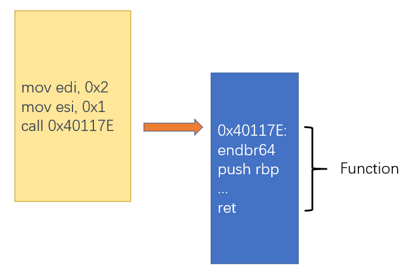

所以如果用一些手段在代码中加入ret，就可以混淆反编译器对函数的解析

```c
int Test1(int a, int b)
{
    printf("Test1\n");
    return a+b;
}

int Test2(int a, int b)
{
    printf("Test2\n");

    asm volatile(
        "push rax\n\t"
        "mov rax, offset Label1\n\t"
        "xchg [rsp], rax\n\t"
        "ret\n\t"
        "Label1:"
        :
        :
        : "cc"
    );
    return a+b;
}
```

这里加入的花指令实际上实现的是一个jmp offset的功能

```nasm
push rax                ; 保存rax内容到栈顶
mov rax, offset Label1    ; 将要跳转的地址传给rax
xchg [rsp], rax            ; 将栈顶数据与rax交换，交换完成后栈顶保存着要跳到的地址
ret                        ; 使用ret进行跳转
Label1:
```

反编译结果分别如下

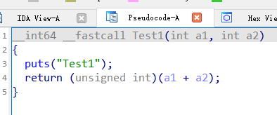

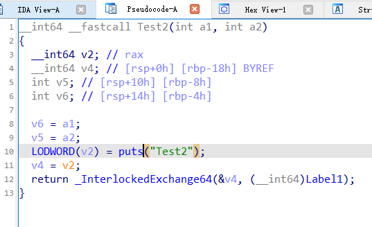

但可以看到，类似的花指令不会影响反汇编：

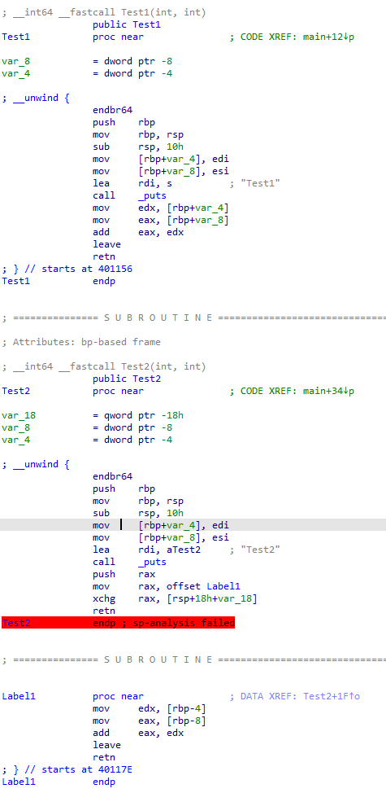

#### 针对反汇编器

这种技术又叫Anti-Disasm，是针对反汇编器的，本质上针对的是反汇编器的两种工作方式：线性反汇编与递归反汇编。此外该技术基本只对变长指令集有效，如x86指令集。

- 线性反汇编与递归反汇编

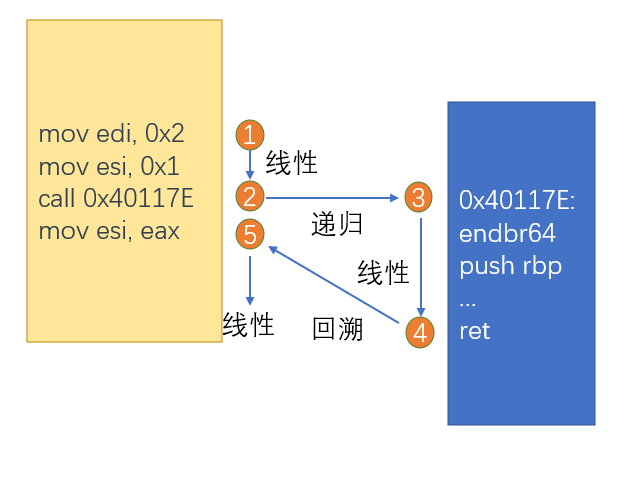

anti-disasm技术主要针对两个点

- 利用几乎所有反汇编器的一个共性：一个地址上的数据最多只能属于一条汇编语句
- 利用递归反汇编时会先到跳转语句的目标地址进行反汇编后，再回溯到跳转语句的下一条指令

针对第一个点的混淆如下：

```c
int Test3(int a, int b)
{
    printf("Test2\n");

    asm volatile(
        ".byte 0xeb\n\t"
        ".byte 0xff\n\t"
        ".byte 0xc0\n\t"
        ".byte 0xff\n\t"
        ".byte 0xc8\n\t"
    );
    return a+b;
}
```

这里的一系列数据实际上构造的是这样三条汇编指令

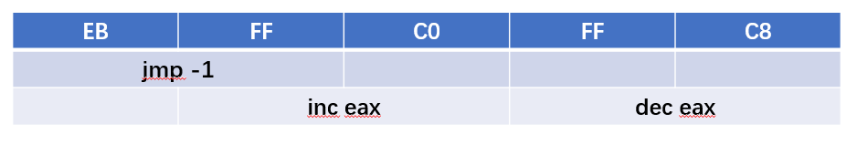

可以看到，第二个字节的FF同属于jmp -1和inc eax两条指令，但反汇编器无法处理这种单个数据同属于两条指令的情况，因此会呈现下列结果

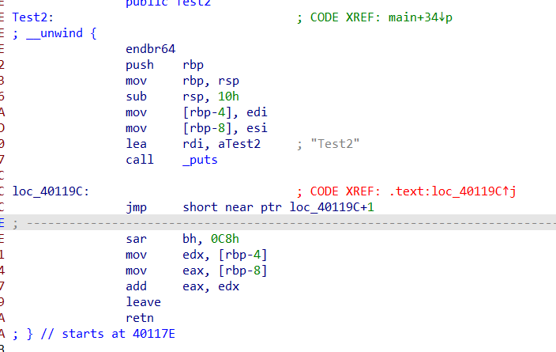

针对第二个点的混淆如下

```c
int Test4(int a, int b)
{
    printf("Test4\n");

    asm volatile(
        "push rax\n\t"
        "xor rax, rax\n\t"
        ".byte 0x74\n\t"    // jz +4
        ".byte 0x2\n\t"
        ".byte 0xe9\n\t"
        ".byte 0xed\n\t"
        "pop rax"
    );

    return a+b;
}
```

这里实际上是先构造了一个不透明谓词（下面会讲到），使得jz永真，因此一定会跳转；但反汇编器在遇到jz指令时会先接着进行线性反汇编，因此误将e9和ed识别成指令，呈现下列结果：

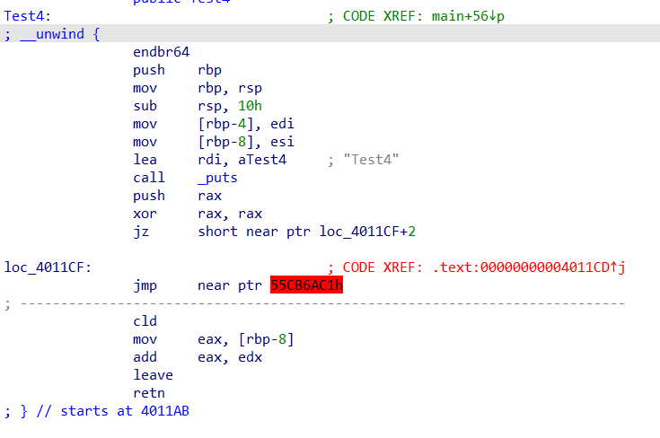

### 垃圾指令、指令膨胀与常量展开

垃圾指令顾名思义，就是一堆与实际操作无关的指令与运算，这类混淆可能在实际的运算过程中混入大量无关的运算，比如函数本身就是对输入进行加法计算，但在函数中插入一个计算矩阵乘法的内容，用来混淆视听。

垃圾代码虽然可以混淆视听，但它本身的计算与输入输出无关，因此可以采用数据流分析等技术将其去除。

指令膨胀则是将一条或几条指令膨胀为一系列指令的操作，只要保证语义的一致性，理论上指令可以无限膨胀。如上面花指令的例子中可以将

```nasm
jmp Label
```

膨胀为

```nasm
push rax
mov rax, offset Label
xchg [rsp], rax
ret
```

还有一个典型的例子就是布尔运算，最经典的就是将

```nasm
xor rax, rbx
```

膨胀为

```nasm
mov rcx, rbx
not rcx
and rcx, rax
not rax
and rax, rbx
or rax, rcx
```

语义的等价性是由公式

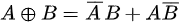

保证的

因为布尔代数的一些特性，基于布尔运算进行的混淆有着较为完善的研究，这种表达式称为 Mixed Boolean-Arithmetic

常量展开与编译优化里的常量折叠相反，常量折叠是为了将多个常量计算折叠为一个计算后的常量，而常量展开则是将单个常量展开为多个常量的计算，同样可以达到混淆的效果

### 不透明谓词

上面提到的几个技术主要是针对数据流进行的混淆，而不透明谓词是控制流混淆技术

#### 基本概念

不透明谓词的概念其实很简单，就是一个条件表达式，程序员可以很容易在运行时确定它的结果，但对于静态分析工具来说，它的结果难以确定。

不透明谓词有三种：永真谓词、永假谓词和不确定谓词，一般来说使用场景如下

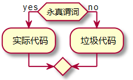

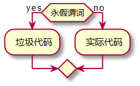

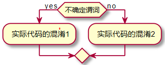

构成谓词的元素可以千变万化，前面举了一个最简单的例子就是一个永真谓词，即

```nasm
xor rax, rax
jz label
```

因为对同一个数进行异或运算的结果一定为0，所以这是一个永真谓词

此外还可以用很多手法构造不透明谓词，如可以使用数学定理构造永真谓词

```c
int x, y;
if( x*x+y*y >= 0)
    real code
else
    junk code
```

甚至使用数据结构来构造不透明谓词，如构造一个图，判断条件是该图是否为无环图，等等。

不透明谓词原理虽简单，但不透明谓词的构造方式使得对程序完备的静态分析在理论层面上变得不可行，因为对于不透明谓词的求解最终可以归类到图灵停机问题。

#### 控制流平坦化

对不透明谓词比较典型的应用就是控制流平坦化技术了，它的原理是将代码控制流中的各个分支使用一系列不透明谓词进行分隔，使得分析人员难以通过静态分析的手段理清程序的控制流

下面是一个简单的函数经过控制流平坦化后的样子：

```c
int main(int argc, char **argv)
{
    if (argc != 2)
    {
        puts("error");
        return 1;
    }
    if (check_password(argv[1]))
    {
        puts("Congratulation!");
    }
    else
    {
        puts("error");
    }
    return 0;
}
```

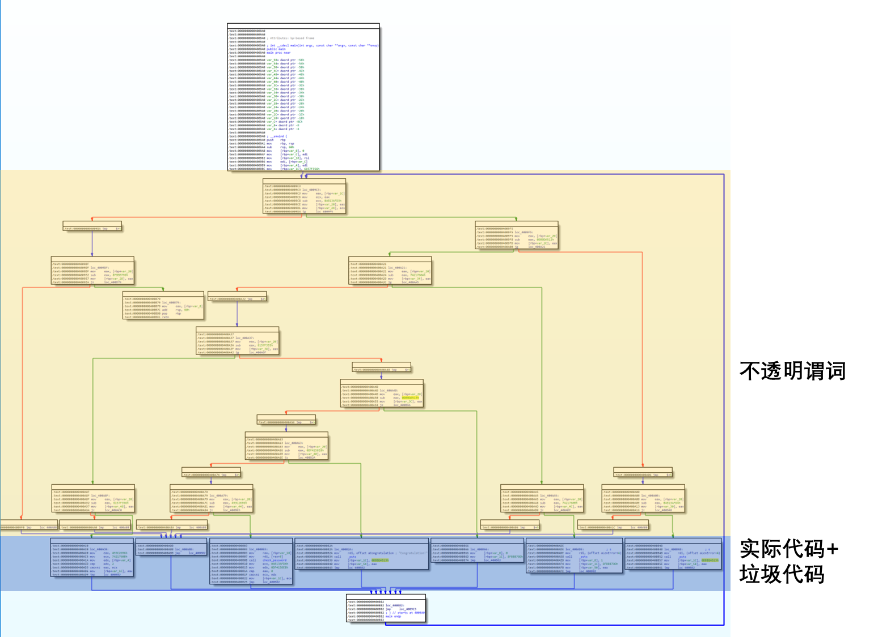

控制流平坦化以基本块为单位（基本块是二进制代码分析中的一个基础概念，即只有一个入口和一个出口的语句块，在执行这个语句块时只可能从入口进入，最终执行到出口退出，中途不可能存在其他的跳转），将基本块合并到一个类似死循环+switch case的结构中，通过一系列不透明谓词来控制各个基本块的执行顺序，并且插入了一些永远无法到达的基本块。从而达到混淆控制流的目的。

### 总结

上面简单介绍了几种二进制代码混淆的方法，主要可以分为两类，一类是针对数据流，一类是针对控制流。可以说，上述几种二进制代码混淆方法构成了二进制混淆技术的基本原语，由这些原语出发，可以构造出各种各样繁多且复杂的混淆方案。
