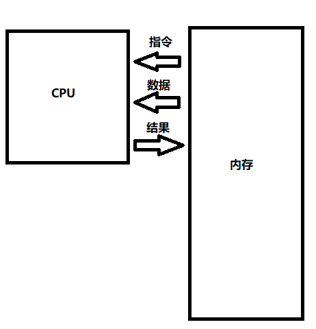
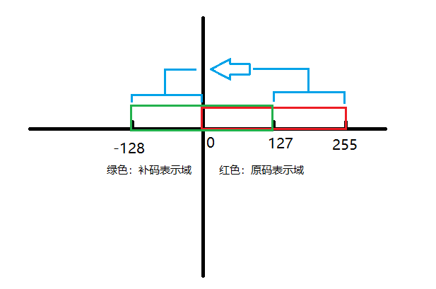
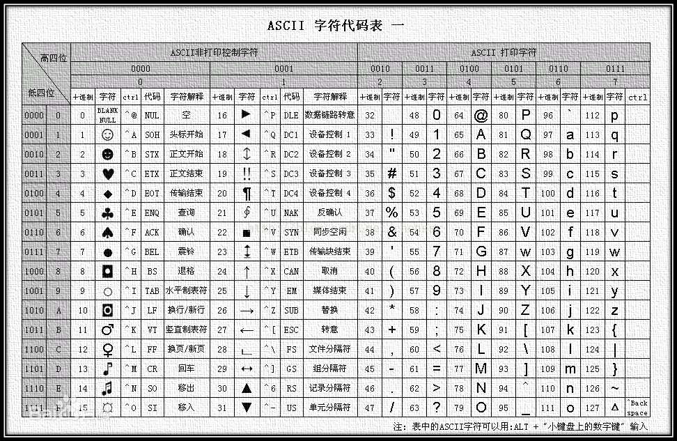
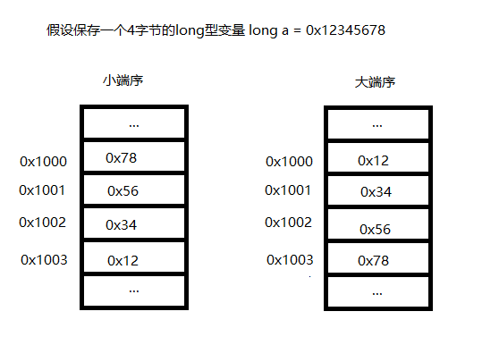

## 计算机是怎么表示数据的

### 基础知识

#### 数字电路与二进制

这里只简单地介绍一下概念

##### 数字电路

简单来说就是因为计算机是由数字电路组成的，数字电路的一个端口只有两种状态：高电平和低电平，或者用较为不严谨的方法描述，可以视作端口有电压和无电压（只是可以这样理解，事实上不是这样的）。高低电平是人为定义的，不同的电平标准有不同的阈值，如常见的TTL电平定义输入电压在2V以上为高电平，电压在0.8V以下为低电平。

只要我们使用的数字电路芯片输入输出的电压全部符合统一的电平标准，也就不需要去管它具体每个端口电压是多少了。这也是为什么在单片机与其他模块连接时通常需要注意一下数字电路的电平标准是否与单片机IO口的输入输出电平标准相符。对于电平标准不符的芯片，应该使用OD（Open-Drain，开漏）加上拉电阻的方式来驱动IO从而匹配电平，具体方式这里不展开讲了。

关于电平（不是重点不知道也没关系啦）：

```
电平标准有四个重要的参数：VIH VIL VOH VOL

- VIH  输入为高电平时的最低电压，当 输入电压>=VIH 时被认为是输入了高电平
- VIL  输入为低电平时的最高电压，当 输入电压<=VIL 时被认为是输入了低电平
- VOH  输出为高电平时的最低电压，输出高电平时应保证 输出电压>=VOH
- VOL  输出为低电平时的最高电压，输出低电平时应保证 输出电压<=VOL

一般说来，VOH要高于VIH，VOL要低于VIL，这是为了避免传输线路上出现的噪声导致信号出现错误。
```

然后我们可以进一步抽象，把低电平定义为0，高电平定义为1。这样我们就可以使用数学来创造世界了。

这其实体现了一种分层的思想，上层的计算机软件部分不需要知道底层的电路部分实现细节，只需要知道底层电路都接收0和1的二进制串作为输入，输出也是0和1的二进制串。

##### 二进制

简单来说二进制不过是一种特殊的计数方法。日常生活我们用的都是十进制计数，这可能源于古人发明计数法的时候计数是用手指头记的，不过他们发现手指记了十个数不够用了，于是一个聪明人翘起了一根脚指头，记了二十个以后他翘起了两根脚指头（虽然我不知道怎么同时翘起两根脚趾，假设他会吧）。于是从此以后我们计数都是按十进制记的，所有数字都可以写成以10为基底的多项式之和，比如`6324 = 4*10^0 + 2*10^1 + 3*10^2 + 6*10^3`

但对于数字电路来说它没有十根手指头，而若把计算电路做成满足十进制的方式需要电路可以识别十种不同的电压输入，这显然成本高昂。因此采用只有0和1两个数的二进制是最为简单的方法，因为这可以直接对应电路端口高电平和低电平两个状态。其实我们也可以试着用手指模拟二进制计数的方法。做法如下：

指头弯曲表示0，指头伸出表示1

* 0  手握拳
* 1  只伸出拇指
* 2  收起拇指伸出食指，表示00010
* 3  伸出拇指和食指， 表示00011
* 4  只伸出中指，表示00100
* 5  伸出中指和拇指，表示00101
* 以此类推

PS 1：是不是突然发现这种方法比我们平时计数要好多了，以前一只手只能算5个数现在能算2^5=32个数了，两只手就是2^10=1024哇！如果算上脚趾就是2^20=2097152，相当于8086地址总线的位宽了！（前提是你能正确的同时伸直所有指头中的任意个，像我是没法同时把拇指和无名指伸直的

PS 2：事实上我们平时用手计数的方法有点类似于计算机里的*独热码*，即对于我们的五根手指来说，每个计数值只有一根手指伸出，表示当前的计数值为该手指代表的值。但这是一种很冗余的编码方案，因为五根手指可以同时有两根伸出也可以有三根伸出，这说明这五根手指可以表示的状态数远远大于5。使用二进制的编码方案则可以利用手指表示的全部状态（假设每根手指只有伸出和收起这两种状态）

PS 3：课后题，哆啦A梦要怎么学算数

二进制的基底为2，同样拿6324举例，表示为二进制应该是`1*2^12 + 1*2^11 + 1*2^7 + 1*2^5 + 1*2^4 + 1^2^2`（4096+2048+128+32+16+4），

即`1 1000 1011 0100`

和十进制一样，我们可以方便地定义四则运算，具体计算方法我不赘述了，其实道理很类似，不过10进制是9+1的时候进位，2进制是1+1的时候进位，所以在十进制下，`999+1 = 1000`，`909+1=910`，而类比二进制，`111+1=1000`，`101+1=110`

#### 存储

计算机执行时最简单的模型如下，内存用于存储指令和数据，CPU用于处理指令和数据，并把结果返回给内存。这里是一个最简单的模型，这个系列的文章希望能以自顶向下的视角逐步地完善并解释这个模型（咕）。



计算机的运行过程其实有点像我们做数学题，CPU是计算器，内存是草稿纸，草稿纸上记着公式（对应CPU运行的指令）和数据（对应数据与结果）。做题的每一个步骤我们都会按照公式输入计算器进行运算，将结果写在草稿纸上以便进行下一步运算。

存储器可以看做是由一堆可以存放0和1的格子组成的，一般以8个格子（8个二进制位）组成一个单位，称为一个字节（byte）。因此一个字节由8个二进制位组成，可以表示2^8=256种不同的状态。

其他的单位有

* WORD 字  一般是2Bytes
* DWORD  双字  一般是4Bytes
* KB  1024Bytes(2^10 Bytes)
* MB  1024KB
* GB  1024MB
* TB  1024GB

存储器可以分成易失性存储（DRAM、SDRAM等）和非易失性存储（磁盘、磁带、NAND flash、光盘、EEPROM等），每种存储方案本质上都是以一定的形式来存储二进制数据，区别主要是成本和速度，感兴趣的话可以了解下人类为了存几个数字脑洞有多大。

PS 1：其实还有一些存储方案存的不是数字而是模拟量，比如唱片、胶片等。不过显然数字的东西易于量化、保存、拷贝等，因此这些东西都成为历史了。

PS 2：想像一下你手机的64G存储空间实际上是由`64*1024*1024*1024*8=‭68719476736‬` 个小格子组成的，密集恐惧症晚期的你是不是顿时内心发毛啊（逃

### 编码

#### 整数

##### 正数与原码

对于正数来说，一般直接使用二进制表示，C语言中有unsigned前缀的类型声明该变量只能用于存放正数，换句话说，该变量的存储空间存放的数据是以正数的方式来存取和解释的，这种编码方式也可以称为原码

下面示例展示了uint8_t uint16_t uint32_t和uint64_t的二进制表示（完整源码可以在[这里](https://github.com/nen9mA0/myNote/tree/master/beginner/编码/code/test_int.c)找到）

PS：uintxx_t用于定义一个xx位的unsigned int类型变量，定义在stdint.h中

```c
uint8_t a = 128;
uint16_t b = 128;
uint32_t c = 128;
uint64_t d = 128;

printf(" uint8_t: ");
printbin(a, sizeof(a));

printf("uint16_t: ");
printbin(b, sizeof(b));

printf("uint32_t: ");
printbin(c, sizeof(c));

printf("uint64_t: ");
printbin(d, sizeof(d));
```

结果如下

```
 uint8_t: 10000000
uint16_t: 0000000010000000
uint32_t: 00000000000000000000000010000000
uint64_t: 0000000000000000000000000000000000000000000000000000000010000000
```

`128 = 1*2^7`，可以看出uint类型中的数字是直接以二进制方式表示的，需要注意uint类型只有正数

##### 负数与补码

###### 一个例子

下面展示一个有趣的例子：

```c
int8_t a2 = -128;
int16_t b2 = -128;
int32_t c2 = -128;
int64_t d2 = -128;

printf("  int8_t: ");
printbin(a2, sizeof(a2));

printf(" int16_t: ");
printbin(b2, sizeof(b2));

printf(" int32_t: ");
printbin(c2, sizeof(c2));

printf(" int64_t: ");
printbin(d2, sizeof(d2));
```

结果如下：

```
  int8_t: 10000000
 int16_t: 1111111110000000
 int32_t: 11111111111111111111111110000000
 int64_t: 1111111111111111111111111111111111111111111111111111111110000000
```

可以看到这里int8_t中的-128与uint8_t中的128有着相同的二进制表示，而对于其他长度的类型，-128的表示与128的表示差别就在于前面n位是1还是0

###### 补码

补码的目的就是在计算机中表示负数，思路很简单，主要满足下面的性质
$$
(x + (-x)) \ mod \ 2^n = 0
$$
其中n为变量的位数。mod 2^n是因为计算机在计算n位数据时会将多于n位的数据舍去，即对于一个8位变量来说，11111111+00000001 = 100000000，但这里的1在第9位，因此会直接丢弃，结果为00000000

比如对于x = 1，n=8（假设x是一个8位的变量，即该变量由8个bit存储），则(-x)即为-1的二进制表示，可以这样推出
$$
\begin{aligned}
(1 + (-x)) \ mod \ 2^n &= 0
\\
1 + (-x) &= 2^n
\\
(-x) &= 2^n -1 
\end{aligned}
$$
所以这里的(-x)写作十进制是255，也即二进制的 11111111，所以这就是负数-1在计算机中的表示，也即补码表示。

第二个性质就是补码表示的数中最高位是数字的符号位，0为正，1为负

符号位的引入使得补码与原码的表示范围出现了区别。以8位为例，对于原码来说，8个数位都可以用来表示数字，因此可以表示`0(00000000)~255(11111111)`这256个数字。对于补码来说，只有7个数位表示数字，可以表示-128`(10000000)~127(01111111)`这256个数字。

```
原码和补码的关系有点类似下面这张图。补码的-128~-1的部分可以视作是原码的128~255部分平移过来的
至于为什么补码运算可以让我们方便地用加法器实现减法运算这里我不打算讲太多，留到以后如果专门写一篇文章讲CPU中的各种运算再开坑吧（咕
```



#### 字符

计算机表示字符的思路很简单，就是做一个表，一个数字对应表中的一个字符，保存的时候就存储字符对应的数字，打印时就根据数字查找对应的字符并打印

##### ASCII

ASCII码是最早的码表，一个ASCII字符由一个字节存储。ASCII码表包含了大小写英文字母，阿拉伯数字和部分标点符号等128个字符，基本上当使用英文输入法时可以用键盘输入的字符都在ASCII码表里。

下面看看字符'a'的二进制形式

完整源码可以在[这里](https://github.com/nen9mA0/myNote/tree/master/beginner/编码/code/test_char.c)找到

```c
char a1 = 'a';
unsigned char b1 = 'a';
int c1 = 'a';


printf("  char: ");
printbin(a1, sizeof(a1));

printf(" uchar: ");
printbin(b1, sizeof(b1));

printf("   int: ");
printbin(c1, sizeof(c1));
```

结果

```
  char: 01100001
 uchar: 01100001
   int: 00000000000000000000000001100001
```

就是十进制的97，对应ascii表的'a'



##### 其他编码

###### ANSI

由于ascii只有128个字符，显然没法表示除了英文外的其他国家的语言，在以后很长一段时间里都没有全球统一的标准，于是各国都拿出了自己的编码表适配国内的语言。如国内有GB2312 GBK GB18030等。

ANSI编码对于不同国家有不同编码表，但都遵循一定的编码规则，如`0~127(0x7F)`依旧保留给ASCII码表，因此对于一个ASCII码字符依旧可以使用一个字节存储。新的编码表第一个字节在`128(0x80)~255(0xFF)`之间，这样当解码时，若遇到如下编码

```c
char ansi_str[10] = {0x45, 0xc3, 0xc8};
printf("%s\n", ansi_str);
```

解码第一个字节时，因为在0~0x7f范围内，所以作为ASCII码解释，为'E'，解码第二个字节时，因为不在ASCII范围内，所以以2个字节为单位按照GBK进行解码，0xc3c8对应的GBK编码为‘萌’（windows控制台使用的是GBK，与linux不同，因此同样的程序在两个系统的控制台运行可能导致乱码）

结果：

```
E萌
```

###### unicode

unicode是为了创立一个全球统一的编码而出现的。unicode码表本身非常冗余，用4个字节保存一个字符，但其拥有多种编码方式以压缩存储空间，常见的有三种

* UTF-32 以32位为单位保存unicode，即4字节，这种方式没有经过任何压缩，直接保存unicode码表的索引
* UTF-16 以16位为单位保存，即2字节。因为unicode表经过一定的精心设计，使得大多数常用字符集中在`0x00000000 ~ 0x0000FFFF`这个范围内（即2字节可以直接表示的范围），因此UTF-16在大多数情况下比UTF-32省空间。不过比起ANSI编码，UTF-16在表示一个ASCII字符时还是采用2字节
* UTF-8  以8位为单位保存，即1字节。这种保存方式可以用1字节表示一个ASCII编码，且大多数常用字符可以使用2~3字节表示，进一步压缩了空间。

但虽然unicode已经推广了几十年，但为了向下兼容，还是有很多系统（比如windows，虽然WINAPI对于字符串的处理很早就由ANSI改为UNICODE了，但windows很多应用，包括记事本等系统应用还是默认使用ANSI编码处理）使用着ANSI编码，这也是为什么直到现在我们还是经常遇见文件打开后乱码的问题。

此外，即使unicode经过一系列设计来使大多数国家的常用字符可以使用2字节来表示，但相比ANSI编码还是比较占空间的，毕竟ANSI编码指定代码页后（即指定本国语言对应的编码表），码表内只含有本国语言的字符，对于一国的语言来说，2字节（按照ANSI的编码方式一共可以有32768种编码）是完全够用的。而unicode码表包含了全世界大多数国家的语言，此外还有大量的数学符号、运算符、emoji等等。

#### 字符串

字符串在内存中的存储方式就是多个字符顺序存储，一般使用一个NULL(0x00)截断

#### 浮点数

一般采用的都是IEEE754标准，在C语言中主要分为了float(32位)和double(64位)两种格式，两者仅在表示精度上有差别，原理是一样的，因此这里以float为例

##### 二进制小数

前文采用十进制整数的表示方法类比了二进制整数的表示方法，对于小数也有相同的道理

```
十进制  0.8125 = 8*10^-1 + 1*10^-2 + 2*10^-3 + 5*10^-3
二进制  0.8125 = 0.5 + 0.25 + 0.0625 = 1*2^-1 + 1*2^-2 + 0*2^-3 + 1^2^-4
所以二进制的0.875=0.1101
```

与十进制小数可能出现无限循环/不循环小数相同，二进制也有无限小数，且因为基底的不同，很多在十进制中不是无限小数的数在二进制中变成了无限小数，比如0.1，表示为二进制为0.000110011001100...

##### 科学计数法

0.8125可以表示为8.125*10^-1

0.1101也可以表示为1.101*2^-1

科学计数法提供了一个将所有小数归约为相同形式的方法

##### 浮点数的表示

首先解释下为什么叫浮点数。“浮点”与“定点”是相对的概念，顾名思义浮点数的小数点是浮动的。可以通过类比整数的表示方法来理解浮点与定点的区别。

###### 定点数

再复习一下上面的内容，对于整数而言，以一个8位正数为例，其8个二进制位分别对应了8个不同基底的数

```
 _______________________________________________
| 2^7 | 2^6 | 2^5 | 2^4 | 2^3 | 2^2 | 2^1 | 2^0 |
 第8位 第7位 第6位  第5位 第4位  第3位 第2位  第1位
```

这样，对于十进制数20，可以这样表示

```
20 = 1*2^4 + 1*2^2
 _______________________________________________
|  0  |  0  |  0  |  1  |  0  |  1  |  0  |  0  |
 第8位 第7位 第6位  第5位 第4位  第3位 第2位  第1位
```

那么如果想表示小数的话，最朴素的想法就是改变每个位的基底，比如把小数点的位置定在第4位

```
 ___________________________________________________
| 2^3 | 2^2 | 2^1 | 2^0 | 2^-1 | 2^-2 | 2^-3 | 2^-4 |
 第8位 第7位 第6位  第5位 第4位   第3位   第2位  第1位
```

这样对于十进制数10.625，可以这样表示

```
10.625 = 1*2^3 + 1*2^1 + 1*2^-1 + 1*2^-3
 _______________________________________________
|  1  |  0  |  1  |  0  |  1  |  0  |  1  |  0  |
 第8位 第7位 第6位  第5位 第4位  第3位 第2位  第1位
```

这样，如上述方法定义的定点数可以表示的范围为：整数部分0~15，小数部分的最高精度是0.0625(2^-4)，总共可以表示16/0.0625=256个数，即从0.0~15.9375之间每隔0.0625的数都可以由该方法准确表示

这就是定点数的定义，因为在定义基底的时候我们把小数点放在了第4位。这种方式有一个很明显的弊端，就是表示范围与精度不可兼得。要是希望整数部分能表示更多的数，自然就要压缩小数部分的数位，反之要是想提高小数部分的精度，必然导致可以表示的整数范围很小。

PS：看到这里你可能会想问，那为什么不把整数部分和小数部分分开呢，比如一个字节专门表示整数，另一个字节专门表示小数。仔细想想，这种方式跟上述方式是没有本质区别的，先前的讨论中定义的是一个小数点放在第4位的8位定点数，而这种两字节的表示方式就相当于一个小数点放在第8位的16位定点数

###### 浮点数

为了解决上述的问题，出现了浮点数

浮点数注意到科学计数法可以把不同精度的数划为一个相同的形式，比如0.025和250分别可以表示为`2.5*10^-2`和`2.5*10^2`

因此浮点数是这样定义的，这里以IEEE754中单精度浮点数为例，对应C语言中是float类型，长度为32位

```
 ____________________________________________
| 符号位s |    阶码e    |        尾数f        |
 第32位     第23~第31位      第1~第22位
 1位符号位   8位阶码          23位尾数
```

然后浮点数以下列公式来表示数（这里的公式仅为IEEE754定义的规格化数的公式，因为这个最常用，其他的几种分别为NaN、无穷、非规格化数和0，都比较特殊所以这里不介绍了）
$$
(-1)^s * (1+f*2^{-23}) * 2^{e-127}
$$
或者我觉得写成这样比较直观
$$
(-1)^s * (1.f) * 2^{e-127}
$$
下面具体说几个比较特殊的点

* 尾数f是+1后参与运算的，这里的1被称为隐含位。这应该是因为数学里常用的科学计数法中一般规定保留个位，而对于二进制来说个位保留的结果肯定是1，就不专门分配一个位来存了。因此该位也被称为隐含位。
* 阶码e在参与运算的时候先-127，这是为了使阶码在不使用补码的情况下可以表示-127~128的数字（实际上因为保留了一些特殊阶码，因此规格化数的阶码范围是-126~127）

###### 浮点的几个例子

接下来举几个例子，比如对于定点数里描述过的10.625，可以表示如下

```
10.625 = 1010.101 = 1.010101 * 2^3
所以
符号位s=0
尾数f=010101
阶码e=127+3=130=10000010
所以在float中表示如下：
0 10000010 01010100000000000000000
```

看看代码的结果，完整源码可以在[这里](https://github.com/nen9mA0/myNote/tree/master/beginner/编码/code/test_float.c)找到（这段代码为了防止隐式类型转换重写了printbin）

```c
float f = 10.625;
printbin(&f, sizeof(f));
```

结果

```
01000001001010100000000000000000
```

与我们计算的相同。

接下来我们试试构造一个浮点数1.0，显然s=0，e=127，f=0。可以采用下列（有点迷惑的代码）构造。这里我不打算讲解这段代码里类型转换的原理，只希望让大家理解bin2float这个函数

```c
uint32_t bin2float(int s, uint8_t e, uint32_t f)
{
    uint32_t tmp = 0;
    tmp |= (s&0x01) << 31;
    tmp |= e << 23;
    tmp |= f & 0x7fffff;
    return tmp;
}

int main()
{
    uint32_t tmp;
    float tmpf;
    
    tmp = bin2float(0, 127, 0);

    tmpf = *(float*)&tmp;
    printf("%x\n", tmp);
    printf("%f\n", tmpf);
}
```

结果

```
3f800000
1.000000
```

###### 浮点数总结

浮点数运用了定点数不同的思想定义了一个新的表示方式，解决了定点数精度与范围不可兼得的问题。

但浮点数也存在一定的问题，比如对于大数+高精度的情况，比如15000000000.000000001，依旧存在精度损失的问题（该数使用float表示时输出为15000000512，说明浮点数在这种大数的情况下最大精度单位已经大于512。不过在大多数情况下已经比定点数好了）

此外，因为浮点数的格式，在保存一个无限小数的时候，即使小数位相同也会导致最大精度的区别（这个问题本质上原因与上一个问题相同），如1500.1与15.1，前者打印的数值是1500.099976，后者则是较准确的15.100000

### 编码的表示

#### 内存与地址

由前文对存储器的描述，对于内存（RAM）来说一般是以字节为单位进行存储的，即当我们想操作内存时只能一个字节一个字节地读取或写入，如果我想把一个字节的最低位置1，只能把整个字节读出来，把最低位置1，再写回内存。

内存的每个字节都有一个单独的地址，就像每家每户都有个单独的门牌号一样。内存芯片一般都有单独的地址线和数据线，地址线位宽直接决定了内存芯片的容量大小。

假设一个内存芯片的地址线有13位（比如Intel的6264，一个很古老的芯片，有13个引脚用来输入地址），它可以表示的地址数就有2^13个，也被称为**寻址空间**。相对应的，该内存芯片的容量应该为`2^13 * 1Byte = 8KB`

计算机在读取或写入内存时，会先在地址线中给出要存取的内存地址，再读取或写入数据。

#### 字节序

字节序是一个跟内存布局有关的问题。当我们在C语言中使用类似int、float等需要使用多个字节保存的变量时，存在一个问题：应该以什么样的顺序在内存中保存这些数据。

于是就出现了大端序和小端序。小端序就是把数据的低位保存在内存的低地址处，大端序就是把数据的低位保存在内存的高地址处。如图：



不同处理器可能采用不同的字节序。x86/x64等是小端序，ARM、PowerPC等有大端也有小端。网络传输中用的是大端。

#### 编码与解码

从前面介绍正数与负数的例子中，可以注意到unsigned char的128与char的-128是完全一样的，二进制都是10000000。

编码始终是与解码相对应的，编码是把一个特定的数据或内容转换成可以用二进制表示的数据，从而便于存储在内存中，而解码是把存储的二进制数据还原为原本的数据内容的过程。

因此对于一个二进制数据来说，抛开了其原始的编码类型，数据本身是毫无意义的。

下面的例子展示了同样的二进制数据以不同形式解码的结果

```c
uint8_t a = 0x41;
printf("%d\n", a);
printf("%c\n", a);

printf("\n");
int32_t b = -1;
printf("%d\n", b);
printf("%u\n", b);

printf("\n");
uint64_t c = 0x00656f6d456948;
printf("%lld\n", c);
printf("%s\n", &c);
```

结果

```
65
A

-1
4294967295

111529249040712
HiEmoe
```

第二个结果中的4294967295就是二进制`11111111 11111111 11111111 11111111 11111111 11111111 11111111 11111111`的结果，即32位全为1

