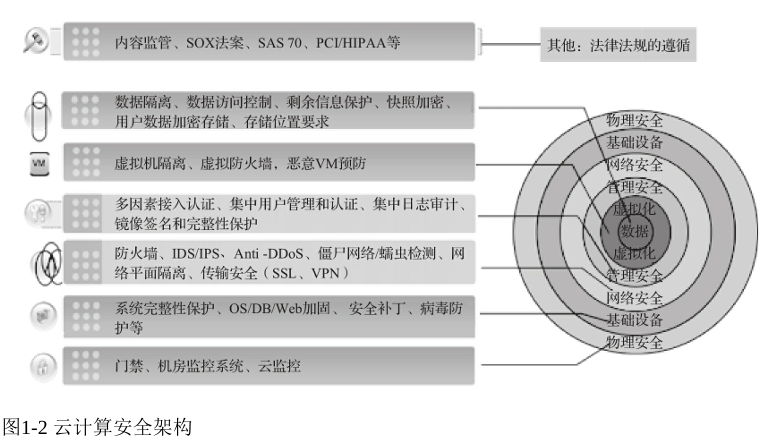
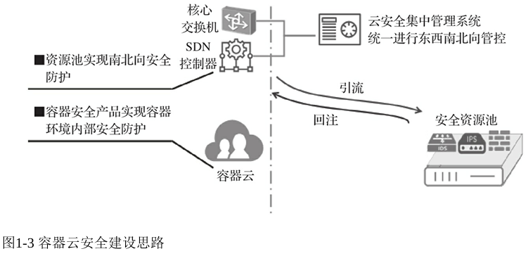
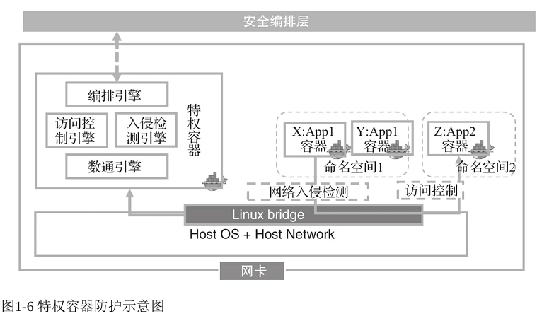
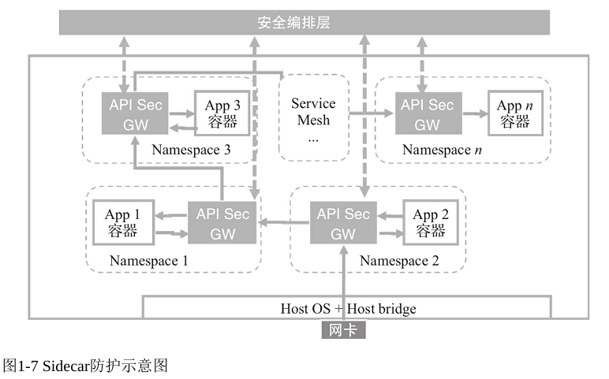
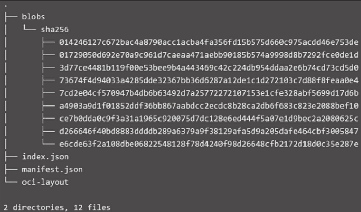
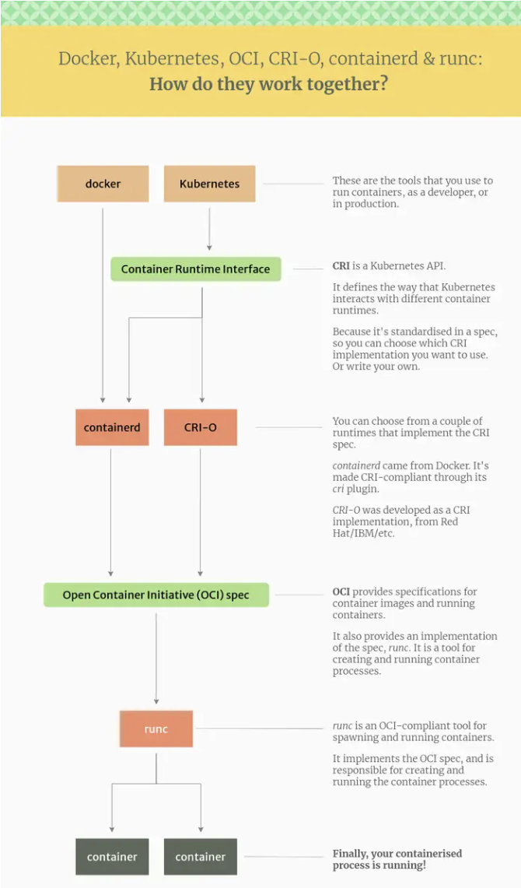
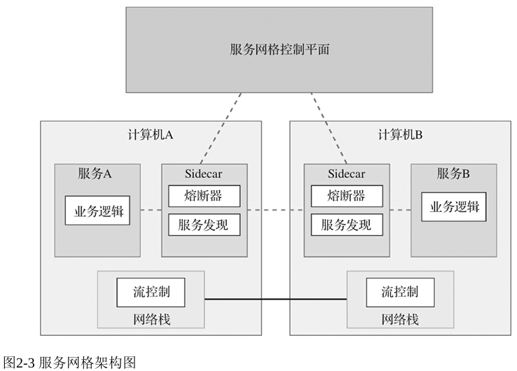
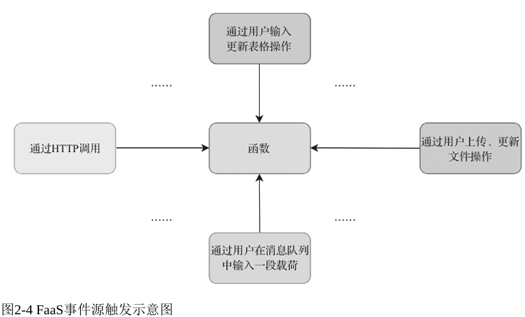
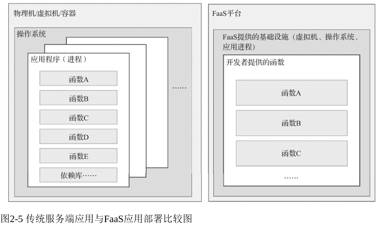
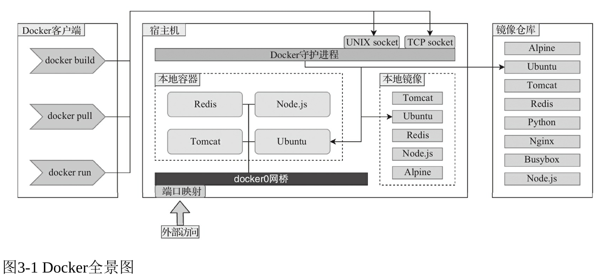

## 第一部分 云原生安全概述

### 第一章 云原生安全

#### 面向云原生环境的安全体系

##### 容器安全

容器层面的安全

* 容器环境基础设施的安全性（主机安全配置 安全漏洞等是否会影响到容器）

* 容器的镜像安全

* 容器的运行时安全（容器隔离、容器间通信）

* 容器生态的安全性（docker等组件本身的安全性）

容器云的整体安全架构则主要有两个方面

* 容器云内部的安全，如下图 

* 容器云内外之间的网络安全（南北向网络安全）
  
  

##### 编排系统安全

主要是k8s

##### 云原生应用安全

容器上运行的应用本身的安全

#### 如何实现安全的云原生化

* 安全架构需要也具备编排能力

* 容器和宿主机安全：安全特权容器
  
  容器和宿主机安全方面关注的是系统调用、网络流量等
  
  

* 业务安全：Sidecar安全容器
  
  业务主要关心的是容器所承载业务的安全，因此安全一般做在应用层上
  
  

### 第二章 云原生技术

#### 容器技术

##### 容器与虚拟化

docker容器没有Hypervisor层，每个容器与主机共享硬件资源和系统内核

##### 容器镜像与存储

docker容器镜像不包含内核，默认存储在`/var/lib/docker`

docker加载镜像时会首先读取manifest.json，根据该文件中config的sha256遍历所有的layer（即使用sha256标记的文件），之后将其拼成镜像

对于持久化存储，docker提供两类方案：

* 存储驱动  可以通过该驱动向容器的可写层写入数据

* 数据卷  存储驱动写入的数据会随着容器销毁而销毁，因此一般采用数据卷向容器提供持久化存储

##### 容器网络

* 主机网络（docker为例）
  
  * None
  
  * Bridge
  
  * Host
  
  * Container

* 集群网络（k8s为例）
  
  * 同一个Pod内容器之间的通信
  
  * 同一个主机内不同Pod之间的通信
  
  * 跨主机Pod之间的通信

##### 容器运行时

#### 容器编排

用于弹性、敏捷地管理容器集群

#### 微服务

将一个完整应用所有模块拆成多个不同服务，每个服务可以独立部署、维护和扩展

#### 服务网格

通常由一组轻量级网络代理实现，与服务一同部署；所有流量经过代理，从而提供负载均衡、智能路由等功能

#### Serverless

一种应用架构，将业务逻辑与基础设施分离，可在不考虑服务器的情况下构建并运行应用和服务

一般有两种实现：BaaS（后端即服务）、FaaS（函数即服务）

#### DevOps

开发运营一体化（Development & Operations）

主要是一个流程上的概念

### 第三章 容器基础设施的风险分析

#### 容器基础设施面临的风险

以docker为例

##### 容器镜像

容器镜像是一个不包含系统内核的unionfs

* 不安全的三方组件

* 恶意镜像

* 敏感信息泄露  开发者在构建镜像时将敏感信息一并打包

##### 活动容器

即镜像以容器形式运行后的风险

* 不安全的容器应用

* 不受限制的资源共享  即没有对容器的计算资源进行限制

* 不安全的配置与挂载
  
  docker容器的核心是两大隔离机制：cgroups（计算资源隔离）和namespace（文件系统、网络、进程、RPC、主机名等隔离）。此外还有Capabilities、Seccomp、AppArmor等机制限制进程权限和系统调用访问权限
  
  但通过一些不安全配置可能导致这些安全机制被打破
  
  * --privileged  特权容器，容器将不受Seccomp等限制，拥有与宿主机root同样的权限
  
  * --net=host  容器与宿主机处于同一个网络命名空间（打破网络隔离）
  
  * --pid=host  容器与宿主机处于同一个进程命名空间（打破进程隔离）
  
  * --volume /:/host  宿主机根目录会被挂载到容器内（打破文件系统隔离）

##### 容器网络

每个容器都处于由docker0网桥构建的局域网中，因此可能存在局域网内的攻击方式

容器内root用户默认由CAP_NET_RAW权限，因此可能可以构造ICMP ARP等包进行攻击

##### 容器管理接口

