# 形式语言与自动机

## 第一章 预备知识

### 一些定义

#### 语言

$$
对于给定的字母表\Sigma ，\Sigma 上一个字符串的集合称为字母表\Sigma 上的语言
$$

#### 前缀性质

设L是某个字母表上的语言，若L中任何字符串都不是另一个字符串的前缀，则称其有前缀性质

```
如在0,1组成的字符串集中，由i个0组成的语言没有前缀性质，因为如00是000的前缀。但由i个0和一个1组成的语言有前缀性质
```

#### 连接

$$
\begin{aligned}
& 设L_1为字母表\Sigma_1上的语言，L_2为字母表\Sigma_2上的语言，L_1和L_2的连接L_1L_2定义为
\\
& L_1L_2 = \{ xy | x \in L_1, y \in L_2 \}
\end{aligned}
$$

#### 闭包

$$
\begin{aligned}
& 语言L的闭包记为L^*，定义为
\\
& 1) \ L^0 = \{ \epsilon \} \\
& 2) \ 对于n \geq 1, L^n = L L^{n-1} \\
& 3) \ L^* = \cup L^n \\
& 正闭包 \ L^+ = \cup L^n，即不包含空串的L的闭包
\end{aligned}
$$

语言L的闭包就是以任意次序连接L中任意多个字串组成的集合

## 第二章 文法的一般理论

### 形式文法与形式语言

#### 定义

一个文法G是一个四元组 `G = (V, T, P, S)`

* V是变元的有限集
* T是终结符的有限集
* P是产生式的有限集。 其中每个产生式都是$\alpha \rightarrow \beta$的形式，其中$\alpha \in (V \cup T)^+$，且至少有一个V中的符号。$\beta \in (V \cup T)^*$。并分别称为产生式的左部和右部
* $S \in V$，称为文法G的开始符号

#### 推导与归约

**直接推导**： 设文法`G = (V, T, P, S)`，若对于$a = a_1 a_2 a_3, \gamma = a_1 \beta a_2$，且$a_2 \rightarrow \beta$是其中一个产生式，则称由a直接推导出$\gamma$，记为$a  \underset{G} \Rightarrow \gamma$

**推导**： 若a可通过多次直接推导得到$\gamma$，则记为$a \stackrel{*}{\underset{G} \Rightarrow} \gamma$

**句型**： 若有$S \stackrel{*}{\underset{G} \Rightarrow} \gamma$，则称为句型。其中S为开始符号

**句子**： 若$\gamma \in T^*$，则称为句子

**归约**： 推导的逆运算，如上面例子可称$\gamma$归约到a，记为$\gamma \stackrel{*}{\underset{G} \Leftarrow} a$

#### 文法与语言

##### 定义

文法`G = (V, T, P, S)`产生的语言记作L(G)，由下述集合定义
$$
L(G) = \{ \omega | S \stackrel{*}{\Rightarrow} \omega, 且 \omega \in T^* \}
$$
**几个从语言确定文法和从文法推导语言的例子的证明在书P26~P29，很繁琐**

* 从文法推导语言： 先证明文法推导出来的语言，再证明文法无法产生其他语言。一般是使用归纳法证明，即先证明长度为1的情况成立，再在长度为n的情况成立下证明长度为n+1的情况成立
* 从语言确定文法则需要先写出各个产生式，再从产生式出发，也是用归纳法来证明该产生式能唯一地产生语言

##### 文法等价

对于两个不同文法$G_1 = (V_1, T_1, P_1, S_1)$，$G_2 = (V_2, T_2, P_2, S_2)$，若有$L(G_1) = L(G_2)$，则称文法等价

文法等价性证明的思路即，首先证明 $L(G_1) \subseteq L(G_2)$，即对于任何G1中的句子 $S \stackrel{*}{\underset{G_1} \Rightarrow} x (x \in T^+)$ ，都能在G2找到一个对应的推导 $S \stackrel{*}{\underset{G_2} \Rightarrow} x (x \in T^+)$ ，这样即可证明G1包含于G2。要证明等价则反向再证G2包含于G1

##### 两类文法等价

设T1和T2是两种不同类型的文法，若对于T1中的每个文法G1，都有T2中的一个文法G2与之等价，反之亦然，则称T1与T2等价

### 文法的乔姆斯基分类

* 0型文法/短语结构文法（PSG）： 符合文法定义并不加其他限制的文法

* 1型文法/上下文有关文法（CSG）： P中每个产生式 $\alpha \rightarrow \beta$ 都满足条件 $|\alpha| \leq |\beta|$

  * $1^0$型文法： P中每个产生式都是 $a_1 A a_2 \rightarrow a_1 \beta a_2 \ \ 其中A \in V  \ \ a_1,a_2 \in (V \cup T)^* \ \ \beta \in (V \cup T)^+ $

* 2型文法/上下文无关文法（CFG）： P中每个产生式都具有如下形式
  $$
  A \rightarrow \beta \ , \beta \in (V \cup T)^*, A \in V
  $$
  即左边是一个变元，右边是任意个变元或终结符的组合

* 3型文法/正则文法（RG）： P中每个产生式都具有如下形式
  $$
  A \rightarrow \alpha \ 或 \ A \rightarrow \alpha B\ ,a \in T \cup \{ \epsilon \}, \ A,B \in V
  $$
  即左边是一个变元，右边是一个终结符，或一个终结符与一个变元的组合（注意顺序，不能有左递归）

#### 1型文法与$1^0$型文法

* **定理**：1型文法与$1^0$型文法等价

  如何从1型文法变为$1^0$型见 [证明](#prove2_1) 和 [例题](#problem1)

个人理解 $1^0$ 型文法主要就是**一次置换一个变元为一个或多个变元/终结符**，注意这里也直观体现了上下文有关文法的含义：把a1和a2看作上下文，那么显然只有当上下文符合条件时才能执行相应的产生式

#### 右线性与左线性文法

**右线性文法**： 产生式形如下式
$$
A \rightarrow \omega
\\
A \rightarrow \omega B
$$
**左线性文法**： 产生式形如下式
$$
A \rightarrow \omega
\\
A \rightarrow B \omega
$$
其中 $A,B \in V, \omega \in T^*$ （注意与正则文法区别，终结符可以是多个）

* **定理**： 任何右线性文法产生的语言都能被正则文法产生 [证明](#prove2_2)

* **定理**： 任何由左线性文法产生的语言都能被如下文法 G=(V, T, P, S)产生： [证明](#prove2_3)

  G中的产生式仅为 $A \rightarrow a$ 和 $A \rightarrow Ba$ 两种形式，其中 $a \in T \cup \{\epsilon\}, A,B \in V$ 

之后可以证明左线性文法类和右线性文法类产生的语言类相同

* **定理**： 给出正则文法G=(V ,T, P, S)，且L(G) = L，则其产生式有 $A \rightarrow a 和 A \rightarrow aB$ 两种形式。则存在文法 G' = (V, T, P', S)，它的产生式仅有 $A \rightarrow a 和 A \rightarrow Ba$ 两种形式，其中$a \in T \cup \{\epsilon\}, A,B \in V$ ，使得 $L(G') = L^R$ （语言L的逆转）  [证明](#prove2_4)


## 第三章 有穷自动机

### 基本定义

#### 有穷自动机

一个有穷自动机（Finite Automata，FA）由一个五元组定义
$$
M = (Q, \Sigma, \delta, q_0, F)
$$

* Q  有穷状态集
* $\Sigma$ 有穷的输入字母表
* $\delta$ 转移函数，将 $Q \times \Sigma$ 全映射到Q
* $q_0 \in Q$ 初始状态
* $F \subseteq Q$ 终结状态集

这里定义的FA对于每个状态的每个输入都能转移到确定的下一个状态，因此也被称为确定的有穷自动机（Deterministic Finite Automata）

#### 扩充转移函数

对于有穷自动机 $M = (Q, \Sigma, \delta, q_0, F)$ ，它的扩充转移函数 $\hat \delta 是从 Q \times \Sigma^* 到Q的映射$ ，定义如下

* $\hat \delta (q, \epsilon) = q$
* $\hat \delta(q, wa) = \delta ( \hat \delta(q, w), a)$

其中 $q \in Q, w \in \Sigma^*, a \in \Sigma$

这是一个递归定义，描述的其实是由基本的转移函数 $\delta$ 可以达到的所有状态，如
$$
\hat \delta (q_0, 010) = \delta ( \hat \delta(q_0, 01), 0) = \delta(\delta(\hat \delta(q_0, 0), 1), 0) = \delta(\delta(\delta(\hat \delta(q_0, \epsilon), 0), 1), 0)
$$

其实上面描述的 $\delta$ 就是 $\hat \delta$ 的在`|x| = 1`时的特例，所以下面不区分这两种记法

#### 有穷自动机接受的语言

$$
对于有穷自动机 M = (Q, \Sigma, \delta, q_0, F)，若 \delta(q_0, x) = p \in F(x \in \Sigma^*)，则称字符串x被M接受
\\
被M接受的全部字符串构成的集合，称为被有穷自动机M接受的语言，记为L(M)，即
\\
L(M) = \{ x | \delta(q_0, x) \in F \}
$$

### 有穷自动机的构造

#### 从接受的语言构造有穷自动机

可以见下面的例题

[从语言构造有穷自动机](#从语言构造有穷自动机)

### 非确定的有穷自动机 NFA

#### 非确定的有穷自动机

一个非确定的有穷自动机（Nondeterministic Finite Automata）是一个五元组
$$
M = (Q, \Sigma, \delta, q_0, F)
$$
其中只有转移函数$\delta$的定义和上面有穷自动机的不同，它是从$Q \times \Sigma$到$2^Q$（一个集合，该集合包含Q的所有子集）上的映射

此外，DFA中，转移函数的一般形式为 $\delta(q, a) = p \  (q, p \in Q)$ ，而在NFA中，一般形式为：
$$
\delta(q, a) = \{p_1, p_2, \cdots, p_k\}\ (p_i \in Q, i=1,2,\cdots,k) 或 \delta(q, a) = \empty
$$
 即转移函数的取值是一个状态集

**简单说**，NFA跟DFA的差别就是对于DFA，假设当前状态为A，输入为a，则下一个状态转移可以唯一地确定；但NFA中，下一个状态可能是一个集合，即可能转移到多个状态

#### 扩充转移函数

对于NFA $M = (Q, \Sigma, \delta, q_0, F)$ ，扩充转移函数是从 $Q \times \Sigma^* 到 2^Q$ 的映射

* $\hat \delta(q, \epsilon) = \{q\}$
* $\hat \delta(q, wa) = \{p | p \in \delta(r, a), r \in \hat \delta(q, w)\}$

**简单说**，第二个式子意思就是wa的扩充状态集是 w的扩充状态集中的所有状态r，进行 $\delta(r, a)$ 运算后得到的状态集合的并集


还可以进一步扩充定义，转移函数是从 $2^Q \times \Sigma 到 2^Q$ 的映射
$$
\hat \delta (\{p_1, p_2, \cdots, p_k\}, w) = \bigcup_{i=1}^n \hat \delta(p_i, w)
$$
其中 $p_i \in Q(i=1,2,\cdots, k, k \geq 1), w \in \Sigma^*$

**简单说**，这个式子实际就是将初始状态扩充为一个状态集，显然在初始状态为pi时，接受w得到的状态集合为 $\hat \delta(p_i, w)$ ，所以最终得到的状态集为pi进行上述转换得到的状态集合的并

#### NFA接受的语言

$$
对于NFA \ \ M = (Q, \Sigma, \delta, q_0, F)，若 \delta(q_0, x) \cap F 非空，其中(x \in \Sigma^*)，则称字符串x被M接受
\\
被M接受的全部字符串构成的集合，称为被M接受的语言，记为L(M)，即
\\
L(M) = \{ x | x \in \Sigma^*，且\delta(q_0, x) \cap F 非空 \}
$$

#### NFA与DFA的等价性

**设L是被一个NFA接受的语言，则存在一个DFA也接受语言L**

[证明](#prove3_1)

### 具有$\epsilon$转移的有穷自动机

#### 定义

与DFA、NFA的类似，差别就是 $\delta是从 Q \times (\Sigma \cup \{\epsilon\})到2^Q的映射$ ，即多了一个 $\epsilon$ 作为输入符号

#### $\epsilon - CLOSURE$

对于状态q的$\epsilon-CLOSURE$定义如下，是一个递归定义
$$
\begin{aligned}
& (1) q在\epsilon-CLOSURE(q)中
\\
& (2) 若p在\epsilon-CLOSURE(q)中，则\delta(p, \epsilon)也在\epsilon-CLOSURE(q)中
\\
& (3) 重复(2)，直到\epsilon-CLOSURE(q)中的状态不再增加
\\
~
\\
& 还可以定义状态集P的\epsilon-CLOSURE
\\
& \epsilon-CLOSURE(P) = \bigcup_{q \in P} \epsilon-CLOSURE(q)
\end{aligned}
$$
**简单来说**这就是q能通过$\epsilon$到达的所有状态

#### 扩充转移函数

$$
\begin{aligned}
& \hat \delta(q, \epsilon) = \epsilon-CLOSURE(q)
\\
& \hat \delta(q, wa) = \epsilon-CLOSURE(P) \ , \ \ P=\bigcup_{r \in \hat\delta(q, w)} \delta(r,a)
\\
& 其中 q \in Q, a \in \Sigma, w \in \Sigma^*
\end{aligned}
$$

**简单来说**，和其他扩充转移函数的差别就是状态q扩充转移函数的结果状态集，应该包含转移函数到达的状态及其$\epsilon-CLOSURE$

举例来说：
$$
\hat \delta(q_0, 0) = \epsilon-CLOSURE(\ \delta(\hat \delta(q_0, \epsilon), 0)\ )
$$


#### $\epsilon-NFA$ 接受的语言

与其他定义类似，对于自动机M，接受的语言定义为
$$
L(M) = \{ w | \hat \delta(q_0, w) \cap F \neq \empty \}
$$

#### $\epsilon-NFA$ 与NFA的等价性

设L是被一个 $\epsilon-NFA$ 接受的语言，则存在一个NFA也接受语言L

[证明](#prove3_2)

## 第四章 正则表达式

### 定义

* $\empty$ 是一个正则表达式，代表空集
* ε 是一个正则表达式，代表集合{ε}
* 对于Σ中的每个符号a，a是正则表达式，代表集合{a}
* 如果r和s是正则表达式，分别代表集合R和S，则`(r+s) (rs) (r*)`是正则表达式，分别代表 $R \cup S, RS,R^{*} $

这是一个递归定义

更清晰的定义如图

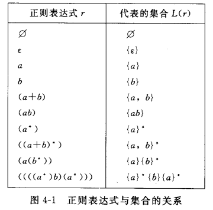

运算符优先级从高到低为 * 连接和+

### 正则表达式与有穷自动机

#### 正则表达式到有穷自动机

设r是一个正则表达式，则存在一个具有ε-转移的有穷自动机接受L(r)

具体证明太长而且也不复杂所以不写了，看书P66~67。这里仅列一下* 连接和+对应的有穷自动机

* *

  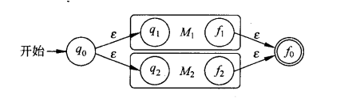

* 连接

  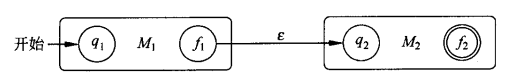

* +

  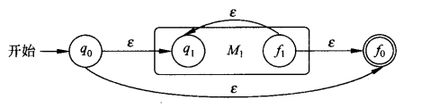

#### 有穷自动机到正则表达式

如果L被一个DFA接受，则L可用一个正则表达式代表

[证明](#prove4_1)

### 正则表达式的等价变换

#### 交换律

* +

  R+S = S+R

#### 结合律

* +

  (R+S)+T = R+(S+T)

* 连接

  (RS)T = R(ST)

#### 单位元

* +

  $R + \empty = R$

* 连接

  $R \epsilon = \epsilon R = R$

#### 零元

* 连接
  $$
  \empty R = R \empty = \empty
  $$

#### 分配率

* +

  $R(S+T) = RS + RT$  证明需要正反向验证，P72

#### *的一些运算律

* $(R^*)^* = R^*$
* $\empty^* = \epsilon$
* $\epsilon^* = \epsilon$

#### 发现正则表达式定律的一般方法

P73，用一个例子讲了如何通过拆分正则表达式的各个部分来证明两个正则表达式相等。

此外还有两条定理，感觉不重要而且证明比较繁琐，因此不写证明

* 设E是带有变量V1 V2 ... Vm的正则表达式，通过把Vi代换成符号ai得到具体的表达式C，则从每个属于L(C)的串a1a2...ak出发，把每个ai换为对应的语言L(Vi)，则可以构造出L(E)
* 可以通过上述方法，将具体符号带入一个正则的公式来检验其是否正确

因此要检验 R(S+T) = RS + RT，可以直接带入a b c，a(b+c) = {a}{b, c}，ab + ac = {ab, ac}，所以得证

## 第五章 正则语言的性质

### 正则文法和有穷自动机的关系

* 设L被某个正则文法G产生，则L可被某个有穷自动机接受

  [证明](#prove5_1)

* 设L被某个DFA M接受，则L可被某个正则文法产生

  [证明](#prove5_2)

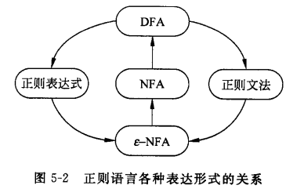

### 正则语言的泵引理

* 设L是一个正则语言，则对于L有下述性质
  $$
  存在只依赖于L的正整数k，对于任何串x, y, z(这里xyz\in L )，只要|y| \geq k
  \\
  就可以将y写成y = uvw(这里v \neq \epsilon, |uv| \leq k)，使得对于任何i \geq 0，都有xuv^iwz \in L
  $$
  [证明](#prove5_3)

* 写为逆否命题可以方便用于证明一个语言是否属于正则语言
  $$
  对于一切正整数k，存在字符串x\ y\ z，其中xyz \in L，|y| \geq k，并且对一切u\ v\ w，y=uvw，其中v \neq \epsilon，|uv| \leq k
  \\
  若存在某个i \geq 0，使得 xuv^iwz 不属于L，那么L不是正则语言
  $$

### 正则语言的封闭性

#### 封闭性

如果属于某个语言类的任何语言在某个特定运算下所得的结果仍然属于该语言类，则称该语言类对这个运算是封闭，并称该语言类对这个运算具有**封闭性**

#### 并 连接 闭包

* 正则语言在并 连接 闭包下是封闭的

  证明 P86

#### 补

* 正则语言在补运算下封闭，即若L是字母表Σ上的正则语言，则Σ*-L也是正则语言

  证明 P86  很简单，正则语言是一个DFA，它的补对应的DFA前面[描述过了](#接受01串中含010子串的串)

#### 交

* 正则语言在交运算下封闭

  证明 P86 德摩根定律将交转为补和并。此外还有个构造性证明

#### 差

* 若L和M是正则语言，则L-M也是正则语言

  证明：$L - M = L \cap \overline M$

#### 逆转

* 若L是正则语言，则 $L^R = \{ x|x^R \in L \}$ 也是正则语言

  证明 P87  以正则表达式的方式E表示正则语言，并通过归纳法，考虑正则语言E的最后一次构造（E=E1+E2  E=E1E2  E=E1*），并对不同的最后一次构造进行改造，使其接受 $E^R$ 来证明

  这里最后通过正则表达式E构造 $E^R$ 的规则为
  $$
  \begin{aligned}
  E=E_1 + E_2 &\Rightarrow E^R = E_1^R + E_2^R
  \\
  E=E_1 E_2 &\Rightarrow E^R = E_2^R E_1^R
  \\
  E=E_1^* &\Rightarrow E^R = (E_1^R)^*
  \end{aligned}
  $$

#### 同态映射

##### 定义

$$
\begin{aligned}
& 设 \Sigma \ \Delta 是两个字母表，h是从\Sigma到\Delta^*的全映射。如果对于一切x \ y \in \Sigma^*，都有h(xy) = h(x) h(y)，则h称为从\Sigma到\Delta^*的同态映射
\\
~
\\
& 对于所有 L \subseteq \Sigma^*，L的同态项是\Delta^*的一个子集，定义为
\\
& h(L) = \bigcup_{x \in L} \{h(x)\}
\\
& 对于所有 w \in \Delta^*，w的同态原像是\Sigma^*的一个子集，定义为
\\
& h^{-1}(w) = \{ x | h(x) = w \}
\\
& 对于所有 L \subseteq \Delta^*，L的同态原像是\Sigma^*的一个子集，定义为
\\
& h^{-1}(L) = \{ x | h(x) \in L \}
\\
& 并且称 h^{-1}(L)为L的逆同态
\end{aligned}
$$

同态映射的一个例子在P88

##### 定理

* 如果L是字母表Σ上的正则语言，h是字母表Σ到Δ上的一个同态映射，则h(L)也是Δ上的正则语言
* 如果h是字母表Σ到字母表Δ的同态，且L是字母表Δ上的正则语言，则 $h^{-1}(L)$ 也是字母表Σ上的正则语言


## 第六章 上下文无关文法

### 上下文无关文法的语法分析

#### 语法分析树

##### 定义

$$
\begin{aligned}
& 上下文无关文法 \ G=(V,T,P,S) \ 满足下列要求的一棵树称为关于G的语法分析树
\\
~
\\
& (1) 树的每个节点带有一个标记，它是 \ V \cup T \cup \{\epsilon\} \  中的一个符号
\\
& (2) 根节点的标记是S
\\
& (3) 树的内部结点（非叶结点）只能以V中符号作为标记
\\
& (4) 如果结点n带有标记A，结点n_1, n_2, \cdots, n_k 是结点n从左到右的儿子结点，并分别带有标记 X_1, X_2, \cdots, X_k，则A \rightarrow X_1 X_2 \cdots X_k 必须是P中的一个产生式
\\
& (5) 如果结点带有标记\epsilon ，则该结点是其父结点的唯一的儿子结点（叶结点）
\end{aligned}
$$

这里定义比较繁琐，其实例子很简单
$$
S \rightarrow ab | aSb
$$
的几棵语法分析树为

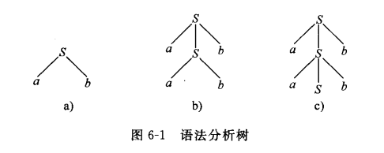

其中c尚未完全构造

##### 边缘

定义：

* 对于一棵语法分析树，将其叶结点上的标记从左到右收集起来组成的字符串称为该语法分析树的**边缘**

定理：

* $$
  设G=(V,T,P,S)是一个上下文无关文法，则 S \stackrel{*} \Rightarrow a(a \in V \cup T)，当且仅当在G中存在一棵以a为边缘的语法分析树
  $$

  证明 P102

* 

##### 推导顺序

* 最左推导  每次推导都只替换句型中最左边的变元
* 最右推导  每次推导都只替换句型中最右边的变元

这两种推导方式过程都是唯一的，但最后产生的语法分析树边缘可能是一致的

##### 二义性

* 对于某个上下文无关文法G，若有某个字符串 $w \in L(G)$ ，存在两棵不同的语法分析书都以w为边缘，则称该文法G是有二义性的

二义性的一个最简单例子如图

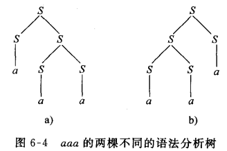

##### 自顶向下分析与自底向上分析

这里举书上的例子P105，假设文法G为
$$
\begin{aligned}
& S \rightarrow aAb | bBa
\\
& A \rightarrow aAb | bBa
\\
& B \rightarrow c
\end{aligned}
$$
尝试推导aabcabb：

自顶向下：

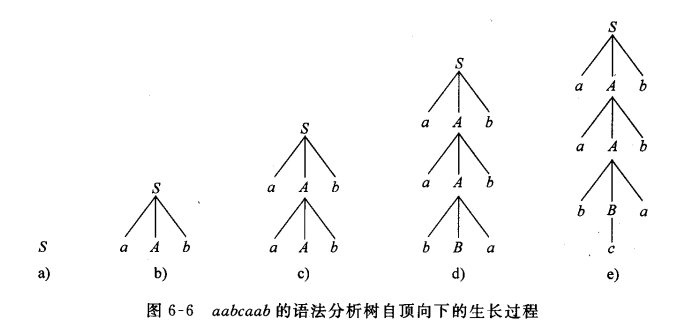

自底向上：

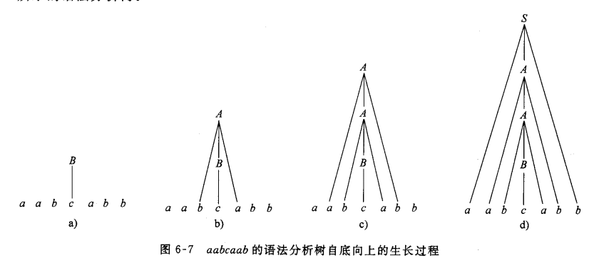

这里第一次推导选择B->c的理由是只有这样一个产生式直接推出终结符


# 一些问题的解释与证明

## 第二章

### prove2_1

* 1型文法与$1^0$型文法等价

设G=(V, T, P, S)是一个1型文法，先将G变为G''=(V'', T, P'', S)
$$
V'' = V \cup M, M=\{ [a] | a \in T \}
$$
*即V''为原来的V加上所有的终结符，即将原来T的所有终结符都作为一个变元[a]加入V''*
$$
P'' = P \cup \{ [a] \rightarrow a | a \in T \}
$$
*即添加一系列从变元[a]到a的推导式*

显然变换后的G''和G等价。此时**G''**中仅有两种产生式

* $A \rightarrow \beta (A \in V'', \beta \in (T \cup V'')^+)$
* $A_1 ... A_n \rightarrow B_1 ... B_m (n \geq 2, m \geq n), A_i,B_j \in V''(i=1,...,n; j=1,...,m)$

*1式跟原来1型文法中可能出现的情况相同（即左边仅有一个变元的情况）。2式不同之处就在于左右两边都只剩下变元，而没有终结符*

其中1式已经符合$1^0$型文法，但2式不符合，因为a1和a2不符合定义。现在要将2式转换为$1^0$文法

引入n个变元C，并构造一系列产生式
$$
\begin{aligned}
A_1 A_2 \dots A_n & \rightarrow C_1 A_2 \dots A_n
\\
C_1 A_2 \dots A_n & \rightarrow C_1 C_2 A_3 \dots A_n
\\
\vdots
\\
C_1 \dots C_{n-1} A_n & \rightarrow C_1 \dots C_{n-1} C_n
\\
C_1 \dots C_n & \rightarrow B_1 C_2 \dots C_n
\\
B_1 C_2 \dots C_n & \rightarrow B_1 B_2 C_3 \dots C_n
\\
\vdots
\\
B_1 B_2 \dots B_{n-1} C_n & \rightarrow B_1 B_2 \dots B_{n-1} B_n \dots B_m
\end{aligned}
$$
*即，先将Ai全部一一换成对应的中间变元Ci，再将Ci一一换为对应Bi，但注意Cn直接换为Bn...Bm。此外这里换元的次序其实可以颠倒，差别只是把a1当做空还是a2当做空（实际上书中的例题2.17就是颠倒的，但这里在记录例题时为了保持上下文一致性就按照原来的顺序进行换元）*

现在这些产生式全部符合$1^0$文法，如对于第一个式子，a1为空，a2为A2...An

因此对G''的所有文法进行上述变换，生成的**G'**即为$1^0$型文法


下面证明**G'和G''的等价性**，这里简单假设G''只有一个形如2式的产生式。若有多个证明相同

先证$L(G'') \subseteq L(G')$，因为对于G''，在 $S \stackrel{*}{\underset{G''} \Rightarrow} x (x \in T^+)$ 的过程中（上式即从开始符号推导一个句子的定义），若只使用了形如1式的产生式，则本身也是G'中的产生式；而如果用到了形如2式的产生式，可以在G'中使用一组如上所示的使用变元C的产生式来代换，最终也可以得到相同的句子，即有 $S \stackrel{*}{\underset{G'} \Rightarrow} x (x \in T^+)$

再证 $L(G') \subseteq L(G'')$ ，对于G'，在$S \stackrel{*}{\underset{G'} \Rightarrow} x (x \in T^+)$过程中，若在推导中未用到如上所列的这组产生式，则本身也是G''中的产生式。若用到了，则必须使用一整个系列的产生式（2n个）来消去引入的变元C。不过这2n个产生式并不一定会被连续使用，而是可能夹杂使用其他产生式，可以讨论如下：

* 首先，在引入变元C后，产生式中间的变元就不能被直接替换，举个例子，假设有
  $$
  A_1 A_2 \rightarrow C_1 A_2
  \\
  C_1 A_2 \rightarrow C_1 C_2
  \\
  C_1 C_2 \rightarrow B_1 C_2
  \\
  B_1 C_2 \rightarrow B_1 B_2
  $$
  即使有其他左边为A1，A2或B1的产生式也不能使用，否则会使得变元无法被消除

* 因此只可能是有如下的产生式：
  $$
  A_i \dots A_n \dots \stackrel{*}{\underset{G'} \Rightarrow} A_i \dots A_n a \ \ (i \geq 2)
  \\
  或
  \\
  \dots B_1 \dots B_j \stackrel{*}{\underset{G'} \Rightarrow} \beta B_1 \dots B_j \ \ (j \leq n-1)
  $$
  这种情况实际对于关于变元C的推导没有什么影响，第一种情况可以把其放到 $A_1 A_2 \dots A_n \rightarrow C_1 A_2 \dots A_n$ 前；第二种情况可以把其放到 $B_1 B_2 \dots B_{n-1} C_n \rightarrow B_1 B_2 \dots B_{n-1} B_n \dots B_m$ 后，使得这几个产生式仍然可以被连续使用

上述过程最终使得G’中的一组产生式会被连续使用，产生如下推导
$$
A_1 \dots A_n \stackrel{*}{\underset{G'} \Rightarrow} B_1 \dots B_m
$$
而对于G''来说，上式可以被直接推出
$$
A_1 \dots A_n \underset{G''} \Rightarrow B_1 \dots B_m
$$
所以 $S\stackrel{*}{\underset{G''} \Rightarrow} x (x \in T^+)$，得证

### prove2_2

* 任何由右线性文法产生的语言都能被正则文法产生

设L是由右线性文法G产生的语言，由G构造G‘=(V', T, P', S)，其中

* 对于形如 $A \rightarrow \omega$ 的产生式

  * 若 $\omega \in T 或 \omega=\epsilon$，则符合正则文法，直接放入P'

  * 对于 $\omega = a_1 a_2 \dots a_n (n \geq 2)$ ，则引入新变元 A1 ... An-1，加入下列产生式
    $$
    \begin{aligned}
    A & \rightarrow a_1 A_1
    \\
    A_1 & \rightarrow a_2 A_2
    \\
    & \cdots
    \\
    A_{n-2} & \rightarrow a_{n-1} A_{n-1}
    \\
    A_{n-1} & \rightarrow a_n
    \end{aligned}
    $$

* 对于形如 $A \rightarrow \omega B$ 的产生式

  * 若 $\omega \in T 或 \omega=\epsilon$，则符合正则文法，直接放入P'

  * 对于 $\omega = a_1 a_2 \dots a_n (n \geq 2)$ ，则引入新变元 B1 ... Bn-1，加入下列产生式
    $$
    \begin{aligned}
    A & \rightarrow a_1 B_1
    \\
    B_1 & \rightarrow a_2 B_2
    \\
    \cdots
    \\
    B_{n-2} & \rightarrow a_{n-1} B_{n-1}
    \\
    B_{n-1} & \rightarrow a_n B
    \end{aligned}
    $$
    注意跟上式的主要区别在于最后一个式子

至此，G'为我们构造的与G等价的正则文法。下面证明两者等价

先证 $L(G) \subseteq L(G')$ ，首先若推导只用到了上述两种产生式的第一种情况，则显然等价。若G使用了第二种产生式（ $\omega = a_1 a_2 \dots a_n (n \geq 2)$ 的情况），则G'可以连续使用上述变元A1 ... An-1的产生式来实现同样的推导

再证 $L(G') \subseteq L(G)$ ，一样若只使用第一种情况，则等价。若使用了第二种，则只要引入一个变元B1，这组产生式的其他式子必是被连续使用的，且中途不会使用其他的产生式，因此最终效果与G中产生式 $A \rightarrow a_1 a_2 \dots a_n B (n \geq 2)$ 相同

### prove2_3

* 任何由左线性文法产生的语言都能被如下文法 G=(V, T, P, S)产生

  G中的产生式仅为 $A \rightarrow a$ 和 $A \rightarrow Ba$ 两种形式，其中 $a \in T \cup \{\epsilon\}, A,B \in V$

证明方式很类似prove2，G和左线性文法的区别仅为，G中， $a \in T \cup \{ \epsilon \}$ ，左线性文法中， $a \in T^*$ 。所以可以如上所述，添加一系列变元和产生式来表示a，使得每个产生式右边只含一个终结符

### prove2_4

* 给出正则文法G=(V ,T, P, S)，且L(G) = L，则存在文法 G' = (V, T, P', S)，它的产生式仅有 $A \rightarrow a 和 A \rightarrow Ba$ 两种形式，其中$a \in T \cup \{\epsilon\}, A,B \in V$ ，使得 $L(G') = L^R$ （语言L的逆转）

下面构造G'，注意G'中只有P'与G不同

* 对于所有形如 $A \rightarrow a \ (a \in T \cup \{\epsilon\}, A \in V)$ 的产生式（即由一个变元转为一个终结符），直接放入P'
* 对于形如 $A \rightarrow aB \ (a \in T \cup \{\epsilon\}, A,B \in V)$ 的产生式，将产生式 $A \rightarrow Ba$ 放入P'

上面即为G'的构造，下面证明 $L(G') = L(G)^R$

首先，证明若 $x = a_1 a_2 \dots a_n \in L(G)，则 x^R = a_n \dots a_2 a_1 \in L(G')$

* 对于n<=1，显然

* 对于n>1，则x的推导过程应该是
  $$
  \begin{aligned}
  S & \Rightarrow a_1 B_1
  \\
  & \Rightarrow a_1 a_2 B_2
  \\
  & \vdots
  \\
  & \Rightarrow a_1 a_2 \dots a_{n-1} B_{n-1}
  \\
  & \Rightarrow a_1 a_2 \dots a_{n-1} a_n
  \\
  & 或最后几步可能是
  \\
  & \Rightarrow a_1 a_2 \dots a_{n-1} B_{n-1}
  \\
  & \Rightarrow a_1 a_2 \dots a_{n-1} a_n B_n
  \\
  & \Rightarrow a_1 a_2 \dots a_{n-1} a_n
  \end{aligned}
  $$
  那么相应的 $x^R$ 应该可以在G'中使用下列推导
  $$
  \begin{aligned}
  S & \Rightarrow B_1 a_1
  \\
  & \Rightarrow B_2 a_2 a_1
  \\
  & \vdots
  \\
  & \Rightarrow B_{n-1} a_{n-1} \dots a_2 a_1
  \\
  & \Rightarrow a_n a_{n-1} \dots a_2 a_1
  \\
  & 或者是
  \\
  & \Rightarrow B_{n-1} a_{n-1} \dots a_2 a_1
  \\
  & \Rightarrow B_n a_n a_{n-1} \dots a_2 a_1
  \\
  & \Rightarrow a_n a_{n-1} \dots a_2 a_1
  \end{aligned}
  $$
  所以可以证明 $x^R \in L(G')$

然后，证明若 $x = a_1 a_2 \dots a_n \in L(G')，则 x^R = a_n \dots a_2 a_1 \in L(G)$

过程基本是上面过程反过来，不赘述

## 第三章

### prove3_1

* 设L是被一个NFA接受的语言，则存在一个DFA也接受语言L

#### 构造对应NFA的DFA

设NFA为 $M = (Q, \Sigma, \delta, q_0, F)$ ，构造 $M' = (Q', \Sigma, \delta', q_0', F')$ ，其中

* $Q' = 2^Q$ 即Q的每个子集作为Q'的一个状态，若子集为 $\{q_1, q_2, \cdots, q_k\}$ ，对应状态记为 $[q_1, q_2, \cdots, q_k]$
* $q_0' = [q_0]$
* F'的每个元素，即Q的一个子集，至少包含F中的一个状态
* $\delta'([q_1, q_2, \cdots, q_i], a) = [p_1, p_2, \cdots, p_j] \ \ 当且仅当 \ \ \delta(\{q_1, q_2, \cdots, q_i\}, a) = \{p_1, p_2, \cdots, p_j\}，其中 a \in \Sigma$

最后一个式子的意思即，假设当前状态集为 $\{q_1, q_2, \cdots, q_i\}$ ，这个状态集接受输入a后转移到的状态集为 $\{p_1, p_2, \cdots, p_j\}$ 

**这个转换的基本思路就是**，因为对于NFA来说，每个状态实际上都是一个状态集合，对于一个确定的状态集合（假设为{q1, q2}），对于确定的输入a，下一步的状态集合都是确定的，不管先前经历了什么样的状态转换。

```
意思就是假设有两种转换过程，第一种是{q0, q4} -> {q1, q2}，第二种是{q3, q5} -> {q1, q2}，那么因为当前的状态都是{q1, q2}，那么对于两种情况如果接受了确定的输入a，转换到的下一个状态应该是相同的
```

所以对于一个NFA来说，实际上可以构造一个新的状态集，这个状态集包含了所有Q的子集，这就涵盖了所有M可能到达的状态，并且用一个状态[q1, q2, ...]代替了状态集合{q1, q2, ...}

#### 证明

先证
$$
\delta'(q_0', x) = [q_1, q_2, ... , q_k] \ \  当且仅当 \ \  \delta(q_0, x) = \{ q_1, q_2, ... , q_k \} \ \ (x \in \Sigma)
$$
用归纳法证明

**归纳基础：** 当|x| = 0，即 $x=\epsilon, \delta(q_0, \epsilon) = \{q_0\}, \delta'(q_0', \epsilon) = [q_0]$，根据$\delta'$定义，成立

**归纳步骤：** 当|x| = m，m>0，假设上述条件成立，现在考虑m+1的串xa，由于
$$
\delta'(q_0', xa) = \delta'(\delta'(q_0', x), a)
\\
\delta(q_0, xa) = \delta(\delta(q_0, x), a)
$$
由假设，$\delta'(q_0', x) = [q_1, q_2, ... , q_k], \delta(q_0, x) = \{q_1, q_2, ... , q_k\}$

代入上式，有
$$
\begin{aligned}
\delta'(q_0', xa) &= \delta'([q_1, q_2, ... , q_k], a)
\\
\delta(q_0, xa) &= \delta(\{q_1, q_2, ... , q_k\}, a)
\end{aligned}
$$
又因为由定义$\delta'([q_1, q_2, \cdots, q_i], a) = [p_1, p_2, \cdots, p_j] \ \ 当且仅当 \ \ \delta(\{q_1, q_2, \cdots, q_i\}, a) = \{p_1, p_2, \cdots, p_j\}$

所以有
$$
\begin{aligned}
\delta'(q_0', xa) &= \delta'([q_1, q_2, ... , q_k], a) = [p_1, p_2, ... , p_j]
\\
当且仅当
\\
\delta(q_0, xa) &= \delta(\{q_1, q_2, ... , q_k\}, a) = \{ p_1, p_2, ... , p_j \}
\end{aligned}
$$
所以得证

有了上述命题，又因为若 $[q_1, q_2, ... , q_k] \in F'$ ，说明 $\{q_1, q_2, ... , q_k\} \cap F \neq \empty$ ，所以M'接受的语言同样被M接受，即L(M') = L(M)

### prove3_2

* 设L是被一个 $\epsilon-NFA$ 接受的语言，则存在一个NFA也接受语言L

#### 构造1

这种构造是一般情况下化简 $\epsilon-NFA$ 使用的构造，但不适合下面的证明

设M是$\epsilon-NFA$，构造M'如下
$$
\begin{aligned}
& \delta'(q, a) =
\left \{
\begin{aligned}
& \empty & if \  x=\epsilon
\\
& \bigcup_{p \in \epsilon-CLOSURE(q)} \delta(p, a) & othrewise
\end{aligned}
\right .
\\
& F'=\{ q | \epsilon-CLOSURE(q) \cap F \neq \empty \}
\end{aligned}
$$
**简单来说**，在结束符号中加入所有能通过空跳到达F的符号。对于每个状态q，若可以通过空跳到达状态集P（即P中每个元素p都可以由q空跳得到），则对于输入a，得到的状态集是q和全部p接收输入a时得到的并集

#### 构造2

设M是$\epsilon-NFA$，构造M'如下
$$
\begin{aligned}
& \delta'(q, a) =
\left \{
\begin{aligned}
& \empty & if \  x=\epsilon
\\
& \epsilon-CLOSURE(P), P=\bigcup_{p \in \epsilon-CLOSURE(q)} \delta(p, a) & othrewise
\end{aligned}
\right .
\\
& F'=\left \{
\begin{aligned}
& F \cup \{q_0\} & if \ \epsilon-CLOSURE(q_0) \cap F \neq \empty
\\
& F
\end{aligned}
\right .
\end{aligned}
$$
**简单来说**，差别就在于多引入了一次ε闭包。下面证明采用这种构造

#### 证明

先证明命题

* $\delta'(q_0, x) = \hat \delta(q_0, x)$

首先当|x|=0时，式子不一定成立，因为 $\hat \delta(q_0, \epsilon) = \epsilon-CLOSURE(\{q_0\}), 而\delta'(q_0, \epsilon) = \{q_0\}$ 

所以这里只能证明|x|>0时的命题

**归纳基础：** |x| = 1时，假设x=a，则由上述构造方法
$$
\delta'(q_0, a) = \epsilon-CLOSURE(P)
\\
其中 P=\bigcup_{p \in \epsilon-CLOSURE(q_0)} \delta(p, a) = \bigcup_{p \in \hat \delta(q_0, \epsilon)} \delta(p,a)
\\
由\hat \delta的定义可知，\delta'(q_0, a) = \hat \delta(q_0, a)
$$
**归纳步骤**： 假设|x| = m符合上式，证|x|=m+1情况下是否成立
$$
\begin{aligned}
& 首先由假设 \delta'(q_0,w) = \hat \delta(q_0, w)，设P = \hat \delta(q_0, w)
\\
& (1) \ \  \delta'(q_0, wa) = \delta'(\delta'(q_0, w), a) = \delta'(\hat \delta(q_0, w), a) = \epsilon-CLOSURE(\bigcup_{r \in P} \delta(r,a))
\\
~
\\
& (2) \ \  \hat \delta(q_0, wa) = \hat \delta(\hat \delta(q_0, w), a) = \epsilon-CLOSURE(\bigcup_{r \in P} \hat \delta(r,a))
\\
& 其中括号内元素可以继续化简如下
\\
~
\\
\bigcup_{r \in P} \hat \delta(r,a) &= \bigcup_{r \in P} \epsilon-CLOSURE(\ \delta(\epsilon-CLOSURE(r), a)\ )
\\
& = \epsilon-CLOSURE \bigcup_{r \in P} \delta(\epsilon-CLOSURE(r), a) & 这里可以将闭包直接提出
\\
& = \epsilon-CLOSURE \bigcup_{r \in P} \delta(r, a)
\\
& 这里是因为P本来就包含了闭包运算，因此r肯定包含在P中
\\
~
\\
& 结果即：
\\
& \hat \delta(q_0, wa) = \epsilon-CLOSURE(\bigcup_{r \in P} \delta(r,a))
\\
~
\\
& 因此两者相等
\end{aligned}
$$
证明了产生式相等后，下面证明停止状态相同，即
$$
对一切 x \in \Sigma^*， \delta'(q, x) \cap F' \neq \empty，当且仅当 \hat \delta(q, x) \cap F \neq \empty
$$

* 考虑x=ε的情况，若被M接受，则q0的ε闭包至少包含F的一个状态，而由F'定义，q0在F'中，因此M'也接受x。

  反之若M'接受x，因为M'为NFA，则q0必然在F'中。而根据F'的生成方式，说明F中必然含有ε-CLOSURE(q0)，则M也接受ε

* 若x不等于ε。若x被M接受，则说明 $\hat \delta(q_0, x) \cap F \neq \empty$ ，则由于上面证明的式子，对应M'也有相同的状态集合 $\delta'(q_0, x) \cap F' \neq \empty$ 

  反之，若M'接受x

  * 若 $\delta'(q_0, x) \neq \{q_0\}$ ，则证明与上面的一致
  * 若等于，且q0不在F中，由F'定义，$\epsilon-CLOSURE(q_0) \cap F \neq \empty$ ，所以也被F接受

至此命题得证

## 第四章

### prove4_1

* 如果L被一个DFA接受，则L可用一个正则表达式代表

#### 构造

设DFA $M = (\{q_1, q_2, ... , q_n\}, \Sigma, \delta, q_1, F)$ 。引入下列字符串的集合的定义
$$
R^k_{ij} = \{x | \delta(q_i, x) = q_j，且中间不经过编号大于k的任何状态，i、j可以大于k\}
$$
上面的意思是，假设y为x的非空真前缀，则R为所有 $\delta(q_i, y) = q_m$ 的集合，且m小于k，这就是所谓中间不经过编号大于k的状态

此后，定义下列递推公式
$$
\begin{aligned}
R_{ij}^0 &= \{a | a\in \Sigma, \delta(q_i, a) = q_j\} & i \neq j
\\
R_{ij}^0 &= \{a | a\in \Sigma, \delta(q_i, a) = q_j\} \cup \{\epsilon\} & i = j
\\
R_{ij}^k &= R_{ik}^{k-1} (R_{kk}^{k-1})^* R_{kj}^{k-1} \cup R_{ij}^{k-1} & (k=1,2,...,n)
\end{aligned}
$$
* 前两个式子的意思比较直观，因为k=0，所以qi到qj中间只能一步到达，不能经过其他状态，所以直接就是状态转移函数；对于i=j的情况，因为 $\delta(q_i, ε) = q_i$ ，所以要加上ε

* 最后一个式子有点动态规划状态转移方程的意思在里面，对于 $R_{ij}^k$ ，存在两种可能

  * 中间经过的所有状态小于k-1，即 $R_{ij}^{k-1}$

  * 中间经过的部分状态为k，则整个过程的状态变化序列如下

    ```
    qi ... qk ... qk ... qk ... qj
    ```

    第一步qi到qk对应 $R_{ik}^{k-1}$ ，记住在 $R_{ij}^k$ 中i j可以大于k，所以是合法的

    第二步重复数次qk到qk，对应 $(R_{kk}^{k-1})^*$

    第三部从qk到qj，对应 $R_{kj}^{k-1}$

因此可以用R来代表DFA接受的集合，那么问题就转换成是否有可以表示R的正则表达式

#### 证明

**归纳基础**： k=0，$R_{ij}^0$ 是个有穷集，每个元素都是 Σ中的符号或ε，因此可以对应到正则表达式 $a_1 + a_2 + ... + a_p$ 或 $a_1 + a_2 + ... + a_p + \epsilon$ (当i=j)

**归纳步骤**： 对于m<k，都找到了对应正则，求m=k时的正则

通过正则表达式与集合的关系，可以直接得到
$$
\begin{aligned}
R_{ij}^k &= R_{ik}^{k-1} (R_{kk}^{k-1})^* R_{kj}^{k-1} \cup R_{ij}^{k-1}
\\
& 对应正则为
\\
r_{ij}^k &= r_{ik}^{k-1} (r_{kk}^{k-1})^* r_{kj}^{k-1} + r_{ij}^{k-1}
\end{aligned}
$$
若终结状态集 $F={q_{j1}, q_{j2}, ... , q_{jp}}$ ，则因为
$$
L(M) = \{ x | \delta(q_1, x)= q_{j1} \} \cup \{ x | \delta(q_1, x)= q_{j2} \} \cup ...
$$
那么可以令n为最大状态数，则R中对k的要求可以忽略，即如下形式
$$
L(M) = R_{1j_1}^n \cup R_{1j_2}^n \cup ... \cup R_{1j_p}^n
$$
即对应正则表达式
$$
r_{1j_1}^n + r_{1j_2}^n + ... + r_{1j_p}^n
$$

## 第五章

### prove5_1

* 设L被某个正则文法G产生，则L可被某个有穷自动机接受

#### 构造

设G = (V, T, P, S)是正则文法，构造一个ε-NFA如下
$$
\begin{aligned}
& M = (V \cup \{f\}, T, \delta, S, \{f\}), 其中f不在V中
\\
& \delta(B, a) = \{C | 对所有B \rightarrow aC \in P \} \cup \{ f | 若B \rightarrow a \in P \}
\\
& \delta(f, a) = \empty, 对一切a \in T \cup \{\epsilon\}
\end{aligned}
$$
注意这里构造的NFA是可以有ε转移的，这是因为形如A->B符合正则文法

这样构造是因为正则文法只有两种产生式，A->aB或A->a。而对于正则文法的推导，有下列形式
$$
S \Rightarrow a_1 B_1 \Rightarrow a_1 a_2 B_2 \Rightarrow\cdots \Rightarrow a_1 \cdots a_{n-1} B_{n} \Rightarrow a_1 \cdots a_n
$$
可以发现对于这样的文法或推导，每次进行下一次推导只跟当前的状态和下一个输入有关，因此对于上述构造方式的所有C是用于模拟A->aB推导的，而因为只有最后一步才会应用形如A->a的推导，所以对于这种产生式其转移到的状态f为终态

#### 证明

当G的推导过程如下式所示
$$
S \Rightarrow a_1 B_1 \Rightarrow a_1 a_2 B_2 \Rightarrow\cdots \Rightarrow a_1 \cdots a_{n-1} B_{n-1} \Rightarrow a_1 \cdots a_n
$$
则有对应M使用下列产生式，可以模拟状态转移过程
$$
\begin{aligned}
\delta(S, a_1) &= B_1
\\
\delta(B_1, a_2) &= B_2
\\
\cdots
\\
\delta(B_{n-2}, a_{n-1}) &= B_{n-1}
\\
\delta(B_{n-1}, a_n) &= f
\end{aligned}
$$
因为也到达了终态f，所以x被M接受

反之，若有x被M接受，设M经过的中间状态为 q1, q2, ...

则在G中依次应用产生式 
$$
S \rightarrow a_1 q_1
\\
q_1 \rightarrow a_2 q_2
\\
\cdots
\\
q_{n-1} \rightarrow a_n
$$
则最终不会留下非终结符，因此也被G接受

### prove5_2

* 设L被某个DFA M接受，则L可被某个正则文法产生

#### 构造

已知DFA M=(Q, Σ, δ, q0, F) 接受L，构造正则文法 G=(Q, Σ, P, q0)，其中P的组成为
$$
\begin{aligned}
& 若 \delta(p,a) = q，则p \rightarrow aq 在P中
\\
& 若 \delta(p, a) \in F，则p \rightarrow a 也在P中
\end{aligned}
$$

#### 证明

因为类似[上面](#prove5_1) 的证明，可以得出下式
$$
对于任何的 w (w \in \Sigma^*)，都有
\\
\delta(q, w) = p \ \ 当且仅当 \ \ q \stackrel{*} \Rightarrow wp (p,q \in Q)
$$
则对于任意的输入串x=wa，若x被M接受，则说明 $\delta(q, w) = p, \delta(p, a) \in F$ 

所以对应的G，由上述的文法构造方法，必有 $q \stackrel{*} \Rightarrow wp, 又\delta(p,a) \in F，则有p \rightarrow a，即q \stackrel{*} \Rightarrow wp \Rightarrow wa$   

反过来，若G接受x，则有 $q \stackrel{*} \Rightarrow wp \Rightarrow wa$ ，则必有产生式 $\delta(p, a) \in F, \delta(q, w) = p$ 

所以 $\delta(q, wa) = \delta(\delta(q, w), a) = \delta(p, a) \in F$ 

### prove5_3

* 正则语言的泵引理

这个引理的道理其实很简单，证明如下：

因为有穷状态机的状态数是有穷的，而接受的语言可以是无限长，而有穷状态机在接收每个字符时都发生状态转移，因此在接受一个长度超过状态数的语言时必然会有部分状态出现过一次以上。假设起始状态为q，重复状态为p，终止状态为f，总状态数为k，则可以将接受语言时的状态变化写作
$$
q0 \ ... q1 \  ... \  p \  ... \  p \ ... \ q2 \ ... \ f
$$
则以q0到q1作为x，q2到f作为z，则子串y（|y|>=k）为q1到q2，可以进一步细分为：

* u： q1到p
* v： p到p
* w：p到q2

$$
\begin{aligned}
\delta(q_1, u) &= p
\\
\delta(p, v) &= p
\\
\delta(p, w) &= q_2
\end{aligned}
$$

则由于第二个式子的起始和终态都是p，因此其扩展i次（i>=0），无论i大小，产生的语言都应该被接受，因为
$$
\delta(q_1, uv^iw) = \delta(\delta(q_1, uv^i), w) = \delta(\delta(\delta(q_1, u), v^i), w) = \delta(\delta(p, v^i), w) = \delta(p, w) = q_2
$$


# 一些代表性的例题

## 第二章

### 文法构造

##### 构造ab个数相等的串

P26 例2.9，这题在书上是用于解释如何证明一些文法的命题的，不过这里拿来讲下如何构造这种文法

因为要求是ab个数相等，首先对于ab构成的串，起始符号肯定是a或b，而构造这个文法的思路就是**每当出现一个a，应该放入一个非终结符来表示当前的串中出现了一个a；而当出现一个b时，就应该消除前面的一个非终结符。对于b来说同理**

所以很自然的，至少需要构造三个非终结符，一个起始符号，一个非终结符代表串中有个a，一个代表串中有个b，所以起始符号为
$$
S \rightarrow aB | bA
$$
这里换个角度想，S实际上代表了当前a和b数量相等，A代表当前多了一个b，B代表当前多了一个a

下一步就是具体构造A和B了，两者构造方法是一致的。

考虑两个符号构成的串，只可能是ab ba aa bb。

* 对于bA的情况
  * 若下一个字母是b，则需要再放入一个A，变成bbAA
  * 若下一个字母是a，则消除当前的A，此时状态可能是一个终结符，也可能是回到S
* 对于aB的情况，与上述类似

所以A、B的产生式为
$$
A \rightarrow bAA \ | \  a \ | \  aS
\\
B \rightarrow aBB \ | \  b \ | \  bS
$$

##### 构造ab对称的串

P27 例2.11

首先对于长度为1的情况，不存在。长度为2的情况有aa和bb。而对于长度为n的情况，假设当n-2时两边的对称部分分别为w和w^R，则n时可能为

w aa w^R 或 w bb w^R

所以可以将非终结符放在中间，形成 w aXa w^R 或 w bXb w^R的结构，所以产生式为
$$
\begin{aligned}
S & \rightarrow aa
\\
S & \rightarrow bb
\\
S & \rightarrow aSa
\\
S & \rightarrow bSb
\end{aligned}
$$

##### 构造a^n b^n c^n

思路很类似上题。但这里需要解决一个问题：若采用类似上上题所用的方法，即当串中出现一个a时，就记录一个非终结符B和C。那么有形如下面的产生式
$$
S \rightarrow aBC
\\
B \rightarrow b|aBBC
$$
但这样是有问题的，因为它可能接受形如 aababcc 这样的串，这是由于前一个字母是a的B与前一个是b的B实际上是不同的。这里理论上可以通过添加符号解决（但尝试了一下没有找到合适的解）

书上的方法是类似上题所用的方法，从中间开始扩展，即 $S \rightarrow a S Bc$ 将Bc看做一个整体来扩展。此后再通过产生式 $cB \rightarrow Bc$ 将Bc的次序调换。最后一步需要将形如 a^n B^n c^n 的式子转换为 a^n b^n c^n，但这里存在的一个难点在于，不能直接转换B，否则会使得调换次序的式子在保证调换完所有的Bc组合前就出现二义性（举个例子，如果有个产生式B->b，则aaBcBc可能直接转换为abcbc，而我们要求应该先保证转换为aaBBcc）。因此这里采用的方法是配合非终结符导出终结符
$$
\begin{aligned}
S & \rightarrow aSBc | aBc
\\
cB & \rightarrow Bc
\\
aB & \rightarrow ab
\\
bB & \rightarrow bb
\end{aligned}
$$
这样可以保证次序调换完全后才能进行转换，因为如 aaBcBc，假设先推导到 aabcBc，那么必须调换cB才能消除下一个B

##### 构造a^(2^k)

思路如下：

* 使用两个非终结符A和B来标识串的起始和末尾
* 使用一个非终结符C在起始和末尾间移动扫描
* C每次扫描到一个a，则将其数量翻倍。
* 到达末尾时需要让C返回到开头，这里为了方便处理，引入非终结符D。
* 此时可以结束，也可以进行下一次扫描，再次将a的数量翻倍。书上使用的产生式用了一个非终结符E来标识结束扩展

根据上述思路写出的产生式如下
$$
\begin{aligned}
S & \rightarrow ACaB
\\
Ca & \rightarrow aaC & 将a的数量翻倍
\\
CB & \rightarrow DB & DB表示要将光标C回退
\\
CB & \rightarrow E & 另一种情况，表示扩展结束，并删除结束符
\\
aD & \rightarrow Da & 回退光标
\\
AD & \rightarrow AC & 回退到开头，重置光标并进行下一次扫描
\\
aE & \rightarrow Ea & 回退结束符E
\\
AE & \rightarrow \epsilon & 将开始符号删除，到此完全结束
\end{aligned}
$$


### 文法转换

##### 1型文法转1^0型文法

* 从1型文法转$1^0$型文法  P36 例2.17

<span id="problem1"/>

1型文法G如下
$$
\begin{aligned}
S & \rightarrow BC | CBC
\\
BC & \rightarrow CB
\\
cC & \rightarrow bc
\\
C & \rightarrow c
\\
B & \rightarrow b
\end{aligned}
$$
**解**

首先转为G''，得
$$
\begin{aligned}
S & \rightarrow BC | CBC
\\
BC & \rightarrow CB
\\
[c]C & \rightarrow [b] [c]
\\
C & \rightarrow [c]
\\
B & \rightarrow [b]
\\
[b] & \rightarrow b
\\
[c] & \rightarrow c
\end{aligned}
$$
除了S外，此时只有2和3式不满足$1^0$型文法，因此做下述变换

2:
$$
\begin{aligned}
BC & \rightarrow D_1 C
\\
D_1 C & \rightarrow D_1 D_2
\\
D_1 D_2 & \rightarrow C D_2
\\
C D_2 & \rightarrow C B
\end{aligned}
$$
3:
$$
[c] C  \rightarrow D_1 C
\\
D_1 C \rightarrow D_1 D_2
\\
D_1 D_2 \rightarrow [b] D_2
\\
[b] D_2 \rightarrow [b] [c]
$$

##### 使用1型文法构造a^(2^k)

原来使用0型文法的产生式为
$$
\begin{aligned}
S & \rightarrow ACaB
\\
Ca & \rightarrow aaC & 将a的数量翻倍
\\
CB & \rightarrow DB & DB表示要将光标C回退
\\
CB & \rightarrow E & 另一种情况，表示扩展结束，并删除结束符
\\
aD & \rightarrow Da & 回退光标
\\
AD & \rightarrow AC & 回退到开头，重置光标并进行下一次扫描
\\
aE & \rightarrow Ea & 回退结束符E
\\
AE & \rightarrow \epsilon & 将开始符号删除，到此完全结束
\end{aligned}
$$
其中4和8不符合1型文法（式子左边的长度小于等于右边），因此需要进行改造，主要思路是：既然左边符号数过多，就合并左边符号，并且通过添加对左边符号前面符号的判断来处理合并符号后的各种情况

这是书上给的顺序，与上述式子有对应关系，但我觉得下面整理后的版本更好看
$$
\begin{aligned}
S & \rightarrow [ACaB]
\\
~
\\
[ACaB] & \rightarrow [Aa] \  [aCB]
\\
[Ca] \  a & \rightarrow aa \  [Ca]
\\
[Ca] \  [aB] & \rightarrow aa \  [CaB]
\\
[ACa] \  a & \rightarrow [Aa] \  a \  [Ca]
\\
[ACa] \ [aB] & \rightarrow [Aa] \ a \ [CaB]
\\
[CaB] & \rightarrow a \ [aCB]
\\
~
\\
[aCB] & \rightarrow [aDB]
\\
~
\\
[aCB] & \rightarrow [aE]
\\
~
\\
a \ [Da] & \rightarrow [Da] \ a
\\
[aDB] & \rightarrow [DaB]
\\
[Aa] \ [Da] & \rightarrow [ADa] \ a
\\
a \ [DaB] & \rightarrow [Da] \ [aB]
\\
[Aa] \ [DaB] & \rightarrow [ADa] \ [aB]
\\
~
\\
[ADa] & \rightarrow [ACa]
\\
~
\\
[aE] & \rightarrow [Ea]
\\
a \ [Ea] & \rightarrow [Ea] \ a
\\
~
\\
[Aa] \ [Ea] & \rightarrow aa
\end{aligned}
$$
可以整理如下：
$$
\begin{aligned}
S & \rightarrow [ACaB]
\\
~
\\
& 起始
\\
[ACaB] & \rightarrow [Aa] \  [aCB]
\\
~
\\
& 这里是对结束的情况的处理
\\
[aCB] & \rightarrow [aE]
\\
[aE] & \rightarrow [Ea]
\\
a \ [Ea] & \rightarrow [Ea] \ a
\\
[Aa] \ [Ea] & \rightarrow aa
\\
~
\\
& 这里是对光标回退的处理
\\
[aCB] & \rightarrow [aDB]
\\
[aDB] & \rightarrow [DaB]
\\
a \ [DaB] & \rightarrow [Da] \ [aB]
\\
a \ [Da] & \rightarrow [Da] \ a
\\
[Aa] \ [Da] & \rightarrow [ADa] \ a
\\
[ADa] & \rightarrow [ACa]
\\
~
\\
& 这里是光标前移时的处理
\\
[ACa] \  a & \rightarrow [Aa] \  a \  [Ca]
\\
[Ca] \  a & \rightarrow aa \  [Ca]
\\
[Ca] \  [aB] & \rightarrow aa \  [CaB]
\\
[CaB] & \rightarrow a \ [aCB]
\\
~
\\
& 这是对两种特殊情况的处理
\\
& 一个是对第一趟回溯的处理
\\
& 一个是对第一趟回溯后的处理
\\
[Aa] \ [DaB] & \rightarrow [ADa] \ [aB]
\\
[ACa] \ [aB] & \rightarrow [Aa] \ a \ [CaB]
\end{aligned}
$$
注意这里有一个思想，这里为了改为0型文法而引入了对原来符号中前一个符号的判断，这使得文法的第一趟扩展的过程需要单独处理，可以对比两种文法中生成aa和aaaa的过程

* aa

  0型
  $$
  S \rightarrow ACaB \rightarrow AaaCB \rightarrow AaaE \rightarrow AaEa \rightarrow AEaa \rightarrow aa
  $$
  1型
  $$
  S \rightarrow [ACaB] \rightarrow [Aa] [aCB] \rightarrow [Aa] [aE] \rightarrow aa
  $$

* aaaa

  0型
  $$
  S \rightarrow ACaB \rightarrow AaaCB \rightarrow AaaDB \rightarrow AaDaB \rightarrow ADaaB \rightarrow ACaaB \rightarrow AaaCaB
  \\
  \rightarrow AaaaaCB \rightarrow  AaaaaE \rightarrow  AaaaEa \rightarrow AaaEaa \rightarrow AaEaaa \rightarrow AEaaaa \rightarrow aaaa
  $$
  1型
  $$
  S \rightarrow [ACaB] \rightarrow [Aa] [aCB] \rightarrow [Aa] [aDB] \rightarrow [Aa] [DaB] \rightarrow [ADa] [aB] \rightarrow [ACa] [aB] \rightarrow [Aa] a [CaB]
  \\
  \rightarrow [Aa] a a [aCB] \rightarrow [Aa] aa [aE] \rightarrow [Aa] aa [Ea] \rightarrow [Aa] a [Ea] a \rightarrow [Aa][Ea] aa \rightarrow  aaaa
  $$

* 

## 第三章

### 从语言构造有穷自动机

##### 接受01串中含010子串的串

P46 例3.2

思路很简单，一共四个状态，分别表示

* 没有检测到子串的子集
* 检测到子串0
* 检测到子串01
* 检测到子串010，为终结状态

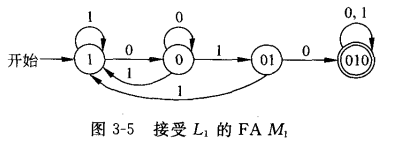

##### 接受01串中不含010子串的串

P46 例3.2

与上题很类似，区别就是要一个要求含有一个要求不含有。做法很简单，将上述自动机中所有的非终结状态改为终结状态，终结状态改为非终结状态

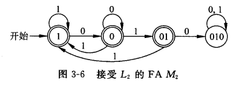

##### 接受模5与0同余的二进制串

P47 例3.3

即整除5的二进制串。注意对于二进制串x，x0的值为2x，x1的值为2x+1。此外可以根据模5将所有的数分为模5为0，模5为1，... ，模5为4 五个状态，假设记为q0 ... q4

下面考虑每种状态分别接受0或1时转移到的状态，计算每个转移函数的方法很简单，假设当前串为x，当前状态为q2则说明 `x % 5 = 2`，所以若接受0， `2x % 5 = 4`，转移到q4；若接受1， `(2x+1) % 5 = 0`，转移到q0

* q0
  * 0  ->  q0
  * 1  ->  q1
* q1
  * 0  ->  q2
  * 1  ->  q3
* q2
  * 0  ->  q4
  * 1  ->  q0
* q3
  * 0  ->  q1
  * 1  ->  q2
* q4
  * 0  ->  q3
  * 1  ->  q4

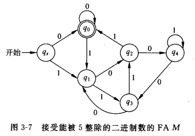

### NFA转DFA

##### 例3.5

P49
$$
\begin{aligned}
& 设M=(\{q_0, q_1\}, \{ 0, 1 \}, \delta, q_0, \{ q_1 \})是一个NFA，其中
\\
& \delta(q_0, 0) = \{q_0, q_1\} & \delta(q_0, 1) &= \{q_1\}
\\
& \delta(q_1, 0) = \empty & \delta(q_0, 1) &= \{q_0, q_1\}
\end{aligned}
$$
根据 [prove3_1](#prove3_1) 可以构造M'如下
$$
\begin{aligned}
& Q' = \{\empty, [q_0], [q_1], [q_0, q_1]\}
\\
& F' = \{ [q_1], [q_0, q_1] \}
\\
~
\\
& \delta'([q_0], 0) = [q_0, q_1]
\\
& \delta'([q_0], 1) = [q_1]
\\
& \delta'([q_1], 0) = \empty
\\
& \delta'([q_0], 1) = [q_0, q_1]
\\
& 注意，下面两个式子就是由扩充转移函数推导的
\\
& 如\delta'([q_0, q_1], 0)，即\delta'([q_0], 0) \cup \delta'([q_1], 0)
\\
& \delta'([q_0, q_1], 0) = [q_0, q_1]
\\
& \delta'([q_0, q_1], 1) = [q_0, q_1]
\\
& 为了完整性，需要加入空集的转移函数，因为空集也是一个状态
\\
& \delta'(\empty, 0) = \empty
\\
& \delta'(\empty, 1) = \empty
\end{aligned}
$$

##### 例3.6

P51

NFA M为
$$
\begin{aligned}
& \delta(q_0, 0) = q_0
\\
& \delta(q_0, 0) = q_3
\\
& \delta(q_0, 1) = q_0
\\
& \delta(q_0, 1) = q_1
\\
& \delta(q_1, 1) = q_2
\\
& \delta(q_2, 0) = q_2
\\
& \delta(q_2, 1) = q_2
\\
& \delta(q_3, 0) = q_4
\\
& \delta(q_4, 0) = q_4
\\
& \delta(q_4, 1) = q_4
\end{aligned}
$$
因为起始状态为q0，则可以从q0开始构造DFA，按照类似写扩充转移函数的方法写出每步可以到达的所有状态，并以这个状态集为DFA转移到的新状态标号。

**注意，在NFA转DFA过程中，很多状态可能是不可达的，因此以下述方法从起始状态顺序构造最优。**

具体方法为，从起始状态q0开始构造，每步只对状态转移函数中新增加的状态写状态转移函数
$$
\begin{aligned}
& \delta'([q_0], 0) = [q_0, q_3]
\\
& \delta'([q_0], 1) = [q_0, q_1]
\\
& 下面扩展新增状态[q_0, q_3] 和[q_0, q_1]
\\
& \delta'([q_0, q_3], 0) = [q_0, q_3, q_4]
\\
& \delta'([q_0, q_3], 1) = [q_0, q_1]
\\
& \delta'([q_0, q_1], 0) = [q_0, q_3]
\\
& \delta'([q_0, q_1], 1) = [q_0, q_1, q_2]
\\
& 下面扩展新增状态 [q_0, q_3, q_4]和[q_0, q_1, q_2]
\\
& \delta'([q_0, q_3, q_4], 0) = [q_0, q_3, q_4]
\\
& \delta'([q_0, q_3, q_4], 1) = [q_0, q_1, q_4]
\\
& \delta'([q_0, q_1, q_2], 0) = [q_0, q_2, q_3]
\\
& \delta'([q_0, q_1, q_2], 1) = [q_0, q_1, q_2]
\\
& 下面扩展新增状态 [q_0, q_1, q_4]和[q_0, q_2, q_3]
\\
& \delta'([q_0, q_1, q_4], 0) = [q_0, q_3, q_4]
\\
& \delta'([q_0, q_1, q_4], 1) = [q_0, q_1, q_2, q_4]
\\
& \delta'([q_0, q_2, q_3], 0) = [q_0, q_2, q_3, q_4]
\\
& \delta'([q_0, q_2, q_3], 1) = [q_0, q_1, q_2]
\\
& 下面扩展新增状态[q_0, q_1, q_2, q_4]和[q_0, q_2, q_3, q_4]
\\
& \delta'([q_0, q_1, q_2, q_4], 0) = [q_0, q_2, q_3, q_4]
\\
& \delta'([q_0, q_1, q_2, q_4], 1) = [q_0, q_1, q_2, q_4]
\\
& \delta'([q_0, q_2, q_3, q_4], 0) = [q_0, q_2, q_3, q_4]
\\
& \delta'([q_0, q_2, q_3, q_4], 1) = [q_0, q_1, q_2, q_4]
\\
& 至此无新增状态
\end{aligned}
$$

### ε-NFA转NFA

P55 例3.9

假设ε-NFA为
$$
\begin{aligned}
\delta(q_0, 0) &= q_0
\\
\delta(q_1, 1) &= q_1
\\
\delta(q_2, 2) &= q_2
\\
\delta(q_0, \epsilon) &= q_1
\\
\delta(q_1, \epsilon) &= q_2
\end{aligned}
$$
转换方法可以见[方法](#prove3_2)，提供了两种方法，分别写在下面

1.
$$
\begin{aligned}
\delta(q_0, 0) &= \{q_0\}
\\
\delta(q_0, 1) &= \{q_1\}
\\
\delta(q_0, 2) &= \{q_2\}
\\
\delta(q_1, 1) &= \{q_1\}
\\
\delta(q_1, 2) &= \{q_2\}
\\
\delta(q_2, 2) &= \{q_2\}
\\
~
\\
F' &= \{q_0, q_1, q_2\}
\end{aligned}
$$
2.
$$
\begin{aligned}
\delta(q_0, 0) &= \epsilon-CLOSURE(\{q_0\}) = \{q_0,q_1,q_2\}
\\
\delta(q_0, 1) &= \epsilon-CLOSURE(\{q_1\}) = \{q_1,q_2\}
\\
\delta(q_0, 2) &= \epsilon-CLOSURE(\{q_2\}) = \{q_2\}
\\
\delta(q_1, 1) &= \epsilon-CLOSURE(\{q_1\}) = \{q_1,q_2\}
\\
\delta(q_1, 2) &= \epsilon-CLOSURE(\{q_2\}) = \{q_2\}
\\
\delta(q_2, 2) &= \{q_2\}
\\
F' &= \{q_0, q_2\}
\end{aligned}
$$


### NFA的用途

##### 例3.7

P51

* 设计一个有穷自动机，使它能接受一个0和1的集合，该集合中每一个串的倒数第十个符号是1

这个问题就是适合NFA解决的问题，因为该问题要求倒数第10个为1，若用DFA解决需要非常多的状态。而NFA因为可以同时有多个状态所以可以简单实现如下


## 第四章

### 正则表达式书写

##### 例4.5

P65

* 倒数第十个符号为1的二进制串

(0+1)*1(0+1)(0+1)(0+1)(0+1)(0+1)(0+1)(0+1)(0+1)(0+1)(0+1)

### 正则表达式转ε-NFA

##### 例4.6

P67

### DFA转正则表达式

##### 例4.7

P69

挺繁琐的

## 第五章

### 正则文法转ε-NFA

##### 例5.1

P81

##### 例5.2

P81
