# 龙书

## 第二章 一个简单的语法制导翻译器

### 上下文无关文法

#### 定义

四元素

* 终结符号集合（词法单元），指该文法所定义语言的基本符号集合
* 非终结符号集合（语法变量）
* 产生式集合
* 指定一个非终结符号作为开始符号

空串（0个终结符号组成的串）记为ε

##### 例1

加减表达式

```
产生式
list -> list + digit
list -> list - digit
list -> digit
digit -> 0|1|2|3|4|5|6|7|8|9
可以等价为：
list -> list+digit | list-digit | digit
digit -> 0|1|2|3|4|5|6|7|8|9
```

终结符号： 0 1 2 3 4 5 6 7 8 9 + -

非终结符号： list digit

#### 推导

从开始符号出发，不断将某个非终结符号替换为该非终结符号的某个产生式，则可以**从开始符号推导得到的所有终结符号串集合**称为该文法定义的语言

##### 例2

由上产生式推导 9-5+2

```
9:digit	由list->digit知 9:list
5:digit	由list->list-digit知 9-5:list
2:digit	由list->list+digit知 9-5+2:list
```

##### 例3

函数调用参数列表，可能有多个参数也可能无参数

```
call -> id(optparams)
optparams -> params|ε			可以为空
params -> params,param | param	可以为多个
```

#### 语法分析树

##### 性质

* 根节点为开始符号
* 每个叶子节点为终结符号或ε
* 每个内部节点为非终结符号
* 如果非终结符号A是某个内部节点的标号，且子节点的标号分别为$X_1, X_2, ... , X_n$，则必然存在产生式$A \rightarrow X_1, X_2, ... , X_n$，$X_1, X_2, ... , X_n$可以是非终结符号也可以是终结符号。特殊地，$A \rightarrow \epsilon$可以作为产生式

##### 例4

构造例2的语法分析树

```
	  			  list
	  list					digit
list		digit
digit
 9	   -	 5		+		2
```

#### 运算符结合性

* 右结合 （以下以=为例）

```
right  -> letter = right | letter
letter -> a|b|c
```

a=b=c语法树

```
         right
letter    =       right
             letter    right
   a           b    =     c
```

相当于`a = (b = c)`

* 左结合

```
left   -> left + letter | letter
letter -> a|b|c
```

a+b+c语法树

```
                 left
      left        +       letter
left   +   letter
 a           b              c
```

相当于`(a + b) + c`

#### 运算符优先级

有n个优先级的语法需要n+1个非终结符号，高优先级的产生式在低优先级产生式的下方

##### 例5

以+ - * \为例，高优先级运算写在下面

```
expr -> expr + term | expr - term | term
term -> term * factor | term / factor | factor
factor -> digit | (expr)
```

### 语法制导翻译

语法制导翻译是通过向一个文法的产生式附加一些规则或程序片段得到的

将表达式**根据语义规则翻译**，其中**语义规则由产生式确定**

#### 语法制导定义

* 将每个文法符号和一个属性集合相关联
* 把每个产生式和一组语义规则相关联

如将下面的表达式

```
expr -> expr + term | expr - term | term
term -> 0 | 1 | ... | 9
```

翻译成后缀形式，下式为该语法制导定义的内容。t为表达式的**综合属性**，|| 表示字符串连接。t与非终结符号expr和term关联

```
产生式					语义规则
expr -> expr+term		expr.t = expr.t || term.t || '+'
expr -> expr-term		expr.t = expr.t || term.t || '-'
expr -> term			expr.t = term.t
term -> 0				term.t = 0
...						...
term -> 9				term.t = 9
```

根据上述规则，对于 9-5+2 的语法分析树

```
        expr
   expr       term
expr   term
term
9   -   5   +   2
```

对应的语法分析树（这里叫注释语法分析树）

```
                             expr.t=95-2+
         expr.t=95-                         term.t=2
expr.t=9          term.t=5
term.t=9
9           -          5          +           2
```

即，9-5+2通过上述语法制导翻译成了后缀表达式95-2+

#### 综合属性与继承属性

可以看到可以上面使用**自底向上的方法**遍历树，即可一次得到翻译结果，因为上一层的翻译结果仅依赖于该层各结点的结果

* 综合属性  属性仅与节点本身和子节点相关
* 继承属性  属性与父节点及兄弟节点属性相关

当语义规则仅包含**综合属性**时可以使用自底向上方法，但若包含**继承属性**则不行

#### 语法制导翻译方案

与上面的语法制导定义相似，语法制导定义将翻译结果作为属性值保存在语法分析树的节点。语法制导翻译方案通过将程序片段置入产生式来实现

下面通过产生式及语法制导分析方案将中缀表达式翻译为后缀

```
expr -> expr + term {print('+')}
expr -> expr - term {print('-')}
expr -> term
term -> 0 {print('0')}
term -> 1 {print('1')}
...
term -> 9 {print('9')}
```

由此对于9-5+2生成的语法分析树

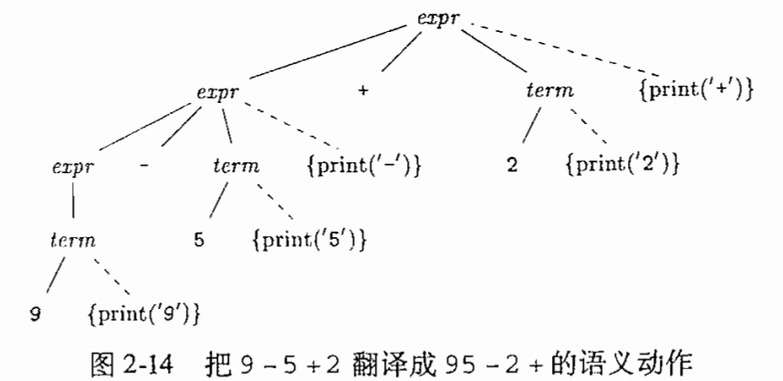

若以深度优先遍历，则执行顺序为

```
print('9')
print('5')
print('-')
print('2')
print('+')
```

### 语法分析

#### 自顶向下方法

自顶向下方法的核心就是先为当前状态选择一个产生式，不合适时回溯

产生式

```
stmt -> expr; | if(expr) stmt | for(optexpr;optexpr;optexpr) stmt | other

optexpr -> ε | expr
```

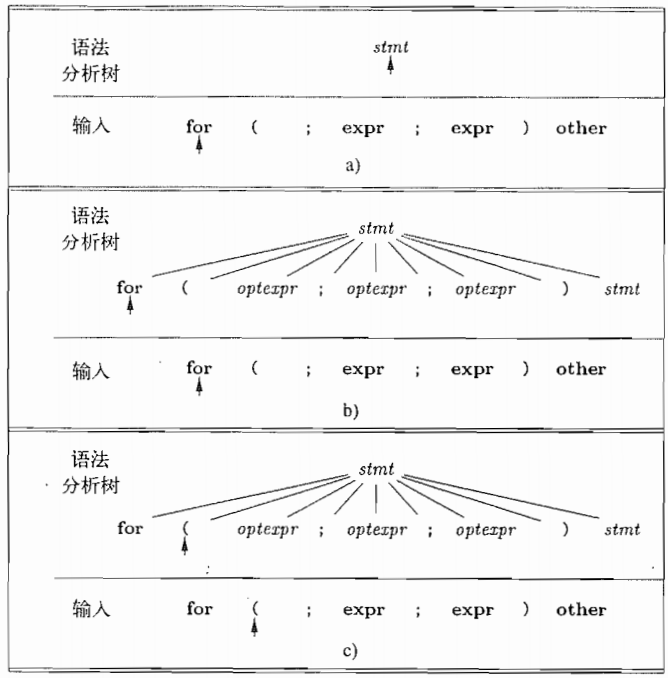

使用自顶向下方法时，重复下面两个步骤

* 在非终结符号A的节点N上，选择A的一个产生式，并且根据产生式构造N的子节点
* 寻找下一个节点来构造子树，通常是子节点最左边尚未扩展的非终结符

stmt为一个**非终结符号**，箭头指向**向前看符号**（输入中正在被扫描的**终结符号**）

一开始，向前看符号是终结符号for，语法分析树指向的为stmt，因此选取一个以向前看符号for为开头的串。因为只有一条规则符合，因此根据此规则构造子节点

当语法分析树的指向的节点（正在分析的节点）与向前看符号指向同样的**终结符**时，两者的指针都往前进一步。

经过上图三步后，第四步语法分析树指向optexpr，向前看符号指向`;`。此时需要为optexpr寻找合适的产生式，只有ε匹配

#### 预测分析法

预测分析法没有如自顶向下方法的测试和回溯过程，预测分析法直接将每个非终结符号的处理方式写成一个函数过程，如下

##### 示例

```c
void stmt()
{
    switch(lookahead)
    {
        case "expr":
            match(expr); match(';'); break;
        case "if":
            match("if"); match('('); match("expr"); match(')'); stmt();
            break;
        case "for":
            match("for"); match('(');
            optexpr(); match(';'); optexpr(); match(';'); optexpr(); match(')');
            stmt(); break;
        case other:
            match(other); break;
        default:
            raise("syntax error");
    }
}

void optexpr()
{
    if(lookahead == expr) match(expr);
}

void match(terminal t)
{
    if(lookahead == t) lookahead = nextTerminal;
    else raise("syntax error");
}
```

##### FIRST集合

对于文法符号串a，定义FIRST(a)为可以由a生成的一个或多个**终结符号**串的第一个符号的集合。若a可以生成ε，则FIRST(a)包含ε

* 若a以终结符号开头，则FIRST(a)中只包含该符号
* 若a以非终结符号开头，则FIRST(a)中包含该非终结符号所有产生式的第一个终结符号

如对于上述例子的产生式，FIRST集合为

```
FIRST(stmt) = {expr, if, for, other}
FIRST(expr) = {expr}
```

FIRST集合的意义在于，对于预测分析法，若当前字串A有两个产生式`A->a  A->b`，则预测分析法要求FIRST(a)和FIRST(b)不相交。这样才可以直接用向前看符号来确定应该调用哪个产生式

##### ε产生式

当ε作为其中一个产生式时，如

```
optexpr -> expr | ε
```

在处理optexpr时，要么使用非终结符号expr生成一个表达式，要么生成ε。如果当前向前看符号不在FIRST(expr)中，则说明当前处理的字串与expr不匹配，就使用ε

##### 设计一个预测分析器

一个预测分析器由各个非终结符对应的过程组成

* 检查向前看符号，决定使用哪个产生式。如果一个产生式体为a，且向前看符号在FIRST(a)中，则选择该式。
* 从左边依次执行产生式体的符号
  * 对于非终结符号，调用对应非终结符的过程
  * 对于终结符号，若与向前看符号匹配，则读入下一个输入符号

##### 左递归

在**预测语法分析器**中，当产生式**右边的第一项**与产生式左边相同时，会出现左递归问题

如 expr -> expr + term ，由于解释时将会按照expr展开，而expr展开后的第一个符号又是expr，因此将无限展开下去

###### 消除：

```
若原表达式为：
A -> Aa | b
替换为
A -> bA'
A'-> aA' | ε
```

例：

```
expr -> expr + term | term
则可以替换为
expr -> term A'
A' -> +term A' | ε
因为expr实际得到的结果为 term + term + ...
因此是相同的
```

#### 简单表达式的翻译器

这里建立了对下列语法制导翻译的程序

```
expr -> expr + term {print('+')} |
        expr - term {print('-')} |
        term
term -> 0 {print('0')} |
        1 {print('1')} |
        ... |
        9 {print('9')}
```

##### 抽象语法与具体语法

抽象语法树与语法分析树很类似，但在语法分析树中，内部节点代表的是非终结符号，而通常在文法的构造中会有一些辅助的非终结或终结符号。在抽象语法树中把这些符号省略了，因此也经常称**语法分析树**为**具体语法树**

##### 左递归的处理

因为 `expr -> expr + term | expr - term` 存在左递归，因此调整如下

```
A -> Aa | Bb | c

A -> cR
R -> aR | bR | ε
```

转换到当前文法，即原本为

```
expr -> expr + term | expr - term | term
```

转换为

```
expr -> term rest
rest -> + term rest | - term rest | ε
```

对于语法制导翻译的处理类似

```
expr -> term rest
rest -> + term {print('+')} rest | - term {print('-')} rest | ε
```

##### 程序

```c
void expr()
{
    term(); rest();
}

void rest()
{
    if(lookahead == '+')
    {
        match('+'); term(); print('+'); rest(); 
    }
    else if(lookahead == '-')
    {
        match('-'); term(); print('-'); rest();
    }
    else
    {  }
}

void term()
{
    if(isnum(lookahead))
    {
        t = lookahead;
        match(lookahead);
        print(t);
    }
    else
    {
        raise("Syntax Error")
    }
}
```

##### 尾递归优化

上述语法翻译器中，对于rest函数中+和-的分支，除ε情况，最后总是会递归调用一个rest。这种情况称为尾递归。因为尾递归相当于在函数结束时跳回函数开头，所以可以用循环来优化

```c
void rest()
{
    while(true)
    {
        if(lookahead == '+')
        {
            match('+'); term(); print('+');
        }
        else if(lookahead == '-')
        {
            match('-'); term(); print('-');
        }
        else
        	break;
    }
}
```

### 词法分析

#### 剔除空白和注释

一般都在词法分析中把space tab和换行等剔除，以便语法分析使用

#### 预读

预读下一个字节，可以有助于确定当前的字符是不是当前元素的最后一个字符

#### 常量

一般来说对于数字、字符串等类型的识别和转换在词法分析中实现，如

```
9 - 5 + 2
```

会被词法分析转换为

```
<num, 9> <-> <num, 5> <+> <num, 2>
```

#### 关键字和标识符

对于关键字，一般会有一个table保存，读入程序标识符时先判断是否为标识符

### 符号表

对于语言中的符号作用域等问题，需要建立符号表来维护每个程序块的符号。这一般在语法分析器中被处理

#### 作用域的嵌套

对于作用域嵌套的情况，一般是维护一个栈，从而查找**最近嵌套**，也可以将各个作用域的符号表由内而外链接，形成一个链表结构，在遍历时只向外层遍历。这样构造的链表最终可以形成一个树

下图展示了书上一个建立符号表的语法制导翻译方案

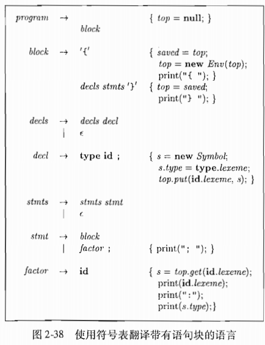

这里在每次进入作用域时，会先将前一个作用域指针保存在saved，返回时再重新把saved赋回top。需要注意的是这里没有考虑在嵌套作用域内调用外部作用域符号的情况

### 生成中间代码

在生成二进制前一般要先生成中间代码，有两种形式：树型结构和线性表示

#### 语法树的构造

树型结构典型代表就是语法树，下面是书中的一个构建语法树的语法制导翻译方案

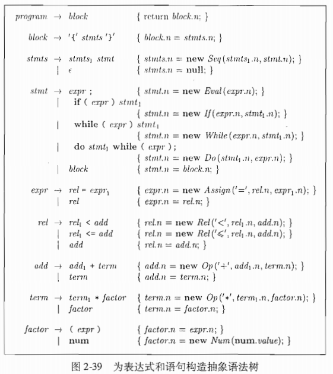

这里需要注意一点，这里每个语法制导翻译规则的语句都写在最后，因此应该是在最后执行，如对于第一条产生式

```
program -> block  {return block.n;}
```

对应的程序应该是

```c
block_t Program()
{
    block_t block = Block();
    return block.n;
}
```

因此会先递归执行非终结符的过程

其次还有一点就是，**规则嵌套程度越深，优先级越高**。如term对应的规则有乘法，是嵌套在add规则下的，因此乘法优先级大于加法

#### 静态检查

* 语法检查  如break只能在循环或switch内等不能使用语法分析的文法来指定的规则
* 类型检查  比如对于==运算符两边的操作数必须同类型，此外应考虑下列情况
  * 自动类型转换
  * 重载
* 左值和右值  确保一个赋值表达式的左部是一个左值

#### 三地址码

##### 基本形式

###### 运算与赋值

```
x = y op z
x = y
```

###### 数组

```
x[y] = z
x = y[z]
```

###### 跳转

```
if True x goto L  ; x为真跳转
if False x goto L
goto L
```

##### 表达式的翻译

所有表达式会被化成三地址式，如

```
i + j - k

t1 = i + j
t2 = t1 - k
```

但如果类似数组的形式作为左值或右值，不能简单计算

```
a[b[i]] = j
```

###### lvalue

左值相对来说情况较少，计算左值的伪代码如下

```c
expr_t lvalue(expr_t x)
{
    if(x是一个id节点)
        return x;
    else if(x是一个Access(y,z)节点，且y是一个id节点)
        return new Access(y, rvalue(z));
}
```

其中Access(y,z)返回数组y[z]的值

这里把z作为右值处理，因为z可能是一个运算表达式

###### rvalue

```c
expr_t rvalue(expr_t x)
{
    if(x是一个id或constant节点)
        return x;
    else if(x是一个Op(op,y,z)或者Rel(op,y,z)节点)
    {
        t = NewTempNode();
        tmp1 = rvalue(y);
        tmp2 = rvalue(z);
        生成t = tmp1 op tmp2的指令串;
        return t;
    }
    else if(x是一个Access(y,z)节点)
    {
        t = NewTempNode();
        tmp1 = lvalue(x);
        生成对应t = tmp1的指令串;
        return t;
    }
    else if(x是一个Assign(y,z)节点)
    {
        t = rvalue(z);
        生成对应lvalue(y) = t的指令串;
        return t;
    }
}
```

其中Op(op, y, z)和Rel(op, y, z)为算术运算或比较运算

Assign(y, z)为赋值运算

###### 改进表达式的代码

* 减少拷贝指令，如`t = i + 1; i = t;`可以合并为`i = i + 1`
* 充分考虑上下文的情况，在后面会提到一些代码优化技术

## 第三章 词法分析

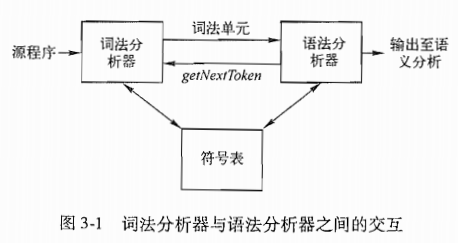

* 提取词素，输出词法单元序列
* 和符号表交互，当发现一个标识符的词素需要添加到符号表
* 处理空白 换行 注释等
* 处理编译器错误消息的行号等
* 宏扩展

### 词法组成

#### 词法单元 模式 词素

* **词法单元**  由一个词法单元名和一个可选的属性值组成
* **模式**  描述了一个词法单元的词素可能具有的形式
* **词素**  原程序中的一个字符序列。可以由某个**模式**匹配，并被识别为**词法单元**

##### 词法单元

###### 类别

* 每个关键字本身就是一个词法单元
* 表示运算符的词法单元
* 表示所有标识符的词法单元
* 一个或多个表示常量的词法单元（数字 字符串等）
* 每个标点符号有一个词法单元（括号 逗号 分号等）

###### 属性

一个词法单元应该有多个属性值来向语法分析器提供一些信息，如对于词法单元id，有词素、类型、第一次出现的位置等

###### 词法错误

如`fi(a==f(x))`，无法断定fi是误写还是变量名，只能作为词法单元传给语法分析器。但假设所有词法单元的模式都与当前输入不匹配，可能会采取一些恢复方法

* 在输入中不断删除字符知道出现一个正确的词法单元
* 从输入中删除一个字符
* 向输入插入一个遗漏字符
* 用一个字符替换另一个字符
* 交换相邻字符

### 输入缓冲

#### 双缓冲

建立长度为N的两个缓冲区，两个指针标记，一个指向当前词素开头，一个指向结尾。程序运行时根据模式扫描字符串，每次扫描结束两个指针中间必为一个词素

使用双缓冲的原因在于，若在第一个缓冲区结尾处当前词素未处理完，可以直接到第二个缓冲区读取下面的N个字符，并继续处理当前元素。只要一个词素的长度不超过N就可以无间断地处理所有的词素

#### 哨兵标记

对上述双缓冲方案的一种优化。因为上述算法每次扫描要做两个判断：检查是否到达缓冲区结尾。读取当前的字符并根据类型运行相应分支

如果在缓冲区结尾设置一个哨兵标记，如eof，则可以将第一个测试省去

### 词法单元的规约

#### 串的运算

某个字符表上的一个有穷序列称为一个串

下面定义**串**的一部分运算

* 前缀  s[0:x]
* 真前缀  s[0:x] x>0
* 后缀  s[x:n-1]
* 真后缀  s[x:n-1] x<n-1
* 子串  s[x1:x2]
* 子序列  s中删除0个或多个符号的串，这些符号不一定相邻
* 连接  xy = x[:] + y[:]  直接拼在一起
* 指数  x^2 = xx

下面定义**语言**的一部分运算，分别是并  连接  Kleene闭包  正闭包
$$
\begin{aligned}
L \cup M &= \{s | s \in L \ \ or \ \ s \in M \}
\\
LM &= \{ st | s \in L \ \ and \ \ t \in M \}
\\
L^* &= \bigcup_{i=0}^{\infin} L^i
\\
L^+ &= \bigcup_{i=1}^{\infin} L^i
\end{aligned}
$$
其中kleene闭包和正闭包就是对某个串的所有指数的串的集合

#### 正则表达式

书中的正则表达式类似实际的正则

##### 正则定义

概念较难讲，用一个简单例子说明

如要识别无符号数（整数或浮点），可以构造下面的正则定义

```
digit -> 0 | 1 | ... | 9
digits -> digit digit*
optionalFraction -> . digits | ε
optionalExponent -> (E (+ | - | ε) digits ) | ε
number -> digits optionalFraction optionalExponent
```

可以识别诸如1.000 1.00E^-1的数（但无法识别有符号数）

使用一些符号可以简化，如

```
digit -> [0-9]
digits -> digit+
number -> digits(. digits)? (E[+-]? digits)?
```

### 词法单元的识别

#### 状态转移图

直接看例子

##### 例1 识别比较运算符

识别 `< <= <> = >= >`

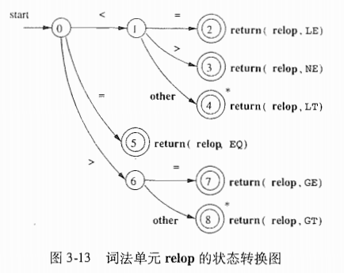

##### 例2 识别无符号数字

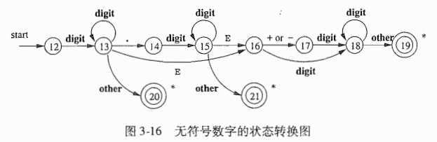

#### 状态转移与KMP算法

##### 原理

对于模式串ababaa，可以画出其最直接的状态转移图

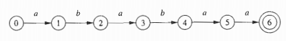

当我们匹配到状态4时，说明当前匹配的字串是abab，因为当前匹配的前缀ab和后缀ab相同，所以下次匹配可以直接跳过2个字符

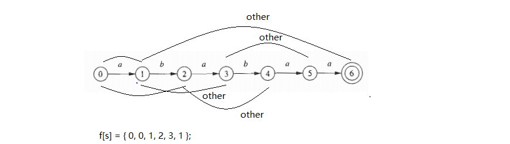

这是对应字串ababaa的状态转移表

假设当前匹配了ababa，即进行到状态5，若下一个字符不是a，则不能到达状态6。但因为ababa的前缀aba和后缀aba相同，因此可以直接后跳两个字符，因此如上图，下一个状态可以直接跳转到3开始。

##### 算法

本质上来说，KMP就是遍历长度为l的模式串Str的每个前缀串s，寻找对于s的前缀a是否有s的后缀b，使得a==b，并记录a的最大长度为f[s]。这样在匹配输入串时，若已经匹配到了第s个字符，而第s+1个字符不匹配，那么下一次匹配的开头`p'=p+f[s]+1`。因为当前匹配的`Str[0:s]`中，后缀`Str[l-f[s]:l]`与前缀`Str[0:f[s]]`相同，因此下次匹配可以从偏移量为`f[s]+1`的地方开始

###### 计算f[s]

可以看做动态规划算法

若Str的前缀串Str[0:s]有相同的前后缀a和b，前后缀的长度被记录进f[s]，那么对于前缀串Str[0:s+1]

* 若`Str[s+1] == Str[f[s]+1]`，则显然`f[s+1] = f[s]+1`

* 若`Str[s+1] != Str[f[s]+1]`，则应该在Str[0:s+1]中找到更小一点的前后缀对，考虑如下：

  * 当前已知`Str[0:f[s]] == Str[l-f[s]:l]`，而`Str[0:f[s]+1] != Str[l-f[s]:l+1]`
  * 此时应该找一个`Str[l-f[s]:l]`小一点的后缀`Str[l-x:l] == Str[0:x]`，然后继续判断是否有`Str[l-x:l+1] == Str[0:x+1]`
  * 寻找小一点的后缀的思想很简单，因为`Str[0:f[s]] == Str[l-f[s]:l]`，所以`Str[0:f[s]]`的前后缀也是`Str[l-f[s]:l]`的前后缀，因此可以通过`f[f[s]]`来获取`Str[0:f[s]]`的最长相等前后缀，即令`x = f[f[s]]`
  * 迭代执行，直到`Str[0:x+1] == Str[l-x:l+1]`。若直到x=0都没有满足条件，则f[s+1]=0
* 边界`f[0]=0`


算法如下

```c
f[0] = 0;
t = 0;				// 当前匹配的前缀的指针
for(s=1; s<n; s++)	//Str[0:s+1]为当前遍历的前缀子串
{
    while(t>0 && Pattern[t] != Pattern[s])
    {
        t = f[t-1];	// 减1的原因可以见代码，因为C的下标是从0开始算，这里的s和t指针始终指向正在匹配的字符（与书上不同，书上指向已经匹配正确的字符）
    }
    if(Pattern[t] == Pattern[s])
    {
        t += 1;
        f[s] = t;
    }
    else
    {
        f[s] = 0;
    }
}
```

###### 匹配算法

```c
t = 0;
for(int i=0; i<strlen(Str); i++)
{
    while(t>0 && pattern[t]!=Str[i])
        t = f[t-1];
    if(pattern[t] == Str[i])
        t += 1;
    if(t == strlen(pattern))
        break
}
if(t == strlen(pattern))
    return "yes";
else
    return "no";
```

具体程序可以见dragon_program/kmp/kmp.c

#### 字典树

KMP的推广，用于多模式串匹配

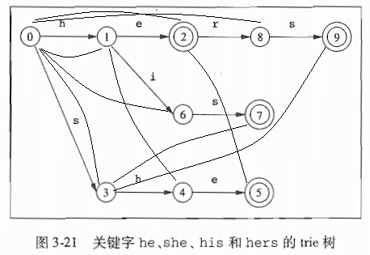

```
f[s] = {0, 0, 0, 1, 2, 0, 3, 0, 3}
```

### 有穷自动机

分为确定的有穷自动机和不确定的有穷自动机

* 确定的有穷自动机  有且只有一条离开某状态，以某符号为标号的边
* 不确定的有穷自动机  可以有多条离开某状态的边

#### 不确定的有穷自动机

##### 定义

NFA(Nondeterministic Finite Automata)由如下部分组成

* 一个有穷状态集合S
* 一个输入符号集合$\Sigma$，即输入字母表。假设空串ε不包含在集合中
* 一个转换函数，为每个状态中的每个符号给出相应的后继状态
* S中的一个状态s0指定为**开始状态**
* S中一个子集F被指定为**终止状态**的集合

##### 转换图

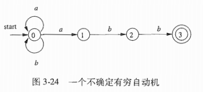

这张图可以表示正则表达式`(a|b)*abb`的状态转移

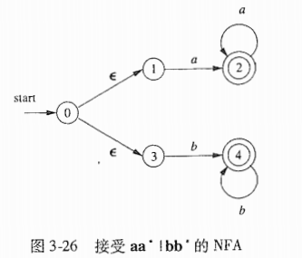

这张图可以表示`aa*|bb*`的状态转移，注意这里使用了ε

##### 转换表

上述转换图可以直接变为转换表

| 状态\输入 | a      | b    | ε    |
| --------- | ------ | ---- | ---- |
| 0         | {0, 1} | {0}  | null |
| 1         | null   | {2}  | null |
| 2         | null   | {3}  | null |
| 3         | null   | null | null |

#### 确定的有穷自动机

##### 定义

DFA(Deterministic Finite Automata)，是NFA的一个特例，有如下特性

* 没有对应输入ε的转换（即状态转移表没有对应ε的条目）
* 对于每个状态有且只有一条边**离开**该状态

##### 转换图

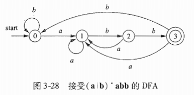

前面的例子正则表达式`(a|b)*abb`对应的DFA。所有的NFA都可以转换为DFA，过程下面描述

### 从正则表达式到自动机

#### 从NFA到DFA

子集构造法(subset construction)，基本思想为构造一个转换表Dtran，每个状态是一个NFA状态集合。首先定义下面几个符号

* ε-closure(s)  从NFA的**某一个**状态s出发通过ε转换到达的NFA状态集合
* ε-closure(T)  从T集合中某个状态s只通过ε转换到达的NFA状态集合
* move(T, a) 从T集合中某个状态s通过标号为a的转换到达的NFA状态集合


