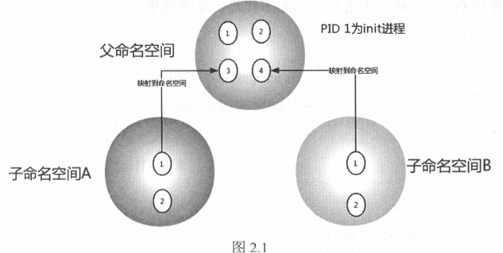

## 基础技术

### Linux Namespace

#### 概念

使用Namespace可以实现UID级别的隔离，即可以为UID n的用户虚拟化出来一个Namespace，在Namespace里有root权限，但是从宿主机系统层面来看它还是UID为n的用户

同样PID也有自己的Namespace，如图，不同Namespace有自己的PID，而这些PID又会映射到父Namespace

目前一共有6种Namespace

| Namespace类型 | 系统调用参数        | 内核版本   |
| ----------- | ------------- | ------ |
| Mount       | CLONE_NEWNS   | 2.4.19 |
| UTS         | CLONE_NEWUTS  | 2.6.19 |
| IPC         | CLONE_NEWIPC  | 2.6.19 |
| PID         | CLONE_NEWPID  | 2.6.24 |
| Network     | CLONE_NEWNET  | 2.6.29 |
| User        | CLONE_NEWUSER | 3.8    |

Namespace主要使用下列三个系统调用

* clone  创建新进程，会根据系统调用参数判断哪些类型的Namespace会被创建，且它们的子进程也会被包含进这些Namespace

* unshare  将进程移出某个Namespace

* setns  将进程加入到Namespace

#### UTS Namespace

用来隔离nodename和domainname两个系统标识，UTS Namespace中每个Namespace有自己的hostname

通过指定CLONE_NEWUTS调用clone即可为新进程创建新的UTS Namespace，可以通过`/proc/<pid>/ns/uts`查看进程所属的Namespace

#### IPC Namespace

可以用来隔离System V IPC和POSIX message queue

#### PID Namespace

可以用来隔离PID，同一个进程在不同Namespace可以使用不同的PID

但若只使用了PID Namespace，没有使用Mount Namespace，则若使用ps查看PID不会得到当前Namespace的PID，因为ps top等命令使用/proc获取信息

#### Mount Namespace

用于隔离各个进程的挂载点视图，在mount namespace中调用mount和unmount只会影响Namespace中的文件系统

#### User Namespace

用于隔离用户ID和用户组ID，一个进程的用户ID和组ID在User Namespace内外可以不同，如在宿主机上以非root用户创建Namespace，而在Namespace中映射为root用户

#### Network Namespace

用于隔离网络设备和IP、端口等网络栈。Network Namespace可以让每个容器拥有自己独立的网络设备且每个Namespace内的端口不会互相冲突

### Linux Cgroups

提供了对一组进程及其子进程的资源限制、控制和统计能力

#### Cgroups的三个组件

* cgroup  对进程分组管理的一个机制，一个cgroup包含一组进程，并可以在其上增加Linux subsystem的各种参数配置

* subsystem  一组资源控制的模块，一般包含
  
  * blkio  设置块设备的访问控制
  
  * cpu  设置CPU调度策略
  
  * cpuacct  统计CPU占用
  
  * cpuset  多核机器上设置cgroup中进程可以使用的CPU和内存（NUMA架构的内存）
  
  * devices  控制设备访问
  
  * freezer  挂起和恢复cgroup中的进程
  
  * memory  控制内存占用
  
  * net_cls  将cgroup网络包分类，以便tc做限流或监控
  
  * net_prio  cgroup进程中产生流量的优先级
  
  * ns  使cgroup进程在新的Namespace fork新进程时创建一个新的cgroup，其包含新的Namespace中的进程

* hierarchy  将一组cgroup串成树状结构，一个树即一个hierarchy，Cgroups可以由此做到继承

#### 三个组件的联系

* 系统创建新的hierarchy后，所有进程都会加入这个hierarchy的cgroup根节点

* 一个subsystem只能附加到一个hierarchy上

* 一个hierarchy可以附加多个subsystem

* 一个进程可以作为多个cgroup的成员，但这些cgroup必须在不同的hierarchy中

* 一个进程fork出子进程时，父子进程均在一个cgroup，但可以根据需要移到其他cgroup

#### Kernel接口

* 可以以cgroup类型mount一个目录作为cgroup配置，此时目录会有一系列默认配置
  
  * cgroup.clone_children  cpuset会读取该文件，若值为1子group会继承父group配置
  
  * cgroup.procs  记录当前cgroup中的进程组ID
  
  * notify_on_release / release_agent  前者标识当该cgroup最后一个进程退出时是否执行了release_agent，后者为一个路径，用于在进程退出后清理不再使用的cgroup
  
  * tasks  标识该cgroup中的进程ID

* 此时在该目录下创建文件夹会被视作创建子cgroup，默认会将父目录的上述文件继承（即复制到子目录）

* 可以通过向tasks文件写入进程ID的形式将进程加入到子cgroup，注意同一个hierarchy下一个进程只能属于一个cgroup

* 上述hierarchy尚没有关联到任何subsystem，实际系统默认为每个subsystem创建了一个默认hierarchy，如内存的hierarchy路径为`/sys/fs/cgroup/memory`

### Union File System

##### UnionFS

是一种将其他文件系统联合到一个挂载点的文件系统服务，它使用branch让不同文件系统的文件和目录形成一个单一一致的文件系统

UnionFS使用了copy-on-write使得对文件系统的写入不会覆盖原来的资源

Docker使用的是AUFS，Advanced Multi-Layered Unification Filesytem

#### Docker中的AUFS

每个docker image都由一系列read-only layer组成，其中image layer存在`/var/lib/docker/aufs/diff`下，对应metadata则存在`/var/lib/docker/aufs/layers` mount目录存在`/var/lib/docker/aufs/mnt`，容器的metadata和配置文件存在`/var/lib/docker/containers/<container-id>`

书中用一个例子来说明docker是如何使用AUFS存放镜像的，基本原理如下：

* docker镜像由layer组成，一个镜像可能存在多个layer

* 当基于一个镜像进行修改产生新镜像时，docker不会直接复制出一个新镜像，而是在原有镜像上进行派生。使用docker history可以查看每个layer分别是使用了哪些指令对镜像进行了修改

* 当启动一个容器时，docker会为其创建一个只读的init layer，用于存储与这个容器内环境相关的内容，还会为其创建一个读写的layer执行所有写操作

