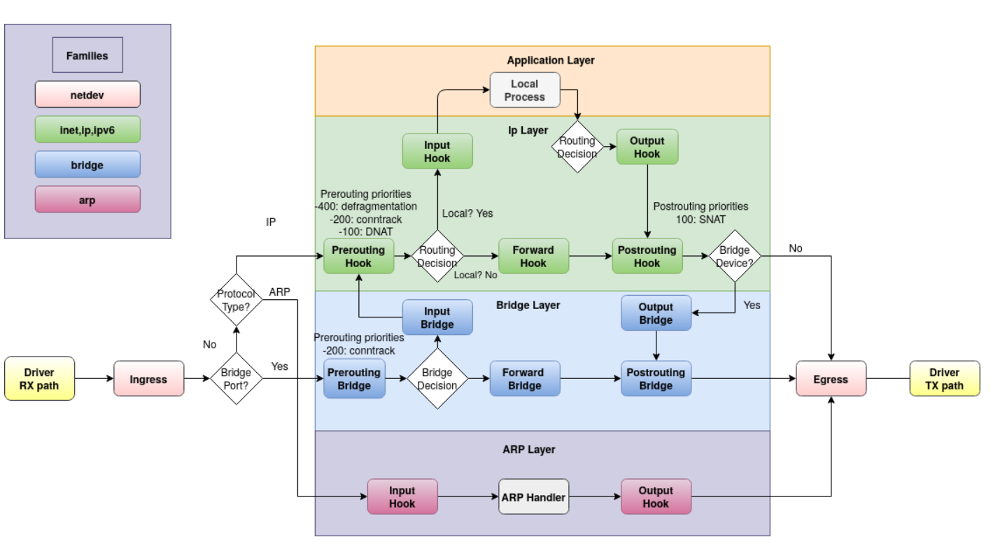
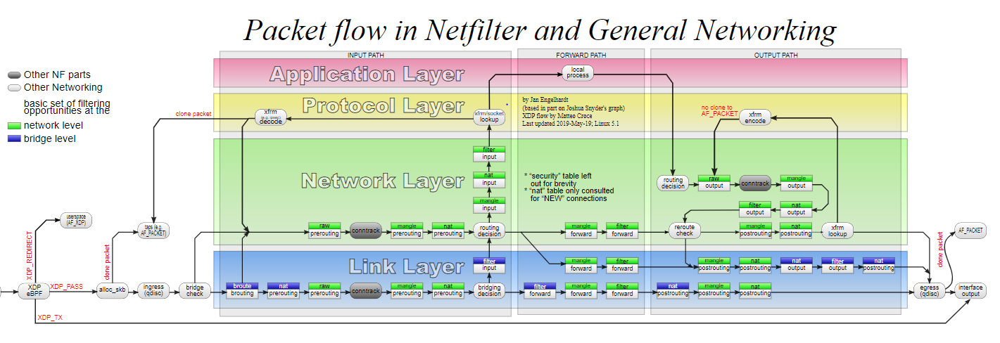
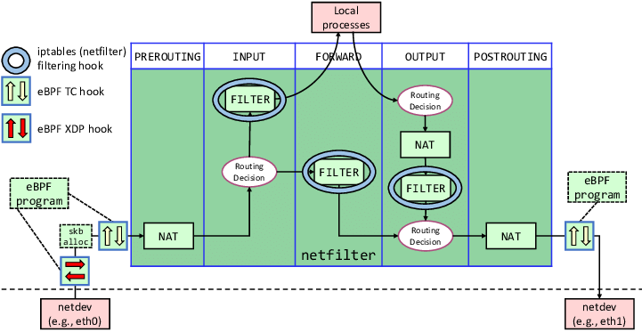

### iptables绕过

[Netfilter hooks - nftables wiki](https://wiki.nftables.org/wiki-nftables/index.php/Netfilter_hooks)

https://chowdera.com/2021/08/20210831223230452E.html
[使用 eBPF 技术跟踪 Netfilter 数据流](https://chowdera.com/2021/08/20210826122332574h.html)

https://dl.acm.org/doi/10.1145/3371927.3371929

[[译] 深入理解 iptables 和 netfilter 架构](https://arthurchiao.art/blog/deep-dive-into-iptables-and-netfilter-arch-zh/)

[File Integrity Monitoring using eBPF – SecAdvent Day 19 | DevSecCon](https://www.devseccon.com/blog/file-integrity-monitoring-using-ebpf-secadvent-day-19/)
