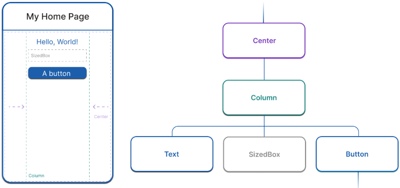

## 学习基础知识

[Dart 入门 | Flutter 中文文档 - Flutter 中文开发者网站 - Flutter](https://docs.flutter.cn/get-started/fundamentals/dart)

### 代码入口点

在`lib/main.dart`

```dart
void main() {
    runApp(const MyApp());
}
```

在runApp之前widget树还未建立。每个stateful widget都有一个initState()方法，会在widget创建并添加到widget树时调用，可以重写该方法并在其中进行初始化，但方法的第一行必须是`super.initState()`

### Widgets

widget是flutter的基本构建块

```dart
import 'package:flutter/material.dart';
import 'package:flutter/services.dart';

void main() => runApp(const MyApp());

class MyApp extends StatelessWidget {
  const MyApp({super.key});

  @override
  Widget build(BuildContext context) {
    return MaterialApp( // Root widget
      home: Scaffold(
        appBar: AppBar(
          title: const Text('My Home Page'),
        ),
        body: Center(
          child: Builder(
            builder: (context) {
              return Column(
                children: [
                  const Text('Hello, World!'),
                  const SizedBox(height: 20),
                  ElevatedButton(
                    onPressed: () {
                      print('Click!');
                    },
                    child: const Text('A button'),
                  ),
                ],
              );
            },
          ),
        ),
      ),
    );
  }
}
```

#### Widget组成

代码中包含下述widget：`MaterialApp`, `Scaffold`, `AppBar`, `Text`, `Center`, `Builder`, `Column`, `SizedBox`, 和`ElevatedButton`



#### 构建Widget

构建一个widget需要重写build方法。注意返回的对象一定得是一个Widget对象。当widget被创建时，或是该widget的依赖被更新时，都会调用build方法

```dart
class PaddedText extends StatelessWidget {
  const PaddedText({super.key});

  @override
  Widget build(BuildContext context) {
    return Padding(
      padding: const EdgeInsets.all(8.0),
      child: const Text('Hello, World!'),
    );
  }
}
```

#### Widget状态

flutter框架有两类主要的widget类型：stateful和stateless

若一个widget没有可变的状态，则其是StatelessWidget的子类。这类widget包含Padding Text Icon

否则为StatefulWidget的子类。StatefulWidget没有build方法，而是根据State对象的变化来构造UI，如

```dart
class CounterWidget extends StatefulWidget {
  @override
  State<CounterWidget> createState() => _CounterWidgetState();
}

class _CounterWidgetState extends State<CounterWidget> {
  int _counter = 0;

  void _incrementCounter() {
    setState(() {
      _counter++;
    });
  }

  @override
  Widget build(BuildContext context) {
    return Text('$_counter');
  }
}
```

当访问State对象时，都会调用setState函数，该函数会通知框架通过State的build函数更新UI

## 布局

Flutter中每个组件都是widget

widget还可以分为布局widget和可见widget

### 横向或纵向布局

Row或Column

#### 对齐

需要对齐widget时使用mainAxisAlignment（横向）或crossAxisAlignment（纵向）

#### 调整widget大小

使用Expanded可以调整widget以适应行或列

### 通用布局widgets

#### 标准widgets

* Container  容器

* GridView  可滚动网格

* ListView  可滚动列表

* Stack  将widget覆盖在另一个上面

##### Container

可以添加padding margins borders等，可以改变背景色或图片

##### GridView

* GridView.count  允许制定列的数量

* GridView.extent  允许制定单元格的最大宽度

##### ListView

自动支持滚动的widget

##### Stack

Stack在基础widget上排列其他widget，可以完全或部分覆盖基础widget

#### Material widgets

- Card 有圆角和阴影的盒子

- ListTitle 文本（最多三行）、可选的导语和后面的图标

##### Card

一个带阴影的圆角矩形，通常和ListTile一起使用。可以使用SizedBox控制Card大小

##### ListTile

创建一个包含三行文本以及可选的行前和行尾图标的行
