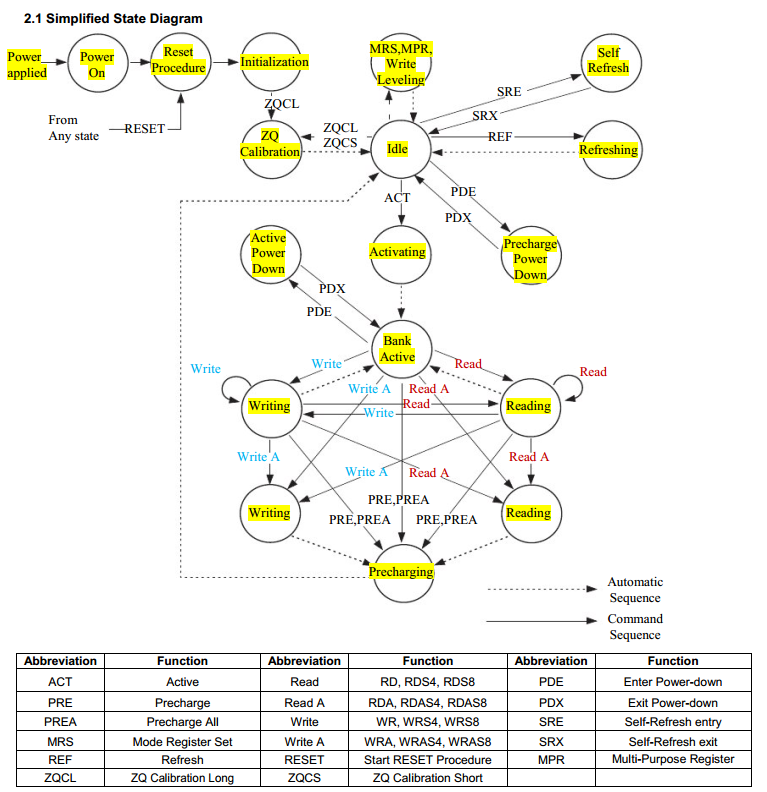

## 状态机

## pin

| 引脚   | 功能                                                |
| ------ | --------------------------------------------------- |
| CK,CK# | 差分时钟输入，所有信号在CK上升沿和CK#下降沿时被采样 |
| CKE    |                                                     |
| CS#    | 片选                                                |
| ODT    | 允许内部                                            |
|        |                                                     |
|        |                                                     |
|        |                                                     |
|        |                                                     |
|        |                                                     |

