## 框图

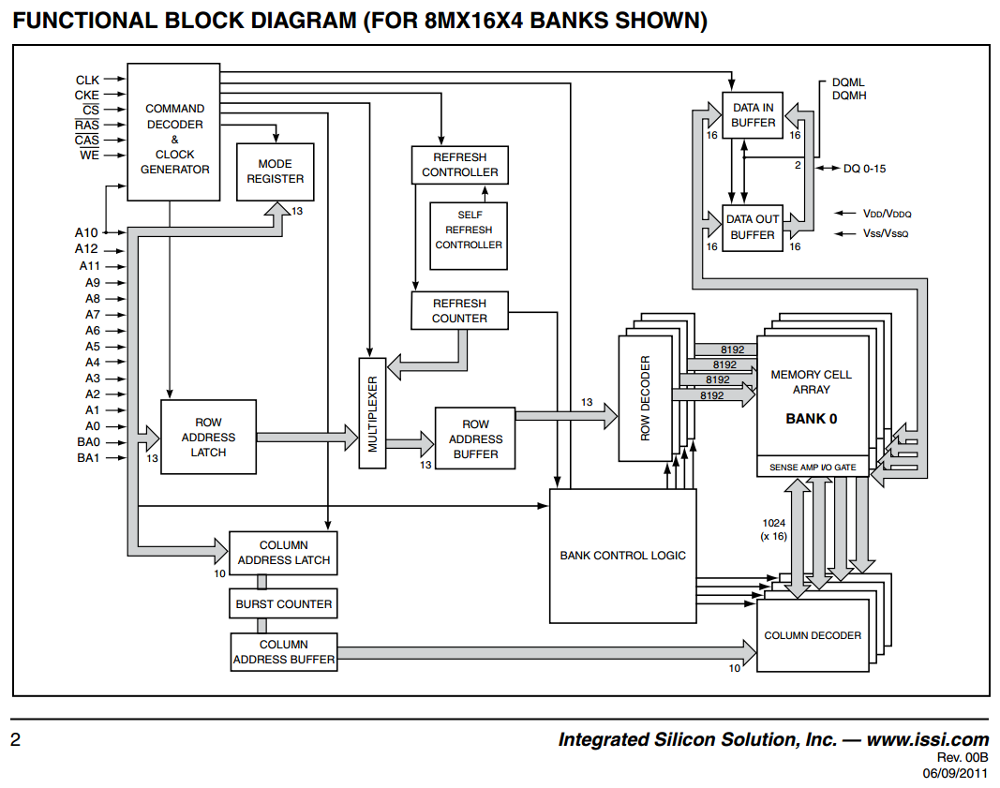

## pin

| 引脚      | 用途           | 引脚 | 用途                   |
| --------- | -------------- | ---- | ---------------------- |
| A0-A12    | row address    | RAS  | row address strobe     |
| A0-A9,A11 | column address | CAS  | column address strobe  |
| BA0,BA1   | bank select    | WE   | write enable           |
| DQ0-DQ7   | data IO        | DQM  | data input/output mask |
| CLK       | system clock   | VDD  | power                  |
| CKE       | clock enable   | VSS  | ground                 |
| CS        | chip select    | VDDQ | IO power               |
| NC        |                | VSSQ | IO groud               |

## 引脚功能

| 引脚    | 功能                                                         |
| ------- | ------------------------------------------------------------ |
| A0-A12  | A0-A9,A11(x8);A0-A9(x16);A0-A8(x32)    在ACTIVE和READ WRITE指令中被采样。A10在PRECHARGE指令中被采样，用于决定是否所有bank都要被预充电（A10为高时）或只充BA0和BA1选的。 |
| BA0,BA1 | ACTIVE READ WRITE PRECHARGE指令选择的bank                    |
| CAS#    |                                                              |
| RAS#    |                                                              |
| WE#     | 以上三个组合成不同的指令                                     |
| CKE     | 当CKE是低时，设备处于power-down/clock suspend/self refresh模式 |
| CLK     |                                                              |
| CS#     | 为低片选                                                     |
| DQM     | DQM(x8)  DQML,DQMH(x16)  DQM0-DQM3(x32)，控制IO buffer，如在x16模式下，读取时DQML和DQMH控制output buffer，当DQML为高时低8位被屏蔽，DQMH相同。写入时类似 |
| DQx     | DQ0-DQ7(x8)  DQ0-DQ15(x16)  DQ0-DQ31(x32)                    |

## 真值表

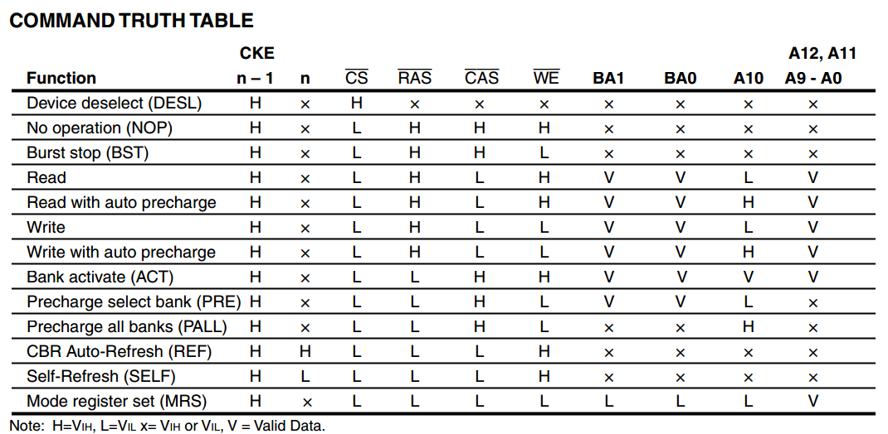

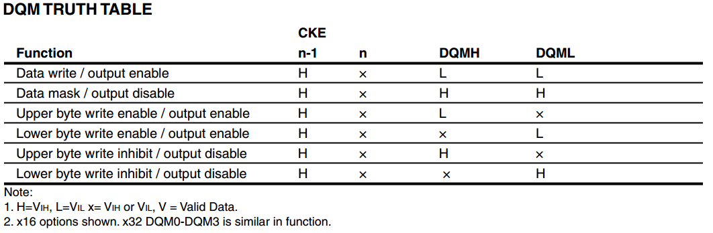

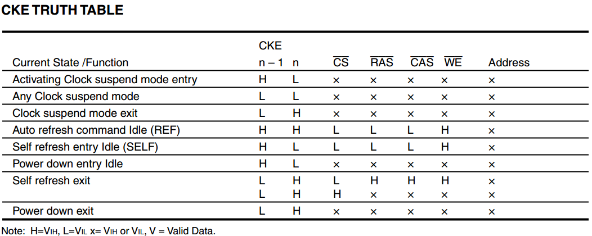

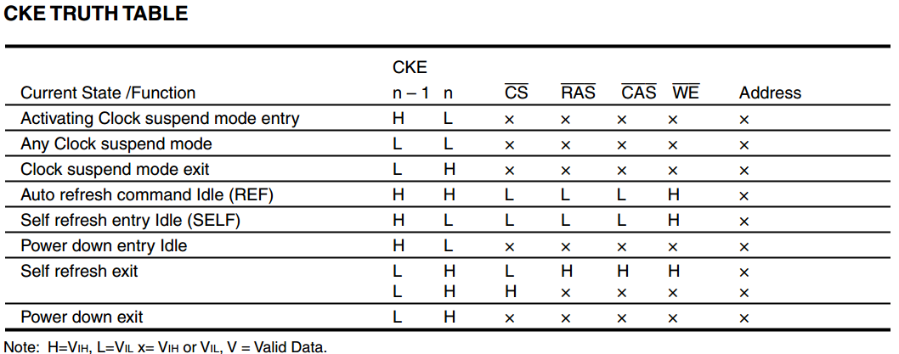

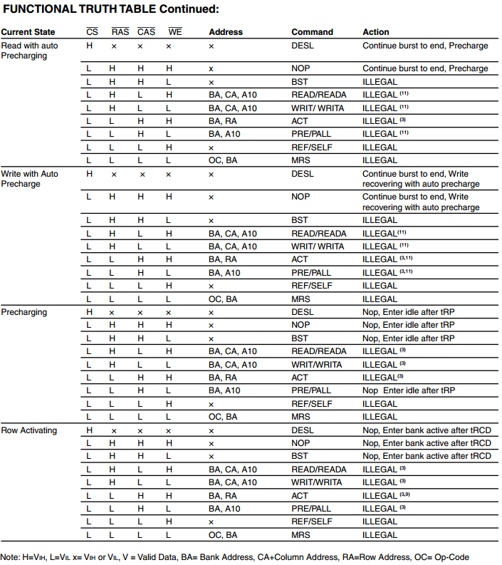

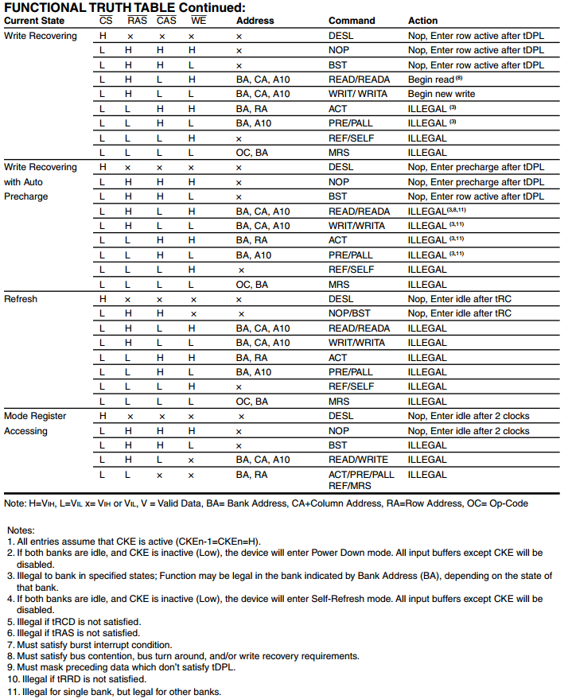

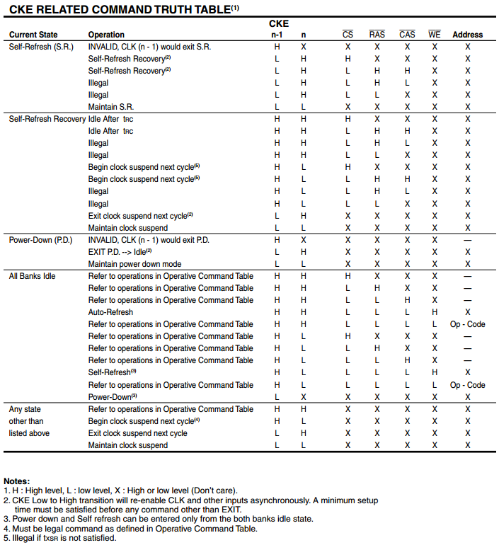

## 状态机

### ACTIVE

当使用ACTIVE指令时，BA0 BA1和A0-An指定的地址的通道被打开，直到该bank执行PRECHARGE指令

### PRECHARGE

用于使一个bank中的row失能。A10用于选择precharge一个bank还是全部的bank。此条命令执行后，下一条操作对应bank的命令只能在tRP后被执行。precharge后的bank处于idle状态，需要一个ACTIVE来使能。

### AUTO PRECHARGE

READ或WRITE中使用A10来指定，在一个READ或WRITE操作后会自动precharge读取/写入的地址。**仅在full-page burst mode使用**

### READ

通过BA0 BA1和A0-An选择要读取的地址。若A10为高，此指令有AUTO PRECHARGE的功能。若选择了auto orecharge，在READ结束时将预充电。而若没选择该功能，则该row会保持打开以便多次访问。读取的内容会提前2个时钟被提交到DQM，若DQM对应为高，则输出Z，否则输出对应数据

### WRITE

与READ基本相同

### AUTO REFRESH COMMAND

执行AUTO REFRESH操作，需要被刷新的row address和bank自动产生。一次刷新需要时间为tRC，在这期间其他指令没法执行。在每个TREF中这条指令至少执行8192次。

### BURST TERMINATE

强制中断read和write

### COMMAND INHIBIT

不执行新的指令

### NO OPERATION

NOP，当片选为低时发生

### LOAD MODE REGISTER

从A0-A12读入模式寄存器。只有当所有bank为idle时才可以用

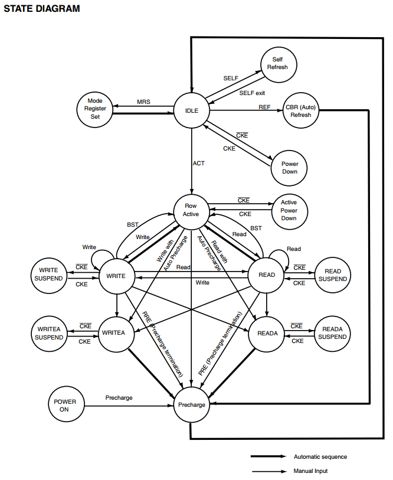

## 时延表

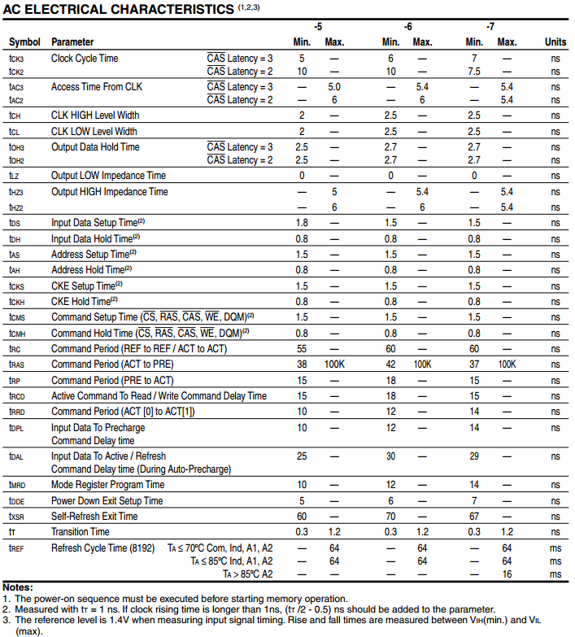

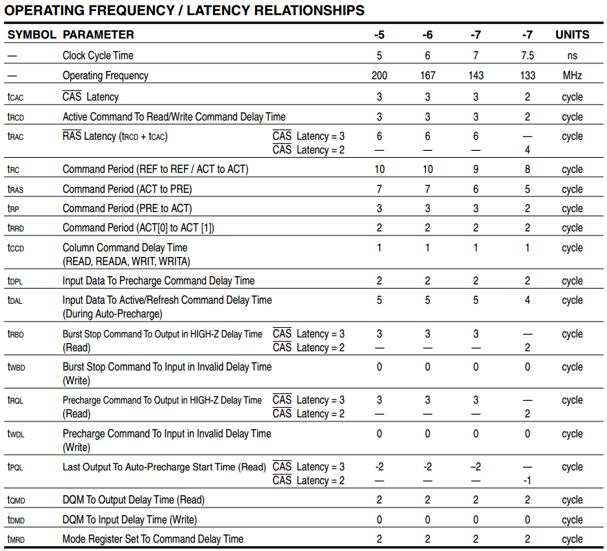

## 具体操作

### 初始化

SDRAM在上电后被初始化。发出除了COMMAND INHIBIT和NOP以外的指令前都需要先等待100us。COMMAND INHITBIT和NOP可以在100us延时的任意时刻使用，且应至少持续到100us结束。若至少一个COMMAND INHIBIT或者NOP被调用，一个PRECHARGE指令应在100us后立即调用。PRECHARGE指令将使所有bank被预充电，其需要至少8个AUTO REFRESH周期。此后SDRAM处于idle状态并且可以开始设置模式寄存器（因为每次重启后模式寄存器值不固定，所以必须设置）。

## ref

https://www.sohu.com/a/126626646_463982